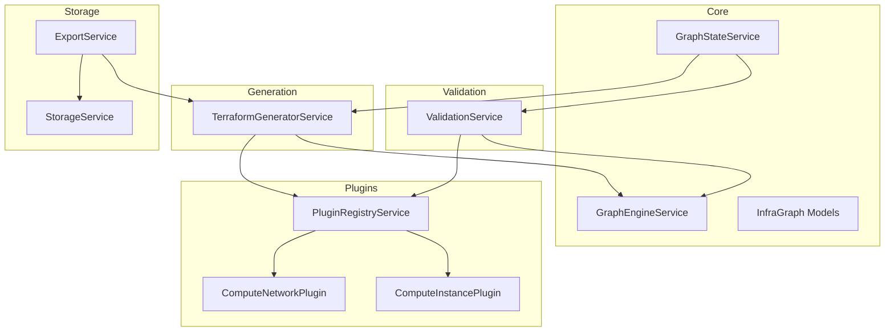
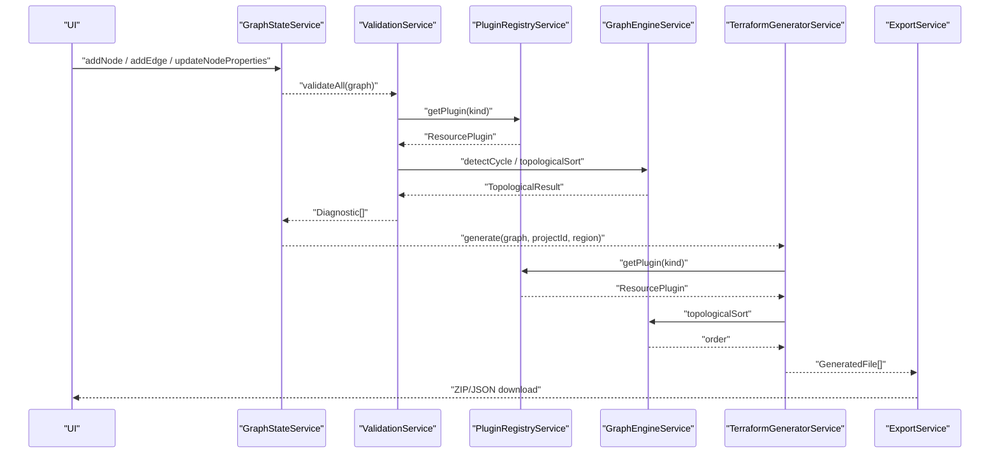
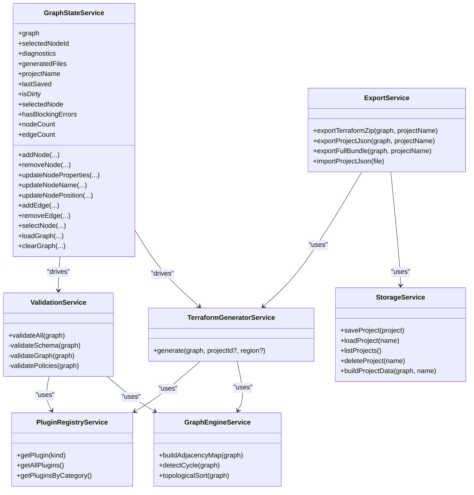

# API Reference

<cite>
**Referenced Files in This Document**
- [graph-state.service.ts](file://src/app/core/services/graph-state.service.ts)
- [validation.service.ts](file://src/app/validation/validation.service.ts)
- [terraform-generator.service.ts](file://src/app/terraform-engine/terraform-generator.service.ts)
- [plugin-registry.service.ts](file://src/app/infra/plugin-registry.service.ts)
- [infra-graph.model.ts](file://src/app/core/models/infra-graph.model.ts)
- [resource-plugin.model.ts](file://src/app/core/models/resource-plugin.model.ts)
- [graph-engine.service.ts](file://src/app/graph-engine/graph-engine.service.ts)
- [export.service.ts](file://src/app/storage/export.service.ts)
- [storage.service.ts](file://src/app/storage/storage.service.ts)
- [compute-network.plugin.ts](file://src/app/infra/plugins/compute-network.plugin.ts)
- [compute-instance.plugin.ts](file://src/app/infra/plugins/compute-instance.plugin.ts)
- [README.md](file://README.md)
- [SYSTEM_DESIGN.md](file://SYSTEM_DESIGN.md)
</cite>

## Table of Contents
1. [Introduction](#introduction)
2. [Project Structure](#project-structure)
3. [Core Components](#core-components)
4. [Architecture Overview](#architecture-overview)
5. [Detailed Component Analysis](#detailed-component-analysis)
6. [Dependency Analysis](#dependency-analysis)
7. [Performance Considerations](#performance-considerations)
8. [Troubleshooting Guide](#troubleshooting-guide)
9. [Conclusion](#conclusion)
10. [Appendices](#appendices)

## Introduction
This API Reference documents the public interfaces and service contracts of CloudCanvas-TF’s core services. It focuses on:
- GraphStateService: node/edge CRUD, selection, and reactive state.
- ValidationService: schema, graph, and policy diagnostics.
- TerraformGeneratorService: code generation, provider configuration, and file outputs.
- PluginRegistryService: plugin management and dynamic loading.
It also covers the shared models and plugin contracts that enable extensibility and consistent behavior across the system.

## Project Structure
CloudCanvas-TF follows a feature-first Angular workspace with clear separation of concerns:
- Core services and models under src/app/core
- Validation, Terraform generation, and plugin registry under dedicated feature folders
- Storage and export utilities under src/app/storage
- Example plugins under src/app/infra/plugins

**Diagram sources**
- [graph-state.service.ts](file://src/app/core/services/graph-state.service.ts#L1-L147)
- [validation.service.ts](file://src/app/validation/validation.service.ts#L1-L107)
- [terraform-generator.service.ts](file://src/app/terraform-engine/terraform-generator.service.ts#L1-L234)
- [plugin-registry.service.ts](file://src/app/infra/plugin-registry.service.ts#L1-L73)
- [graph-engine.service.ts](file://src/app/graph-engine/graph-engine.service.ts#L1-L127)
- [export.service.ts](file://src/app/storage/export.service.ts#L1-L203)
- [storage.service.ts](file://src/app/storage/storage.service.ts#L1-L85)
- [compute-network.plugin.ts](file://src/app/infra/plugins/compute-network.plugin.ts#L1-L129)
- [compute-instance.plugin.ts](file://src/app/infra/plugins/compute-instance.plugin.ts#L1-L128)

**Section sources**
- [README.md](file://README.md#L1-L19)
- [SYSTEM_DESIGN.md](file://SYSTEM_DESIGN.md#L245-L262)

## Core Components
- GraphStateService: central reactive state for the infrastructure graph, diagnostics, and generated files.
- ValidationService: aggregates diagnostics across schema, graph, and policy layers.
- TerraformGeneratorService: orchestrates plugin-based generation and file assembly.
- PluginRegistryService: registers and retrieves resource plugins by kind.
- Shared models: InfraGraph, InfraNode, InfraEdge, Diagnostic, TerraformBlock, and plugin contracts.

**Section sources**
- [graph-state.service.ts](file://src/app/core/services/graph-state.service.ts#L1-L147)
- [validation.service.ts](file://src/app/validation/validation.service.ts#L1-L107)
- [terraform-generator.service.ts](file://src/app/terraform-engine/terraform-generator.service.ts#L1-L234)
- [plugin-registry.service.ts](file://src/app/infra/plugin-registry.service.ts#L1-L73)
- [infra-graph.model.ts](file://src/app/core/models/infra-graph.model.ts#L1-L118)
- [resource-plugin.model.ts](file://src/app/core/models/resource-plugin.model.ts#L1-L55)

## Architecture Overview
The system centers on a canonical InfraGraph that flows through validation and generation:
- GraphStateService maintains reactive state and exposes CRUD APIs for nodes and edges.
- ValidationService validates schema, graph integrity, and policy.
- TerraformGeneratorService uses plugins to produce Terraform AST blocks and files.
- PluginRegistryService manages plugin lifecycle and discovery.
- ExportService packages generated files and project data for download.

**Diagram sources**
- [graph-state.service.ts](file://src/app/core/services/graph-state.service.ts#L1-L147)
- [validation.service.ts](file://src/app/validation/validation.service.ts#L1-L107)
- [terraform-generator.service.ts](file://src/app/terraform-engine/terraform-generator.service.ts#L1-L234)
- [plugin-registry.service.ts](file://src/app/infra/plugin-registry.service.ts#L1-L73)
- [graph-engine.service.ts](file://src/app/graph-engine/graph-engine.service.ts#L1-L127)
- [export.service.ts](file://src/app/storage/export.service.ts#L1-L203)

## Detailed Component Analysis

### GraphStateService API
Responsibilities:
- Manage InfraGraph state with Angular signals.
- Provide CRUD operations for nodes and edges.
- Track selection, diagnostics, generated files, project metadata, and dirty state.
- Compute derived signals for counts and selected node.

Public methods and behaviors:
- addNode(kind, position, defaults) -> string
  - Creates a new node with generated id, derived name, and initial properties.
  - Updates graph and marks as dirty.
- removeNode(nodeId) -> void
  - Removes node and incident edges; clears selection if removed node was selected.
  - Marks as dirty.
- updateNodeProperties(nodeId, properties) -> void
  - Merges properties and increments version; marks as dirty.
- updateNodeName(nodeId, name) -> void
- updateNodePosition(nodeId, position) -> void
- addEdge(from, to, relationship) -> string | null
  - Prevents duplicates and self-loops; returns new edge id or null.
  - Marks as dirty.
- removeEdge(edgeId) -> void
  - Marks as dirty.
- selectNode(nodeId | null) -> void
- loadGraph(graph) -> void
  - Resets selection and dirty state.
- clearGraph() -> void
  - Clears graph, selection, diagnostics, generated files, and dirty state.

Reactive signals:
- graph: InfraGraph
- selectedNodeId: string | null
- diagnostics: Diagnostic[]
- generatedFiles: GeneratedFile[]
- projectName: string
- lastSaved: Date | null
- isDirty: boolean
- selectedNode: computed<InfraNode | null>
- hasBlockingErrors: computed<boolean>
- nodeCount: computed<number>
- edgeCount: computed<number>

Error handling patterns:
- No explicit exceptions; mutations are idempotent and guarded against duplicates and invalid loops.

Integration patterns:
- Subscribe to reactive signals for UI binding.
- Call loadGraph to restore persisted state.
- Use isDirty to gate export and save prompts.

**Section sources**
- [graph-state.service.ts](file://src/app/core/services/graph-state.service.ts#L1-L147)
- [infra-graph.model.ts](file://src/app/core/models/infra-graph.model.ts#L17-L39)
- [infra-graph.model.ts](file://src/app/core/models/infra-graph.model.ts#L41-L48)

### ValidationService API
Responsibilities:
- Aggregate diagnostics across schema, graph, and policy layers.
- Use PluginRegistryService to validate per-resource schema.
- Use GraphEngineService to detect cycles and dangling edges.

Public methods:
- validateAll(graph) -> Diagnostic[]
  - Chains validateSchema, validateGraph, validatePolicies.

Private methods:
- validateSchema(graph) -> Diagnostic[]
  - Iterates nodes, retrieves plugin by kind, calls plugin.validate(node, ctx).
  - Emits UNKNOWN_RESOURCE if plugin not found.
- validateGraph(graph) -> Diagnostic[]
  - Uses GraphEngineService.detectCycle to detect cycles.
  - Checks for dangling edges and duplicate names.
- validatePolicies(graph) -> Diagnostic[]
  - Emits EMPTY_GRAPH for empty graphs.
  - Emits SUBNET_WITHOUT_VPC when subnetworks exist without a VPC.

Error handling patterns:
- Returns arrays of Diagnostic entries; severity includes error, warning, info.
- Remediation hints included for actionable guidance.

Integration patterns:
- Call validateAll after graph changes; bind diagnostics to UI panels.
- Gate export until hasBlockingErrors is false.

**Section sources**
- [validation.service.ts](file://src/app/validation/validation.service.ts#L1-L107)
- [graph-engine.service.ts](file://src/app/graph-engine/graph-engine.service.ts#L27-L63)
- [plugin-registry.service.ts](file://src/app/infra/plugin-registry.service.ts#L48-L50)
- [resource-plugin.model.ts](file://src/app/core/models/resource-plugin.model.ts#L32-L35)

### TerraformGeneratorService API
Responsibilities:
- Generate Terraform files from InfraGraph using registered plugins.
- Perform topological sorting to ensure deterministic ordering.
- Assemble providers.tf, main.tf, variables.tf, outputs.tf, and README.generated.md.

Public methods:
- generate(graph, projectId?, region?) -> GeneratedFile[]
  - Builds GeneratorContext with nodeMap and getNodeReference helper.
  - Sorts nodes topologically; falls back to raw order if cycle detected.
  - Invokes plugin.toTerraform for each node; collects blocks.
  - Produces file set: providers.tf, main.tf, variables.tf, outputs.tf, README.generated.md.

Private methods:
- generateProvidersFile(projectId, region) -> GeneratedFile
- generateMainFile(blocks) -> GeneratedFile
- generateVariablesFile(projectId, region) -> GeneratedFile
- generateOutputsFile(blocks) -> GeneratedFile
- generateReadme(graph) -> GeneratedFile
- serializeBlock(block) -> string
- serializeNestedBlock(nested) -> string[]
- serializeValue(val) -> string

Error handling patterns:
- Gracefully handles empty graphs by emitting placeholder content.
- Uses safe references via getNodeReference to prevent malformed references.

Integration patterns:
- Call generate after validation passes.
- Use generatedFiles to populate code preview and export.

**Section sources**
- [terraform-generator.service.ts](file://src/app/terraform-engine/terraform-generator.service.ts#L1-L234)
- [graph-engine.service.ts](file://src/app/graph-engine/graph-engine.service.ts#L65-L110)
- [resource-plugin.model.ts](file://src/app/core/models/resource-plugin.model.ts#L37-L41)

### PluginRegistryService API
Responsibilities:
- Register and discover ResourcePlugin instances by ResourceKind.
- Provide categorized plugin lists and all plugins.

Public methods:
- getPlugin(kind) -> ResourcePlugin | undefined
- getAllPlugins() -> ResourcePlugin[]
- getPluginsByCategory() -> Map<string, ResourcePlugin[]>

Registration:
- Constructor registers built-in plugins (Network, Compute, Storage, Kubernetes, Database, Serverless, Security, Messaging).

Extension points:
- Implement ResourcePlugin and register via register(plugin) to add new resource kinds.

**Section sources**
- [plugin-registry.service.ts](file://src/app/infra/plugin-registry.service.ts#L1-L73)
- [resource-plugin.model.ts](file://src/app/core/models/resource-plugin.model.ts#L43-L54)

### Shared Models and Contracts
Key types and interfaces:
- InfraGraph, InfraNode, InfraEdge, Diagnostic, TerraformBlock, TerraformNestedBlock, TerraformReference, GeneratedFile
- ResourceKind, ResourceCategory, EdgeRelationship
- ResourcePlugin: kind, category, displayName, description, icon, schema, defaults(), validate(), toTerraform(), suggestEdges?
- ValidationContext and GeneratorContext

These contracts define the plugin interface and the canonical graph representation used across services.

**Section sources**
- [infra-graph.model.ts](file://src/app/core/models/infra-graph.model.ts#L1-L118)
- [resource-plugin.model.ts](file://src/app/core/models/resource-plugin.model.ts#L1-L55)

### Example Plugins
- ComputeNetworkPlugin: demonstrates schema definition, defaults, validation, and Terraform block generation for VPC networks.
- ComputeInstancePlugin: demonstrates nested blocks (boot_disk, network_interface), references via GeneratorContext, and edge suggestions.

**Section sources**
- [compute-network.plugin.ts](file://src/app/infra/plugins/compute-network.plugin.ts#L1-L129)
- [compute-instance.plugin.ts](file://src/app/infra/plugins/compute-instance.plugin.ts#L1-L128)

## Dependency Analysis
High-level dependencies:
- ValidationService depends on PluginRegistryService and GraphEngineService.
- TerraformGeneratorService depends on PluginRegistryService and GraphEngineService.
- GraphStateService coordinates UI state and triggers validation/generation.
- ExportService depends on TerraformGeneratorService and StorageService.

**Diagram sources**
- [graph-state.service.ts](file://src/app/core/services/graph-state.service.ts#L1-L147)
- [validation.service.ts](file://src/app/validation/validation.service.ts#L1-L107)
- [terraform-generator.service.ts](file://src/app/terraform-engine/terraform-generator.service.ts#L1-L234)
- [plugin-registry.service.ts](file://src/app/infra/plugin-registry.service.ts#L1-L73)
- [graph-engine.service.ts](file://src/app/graph-engine/graph-engine.service.ts#L1-L127)
- [export.service.ts](file://src/app/storage/export.service.ts#L1-L203)
- [storage.service.ts](file://src/app/storage/storage.service.ts#L1-L85)

**Section sources**
- [graph-state.service.ts](file://src/app/core/services/graph-state.service.ts#L1-L147)
- [validation.service.ts](file://src/app/validation/validation.service.ts#L1-L107)
- [terraform-generator.service.ts](file://src/app/terraform-engine/terraform-generator.service.ts#L1-L234)
- [plugin-registry.service.ts](file://src/app/infra/plugin-registry.service.ts#L1-L73)
- [graph-engine.service.ts](file://src/app/graph-engine/graph-engine.service.ts#L1-L127)
- [export.service.ts](file://src/app/storage/export.service.ts#L1-L203)
- [storage.service.ts](file://src/app/storage/storage.service.ts#L1-L85)

## Performance Considerations
- Deterministic ordering: GraphEngineService uses topological sort with tie-breaking to ensure stable output.
- Reactive updates: GraphStateService uses signals for efficient UI updates without manual subscriptions.
- Offloading heavy work: SYSTEM_DESIGN.md recommends Web Workers for sort/validate/generate to keep UI responsive.
- Export constraints: ExportService enforces synchronous download triggers from user gestures to ensure reliable downloads.

[No sources needed since this section provides general guidance]

## Troubleshooting Guide
Common issues and resolutions:
- Circular dependencies: ValidationService detects cycles; fix by removing edges forming cycles.
- Dangling edges: ValidationService reports missing node references; connect edges to existing nodes.
- Duplicate resource names: ValidationService reports duplicate names for the same kind; rename resources uniquely.
- Unknown resource type: ValidationService emits UNKNOWN_RESOURCE; ensure plugin is registered for the kind.
- Export failures: ExportService wraps errors and alerts; check console for details and retry.

**Section sources**
- [validation.service.ts](file://src/app/validation/validation.service.ts#L41-L81)
- [export.service.ts](file://src/app/storage/export.service.ts#L18-L59)

## Conclusion
CloudCanvas-TF’s API is structured around a canonical InfraGraph and plugin-driven architecture:
- GraphStateService provides reactive state and CRUD operations.
- ValidationService ensures correctness across schema, graph, and policy.
- TerraformGeneratorService produces deterministic, readable Terraform outputs.
- PluginRegistryService enables extensibility and dynamic loading.
Together, these services deliver a robust, extensible platform for visual infrastructure design and Terraform generation.

[No sources needed since this section summarizes without analyzing specific files]

## Appendices

### API Usage Examples and Extension Points
- Using GraphStateService:
  - Add a node: call addNode with kind, position, and defaults; subscribe to graph and diagnostics signals.
  - Connect resources: call addEdge with relationship; handle null return for invalid edges.
  - Load and clear graphs: use loadGraph and clearGraph to manage project state.
- Using ValidationService:
  - Run validateAll after edits; display diagnostics in UI panels; block export if hasBlockingErrors.
- Using TerraformGeneratorService:
  - Call generate with InfraGraph and optional project/region; consume GeneratedFile[] for preview and export.
- Extending with plugins:
  - Implement ResourcePlugin and register via PluginRegistryService.register(plugin).
  - Define JsonSchema for property forms and implement toTerraform to emit TerraformBlock[].

**Section sources**
- [graph-state.service.ts](file://src/app/core/services/graph-state.service.ts#L39-L145)
- [validation.service.ts](file://src/app/validation/validation.service.ts#L14-L20)
- [terraform-generator.service.ts](file://src/app/terraform-engine/terraform-generator.service.ts#L16-L51)
- [plugin-registry.service.ts](file://src/app/infra/plugin-registry.service.ts#L44-L54)
- [resource-plugin.model.ts](file://src/app/core/models/resource-plugin.model.ts#L43-L54)