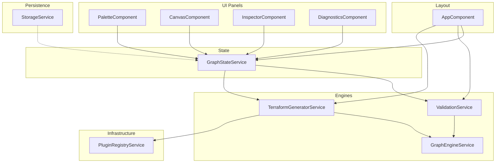
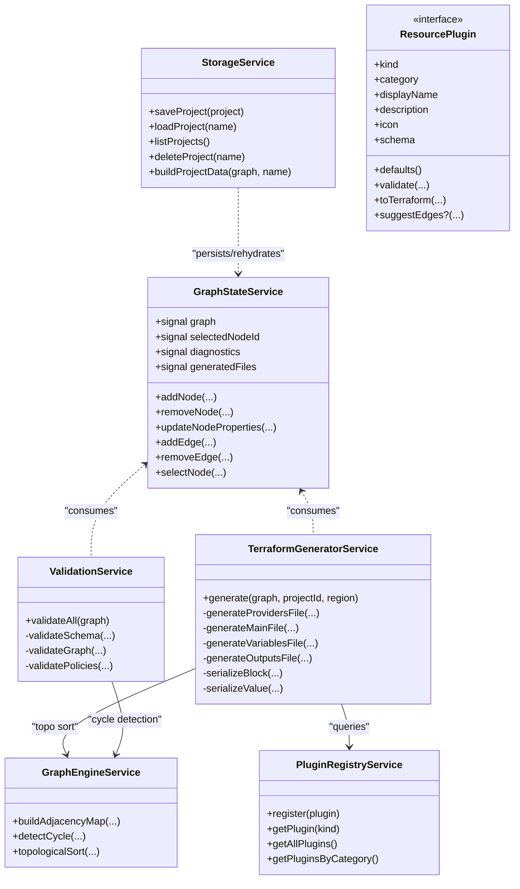
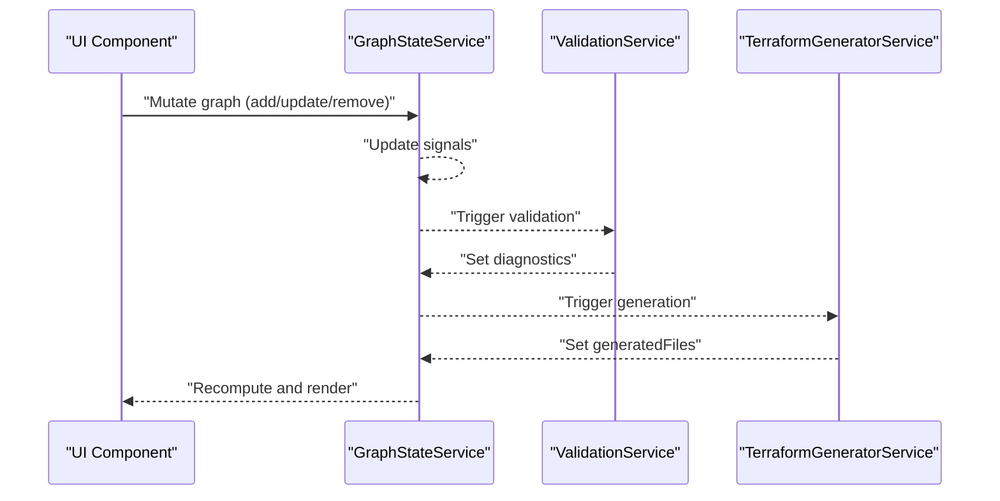
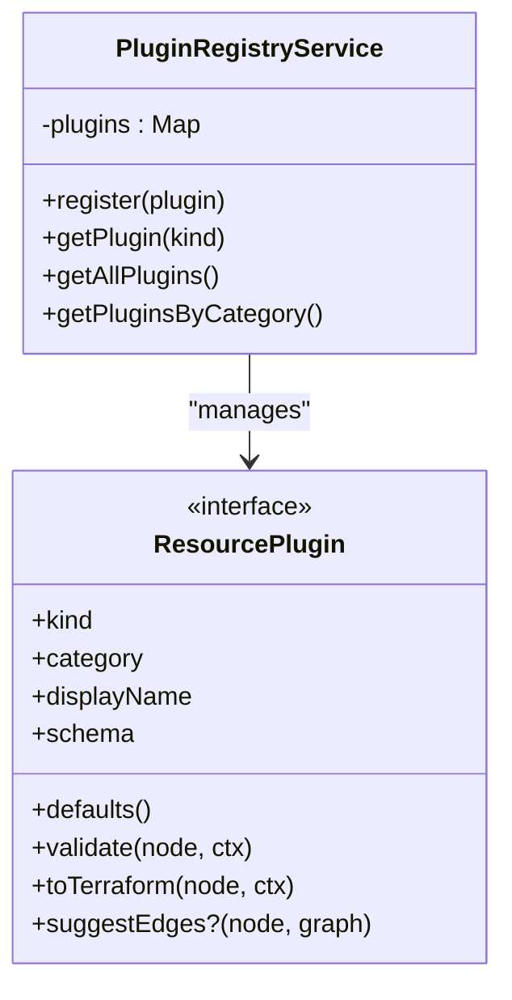
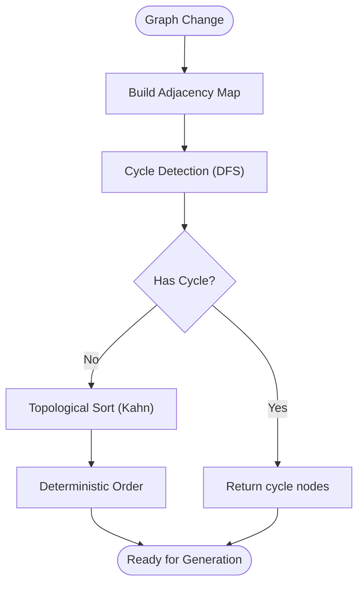
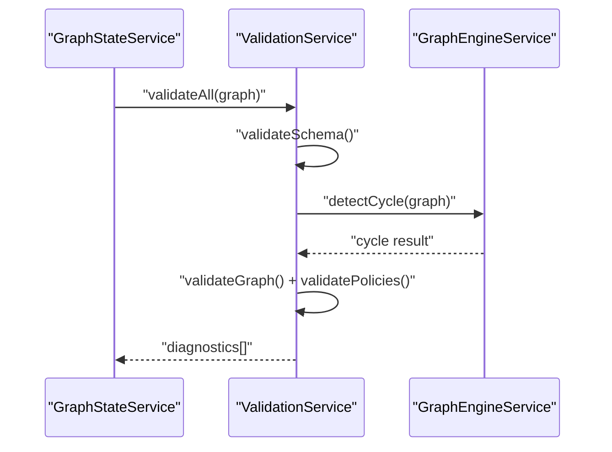
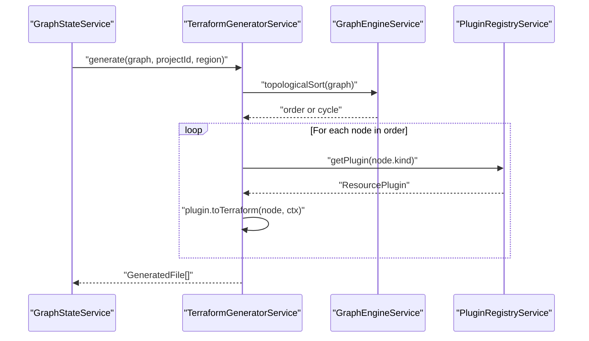
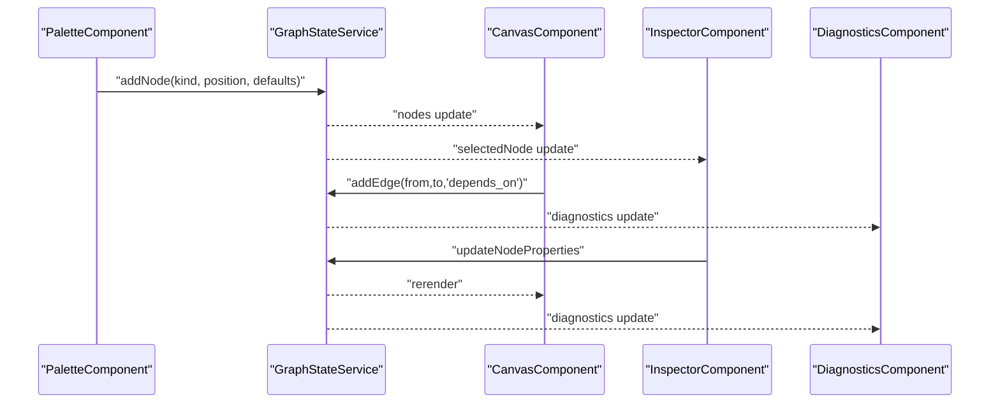
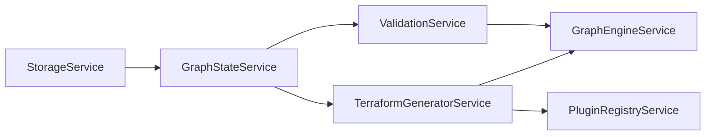

# Architecture Overview

<cite>
**Referenced Files in This Document**
- [SYSTEM_DESIGN.md](file://SYSTEM_DESIGN.md)
- [README.md](file://README.md)
- [angular.json](file://angular.json)
- [package.json](file://package.json)
- [src/app/core/models/infra-graph.model.ts](file://src/app/core/models/infra-graph.model.ts)
- [src/app/core/models/resource-plugin.model.ts](file://src/app/core/models/resource-plugin.model.ts)
- [src/app/core/services/graph-state.service.ts](file://src/app/core/services/graph-state.service.ts)
- [src/app/infra/plugin-registry.service.ts](file://src/app/infra/plugin-registry.service.ts)
- [src/app/graph-engine/graph-engine.service.ts](file://src/app/graph-engine/graph-engine.service.ts)
- [src/app/terraform-engine/terraform-generator.service.ts](file://src/app/terraform-engine/terraform-generator.service.ts)
- [src/app/validation/validation.service.ts](file://src/app/validation/validation.service.ts)
- [src/app/storage/storage.service.ts](file://src/app/storage/storage.service.ts)
- [src/app/canvas/canvas.component.ts](file://src/app/canvas/canvas.component.ts)
- [src/app/palette/palette.component.ts](file://src/app/palette/palette.component.ts)
- [src/app/inspector/inspector.component.ts](file://src/app/inspector/inspector.component.ts)
- [src/app/diagnostics/diagnostics.component.ts](file://src/app/diagnostics/diagnostics.component.ts)
- [src/app/layout/app.component.ts](file://src/app/layout/app.component.ts)
</cite>

## Table of Contents
1. [Introduction](#introduction)
2. [Project Structure](#project-structure)
3. [Core Components](#core-components)
4. [Architecture Overview](#architecture-overview)
5. [Detailed Component Analysis](#detailed-component-analysis)
6. [Dependency Analysis](#dependency-analysis)
7. [Performance Considerations](#performance-considerations)
8. [Troubleshooting Guide](#troubleshooting-guide)
9. [Conclusion](#conclusion)
10. [Appendices](#appendices)

## Introduction
CloudCanvas-TF is a visual design studio for Google Cloud infrastructure that generates clean, editable Terraform. It emphasizes a plugin-based architecture, signals-based state management, and a canonical InfraGraph data model. The system integrates UI panels (canvas, inspector, diagnostics, palette), a validation engine, a graph engine for dependency intelligence, a Terraform generation engine, and local storage backed by IndexedDB. The technology stack leverages Angular Signals, RxJS, Monaco Editor, and Dexie.js to balance beginner-friendly UX with expert-acceptable output quality.

## Project Structure
The project follows a feature-first Angular workspace structure aligned with the system design. Key areas include:
- Core models and services for the canonical data model and state
- Infrastructure plugins and registry
- Graph engine for dependency analysis
- Terraform generation engine
- Validation engine
- Storage for local persistence
- UI components for canvas, palette, inspector, diagnostics, and top bar
- Layout orchestrating effects and data flow

**Diagram sources**
- [src/app/layout/app.component.ts](file://src/app/layout/app.component.ts#L26-L47)
- [src/app/core/services/graph-state.service.ts](file://src/app/core/services/graph-state.service.ts#L12-L146)
- [src/app/validation/validation.service.ts](file://src/app/validation/validation.service.ts#L7-L106)
- [src/app/terraform-engine/terraform-generator.service.ts](file://src/app/terraform-engine/terraform-generator.service.ts#L9-L51)
- [src/app/graph-engine/graph-engine.service.ts](file://src/app/graph-engine/graph-engine.service.ts#L10-L126)
- [src/app/infra/plugin-registry.service.ts](file://src/app/infra/plugin-registry.service.ts#L17-L72)
- [src/app/storage/storage.service.ts](file://src/app/storage/storage.service.ts#L8-L84)
- [src/app/palette/palette.component.ts](file://src/app/palette/palette.component.ts#L14-L82)
- [src/app/canvas/canvas.component.ts](file://src/app/canvas/canvas.component.ts#L12-L285)
- [src/app/inspector/inspector.component.ts](file://src/app/inspector/inspector.component.ts#L14-L102)
- [src/app/diagnostics/diagnostics.component.ts](file://src/app/diagnostics/diagnostics.component.ts#L5-L43)

**Section sources**
- [SYSTEM_DESIGN.md](file://SYSTEM_DESIGN.md#L245-L262)
- [README.md](file://README.md#L15-L18)

## Core Components
- Canonical Data Model: InfraGraph defines nodes, edges, diagnostics, Terraform blocks, and project metadata. It ensures deterministic generation and extensibility.
- Plugin Registry: Central registry of resource plugins implementing the ResourcePlugin contract, enabling incremental rollout and isolation of resource-specific logic.
- Graph State Service: Angular Signals-based state for the graph, selection, diagnostics, generated files, and dirty state. Provides mutation APIs for nodes and edges.
- Validation Service: Aggregates schema, graph, and policy validations and produces diagnostics.
- Graph Engine: Performs cycle detection and topological sorting to ensure deterministic Terraform ordering.
- Terraform Generator: Serializes InfraGraph into Terraform files using plugin-provided blocks and a canonical serialization strategy.
- Storage Service: IndexedDB-backed persistence for projects with CRUD operations and project metadata.
- UI Panels: Palette (resource catalog), Canvas (drag-and-drop, pan/zoom, node manipulation), Inspector (dynamic form), Diagnostics (issue list).

**Section sources**
- [src/app/core/models/infra-graph.model.ts](file://src/app/core/models/infra-graph.model.ts#L1-L118)
- [src/app/core/models/resource-plugin.model.ts](file://src/app/core/models/resource-plugin.model.ts#L43-L54)
- [src/app/infra/plugin-registry.service.ts](file://src/app/infra/plugin-registry.service.ts#L17-L72)
- [src/app/core/services/graph-state.service.ts](file://src/app/core/services/graph-state.service.ts#L12-L146)
- [src/app/validation/validation.service.ts](file://src/app/validation/validation.service.ts#L7-L106)
- [src/app/graph-engine/graph-engine.service.ts](file://src/app/graph-engine/graph-engine.service.ts#L10-L126)
- [src/app/terraform-engine/terraform-generator.service.ts](file://src/app/terraform-engine/terraform-generator.service.ts#L9-L51)
- [src/app/storage/storage.service.ts](file://src/app/storage/storage.service.ts#L8-L84)
- [src/app/palette/palette.component.ts](file://src/app/palette/palette.component.ts#L14-L82)
- [src/app/canvas/canvas.component.ts](file://src/app/canvas/canvas.component.ts#L12-L285)
- [src/app/inspector/inspector.component.ts](file://src/app/inspector/inspector.component.ts#L14-L102)
- [src/app/diagnostics/diagnostics.component.ts](file://src/app/diagnostics/diagnostics.component.ts#L5-L43)

## Architecture Overview
CloudCanvas-TF employs MVVM, Plugin Pattern, Observer Pattern, and Factory Pattern:
- MVVM: Signals drive observable state; components bind to computed signals and trigger mutations via services.
- Plugin Pattern: Resource plugins encapsulate schema, defaults, validation, and Terraform generation per resource.
- Observer Pattern: Effects observe graph changes and trigger validation and generation.
- Factory Pattern: PluginRegistry constructs and registers plugins by kind.

**Diagram sources**
- [src/app/core/services/graph-state.service.ts](file://src/app/core/services/graph-state.service.ts#L12-L146)
- [src/app/infra/plugin-registry.service.ts](file://src/app/infra/plugin-registry.service.ts#L17-L72)
- [src/app/validation/validation.service.ts](file://src/app/validation/validation.service.ts#L7-L106)
- [src/app/graph-engine/graph-engine.service.ts](file://src/app/graph-engine/graph-engine.service.ts#L10-L126)
- [src/app/terraform-engine/terraform-generator.service.ts](file://src/app/terraform-engine/terraform-generator.service.ts#L9-L51)
- [src/app/storage/storage.service.ts](file://src/app/storage/storage.service.ts#L8-L84)
- [src/app/core/models/resource-plugin.model.ts](file://src/app/core/models/resource-plugin.model.ts#L43-L54)

## Detailed Component Analysis

### Signals-Based State Management
- Writable signals: graph, selectedNodeId, diagnostics, generatedFiles, projectName, lastSaved, isDirty.
- Computed signals: selectedNode, hasBlockingErrors, nodeCount, edgeCount.
- Effects: React to graph changes to run validation and generation, and to update UI state.

**Diagram sources**
- [src/app/layout/app.component.ts](file://src/app/layout/app.component.ts#L32-L41)
- [src/app/core/services/graph-state.service.ts](file://src/app/core/services/graph-state.service.ts#L12-L146)
- [src/app/validation/validation.service.ts](file://src/app/validation/validation.service.ts#L7-L106)
- [src/app/terraform-engine/terraform-generator.service.ts](file://src/app/terraform-engine/terraform-generator.service.ts#L9-L51)

**Section sources**
- [src/app/core/services/graph-state.service.ts](file://src/app/core/services/graph-state.service.ts#L12-L146)
- [src/app/layout/app.component.ts](file://src/app/layout/app.component.ts#L26-L47)

### Plugin-Based Architecture
- ResourcePlugin contract defines schema, defaults, validation, and Terraform generation.
- PluginRegistry registers plugins categorized by resource type.
- TerraformGenerator invokes plugins during generation; ValidationService consults plugins for schema validation.

**Diagram sources**
- [src/app/infra/plugin-registry.service.ts](file://src/app/infra/plugin-registry.service.ts#L17-L72)
- [src/app/core/models/resource-plugin.model.ts](file://src/app/core/models/resource-plugin.model.ts#L43-L54)

**Section sources**
- [src/app/core/models/resource-plugin.model.ts](file://src/app/core/models/resource-plugin.model.ts#L11-L54)
- [src/app/infra/plugin-registry.service.ts](file://src/app/infra/plugin-registry.service.ts#L17-L72)

### Canonical Data Model and Graph Engine
- InfraGraph: nodes and edges define the dependency graph.
- GraphEngineService: builds adjacency maps, detects cycles, and computes a deterministic topological order.

**Diagram sources**
- [src/app/graph-engine/graph-engine.service.ts](file://src/app/graph-engine/graph-engine.service.ts#L10-L126)
- [src/app/core/models/infra-graph.model.ts](file://src/app/core/models/infra-graph.model.ts#L36-L39)

**Section sources**
- [src/app/graph-engine/graph-engine.service.ts](file://src/app/graph-engine/graph-engine.service.ts#L10-L126)
- [src/app/core/models/infra-graph.model.ts](file://src/app/core/models/infra-graph.model.ts#L17-L39)

### Validation and Policy Engine
- Schema validation: per-resource plugin validation.
- Graph validation: cycle detection, dangling edges, duplicate names.
- Policy advisories: contextual warnings (e.g., subnet without VPC).

**Diagram sources**
- [src/app/validation/validation.service.ts](file://src/app/validation/validation.service.ts#L7-L106)
- [src/app/graph-engine/graph-engine.service.ts](file://src/app/graph-engine/graph-engine.service.ts#L27-L63)

**Section sources**
- [src/app/validation/validation.service.ts](file://src/app/validation/validation.service.ts#L7-L106)

### Terraform Generation Engine
- Reads canonical graph, normalizes dependencies, invokes plugins, and serializes files.
- Produces providers.tf, main.tf, variables.tf, outputs.tf, and a generated README.

**Diagram sources**
- [src/app/terraform-engine/terraform-generator.service.ts](file://src/app/terraform-engine/terraform-generator.service.ts#L9-L51)
- [src/app/graph-engine/graph-engine.service.ts](file://src/app/graph-engine/graph-engine.service.ts#L65-L110)
- [src/app/infra/plugin-registry.service.ts](file://src/app/infra/plugin-registry.service.ts#L48-L50)

**Section sources**
- [src/app/terraform-engine/terraform-generator.service.ts](file://src/app/terraform-engine/terraform-generator.service.ts#L16-L51)

### UI Component Interactions
- Palette: Drags resources onto the canvas; adds nodes with defaults and selects them.
- Canvas: Handles drag-and-drop, pan/zoom, node creation, deletion, and edge drawing.
- Inspector: Renders dynamic form from plugin schema; updates node properties.
- Diagnostics: Lists issues and navigates to affected nodes.

**Diagram sources**
- [src/app/palette/palette.component.ts](file://src/app/palette/palette.component.ts#L62-L77)
- [src/app/canvas/canvas.component.ts](file://src/app/canvas/canvas.component.ts#L90-L125)
- [src/app/inspector/inspector.component.ts](file://src/app/inspector/inspector.component.ts#L75-L85)
- [src/app/diagnostics/diagnostics.component.ts](file://src/app/diagnostics/diagnostics.component.ts#L29-L33)

**Section sources**
- [src/app/palette/palette.component.ts](file://src/app/palette/palette.component.ts#L14-L82)
- [src/app/canvas/canvas.component.ts](file://src/app/canvas/canvas.component.ts#L74-L161)
- [src/app/inspector/inspector.component.ts](file://src/app/inspector/inspector.component.ts#L25-L85)
- [src/app/diagnostics/diagnostics.component.ts](file://src/app/diagnostics/diagnostics.component.ts#L11-L43)

## Dependency Analysis
- Internal dependencies:
  - GraphStateService is consumed by all UI components and engines.
  - ValidationService depends on GraphEngineService and PluginRegistryService.
  - TerraformGeneratorService depends on GraphEngineService and PluginRegistryService.
  - StorageService persists GraphState-derived ProjectData.
- External integrations:
  - IndexedDB via StorageService for persistence.
  - Monaco Editor for code preview (referenced in system design).
  - RxJS for async orchestration (referenced in system design).
  - Angular Signals for reactive state (referenced in system design).

**Diagram sources**
- [src/app/core/services/graph-state.service.ts](file://src/app/core/services/graph-state.service.ts#L12-L146)
- [src/app/validation/validation.service.ts](file://src/app/validation/validation.service.ts#L7-L12)
- [src/app/terraform-engine/terraform-generator.service.ts](file://src/app/terraform-engine/terraform-generator.service.ts#L9-L14)
- [src/app/graph-engine/graph-engine.service.ts](file://src/app/graph-engine/graph-engine.service.ts#L10-L126)
- [src/app/infra/plugin-registry.service.ts](file://src/app/infra/plugin-registry.service.ts#L17-L72)
- [src/app/storage/storage.service.ts](file://src/app/storage/storage.service.ts#L8-L84)

**Section sources**
- [src/app/layout/app.component.ts](file://src/app/layout/app.component.ts#L26-L47)
- [SYSTEM_DESIGN.md](file://SYSTEM_DESIGN.md#L235-L243)

## Performance Considerations
- Large graphs: The system targets interactivity up to hundreds of nodes and delegates heavy operations (sorting, validating, generating) to the graph engine and generator.
- Determinism: Topological sorting with ID-based tie-breaking ensures stable output ordering.
- Debounced persistence: Auto-save is debounced to reduce IndexedDB write pressure.
- Worker offloading: Heavy operations should run in Web Workers as per system design.

[No sources needed since this section provides general guidance]

## Troubleshooting Guide
- Worker-related failures: The system design documents worker timeout retries and fallbacks; ensure worker bridge and message contracts are intact.
- Corrupted local projects: Safe-open with partial recovery mode is supported.
- Import mismatches: Migration attempts with preview before overwrite.
- Export failures: Fallback to plain-text files and notifications.

**Section sources**
- [SYSTEM_DESIGN.md](file://SYSTEM_DESIGN.md#L458-L463)

## Conclusion
CloudCanvas-TF’s architecture centers on a canonical InfraGraph, signals-based state, and a plugin-driven engine. The MVVM, Plugin, Observer, and Factory patterns enable modularity, testability, and incremental feature rollout. The integration with IndexedDB and Monaco aligns with the goal of local persistence and transparent, editable Terraform output. Cross-cutting concerns like reactive programming, validation, and persistence are addressed through dedicated services and effects, ensuring a robust and maintainable system.

[No sources needed since this section summarizes without analyzing specific files]

## Appendices

### System Boundaries and Integration Points
- Canvas: SVG-based rendering with pan/zoom and drag-and-drop interactions.
- Inspector: Dynamic form driven by plugin JSON schema.
- Diagnostics: Centralized list with severity counts and navigation.
- Storage: IndexedDB-backed persistence for projects and snapshots.
- Monaco Editor: Code preview integration for generated Terraform files.

**Section sources**
- [SYSTEM_DESIGN.md](file://SYSTEM_DESIGN.md#L235-L243)
- [src/app/storage/storage.service.ts](file://src/app/storage/storage.service.ts#L8-L84)

### Technology Stack Decisions and Impact
- Angular Signals: Enables fine-grained reactivity and efficient UI updates.
- RxJS: Supports async pipelines and worker orchestration.
- Monaco Editor: Provides syntax-highlighted code preview.
- Dexie.js: Simplifies IndexedDB schema versioning and transactions.
- Web Workers: Offloads heavy computation for performance and responsiveness.

**Section sources**
- [SYSTEM_DESIGN.md](file://SYSTEM_DESIGN.md#L235-L243)
- [README.md](file://README.md#L5-L8)