# Component Interactions

<cite>
**Referenced Files in This Document**
- [AppComponent](file://src/app/layout/app.component.ts)
- [App Template](file://src/app/layout/app.component.html)
- [CanvasComponent](file://src/app/canvas/canvas.component.ts)
- [Canvas Template](file://src/app/canvas/canvas.component.html)
- [InspectorComponent](file://src/app/inspector/inspector.component.ts)
- [Inspector Template](file://src/app/inspector/inspector.component.html)
- [DiagnosticsComponent](file://src/app/diagnostics/diagnostics.component.ts)
- [Diagnostics Template](file://src/app/diagnostics/diagnostics.component.html)
- [GraphStateService](file://src/app/core/services/graph-state.service.ts)
- [PluginRegistryService](file://src/app/infra/plugin-registry.service.ts)
- [ValidationService](file://src/app/validation/validation.service.ts)
- [TerraformGeneratorService](file://src/app/terraform-engine/terraform-generator.service.ts)
- [GraphEngineService](file://src/app/graph-engine/graph-engine.service.ts)
- [Infra Graph Model](file://src/app/core/models/infra-graph.model.ts)
- [PaletteComponent](file://src/app/palette/palette.component.ts)
</cite>

## Table of Contents
1. [Introduction](#introduction)
2. [Project Structure](#project-structure)
3. [Core Components](#core-components)
4. [Architecture Overview](#architecture-overview)
5. [Detailed Component Analysis](#detailed-component-analysis)
6. [Dependency Analysis](#dependency-analysis)
7. [Performance Considerations](#performance-considerations)
8. [Troubleshooting Guide](#troubleshooting-guide)
9. [Conclusion](#conclusion)

## Introduction
This document explains how components interact in CloudCanvas-TF to form a reactive, signal-driven modeling environment. It traces user interactions from the canvas to state management and back to UI updates, documents the orchestration by AppComponent, the event handling in CanvasComponent, the property binding in InspectorComponent, and the diagnostic notifications in DiagnosticsComponent. It also covers the signal-based reactive system, component lifecycle, memory cleanup, and performance optimization via selective re-rendering.

## Project Structure
CloudCanvas-TF is organized around a central state service and several UI components:
- AppComponent orchestrates global reactions to state changes.
- CanvasComponent renders the graph, handles user interactions, and updates state.
- InspectorComponent binds to the selected node and updates properties reactively.
- DiagnosticsComponent displays validation results and allows navigation to problematic nodes.
- GraphStateService holds the reactive graph state and exposes signals for UI components.
- ValidationService and TerraformGeneratorService transform the graph into diagnostics and generated files.
- GraphEngineService provides graph algorithms (topological sort, cycle detection).
- PluginRegistryService supplies resource plugins with schema and conversion logic.

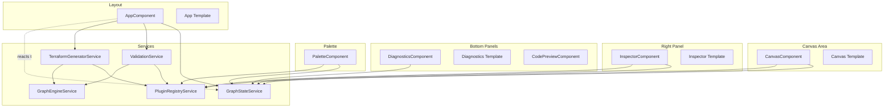

**Diagram sources**
- [AppComponent](file://src/app/layout/app.component.ts#L26-L47)
- [App Template](file://src/app/layout/app.component.html#L1-L27)
- [CanvasComponent](file://src/app/canvas/canvas.component.ts#L12-L14)
- [Canvas Template](file://src/app/canvas/canvas.component.html#L1-L123)
- [InspectorComponent](file://src/app/inspector/inspector.component.ts#L22-L23)
- [Inspector Template](file://src/app/inspector/inspector.component.html#L1-L86)
- [DiagnosticsComponent](file://src/app/diagnostics/diagnostics.component.ts#L12-L12)
- [Diagnostics Template](file://src/app/diagnostics/diagnostics.component.html#L1-L38)
- [GraphStateService](file://src/app/core/services/graph-state.service.ts#L14-L20)
- [ValidationService](file://src/app/validation/validation.service.ts#L9-L12)
- [TerraformGeneratorService](file://src/app/terraform-engine/terraform-generator.service.ts#L11-L14)
- [PluginRegistryService](file://src/app/infra/plugin-registry.service.ts#L18-L42)
- [GraphEngineService](file://src/app/graph-engine/graph-engine.service.ts#L11-L11)
- [PaletteComponent](file://src/app/palette/palette.component.ts#L15-L16)

**Section sources**
- [AppComponent](file://src/app/layout/app.component.ts#L12-L25)
- [App Template](file://src/app/layout/app.component.html#L1-L27)

## Core Components
- AppComponent orchestrates a reactive loop: it subscribes to graph changes via Angular’s effect and triggers validation and code generation, updating diagnostics and generated files signals.
- CanvasComponent renders nodes and edges, manages selection, dragging, panning, zooming, and edge drawing. It translates user actions into state updates via GraphStateService.
- InspectorComponent computes fields from the selected node’s plugin schema, binds to property changes, and surfaces diagnostics for the selected node.
- DiagnosticsComponent reads diagnostics signals and presents them with severity-aware sorting and quick navigation to related nodes.
- GraphStateService centralizes InfraGraph, selection, diagnostics, generated files, and dirty state as signals, exposing mutation methods.
- ValidationService validates schema, graph integrity, and policy compliance using PluginRegistryService and GraphEngineService.
- TerraformGeneratorService converts the validated graph into Terraform files using plugin conversions and topological ordering.
- GraphEngineService provides graph algorithms (adjacency map, cycle detection, topological sort).
- PluginRegistryService registers and retrieves resource plugins with schema, defaults, and conversion logic.

**Section sources**
- [AppComponent](file://src/app/layout/app.component.ts#L33-L41)
- [CanvasComponent](file://src/app/canvas/canvas.component.ts#L12-L43)
- [InspectorComponent](file://src/app/inspector/inspector.component.ts#L25-L79)
- [DiagnosticsComponent](file://src/app/diagnostics/diagnostics.component.ts#L14-L33)
- [GraphStateService](file://src/app/core/services/graph-state.service.ts#L14-L33)
- [ValidationService](file://src/app/validation/validation.service.ts#L14-L20)
- [TerraformGeneratorService](file://src/app/terraform-engine/terraform-generator.service.ts#L16-L51)
- [GraphEngineService](file://src/app/graph-engine/graph-engine.service.ts#L13-L110)
- [PluginRegistryService](file://src/app/infra/plugin-registry.service.ts#L19-L54)

## Architecture Overview
The system follows a signal-based reactive architecture:
- UI components declare computed dependencies on GraphStateService signals.
- User interactions mutate GraphStateService signals.
- A global effect in AppComponent reacts to graph changes, invoking ValidationService and TerraformGeneratorService, which write back to GraphStateService signals.
- Components re-render only when their dependent signals change, enabling selective re-rendering.

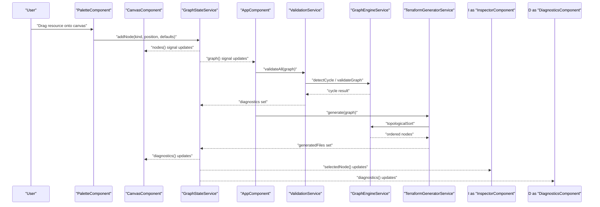

**Diagram sources**
- [PaletteComponent](file://src/app/palette/palette.component.ts#L62-L77)
- [CanvasComponent](file://src/app/canvas/canvas.component.ts#L90-L99)
- [GraphStateService](file://src/app/core/services/graph-state.service.ts#L39-L60)
- [AppComponent](file://src/app/layout/app.component.ts#L33-L41)
- [ValidationService](file://src/app/validation/validation.service.ts#L14-L20)
- [GraphEngineService](file://src/app/graph-engine/graph-engine.service.ts#L65-L110)
- [TerraformGeneratorService](file://src/app/terraform-engine/terraform-generator.service.ts#L16-L51)
- [InspectorComponent](file://src/app/inspector/inspector.component.ts#L25-L25)
- [DiagnosticsComponent](file://src/app/diagnostics/diagnostics.component.ts#L14-L14)

## Detailed Component Analysis

### AppComponent Orchestration
- Subscribes to graph changes via Angular’s effect and recomputes diagnostics and generated files.
- Uses ValidationService to validate the entire graph and sets diagnostics.
- Uses TerraformGeneratorService to produce generated files and sets them.
- Initializes with an empty graph and no diagnostics.

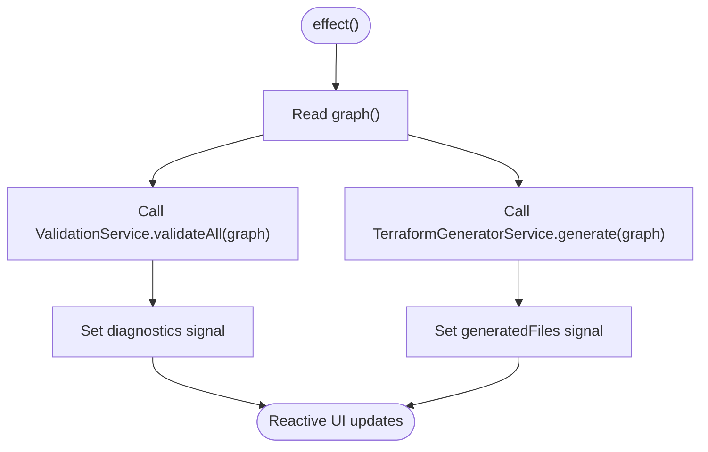

**Diagram sources**
- [AppComponent](file://src/app/layout/app.component.ts#L33-L41)
- [ValidationService](file://src/app/validation/validation.service.ts#L14-L20)
- [TerraformGeneratorService](file://src/app/terraform-engine/terraform-generator.service.ts#L16-L51)

**Section sources**
- [AppComponent](file://src/app/layout/app.component.ts#L31-L47)

### CanvasComponent Interaction Patterns
CanvasComponent handles:
- Background clicks to deselect or cancel edge drawing.
- Node clicks to select or complete edge drawing.
- Node drag-and-drop to move nodes.
- Edge drawing mode with dynamic SVG path rendering.
- Pan and zoom gestures.
- Deleting nodes and edges.

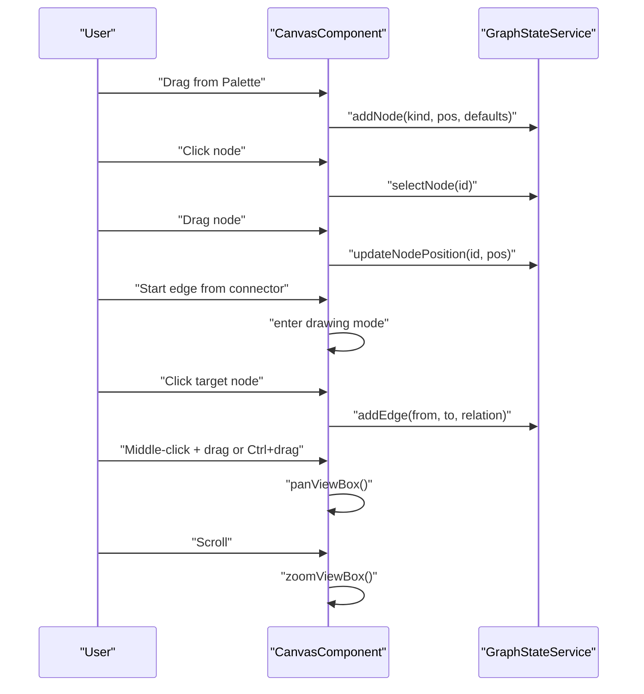

**Diagram sources**
- [CanvasComponent](file://src/app/canvas/canvas.component.ts#L90-L154)
- [CanvasComponent](file://src/app/canvas/canvas.component.ts#L164-L218)
- [GraphStateService](file://src/app/core/services/graph-state.service.ts#L39-L102)

**Section sources**
- [CanvasComponent](file://src/app/canvas/canvas.component.ts#L74-L125)
- [CanvasComponent](file://src/app/canvas/canvas.component.ts#L127-L154)
- [CanvasComponent](file://src/app/canvas/canvas.component.ts#L163-L177)
- [CanvasComponent](file://src/app/canvas/canvas.component.ts#L179-L218)
- [Canvas Template](file://src/app/canvas/canvas.component.html#L1-L123)

### InspectorComponent Property Binding
InspectorComponent:
- Computes fields from the selected node’s plugin schema.
- Binds to property changes and updates node properties reactively.
- Displays diagnostics for the selected node and highlights field errors.

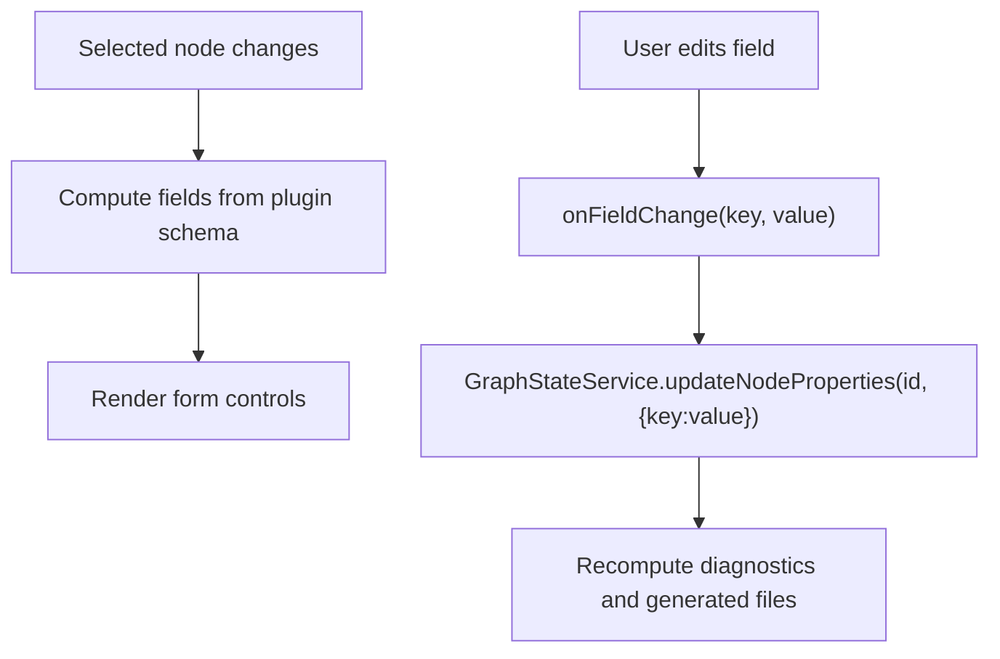

**Diagram sources**
- [InspectorComponent](file://src/app/inspector/inspector.component.ts#L27-L53)
- [InspectorComponent](file://src/app/inspector/inspector.component.ts#L75-L79)
- [GraphStateService](file://src/app/core/services/graph-state.service.ts#L73-L83)

**Section sources**
- [InspectorComponent](file://src/app/inspector/inspector.component.ts#L25-L79)
- [Inspector Template](file://src/app/inspector/inspector.component.html#L27-L78)

### DiagnosticsComponent Notification Display
DiagnosticsComponent:
- Reads diagnostics signals and sorts by severity.
- Provides quick navigation to nodes by clicking diagnostics.
- Shows counts of errors and warnings.

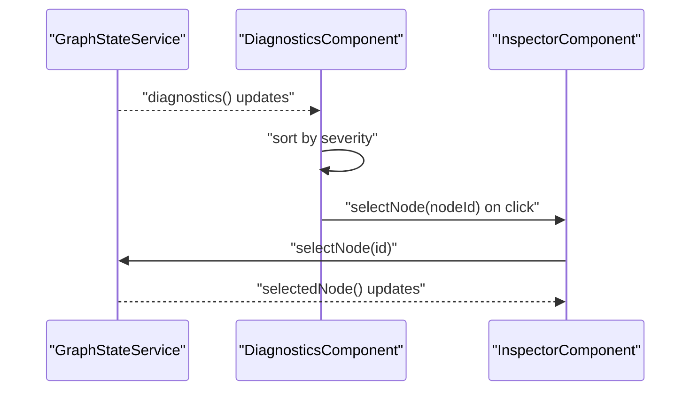

**Diagram sources**
- [DiagnosticsComponent](file://src/app/diagnostics/diagnostics.component.ts#L14-L33)
- [GraphStateService](file://src/app/core/services/graph-state.service.ts#L22-L26)
- [InspectorComponent](file://src/app/inspector/inspector.component.ts#L25-L25)

**Section sources**
- [DiagnosticsComponent](file://src/app/diagnostics/diagnostics.component.ts#L14-L33)
- [Diagnostics Template](file://src/app/diagnostics/diagnostics.component.html#L17-L30)

### Signal-Based Reactive Communication
- Signals in GraphStateService represent the single source of truth for the graph, selection, diagnostics, and generated files.
- Components subscribe to computed signals and re-render only when their dependencies change.
- Global effect in AppComponent ensures validation and generation occur after any graph change.

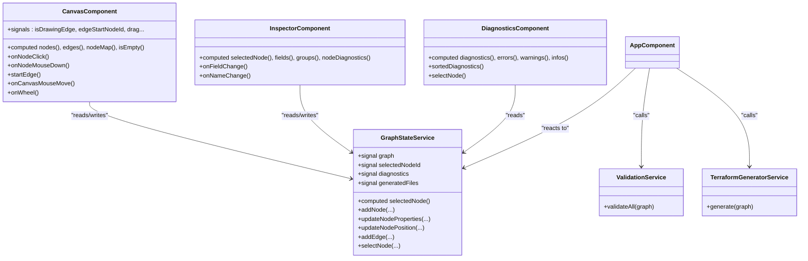

**Diagram sources**
- [GraphStateService](file://src/app/core/services/graph-state.service.ts#L14-L146)
- [CanvasComponent](file://src/app/canvas/canvas.component.ts#L12-L43)
- [InspectorComponent](file://src/app/inspector/inspector.component.ts#L22-L53)
- [DiagnosticsComponent](file://src/app/diagnostics/diagnostics.component.ts#L12-L27)
- [AppComponent](file://src/app/layout/app.component.ts#L27-L41)
- [ValidationService](file://src/app/validation/validation.service.ts#L8-L20)
- [TerraformGeneratorService](file://src/app/terraform-engine/terraform-generator.service.ts#L9-L51)

**Section sources**
- [GraphStateService](file://src/app/core/services/graph-state.service.ts#L14-L33)
- [CanvasComponent](file://src/app/canvas/canvas.component.ts#L34-L43)
- [InspectorComponent](file://src/app/inspector/inspector.component.ts#L25-L53)
- [DiagnosticsComponent](file://src/app/diagnostics/diagnostics.component.ts#L14-L27)

### Typical User Workflows

#### Drag-and-Drop Resource Placement
- User drags a resource from the palette onto the canvas.
- PaletteComponent adds a node via GraphStateService and selects it.
- CanvasComponent re-renders nodes and selection immediately.

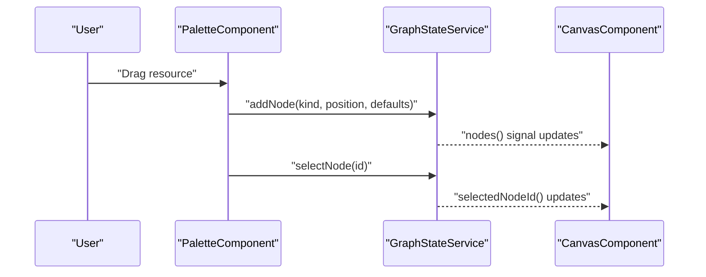

**Diagram sources**
- [PaletteComponent](file://src/app/palette/palette.component.ts#L62-L77)
- [GraphStateService](file://src/app/core/services/graph-state.service.ts#L39-L60)
- [CanvasComponent](file://src/app/canvas/canvas.component.ts#L34-L43)

#### Property Editing and Validation Feedback Loop
- User edits a property in the inspector.
- InspectorComponent updates node properties via GraphStateService.
- AppComponent effect triggers validation and generation; diagnostics update.
- DiagnosticsComponent reflects new validation results.

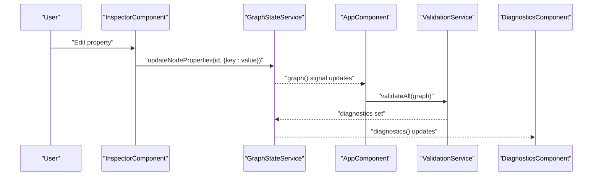

**Diagram sources**
- [InspectorComponent](file://src/app/inspector/inspector.component.ts#L75-L79)
- [GraphStateService](file://src/app/core/services/graph-state.service.ts#L73-L83)
- [AppComponent](file://src/app/layout/app.component.ts#L33-L41)
- [ValidationService](file://src/app/validation/validation.service.ts#L14-L20)
- [DiagnosticsComponent](file://src/app/diagnostics/diagnostics.component.ts#L14-L14)

#### Edge Drawing Workflow
- User clicks a node’s connector handle to start edge drawing.
- CanvasComponent enters drawing mode and tracks cursor position.
- User clicks another node to complete the edge.
- CanvasComponent adds the edge and resets drawing state.

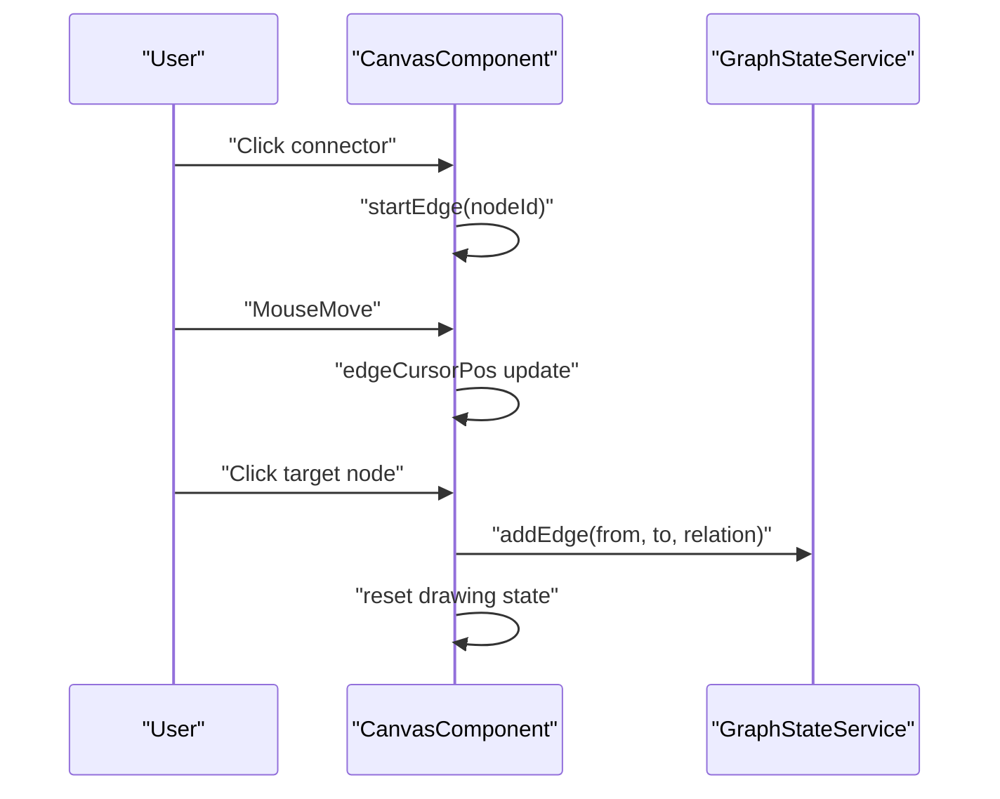

**Diagram sources**
- [CanvasComponent](file://src/app/canvas/canvas.component.ts#L164-L177)
- [CanvasComponent](file://src/app/canvas/canvas.component.ts#L179-L182)
- [CanvasComponent](file://src/app/canvas/canvas.component.ts#L112-L121)
- [GraphStateService](file://src/app/core/services/graph-state.service.ts#L104-L119)

## Dependency Analysis
- Component coupling is centralized through GraphStateService signals.
- CanvasComponent depends on GraphStateService and PluginRegistryService for display and plugin metadata.
- InspectorComponent depends on GraphStateService and PluginRegistryService for schema and defaults.
- DiagnosticsComponent depends on GraphStateService for diagnostics.
- AppComponent orchestrates ValidationService and TerraformGeneratorService, which depend on PluginRegistryService and GraphEngineService.
- PaletteComponent depends on PluginRegistryService and GraphStateService.

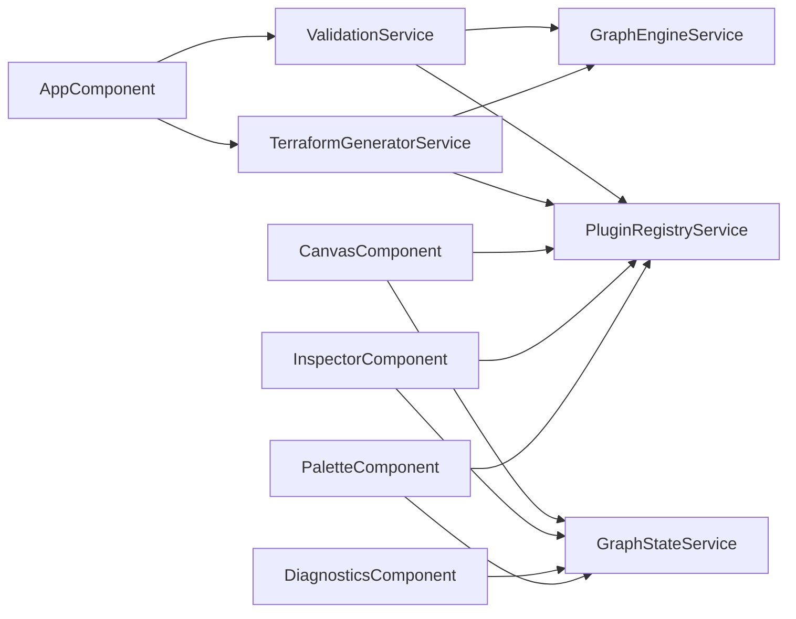

**Diagram sources**
- [AppComponent](file://src/app/layout/app.component.ts#L27-L41)
- [ValidationService](file://src/app/validation/validation.service.ts#L9-L12)
- [TerraformGeneratorService](file://src/app/terraform-engine/terraform-generator.service.ts#L11-L14)
- [PluginRegistryService](file://src/app/infra/plugin-registry.service.ts#L18-L42)
- [GraphEngineService](file://src/app/graph-engine/graph-engine.service.ts#L11-L11)
- [CanvasComponent](file://src/app/canvas/canvas.component.ts#L13-L14)
- [InspectorComponent](file://src/app/inspector/inspector.component.ts#L22-L23)
- [DiagnosticsComponent](file://src/app/diagnostics/diagnostics.component.ts#L12-L12)
- [PaletteComponent](file://src/app/palette/palette.component.ts#L15-L16)

**Section sources**
- [PluginRegistryService](file://src/app/infra/plugin-registry.service.ts#L18-L72)
- [GraphEngineService](file://src/app/graph-engine/graph-engine.service.ts#L11-L126)

## Performance Considerations
- Selective re-rendering: Components rely on signals and computed values; only affected components update when a signal changes.
- Minimal DOM updates: CanvasComponent computes SVG paths and positions efficiently; edge drawing uses lightweight cursor tracking.
- Efficient graph algorithms: GraphEngineService uses DFS for cycle detection and Kahn’s algorithm for topological sort to minimize overhead during generation.
- Avoid unnecessary listeners: CanvasComponent attaches mousemove/mouseup listeners only during drag or pan, removing them on release.
- Computed caching: Components cache node maps and derived values (e.g., nodeMap) to avoid repeated scans.

[No sources needed since this section provides general guidance]

## Troubleshooting Guide
- Diagnostics not updating:
  - Verify the global effect in AppComponent runs and calls ValidationService and TerraformGeneratorService.
  - Check that GraphStateService setters are invoked after mutations.
- Validation errors not appearing:
  - Confirm ValidationService.validateAll is called and diagnostics are written to GraphStateService.
  - Ensure PluginRegistryService has a plugin registered for the resource kind.
- Generation not produced:
  - Confirm TerraformGeneratorService.generate is invoked and returns files.
  - Verify GraphEngineService topologicalSort completes (or falls back to raw order on cycles).
- Canvas interactions not working:
  - Ensure CanvasComponent event handlers are bound in the template and that GraphStateService mutation methods are called.
  - Check that drag-and-drop events are prevented and dataTransfer is set in PaletteComponent.

**Section sources**
- [AppComponent](file://src/app/layout/app.component.ts#L33-L41)
- [ValidationService](file://src/app/validation/validation.service.ts#L14-L20)
- [TerraformGeneratorService](file://src/app/terraform-engine/terraform-generator.service.ts#L16-L51)
- [GraphEngineService](file://src/app/graph-engine/graph-engine.service.ts#L65-L110)
- [CanvasComponent](file://src/app/canvas/canvas.component.ts#L90-L154)
- [PaletteComponent](file://src/app/palette/palette.component.ts#L55-L60)

## Conclusion
CloudCanvas-TF implements a cohesive, reactive architecture centered on GraphStateService signals. AppComponent orchestrates validation and generation, while CanvasComponent, InspectorComponent, and DiagnosticsComponent provide a responsive authoring experience. PluginRegistryService and GraphEngineService underpin schema-driven modeling and graph correctness. The design emphasizes selective re-rendering, efficient algorithms, and clear separation of concerns, enabling scalable enhancements and maintainable UI updates.