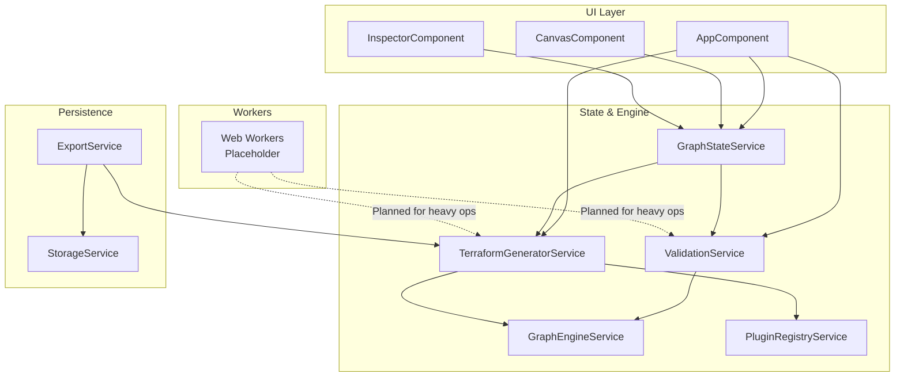
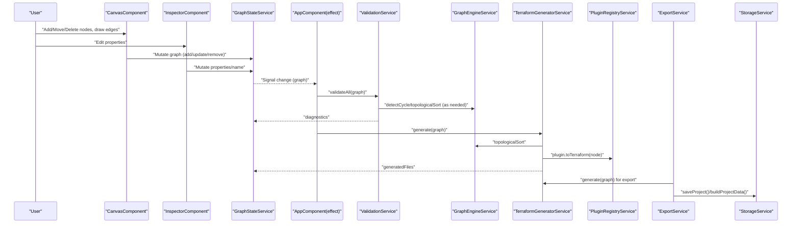
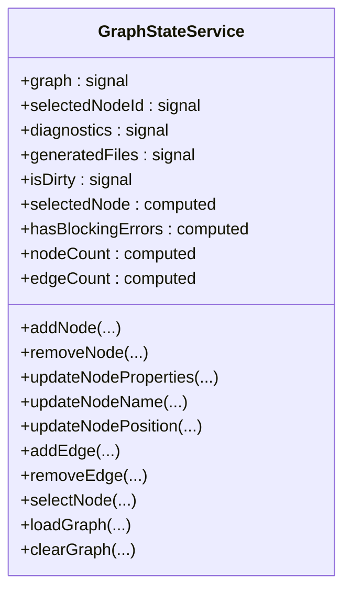
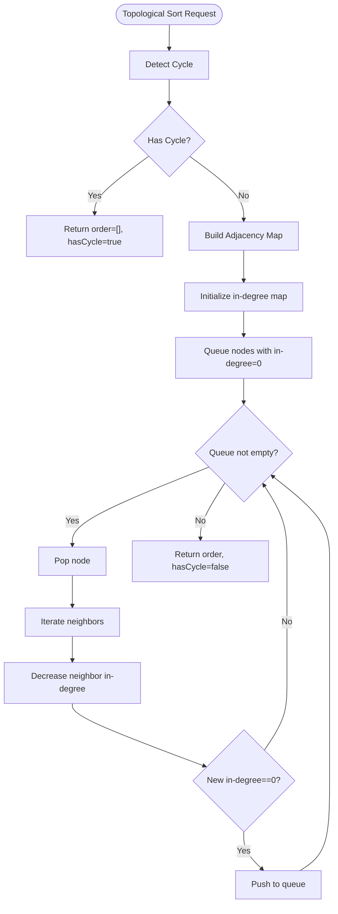
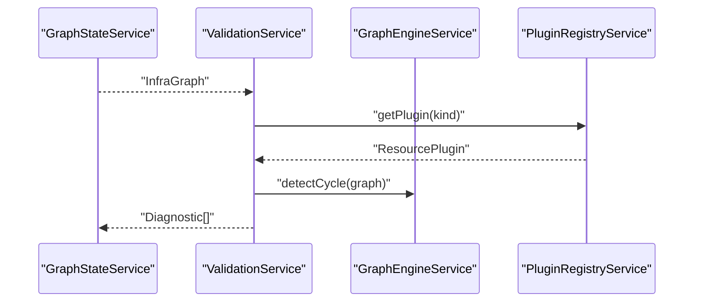
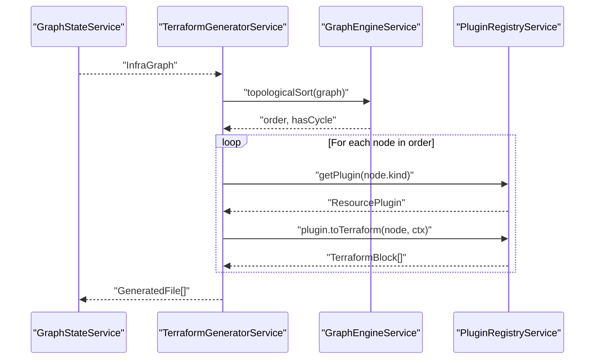
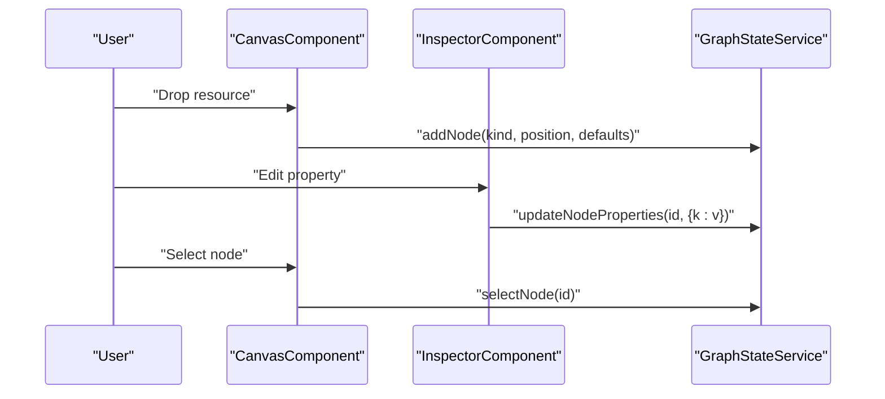
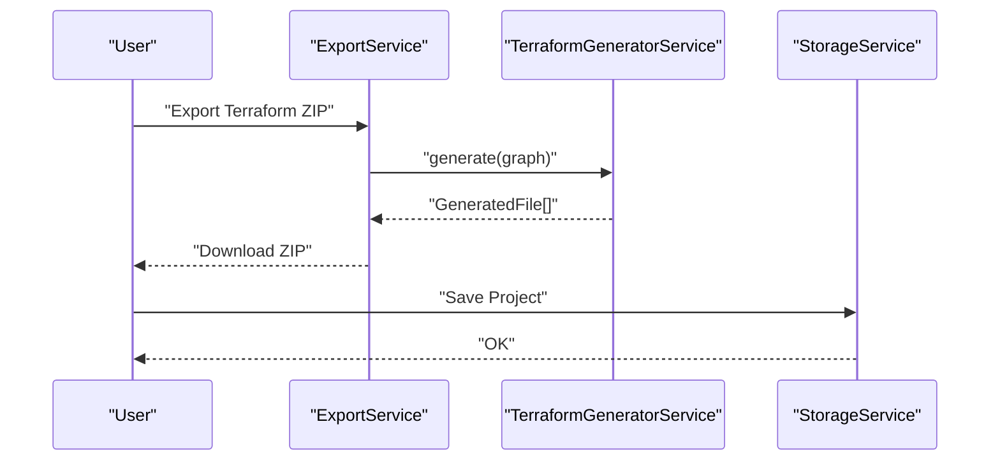
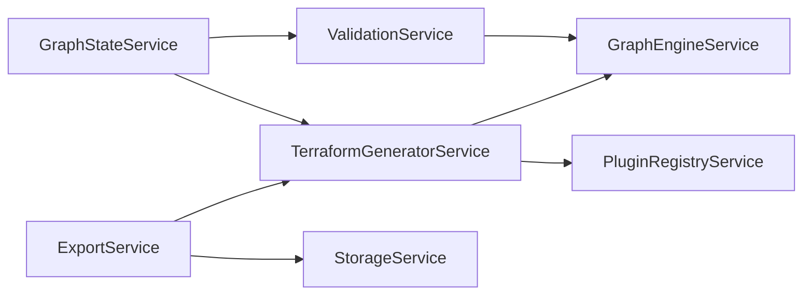

# Data Flow Architecture

<cite>
**Referenced Files in This Document**
- [infra-graph.model.ts](file://src/app/core/models/infra-graph.model.ts)
- [resource-plugin.model.ts](file://src/app/core/models/resource-plugin.model.ts)
- [graph-state.service.ts](file://src/app/core/services/graph-state.service.ts)
- [graph-engine.service.ts](file://src/app/graph-engine/graph-engine.service.ts)
- [validation.service.ts](file://src/app/validation/validation.service.ts)
- [terraform-generator.service.ts](file://src/app/terraform-engine/terraform-generator.service.ts)
- [plugin-registry.service.ts](file://src/app/infra/plugin-registry.service.ts)
- [storage.service.ts](file://src/app/storage/storage.service.ts)
- [export.service.ts](file://src/app/storage/export.service.ts)
- [canvas.component.ts](file://src/app/canvas/canvas.component.ts)
- [inspector.component.ts](file://src/app/inspector/inspector.component.ts)
- [app.component.ts](file://src/app/layout/app.component.ts)
- [README.md (workers)](file://src/app/workers/README.md)
- [main.ts](file://src/main.ts)
</cite>

## Table of Contents
1. [Introduction](#introduction)
2. [Project Structure](#project-structure)
3. [Core Components](#core-components)
4. [Architecture Overview](#architecture-overview)
5. [Detailed Component Analysis](#detailed-component-analysis)
6. [Dependency Analysis](#dependency-analysis)
7. [Performance Considerations](#performance-considerations)
8. [Troubleshooting Guide](#troubleshooting-guide)
9. [Conclusion](#conclusion)
10. [Appendices](#appendices)

## Introduction
This document explains CloudCanvas-TF’s end-to-end data flow architecture. It covers how user input propagates through state management into validation, graph transformations, Terraform code generation, and persistence. It documents the reactive data model built on Angular Signals, the separation between read-only canonical graph data and mutable UI state, and the planned worker-based architecture for heavy computations. It also details the transformation pipeline from canonical graph to Terraform AST blocks and finally to serialized files, along with error handling and consistency guarantees.

## Project Structure
CloudCanvas-TF is organized around a layered Angular application:
- Core models define the canonical data shapes for infrastructure graphs, diagnostics, Terraform blocks, and plugin contracts.
- Services encapsulate state, validation, graph engine operations, and Terraform generation.
- UI components orchestrate user interactions and bind to reactive state.
- Storage and export services manage persistence and packaging of generated artifacts.

**Diagram sources**
- [app.component.ts](file://src/app/layout/app.component.ts#L26-L47)
- [canvas.component.ts](file://src/app/canvas/canvas.component.ts#L12-L14)
- [inspector.component.ts](file://src/app/inspector/inspector.component.ts#L21-L23)
- [graph-state.service.ts](file://src/app/core/services/graph-state.service.ts#L12-L21)
- [graph-engine.service.ts](file://src/app/graph-engine/graph-engine.service.ts#L10-L11)
- [validation.service.ts](file://src/app/validation/validation.service.ts#L7-L12)
- [terraform-generator.service.ts](file://src/app/terraform-engine/terraform-generator.service.ts#L9-L14)
- [plugin-registry.service.ts](file://src/app/infra/plugin-registry.service.ts#L17-L22)
- [storage.service.ts](file://src/app/storage/storage.service.ts#L8-L10)
- [export.service.ts](file://src/app/storage/export.service.ts#L6-L11)
- [README.md (workers)](file://src/app/workers/README.md#L1-L6)

**Section sources**
- [main.ts](file://src/main.ts#L1-L7)
- [app.component.ts](file://src/app/layout/app.component.ts#L12-L25)

## Core Components
- Canonical data models define the InfraGraph, diagnostics, Terraform AST, and plugin contracts. These are immutable read-only structures used as inputs to pure functions and services.
- GraphStateService holds reactive signals for the graph, selection, diagnostics, generated files, and UI flags. It exposes computed signals and mutation methods to update the graph safely.
- GraphEngineService performs graph topology checks and topological sorting.
- ValidationService validates schema, graph integrity, and policy compliance using registered plugins.
- TerraformGeneratorService transforms the graph into Terraform AST blocks and serializes them into files.
- PluginRegistryService registers and retrieves resource plugins that implement validation and Terraform conversion.
- StorageService persists projects to IndexedDB.
- ExportService packages generated files and project data into downloadable bundles.

**Section sources**
- [infra-graph.model.ts](file://src/app/core/models/infra-graph.model.ts#L36-L91)
- [resource-plugin.model.ts](file://src/app/core/models/resource-plugin.model.ts#L43-L54)
- [graph-state.service.ts](file://src/app/core/services/graph-state.service.ts#L12-L33)
- [graph-engine.service.ts](file://src/app/graph-engine/graph-engine.service.ts#L10-L126)
- [validation.service.ts](file://src/app/validation/validation.service.ts#L7-L106)
- [terraform-generator.service.ts](file://src/app/terraform-engine/terraform-generator.service.ts#L9-L233)
- [plugin-registry.service.ts](file://src/app/infra/plugin-registry.service.ts#L17-L72)
- [storage.service.ts](file://src/app/storage/storage.service.ts#L8-L84)
- [export.service.ts](file://src/app/storage/export.service.ts#L6-L202)

## Architecture Overview
The system follows a reactive pipeline:
- User input updates GraphStateService signals.
- An Angular effect reacts to graph changes, invoking ValidationService and TerraformGeneratorService.
- ValidationService computes diagnostics and updates GraphStateService.
- TerraformGeneratorService produces GeneratedFile artifacts and updates GraphStateService.
- ExportService and StorageService consume these artifacts for persistence and downloads.

**Diagram sources**
- [canvas.component.ts](file://src/app/canvas/canvas.component.ts#L90-L161)
- [inspector.component.ts](file://src/app/inspector/inspector.component.ts#L75-L85)
- [graph-state.service.ts](file://src/app/core/services/graph-state.service.ts#L39-L102)
- [app.component.ts](file://src/app/layout/app.component.ts#L33-L41)
- [validation.service.ts](file://src/app/validation/validation.service.ts#L14-L20)
- [graph-engine.service.ts](file://src/app/graph-engine/graph-engine.service.ts#L65-L110)
- [terraform-generator.service.ts](file://src/app/terraform-engine/terraform-generator.service.ts#L16-L51)
- [plugin-registry.service.ts](file://src/app/infra/plugin-registry.service.ts#L48-L50)
- [export.service.ts](file://src/app/storage/export.service.ts#L18-L28)
- [storage.service.ts](file://src/app/storage/storage.service.ts#L30-L38)

## Detailed Component Analysis

### Reactive Data Model and Signals
- GraphStateService exposes:
  - graph: signal<InfraGraph> (read-only canonical data)
  - selectedNodeId: signal<string | null> (mutable UI selection)
  - diagnostics: signal<Diagnostic[]>
  - generatedFiles: signal<GeneratedFile[]>
  - isDirty: signal<boolean>
  - selectedNode: computed<InfraNode | null> derived from selectedNodeId and graph
  - hasBlockingErrors: computed<boolean> derived from diagnostics
  - nodeCount, edgeCount: computed<number>
- Mutations update graph immutably via signal.update, ensuring predictable reactivity and avoiding accidental mutations of the canonical InfraGraph.

**Diagram sources**
- [graph-state.service.ts](file://src/app/core/services/graph-state.service.ts#L12-L146)

**Section sources**
- [graph-state.service.ts](file://src/app/core/services/graph-state.service.ts#L12-L33)
- [graph-state.service.ts](file://src/app/core/services/graph-state.service.ts#L22-L30)

### Graph Engine and Topology
- GraphEngineService provides:
  - buildAdjacencyMap: O(V+E)
  - detectCycle: DFS-based, O(V+E)
  - topologicalSort: Kahn’s algorithm with deterministic tie-breaking, O(V+E)
  - Utility helpers: getConnectedNodes, getEdgesBetween
- These operations are used by ValidationService and TerraformGeneratorService to ensure safe ordering and detect invalid configurations.

**Diagram sources**
- [graph-engine.service.ts](file://src/app/graph-engine/graph-engine.service.ts#L65-L110)

**Section sources**
- [graph-engine.service.ts](file://src/app/graph-engine/graph-engine.service.ts#L13-L126)

### Validation Pipeline
- ValidationService.validateAll orchestrates:
  - validateSchema: per-node plugin validation
  - validateGraph: cycle detection, dangling edges, duplicate names
  - validatePolicies: hints and warnings (e.g., empty graph, subnet without VPC)
- Uses GraphEngineService for cycle detection and PluginRegistryService to route validations per resource type.

**Diagram sources**
- [validation.service.ts](file://src/app/validation/validation.service.ts#L14-L20)
- [validation.service.ts](file://src/app/validation/validation.service.ts#L43-L51)
- [graph-engine.service.ts](file://src/app/graph-engine/graph-engine.service.ts#L27-L63)
- [plugin-registry.service.ts](file://src/app/infra/plugin-registry.service.ts#L48-L50)

**Section sources**
- [validation.service.ts](file://src/app/validation/validation.service.ts#L14-L105)

### Terraform Generation Pipeline
- TerraformGeneratorService.generate:
  - Builds a nodeMap for references
  - Computes topological order (or falls back to raw order if cycle)
  - Invokes plugin.toTerraform for each node to produce Terraform blocks
  - Serializes blocks into providers.tf, main.tf, variables.tf, outputs.tf, and README.generated.md
- Serialization handles nested blocks and value formatting deterministically.

**Diagram sources**
- [terraform-generator.service.ts](file://src/app/terraform-engine/terraform-generator.service.ts#L16-L51)
- [graph-engine.service.ts](file://src/app/graph-engine/graph-engine.service.ts#L65-L110)
- [plugin-registry.service.ts](file://src/app/infra/plugin-registry.service.ts#L48-L50)

**Section sources**
- [terraform-generator.service.ts](file://src/app/terraform-engine/terraform-generator.service.ts#L16-L233)

### UI Interaction and State Updates
- CanvasComponent handles drag-and-drop, node creation, edge drawing, panning, zooming, and deletion. It updates GraphStateService signals and selection state reactively.
- InspectorComponent binds to the selected node, renders plugin-provided JSON schema fields, and updates node properties and names via GraphStateService.

**Diagram sources**
- [canvas.component.ts](file://src/app/canvas/canvas.component.ts#L90-L125)
- [inspector.component.ts](file://src/app/inspector/inspector.component.ts#L75-L85)
- [graph-state.service.ts](file://src/app/core/services/graph-state.service.ts#L39-L102)

**Section sources**
- [canvas.component.ts](file://src/app/canvas/canvas.component.ts#L74-L161)
- [inspector.component.ts](file://src/app/inspector/inspector.component.ts#L25-L79)

### Persistence and Export
- ExportService generates Terraform files synchronously from user gestures, packages them into ZIP, and triggers downloads. It also supports exporting project JSON and full bundles.
- StorageService persists projects to IndexedDB with metadata and timestamps.

**Diagram sources**
- [export.service.ts](file://src/app/storage/export.service.ts#L18-L28)
- [export.service.ts](file://src/app/storage/export.service.ts#L42-L59)
- [storage.service.ts](file://src/app/storage/storage.service.ts#L30-L38)

**Section sources**
- [export.service.ts](file://src/app/storage/export.service.ts#L13-L59)
- [storage.service.ts](file://src/app/storage/storage.service.ts#L30-L84)

### Worker-Based Architecture (Planned)
- The workers directory is a placeholder indicating that CPU-intensive tasks (topological sort, AST generation, validation) are intended to run in Web Workers to keep the UI responsive.
- Angular services will communicate with workers via message passing, maintaining the same reactive contract on the main thread.

**Section sources**
- [README.md (workers)](file://src/app/workers/README.md#L1-L6)

## Dependency Analysis
- Coupling:
  - GraphStateService is central; most components depend on it for state.
  - ValidationService depends on GraphEngineService and PluginRegistryService.
  - TerraformGeneratorService depends on GraphEngineService and PluginRegistryService.
  - ExportService depends on TerraformGeneratorService and StorageService.
- Cohesion:
  - Each service encapsulates a single responsibility (state, validation, generation, persistence).
- External dependencies:
  - Plugins implement validation and serialization contracts.
  - IndexedDB for persistence.

**Diagram sources**
- [graph-state.service.ts](file://src/app/core/services/graph-state.service.ts#L12-L21)
- [validation.service.ts](file://src/app/validation/validation.service.ts#L7-L12)
- [terraform-generator.service.ts](file://src/app/terraform-engine/terraform-generator.service.ts#L9-L14)
- [plugin-registry.service.ts](file://src/app/infra/plugin-registry.service.ts#L17-L22)
- [export.service.ts](file://src/app/storage/export.service.ts#L6-L11)
- [storage.service.ts](file://src/app/storage/storage.service.ts#L8-L10)

**Section sources**
- [graph-state.service.ts](file://src/app/core/services/graph-state.service.ts#L12-L21)
- [validation.service.ts](file://src/app/validation/validation.service.ts#L7-L12)
- [terraform-generator.service.ts](file://src/app/terraform-engine/terraform-generator.service.ts#L9-L14)
- [plugin-registry.service.ts](file://src/app/infra/plugin-registry.service.ts#L17-L22)
- [export.service.ts](file://src/app/storage/export.service.ts#L6-L11)
- [storage.service.ts](file://src/app/storage/storage.service.ts#L8-L10)

## Performance Considerations
- Signal-based reactivity ensures minimal recomputation; effects only subscribe to graph changes.
- Topological sort and cycle detection are linear-time operations; avoid repeated runs by batching UI updates.
- Serialization is deterministic and efficient; consider lazy rendering of large generated files in the preview component.
- Offload heavy work to Web Workers to prevent main-thread blocking during validation and generation.

[No sources needed since this section provides general guidance]

## Troubleshooting Guide
- Diagnostics:
  - ValidationService emits diagnostics with severity, code, optional nodeId/field, message, and remediation. Components can surface these to users.
  - GraphStateService.hasBlockingErrors simplifies gating actions like export.
- Rollback and consistency:
  - GraphStateService.loadGraph replaces the entire graph and clears selection/diagnostics/generated files, providing a clean slate.
  - GraphStateService.clearGraph resets to initial state.
  - isDirty tracks unsaved changes; use it to warn users before navigation.
- Export failures:
  - ExportService wraps generation and download in try/catch and alerts on errors. Verify that the graph is non-empty and valid before exporting.

**Section sources**
- [validation.service.ts](file://src/app/validation/validation.service.ts#L42-L81)
- [graph-state.service.ts](file://src/app/core/services/graph-state.service.ts#L133-L145)
- [export.service.ts](file://src/app/storage/export.service.ts#L18-L28)

## Conclusion
CloudCanvas-TF’s architecture cleanly separates canonical graph data from mutable UI state, uses Angular Signals for reactive propagation, and composes services to validate and generate Terraform artifacts. The planned worker-based design will further improve responsiveness for heavy computations. The pipeline from user input to persisted exports is robust, with diagnostics guiding users and consistent state transitions.

[No sources needed since this section summarizes without analyzing specific files]

## Appendices

### Data Transformation Stages
- Canonical graph: InfraGraph (nodes, edges)
- Validation: Diagnostic[]
- Terraform AST: TerraformBlock[]
- Serialized files: providers.tf, main.tf, variables.tf, outputs.tf, README.generated.md

**Section sources**
- [infra-graph.model.ts](file://src/app/core/models/infra-graph.model.ts#L36-L77)
- [terraform-generator.service.ts](file://src/app/terraform-engine/terraform-generator.service.ts#L53-L154)