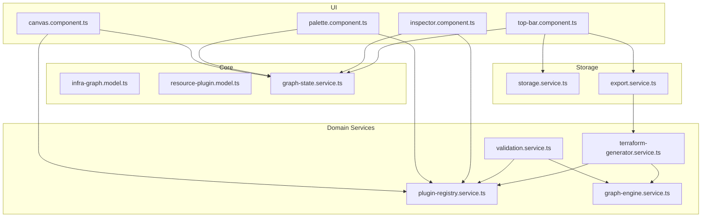
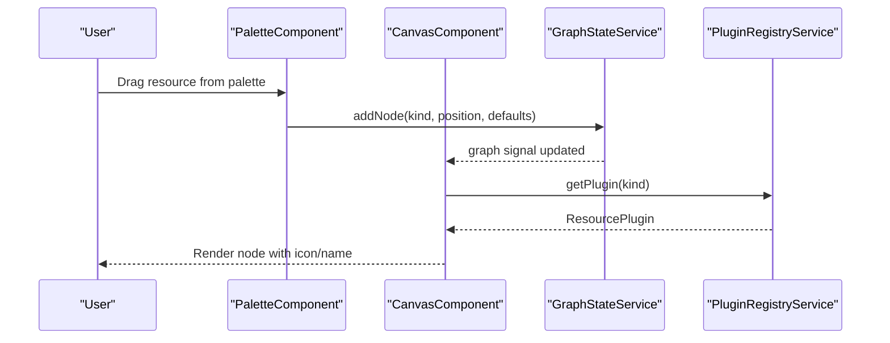
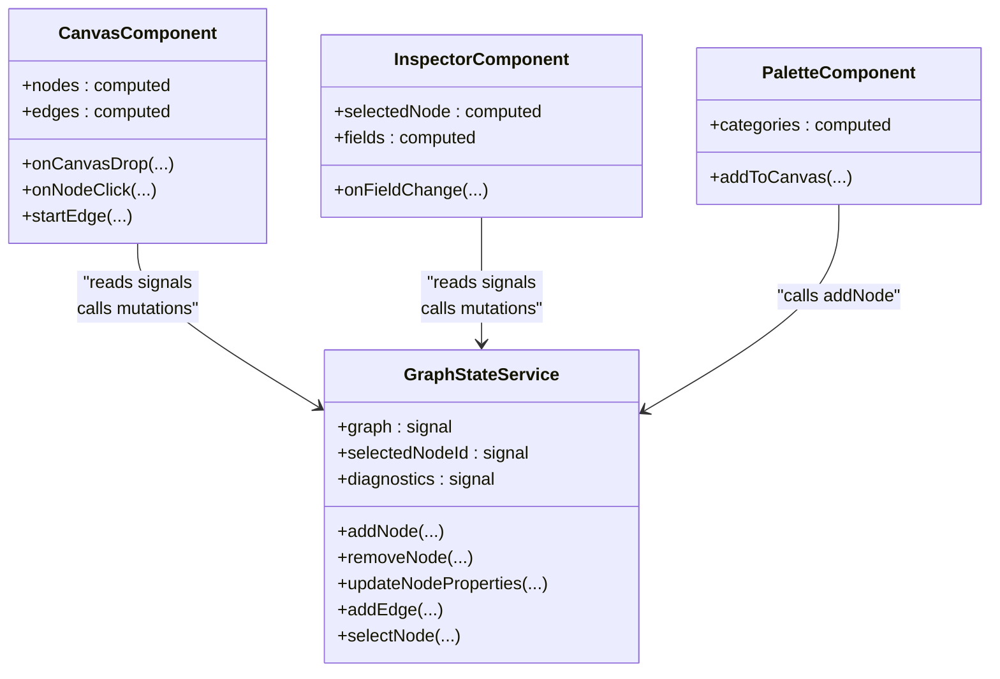
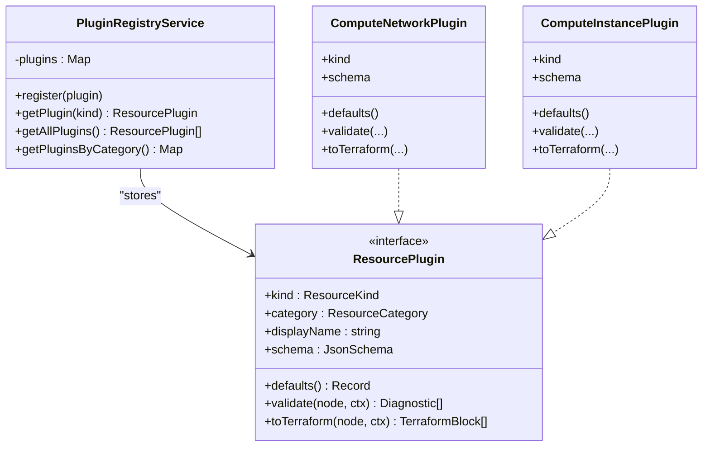
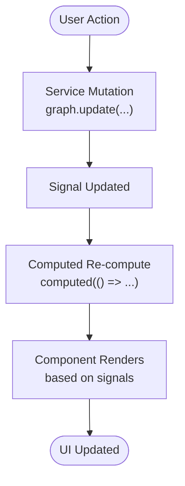
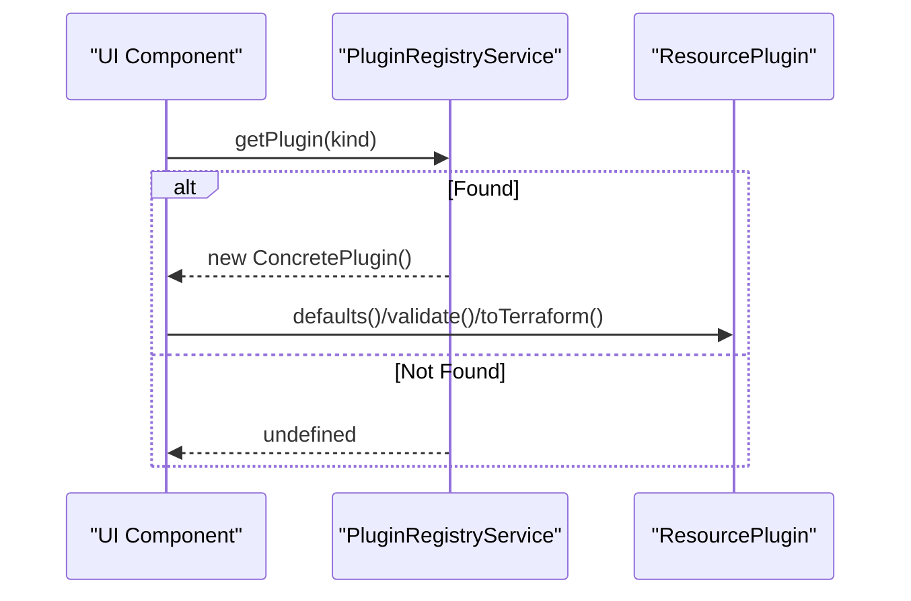
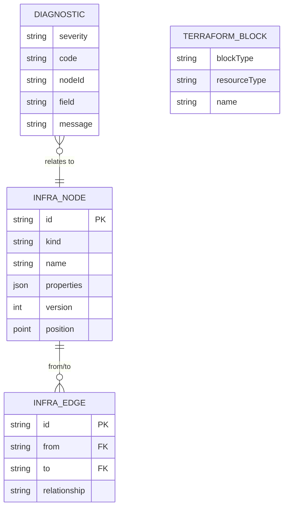
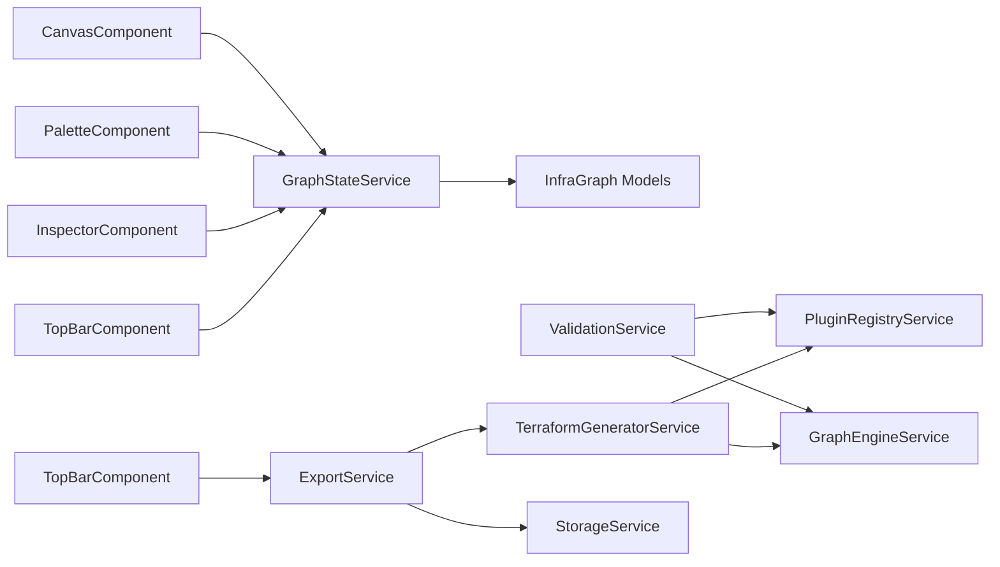

# System Design Patterns

<cite>
**Referenced Files in This Document**
- [infra-graph.model.ts](file://src/app/core/models/infra-graph.model.ts)
- [resource-plugin.model.ts](file://src/app/core/models/resource-plugin.model.ts)
- [graph-state.service.ts](file://src/app/core/services/graph-state.service.ts)
- [plugin-registry.service.ts](file://src/app/infra/plugin-registry.service.ts)
- [canvas.component.ts](file://src/app/canvas/canvas.component.ts)
- [palette.component.ts](file://src/app/palette/palette.component.ts)
- [inspector.component.ts](file://src/app/inspector/inspector.component.ts)
- [top-bar.component.ts](file://src/app/layout/top-bar/top-bar.component.ts)
- [validation.service.ts](file://src/app/validation/validation.service.ts)
- [terraform-generator.service.ts](file://src/app/terraform-engine/terraform-generator.service.ts)
- [graph-engine.service.ts](file://src/app/graph-engine/graph-engine.service.ts)
- [compute-network.plugin.ts](file://src/app/infra/plugins/compute-network.plugin.ts)
- [compute-instance.plugin.ts](file://src/app/infra/plugins/compute-instance.plugin.ts)
- [storage.service.ts](file://src/app/storage/storage.service.ts)
- [export.service.ts](file://src/app/storage/export.service.ts)
</cite>

## Table of Contents
1. [Introduction](#introduction)
2. [Project Structure](#project-structure)
3. [Core Components](#core-components)
4. [Architecture Overview](#architecture-overview)
5. [Detailed Component Analysis](#detailed-component-analysis)
6. [Dependency Analysis](#dependency-analysis)
7. [Performance Considerations](#performance-considerations)
8. [Troubleshooting Guide](#troubleshooting-guide)
9. [Conclusion](#conclusion)

## Introduction
This document explains the core design patterns implemented in CloudCanvas-TF and how they work together to form a maintainable, extensible architecture. It focuses on:
- MVVM (Model-View-ViewModel) via Angular signals and components
- Plugin Pattern for extensible GCP resource support
- Observer Pattern through Angular Signals for reactive state updates
- Factory Pattern for dynamic resource plugin instantiation
- Canonical Data Model centered around InfraGraph as the single source of truth
- Separation of concerns among UI, business logic, and data models

## Project Structure
The application is organized into feature-focused modules with clear separation of concerns:
- Core models define the canonical data model (InfraGraph, Diagnostics, Terraform blocks)
- Services encapsulate state, validation, graph algorithms, and generation
- UI components are stateless views driven by signals and services
- Plugins implement resource-specific behavior and schemas

**Diagram sources**
- [infra-graph.model.ts](file://src/app/core/models/infra-graph.model.ts#L36-L89)
- [resource-plugin.model.ts](file://src/app/core/models/resource-plugin.model.ts#L43-L54)
- [graph-state.service.ts](file://src/app/core/services/graph-state.service.ts#L14-L33)
- [plugin-registry.service.ts](file://src/app/infra/plugin-registry.service.ts#L19-L54)
- [canvas.component.ts](file://src/app/canvas/canvas.component.ts#L12-L41)
- [palette.component.ts](file://src/app/palette/palette.component.ts#L14-L40)
- [inspector.component.ts](file://src/app/inspector/inspector.component.ts#L21-L42)
- [top-bar.component.ts](file://src/app/layout/top-bar/top-bar.component.ts#L14-L30)
- [validation.service.ts](file://src/app/validation/validation.service.ts#L8-L20)
- [terraform-generator.service.ts](file://src/app/terraform-engine/terraform-generator.service.ts#L9-L14)
- [graph-engine.service.ts](file://src/app/graph-engine/graph-engine.service.ts#L11-L25)
- [storage.service.ts](file://src/app/storage/storage.service.ts#L8-L28)
- [export.service.ts](file://src/app/storage/export.service.ts#L6-L11)

**Section sources**
- [infra-graph.model.ts](file://src/app/core/models/infra-graph.model.ts#L1-L118)
- [resource-plugin.model.ts](file://src/app/core/models/resource-plugin.model.ts#L1-L55)
- [graph-state.service.ts](file://src/app/core/services/graph-state.service.ts#L1-L147)
- [plugin-registry.service.ts](file://src/app/infra/plugin-registry.service.ts#L1-L73)
- [canvas.component.ts](file://src/app/canvas/canvas.component.ts#L1-L286)
- [palette.component.ts](file://src/app/palette/palette.component.ts#L1-L83)
- [inspector.component.ts](file://src/app/inspector/inspector.component.ts#L1-L103)
- [top-bar.component.ts](file://src/app/layout/top-bar/top-bar.component.ts#L1-L96)
- [validation.service.ts](file://src/app/validation/validation.service.ts#L1-L107)
- [terraform-generator.service.ts](file://src/app/terraform-engine/terraform-generator.service.ts#L1-L234)
- [graph-engine.service.ts](file://src/app/graph-engine/graph-engine.service.ts#L1-L127)
- [storage.service.ts](file://src/app/storage/storage.service.ts#L1-L85)
- [export.service.ts](file://src/app/storage/export.service.ts#L1-L203)

## Core Components
- InfraGraph and related types define the canonical data model for infrastructure resources and edges, plus diagnostics and Terraform serialization structures.
- ResourcePlugin defines the contract for adding new GCP resources with schema, defaults, validation, and Terraform generation.
- GraphStateService holds reactive state (signals) for the graph, selection, diagnostics, and dirty state, exposing mutation APIs.
- PluginRegistryService registers and exposes plugins by kind and category, enabling dynamic discovery and factory-style instantiation via constructor registration.
- ValidationService orchestrates schema, graph, and policy validations using plugins and graph engine.
- TerraformGeneratorService generates Terraform files from the graph using plugin-specific generators and graph engine ordering.
- GraphEngineService provides graph algorithms (adjacency, cycle detection, topological sort).
- UI components (Canvas, Palette, Inspector, TopBar) are thin views bound to signals and services.

**Section sources**
- [infra-graph.model.ts](file://src/app/core/models/infra-graph.model.ts#L17-L89)
- [resource-plugin.model.ts](file://src/app/core/models/resource-plugin.model.ts#L43-L54)
- [graph-state.service.ts](file://src/app/core/services/graph-state.service.ts#L14-L146)
- [plugin-registry.service.ts](file://src/app/infra/plugin-registry.service.ts#L19-L71)
- [validation.service.ts](file://src/app/validation/validation.service.ts#L8-L106)
- [terraform-generator.service.ts](file://src/app/terraform-engine/terraform-generator.service.ts#L9-L51)
- [graph-engine.service.ts](file://src/app/graph-engine/graph-engine.service.ts#L11-L126)
- [canvas.component.ts](file://src/app/canvas/canvas.component.ts#L12-L41)
- [palette.component.ts](file://src/app/palette/palette.component.ts#L14-L82)
- [inspector.component.ts](file://src/app/inspector/inspector.component.ts#L21-L102)
- [top-bar.component.ts](file://src/app/layout/top-bar/top-bar.component.ts#L14-L95)

## Architecture Overview
CloudCanvas-TF follows a reactive MVVM-like architecture:
- Model: InfraGraph and typed structures
- View: Angular components rendering UI and binding to signals
- ViewModel: Services and component logic that transform model data into view-ready state

**Diagram sources**
- [palette.component.ts](file://src/app/palette/palette.component.ts#L55-L77)
- [graph-state.service.ts](file://src/app/core/services/graph-state.service.ts#L39-L60)
- [canvas.component.ts](file://src/app/canvas/canvas.component.ts#L90-L99)
- [plugin-registry.service.ts](file://src/app/infra/plugin-registry.service.ts#L48-L50)

## Detailed Component Analysis

### MVVM (Model-View-ViewModel) with Signals
- Model: InfraGraph and related types define the single source of truth for infrastructure state.
- ViewModel: Services expose signals and computed values; components subscribe to these signals and call service methods.
- View: Components render based on signals and react to user actions by invoking service methods.

**Diagram sources**
- [graph-state.service.ts](file://src/app/core/services/graph-state.service.ts#L14-L146)
- [canvas.component.ts](file://src/app/canvas/canvas.component.ts#L12-L41)
- [inspector.component.ts](file://src/app/inspector/inspector.component.ts#L21-L42)
- [palette.component.ts](file://src/app/palette/palette.component.ts#L14-L40)

**Section sources**
- [graph-state.service.ts](file://src/app/core/services/graph-state.service.ts#L14-L146)
- [canvas.component.ts](file://src/app/canvas/canvas.component.ts#L12-L125)
- [inspector.component.ts](file://src/app/inspector/inspector.component.ts#L21-L102)
- [palette.component.ts](file://src/app/palette/palette.component.ts#L14-L82)

### Plugin Pattern for Extensible GCP Resource Support
- ResourcePlugin interface defines the contract for each GCP resource: kind, category, display metadata, JSON schema, defaults, validation, and Terraform generation.
- PluginRegistryService registers concrete plugins and exposes lookup by kind and grouping by category.
- Dynamic loading is achieved by importing plugin classes and registering instances in the registry’s constructor.

**Diagram sources**
- [resource-plugin.model.ts](file://src/app/core/models/resource-plugin.model.ts#L43-L54)
- [plugin-registry.service.ts](file://src/app/infra/plugin-registry.service.ts#L19-L54)
- [compute-network.plugin.ts](file://src/app/infra/plugins/compute-network.plugin.ts#L4-L128)
- [compute-instance.plugin.ts](file://src/app/infra/plugins/compute-instance.plugin.ts#L4-L127)

**Section sources**
- [resource-plugin.model.ts](file://src/app/core/models/resource-plugin.model.ts#L11-L54)
- [plugin-registry.service.ts](file://src/app/infra/plugin-registry.service.ts#L19-L71)
- [compute-network.plugin.ts](file://src/app/infra/plugins/compute-network.plugin.ts#L4-L128)
- [compute-instance.plugin.ts](file://src/app/infra/plugins/compute-instance.plugin.ts#L4-L127)

### Observer Pattern via Angular Signals
- Reactive updates: GraphStateService exposes signals for graph, selection, diagnostics, and counts. Components subscribe via computed and effects.
- Automatic propagation: When a service mutates a signal, dependent computations re-evaluate and views update.

**Diagram sources**
- [graph-state.service.ts](file://src/app/core/services/graph-state.service.ts#L14-L33)
- [canvas.component.ts](file://src/app/canvas/canvas.component.ts#L34-L41)
- [inspector.component.ts](file://src/app/inspector/inspector.component.ts#L25-L42)

**Section sources**
- [graph-state.service.ts](file://src/app/core/services/graph-state.service.ts#L14-L33)
- [canvas.component.ts](file://src/app/canvas/canvas.component.ts#L34-L41)
- [inspector.component.ts](file://src/app/inspector/inspector.component.ts#L25-L42)

### Factory Pattern for Dynamic Resource Plugin Instantiation
- Registration as factory: PluginRegistryService constructs plugin instances in its constructor and stores them in a Map keyed by ResourceKind.
- Lookup-based factory: getPlugin(kind) acts as a factory method returning the registered plugin instance.

**Diagram sources**
- [plugin-registry.service.ts](file://src/app/infra/plugin-registry.service.ts#L21-L50)
- [resource-plugin.model.ts](file://src/app/core/models/resource-plugin.model.ts#L43-L54)

**Section sources**
- [plugin-registry.service.ts](file://src/app/infra/plugin-registry.service.ts#L19-L54)
- [resource-plugin.model.ts](file://src/app/core/models/resource-plugin.model.ts#L43-L54)

### Canonical Data Model with InfraGraph as Single Source of Truth
- InfraGraph centralizes nodes, edges, and metadata; all UI and services read/write through this structure.
- Validation and generation depend on InfraGraph to ensure consistency and correctness.

**Diagram sources**
- [infra-graph.model.ts](file://src/app/core/models/infra-graph.model.ts#L17-L48)

**Section sources**
- [infra-graph.model.ts](file://src/app/core/models/infra-graph.model.ts#L36-L89)

### Separation of Concerns
- UI components focus on rendering and capturing user interactions, delegating state changes to services.
- Business logic services encapsulate domain operations: validation, graph algorithms, and Terraform generation.
- Data models define the canonical structures and schemas used across the system.

Concrete examples:
- CanvasComponent orchestrates node creation, selection, dragging, and edge drawing by calling GraphStateService methods.
- ValidationService delegates per-resource validation to plugins and performs graph-wide checks via GraphEngineService.
- TerraformGeneratorService orders nodes via GraphEngineService and delegates serialization to plugins.

**Section sources**
- [canvas.component.ts](file://src/app/canvas/canvas.component.ts#L74-L161)
- [validation.service.ts](file://src/app/validation/validation.service.ts#L14-L81)
- [terraform-generator.service.ts](file://src/app/terraform-engine/terraform-generator.service.ts#L16-L51)

## Dependency Analysis
The system exhibits low coupling and high cohesion:
- UI components depend on services via dependency injection and signals.
- Services depend on models and registries but not on specific UI components.
- Plugins are decoupled from UI and only implement the ResourcePlugin contract.

**Diagram sources**
- [canvas.component.ts](file://src/app/canvas/canvas.component.ts#L12-L14)
- [palette.component.ts](file://src/app/palette/palette.component.ts#L15-L16)
- [inspector.component.ts](file://src/app/inspector/inspector.component.ts#L22-L23)
- [top-bar.component.ts](file://src/app/layout/top-bar/top-bar.component.ts#L15-L17)
- [graph-state.service.ts](file://src/app/core/services/graph-state.service.ts#L1-L10)
- [validation.service.ts](file://src/app/validation/validation.service.ts#L9-L12)
- [terraform-generator.service.ts](file://src/app/terraform-engine/terraform-generator.service.ts#L11-L14)
- [plugin-registry.service.ts](file://src/app/infra/plugin-registry.service.ts#L1-L3)
- [graph-engine.service.ts](file://src/app/graph-engine/graph-engine.service.ts#L1-L2)
- [export.service.ts](file://src/app/storage/export.service.ts#L8-L11)
- [storage.service.ts](file://src/app/storage/storage.service.ts#L8-L8)

**Section sources**
- [canvas.component.ts](file://src/app/canvas/canvas.component.ts#L12-L14)
- [palette.component.ts](file://src/app/palette/palette.component.ts#L15-L16)
- [inspector.component.ts](file://src/app/inspector/inspector.component.ts#L22-L23)
- [top-bar.component.ts](file://src/app/layout/top-bar/top-bar.component.ts#L15-L17)
- [validation.service.ts](file://src/app/validation/validation.service.ts#L9-L12)
- [terraform-generator.service.ts](file://src/app/terraform-engine/terraform-generator.service.ts#L11-L14)
- [plugin-registry.service.ts](file://src/app/infra/plugin-registry.service.ts#L1-L3)
- [graph-engine.service.ts](file://src/app/graph-engine/graph-engine.service.ts#L1-L2)
- [export.service.ts](file://src/app/storage/export.service.ts#L8-L11)
- [storage.service.ts](file://src/app/storage/storage.service.ts#L8-L8)

## Performance Considerations
- Signals minimize change detection overhead by providing fine-grained reactivity.
- Computed values cache derived state; ensure expensive computations are memoized via computed.
- Graph algorithms (topological sort, cycle detection) operate on adjacency structures; keep graphs reasonably sized for interactive UX.
- Avoid synchronous heavy work in UI event handlers; delegate to services and keep UI responsive.

## Troubleshooting Guide
Common issues and where to look:
- Unknown resource type errors during validation indicate a missing plugin registration or incorrect kind.
  - Check plugin registration and kind values.
  - See [validation.service.ts](file://src/app/validation/validation.service.ts#L26-L37) and [plugin-registry.service.ts](file://src/app/infra/plugin-registry.service.ts#L48-L50).
- Circular dependencies detected by graph engine cause generation failures.
  - Review edges and remove cycles.
  - See [graph-engine.service.ts](file://src/app/graph-engine/graph-engine.service.ts#L27-L63).
- Duplicate resource names within a type produce validation warnings.
  - Adjust names to be unique per type.
  - See [validation.service.ts](file://src/app/validation/validation.service.ts#L67-L78).
- Export failures often stem from invalid graph state or unsupported plugin configurations.
  - Validate graph and ensure all plugins are registered.
  - See [export.service.ts](file://src/app/storage/export.service.ts#L18-L28) and [terraform-generator.service.ts](file://src/app/terraform-engine/terraform-generator.service.ts#L16-L51).

**Section sources**
- [validation.service.ts](file://src/app/validation/validation.service.ts#L22-L81)
- [graph-engine.service.ts](file://src/app/graph-engine/graph-engine.service.ts#L27-L63)
- [export.service.ts](file://src/app/storage/export.service.ts#L18-L28)
- [terraform-generator.service.ts](file://src/app/terraform-engine/terraform-generator.service.ts#L16-L51)
- [plugin-registry.service.ts](file://src/app/infra/plugin-registry.service.ts#L48-L50)

## Conclusion
CloudCanvas-TF’s architecture leverages Angular signals for reactive state, a canonical InfraGraph model as the single source of truth, and a plugin-driven extensibility model. The MVVM-like separation of concerns, combined with the Plugin, Factory, Observer, and Canonical Data Model patterns, yields a maintainable and extensible system suitable for evolving GCP resource support and complex infrastructure modeling.