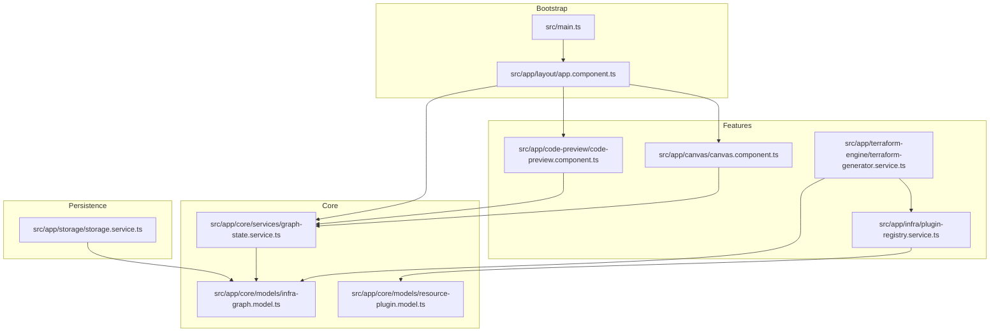
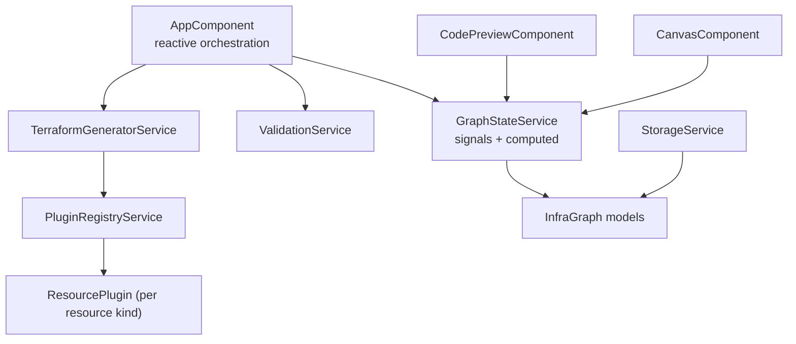
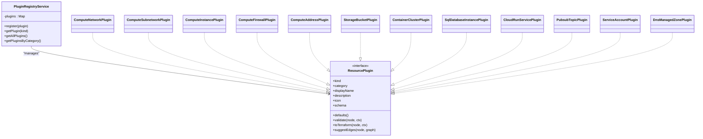
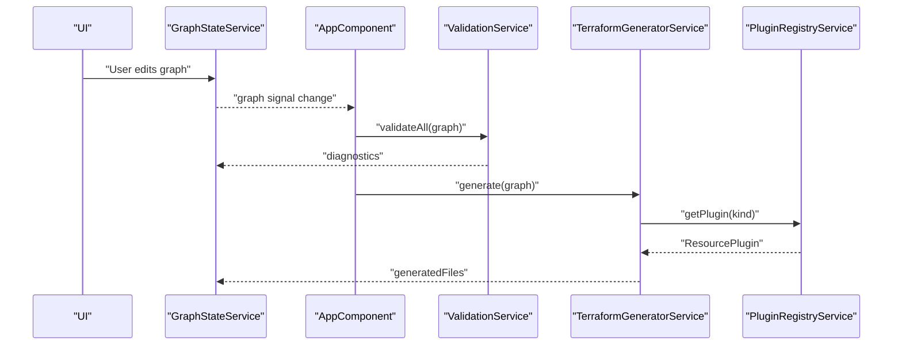
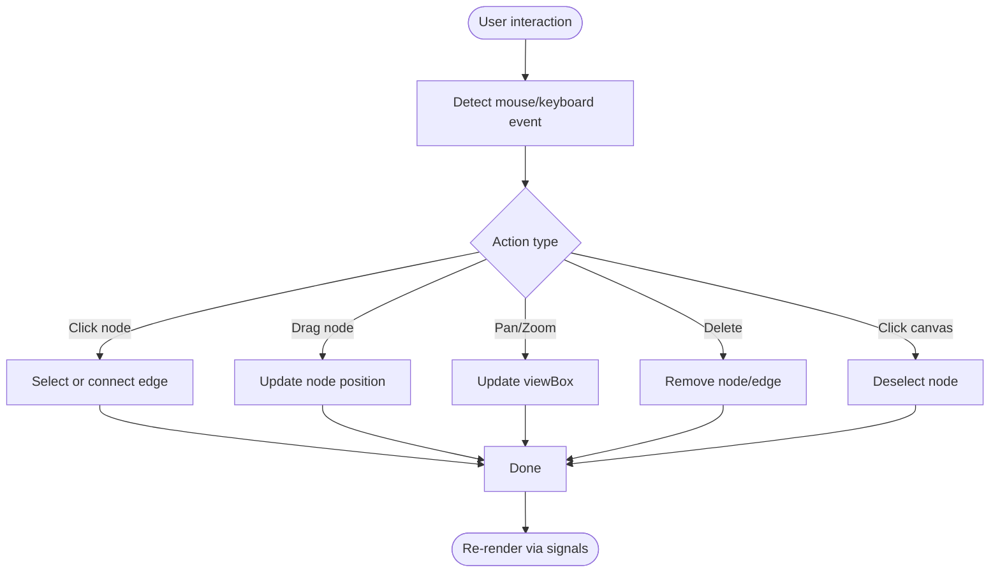
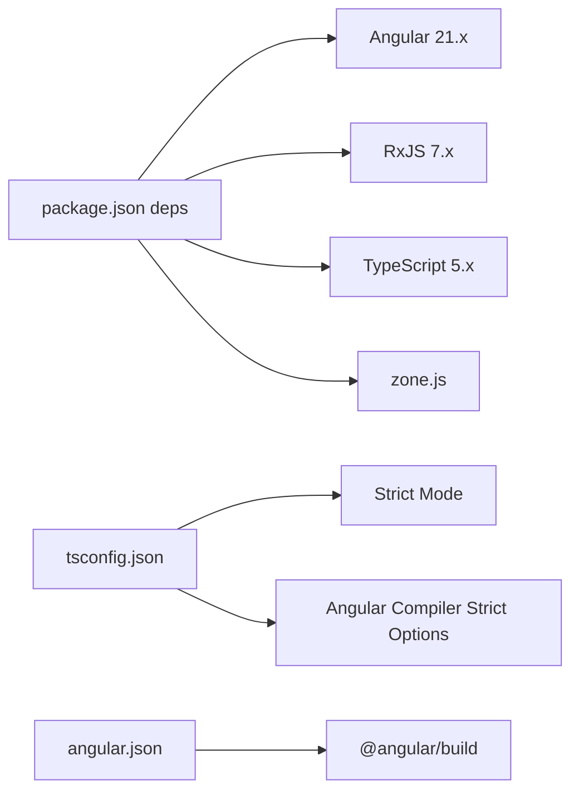

# Technology Stack Decisions

<cite>
**Referenced Files in This Document**
- [package.json](file://package.json)
- [angular.json](file://angular.json)
- [tsconfig.json](file://tsconfig.json)
- [src/main.ts](file://src/main.ts)
- [src/app/layout/app.component.ts](file://src/app/layout/app.component.ts)
- [src/app/core/services/graph-state.service.ts](file://src/app/core/services/graph-state.service.ts)
- [src/app/core/models/infra-graph.model.ts](file://src/app/core/models/infra-graph.model.ts)
- [src/app/core/models/resource-plugin.model.ts](file://src/app/core/models/resource-plugin.model.ts)
- [src/app/infra/plugin-registry.service.ts](file://src/app/infra/plugin-registry.service.ts)
- [src/app/terraform-engine/terraform-generator.service.ts](file://src/app/terraform-engine/terraform-generator.service.ts)
- [src/app/canvas/canvas.component.ts](file://src/app/canvas/canvas.component.ts)
- [src/app/code-preview/code-preview.component.ts](file://src/app/code-preview/code-preview.component.ts)
- [src/app/storage/storage.service.ts](file://src/app/storage/storage.service.ts)
</cite>

## Table of Contents
1. [Introduction](#introduction)
2. [Project Structure](#project-structure)
3. [Core Components](#core-components)
4. [Architecture Overview](#architecture-overview)
5. [Detailed Component Analysis](#detailed-component-analysis)
6. [Dependency Analysis](#dependency-analysis)
7. [Performance Considerations](#performance-considerations)
8. [Troubleshooting Guide](#troubleshooting-guide)
9. [Conclusion](#conclusion)
10. [Appendices](#appendices)

## Introduction
This document explains CloudCanvas-TF’s technology stack choices and how they shape the system design. It focuses on:
- Angular 21 with standalone components and signals-based architecture for reactive programming and component isolation
- TypeScript strict mode for type safety and developer experience
- Angular Signals over NgRx for state management, emphasizing simplicity and performance
- RxJS for async operations and worker orchestration
- Monaco Editor for code preview
- IndexedDB for persistence
- Web Workers for computational tasks
- A plugin architecture using Angular DI and factory patterns
It also covers performance implications, maintainability benefits, trade-offs, and guidance for extensibility and future development.

## Project Structure
CloudCanvas-TF follows a feature-based Angular structure with clear separation of concerns:
- Application bootstrap and layout define the root component and shell UI
- Core domain models and services encapsulate state and business logic
- Feature modules (canvas, inspector, diagnostics, code preview) implement UI and interactions
- Infrastructure plugins power extensible resource modeling and generation
- Storage and engine services handle persistence and code generation

**Diagram sources**
- [src/main.ts](file://src/main.ts#L1-L7)
- [src/app/layout/app.component.ts](file://src/app/layout/app.component.ts#L1-L48)
- [src/app/core/services/graph-state.service.ts](file://src/app/core/services/graph-state.service.ts#L1-L147)
- [src/app/core/models/infra-graph.model.ts](file://src/app/core/models/infra-graph.model.ts#L1-L118)
- [src/app/core/models/resource-plugin.model.ts](file://src/app/core/models/resource-plugin.model.ts#L1-L55)
- [src/app/infra/plugin-registry.service.ts](file://src/app/infra/plugin-registry.service.ts#L1-L73)
- [src/app/terraform-engine/terraform-generator.service.ts](file://src/app/terraform-engine/terraform-generator.service.ts#L1-L234)
- [src/app/canvas/canvas.component.ts](file://src/app/canvas/canvas.component.ts#L1-L286)
- [src/app/code-preview/code-preview.component.ts](file://src/app/code-preview/code-preview.component.ts#L1-L137)
- [src/app/storage/storage.service.ts](file://src/app/storage/storage.service.ts#L1-L85)

**Section sources**
- [package.json](file://package.json#L12-L22)
- [angular.json](file://angular.json#L1-L34)
- [tsconfig.json](file://tsconfig.json#L1-L23)
- [src/main.ts](file://src/main.ts#L1-L7)
- [src/app/layout/app.component.ts](file://src/app/layout/app.component.ts#L1-L48)

## Core Components
- Angular 21 with standalone components and signals: The app uses standalone components and signals for reactive state, enabling fine-grained reactivity and component isolation. The root component orchestrates state reactions via effects.
- TypeScript strict mode: Enforced via tsconfig, ensuring strong typing, explicit overrides, and safer refactors.
- Signals-based state: GraphStateService centralizes application state using signals and computed values, minimizing boilerplate and reducing accidental mutations.
- Plugin registry: A DI-backed registry registers and exposes resource plugins categorized by cloud service families.
- Terraform generator: Generates Terraform files from the graph using plugin-provided transformations and a topological sort.
- Code preview: Renders generated HCL with syntax highlighting and clipboard integration.
- Persistence: IndexedDB-backed StorageService persists projects with a simple object store.

**Section sources**
- [src/app/layout/app.component.ts](file://src/app/layout/app.component.ts#L26-L42)
- [src/app/core/services/graph-state.service.ts](file://src/app/core/services/graph-state.service.ts#L12-L33)
- [src/app/infra/plugin-registry.service.ts](file://src/app/infra/plugin-registry.service.ts#L17-L54)
- [src/app/terraform-engine/terraform-generator.service.ts](file://src/app/terraform-engine/terraform-generator.service.ts#L9-L51)
- [src/app/code-preview/code-preview.component.ts](file://src/app/code-preview/code-preview.component.ts#L100-L136)
- [src/app/storage/storage.service.ts](file://src/app/storage/storage.service.ts#L8-L84)
- [tsconfig.json](file://tsconfig.json#L4-L21)

## Architecture Overview
The system is a single-page application built around a reactive graph model. The root component reacts to graph changes to trigger validation and code generation. Plugins implement resource-specific logic, and the generator composes Terraform artifacts. UI components consume signals for rendering and user interactions.

**Diagram sources**
- [src/app/layout/app.component.ts](file://src/app/layout/app.component.ts#L26-L42)
- [src/app/core/services/graph-state.service.ts](file://src/app/core/services/graph-state.service.ts#L12-L33)
- [src/app/terraform-engine/terraform-generator.service.ts](file://src/app/terraform-engine/terraform-generator.service.ts#L9-L51)
- [src/app/infra/plugin-registry.service.ts](file://src/app/infra/plugin-registry.service.ts#L17-L54)
- [src/app/core/models/infra-graph.model.ts](file://src/app/core/models/infra-graph.model.ts#L1-L118)
- [src/app/code-preview/code-preview.component.ts](file://src/app/code-preview/code-preview.component.ts#L107-L118)
- [src/app/canvas/canvas.component.ts](file://src/app/canvas/canvas.component.ts#L12-L43)
- [src/app/storage/storage.service.ts](file://src/app/storage/storage.service.ts#L8-L84)

## Detailed Component Analysis

### Angular Signals and Reactive Orchestration
- Signals replace NgRx for local state management, simplifying the mental model and reducing boilerplate. GraphStateService exposes signals for graph, diagnostics, and generated files, plus computed views for derived data.
- The root component uses an effect to reactively run validation and code generation whenever the graph changes, ensuring UI consistency and immediate feedback.

Benefits:
- Fine-grained reactivity reduces unnecessary renders
- Simpler mental model compared to centralized stores
- Strong typing with signals and computed

Trade-offs:
- Centralized state requires disciplined updates
- Complex cross-cutting concerns may still benefit from a dedicated store

**Section sources**
- [src/app/core/services/graph-state.service.ts](file://src/app/core/services/graph-state.service.ts#L12-L33)
- [src/app/layout/app.component.ts](file://src/app/layout/app.component.ts#L31-L42)

### Plugin Architecture with Angular DI and Factory Patterns
- PluginRegistryService registers concrete ResourcePlugin instances keyed by ResourceKind. Plugins encapsulate validation, schema, defaults, and Terraform conversion logic.
- The registry exposes typed getters and grouping helpers, enabling dynamic UI composition and extensibility.

**Diagram sources**
- [src/app/infra/plugin-registry.service.ts](file://src/app/infra/plugin-registry.service.ts#L17-L71)
- [src/app/core/models/resource-plugin.model.ts](file://src/app/core/models/resource-plugin.model.ts#L43-L54)

**Section sources**
- [src/app/infra/plugin-registry.service.ts](file://src/app/infra/plugin-registry.service.ts#L17-L71)
- [src/app/core/models/resource-plugin.model.ts](file://src/app/core/models/resource-plugin.model.ts#L1-L55)

### Terraform Generation Pipeline
- The generator constructs a context mapping node IDs to nodes, sorts nodes topologically (with fallback for cycles), and invokes each plugin’s toTerraform method to produce Terraform blocks. It then emits providers, main, variables, outputs, and a README file.

**Diagram sources**
- [src/app/layout/app.component.ts](file://src/app/layout/app.component.ts#L33-L41)
- [src/app/core/services/graph-state.service.ts](file://src/app/core/services/graph-state.service.ts#L14-L20)
- [src/app/terraform-engine/terraform-generator.service.ts](file://src/app/terraform-engine/terraform-generator.service.ts#L16-L51)
- [src/app/infra/plugin-registry.service.ts](file://src/app/infra/plugin-registry.service.ts#L48-L50)

**Section sources**
- [src/app/terraform-engine/terraform-generator.service.ts](file://src/app/terraform-engine/terraform-generator.service.ts#L9-L51)

### Canvas Interaction and Rendering
- CanvasComponent manages SVG panning/zooming, node dragging, edge drawing, and deletion. It computes node positions, selection state, and edge paths. It integrates with GraphStateService for mutation and reads diagnostics for visual indicators.

**Diagram sources**
- [src/app/canvas/canvas.component.ts](file://src/app/canvas/canvas.component.ts#L74-L218)

**Section sources**
- [src/app/canvas/canvas.component.ts](file://src/app/canvas/canvas.component.ts#L12-L286)

### Code Preview and Syntax Highlighting
- CodePreviewComponent displays generated files and applies HCL syntax highlighting via a pipe. It supports copying content to the clipboard with user feedback.

**Section sources**
- [src/app/code-preview/code-preview.component.ts](file://src/app/code-preview/code-preview.component.ts#L100-L136)

### Persistence with IndexedDB
- StorageService wraps IndexedDB operations with a simple object store keyed by project name. It supports saving, loading, listing, and deleting projects.

**Section sources**
- [src/app/storage/storage.service.ts](file://src/app/storage/storage.service.ts#L8-L84)

## Dependency Analysis
External dependencies and build configuration:
- Angular 21 packages for framework, router, forms, platform-browser, animations, and zone.js
- RxJS for asynchronous streams and operator-based composition
- TypeScript 5.9.3 with strict compiler options and Angular-specific strictness flags
- Angular CLI and @angular/build for application builder and dev server

**Diagram sources**
- [package.json](file://package.json#L12-L31)
- [tsconfig.json](file://tsconfig.json#L3-L21)
- [angular.json](file://angular.json#L12-L26)

**Section sources**
- [package.json](file://package.json#L12-L31)
- [tsconfig.json](file://tsconfig.json#L3-L21)
- [angular.json](file://angular.json#L12-L26)

## Performance Considerations
- Signals and computed: Minimizes change detection overhead by tracking precise dependencies. Prefer computed for derived data to avoid recomputation.
- Standalone components: Reduce bootstrap cost and improve tree-shaking. Keep heavy initialization out of constructors.
- IndexedDB: Batch operations and avoid synchronous IndexedDB in hot paths. Offload heavy work to workers if needed.
- SVG rendering: Defer expensive DOM updates; throttle mousemove handlers; cache node maps and computed values.
- Async operations: Use RxJS operators for backpressure and cancellation; avoid blocking the UI thread.
- Clipboard operations: Perform in response to user gestures to prevent browser restrictions.

[No sources needed since this section provides general guidance]

## Troubleshooting Guide
- Type errors: Enable strict mode checks and fix missing returns, implicit overrides, and index signature access violations.
- Signal updates: Ensure updates occur inside Angular zones if integrating with external async APIs; use graph updates via graph.update to preserve immutability patterns.
- IndexedDB failures: Handle transaction errors and version mismatches; verify object store creation during upgrade.
- Clipboard permission: Trigger clipboard actions from user-initiated events; handle exceptions gracefully.
- Plugin registration: Verify plugin kinds match ResourceKind and that defaults and schema align with node properties.

**Section sources**
- [tsconfig.json](file://tsconfig.json#L4-L8)
- [src/app/core/services/graph-state.service.ts](file://src/app/core/services/graph-state.service.ts#L54-L82)
- [src/app/storage/storage.service.ts](file://src/app/storage/storage.service.ts#L15-L28)
- [src/app/code-preview/code-preview.component.ts](file://src/app/code-preview/code-preview.component.ts#L124-L135)

## Conclusion
CloudCanvas-TF’s stack emphasizes simplicity, performance, and maintainability:
- Angular 21 with standalone components and signals delivers reactive UI with minimal boilerplate
- Strict TypeScript improves reliability and developer productivity
- Signals replace NgRx for local state, keeping the system lean
- RxJS powers async flows and can orchestrate Web Workers for heavy computations
- Monaco Editor can enhance code editing and preview experiences
- IndexedDB provides robust offline-first persistence
- A DI-backed plugin registry enables extensibility and modular growth

These choices collectively support rapid iteration, clear data flow, and scalable architecture for infrastructure-as-code authoring.

[No sources needed since this section summarizes without analyzing specific files]

## Appendices

### Technology Choices and Impacts
- Angular 21 + Standalone + Signals
  - Impact: Reactive, component-isolated UI; simplified DI and lazy loading
  - Performance: Lower overhead than NgRx for local state
  - Maintainability: Easier to test and refactor components
- TypeScript strict mode
  - Impact: Safer refactors, fewer runtime errors
  - Trade-off: Steeper learning curve and stricter development process
- Signals vs NgRx
  - Impact: Reduced complexity for local state; centralized stores still valuable for cross-cutting concerns
  - Performance: Lower memory footprint and simpler subscriptions
- RxJS
  - Impact: Rich async primitives; integrate with Web Workers for heavy tasks
  - Performance: Backpressure and cancellation reduce wasted work
- Monaco Editor
  - Impact: Rich editor experience for code preview/editing
  - Consideration: Additional bundle size; optional integration
- IndexedDB
  - Impact: Persistent, client-side storage without backend
  - Consideration: Browser compatibility and migration strategy
- Web Workers
  - Impact: Offload heavy computation (e.g., graph algorithms, serialization)
  - Consideration: Serialization overhead; structured cloning limitations

[No sources needed since this section provides general guidance]