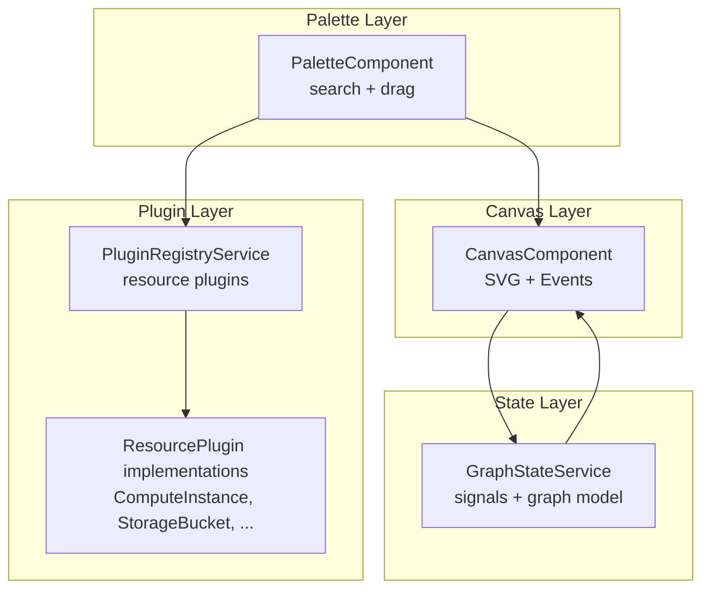
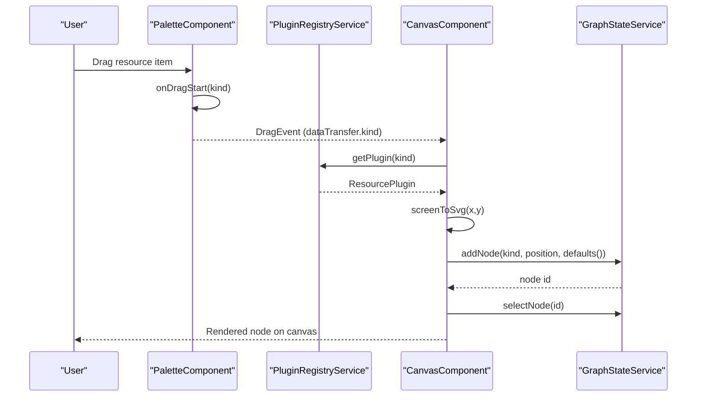
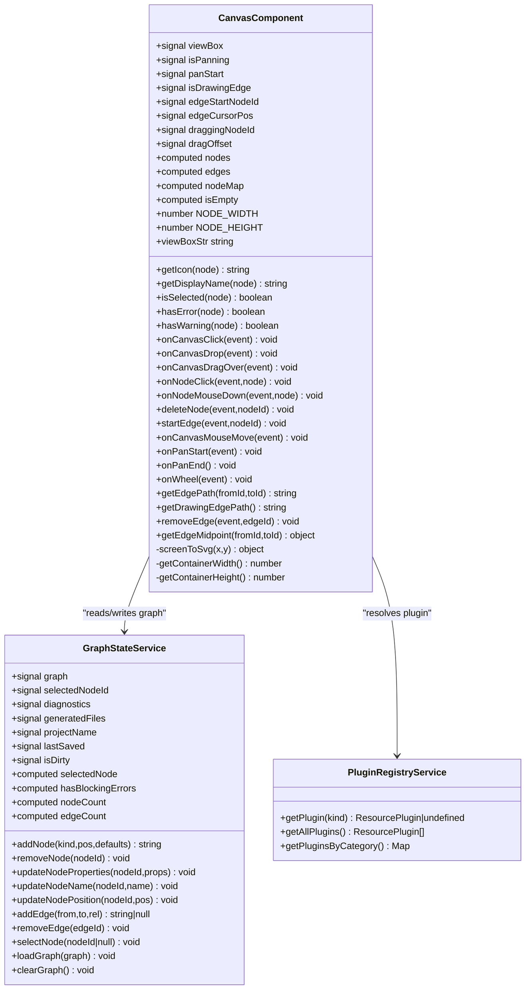
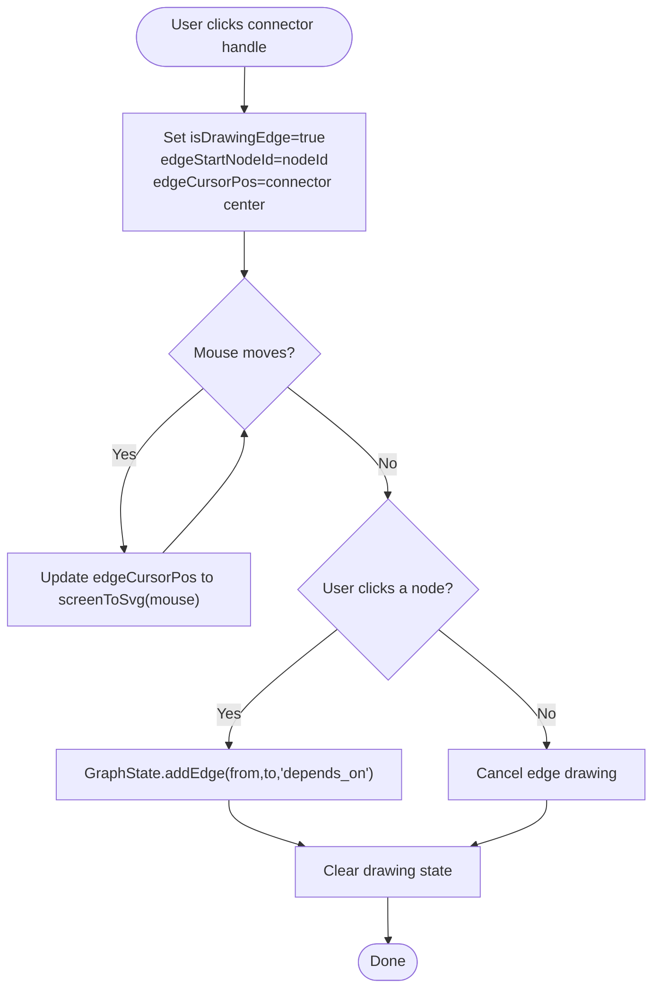
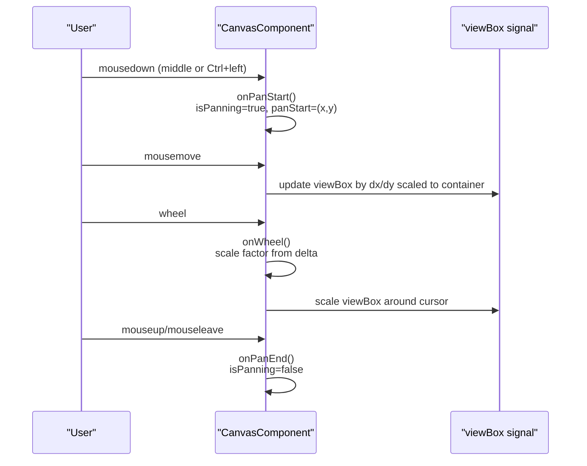
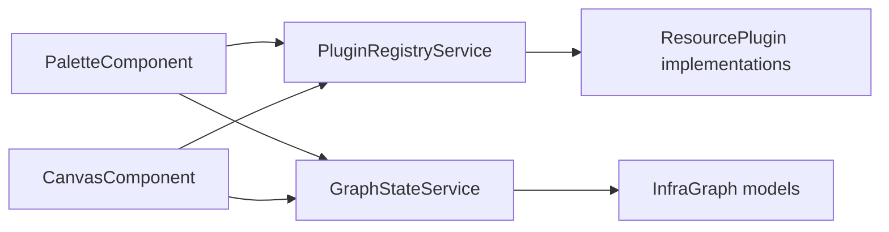

# Canvas System

<cite>
**Referenced Files in This Document**
- [canvas.component.ts](file://src/app/canvas/canvas.component.ts)
- [canvas.component.html](file://src/app/canvas/canvas.component.html)
- [canvas.component.scss](file://src/app/canvas/canvas.component.scss)
- [README.md](file://src/app/canvas/README.md)
- [infra-graph.model.ts](file://src/app/core/models/infra-graph.model.ts)
- [graph-state.service.ts](file://src/app/core/services/graph-state.service.ts)
- [plugin-registry.service.ts](file://src/app/infra/plugin-registry.service.ts)
- [resource-plugin.model.ts](file://src/app/core/models/resource-plugin.model.ts)
- [compute-instance.plugin.ts](file://src/app/infra/plugins/compute-instance.plugin.ts)
- [storage-bucket.plugin.ts](file://src/app/infra/plugins/storage-bucket.plugin.ts)
- [palette.component.ts](file://src/app/palette/palette.component.ts)
- [palette.component.html](file://src/app/palette/palette.component.html)
- [SYSTEM_DESIGN.md](file://SYSTEM_DESIGN.md)
</cite>

## Table of Contents
1. [Introduction](#introduction)
2. [Project Structure](#project-structure)
3. [Core Components](#core-components)
4. [Architecture Overview](#architecture-overview)
5. [Detailed Component Analysis](#detailed-component-analysis)
6. [Dependency Analysis](#dependency-analysis)
7. [Performance Considerations](#performance-considerations)
8. [Troubleshooting Guide](#troubleshooting-guide)
9. [Conclusion](#conclusion)
10. [Appendices](#appendices)

## Introduction
This document describes the Canvas System component that powers the visual graph editing interface. It enables drag-and-drop resource placement from the palette, interactive node manipulation, edge drawing, and real-time rendering of infrastructure graphs. It covers the SVG-based coordinate system, zoom and pan capabilities, grid snapping behavior, integration with Angular CDK for drag-and-drop, mouse event handling for selection and manipulation, canvas state management, viewport calculations, and responsive design considerations. Practical examples and performance optimization techniques for large graphs are included.

## Project Structure
The Canvas System is implemented as a standalone Angular component with tight integration to the application’s state and plugin systems:
- Canvas component renders an SVG canvas with nodes, edges, and interactive controls.
- Graph state service manages the canonical graph model and selection state.
- Plugin registry provides resource definitions and defaults for drag-and-drop creation.
- Palette component exposes searchable resource catalogs and initiates drag-and-drop.

**Diagram sources**
- [canvas.component.ts](file://src/app/canvas/canvas.component.ts#L1-L286)
- [graph-state.service.ts](file://src/app/core/services/graph-state.service.ts#L1-L147)
- [plugin-registry.service.ts](file://src/app/infra/plugin-registry.service.ts#L1-L73)
- [palette.component.ts](file://src/app/palette/palette.component.ts#L1-L83)

**Section sources**
- [canvas.component.ts](file://src/app/canvas/canvas.component.ts#L1-L286)
- [canvas.component.html](file://src/app/canvas/canvas.component.html#L1-L123)
- [canvas.component.scss](file://src/app/canvas/canvas.component.scss#L1-L305)
- [README.md](file://src/app/canvas/README.md#L1-L4)
- [infra-graph.model.ts](file://src/app/core/models/infra-graph.model.ts#L1-L118)
- [graph-state.service.ts](file://src/app/core/services/graph-state.service.ts#L1-L147)
- [plugin-registry.service.ts](file://src/app/infra/plugin-registry.service.ts#L1-L73)
- [resource-plugin.model.ts](file://src/app/core/models/resource-plugin.model.ts#L1-L55)
- [palette.component.ts](file://src/app/palette/palette.component.ts#L1-L83)
- [palette.component.html](file://src/app/palette/palette.component.html#L1-L49)
- [SYSTEM_DESIGN.md](file://SYSTEM_DESIGN.md#L68-L81)

## Core Components
- CanvasComponent: Central controller for SVG rendering, events, viewport, and interaction logic.
- GraphStateService: Canonical graph model and selection state with reactive signals.
- PluginRegistryService: Resource plugin registry and categorization.
- ResourcePlugin: Contract for resource schemas, defaults, validation, and Terraform generation.
- PaletteComponent: Resource catalog with search, grouping, and drag initiation.

Key responsibilities:
- Coordinate system and viewport: SVG viewBox management for pan and zoom.
- Interaction model: node selection, drag-to-move, edge drawing, canvas panning.
- Rendering pipeline: nodes, edges, connectors, and status indicators.
- Integration: drag-and-drop from palette, plugin-driven defaults, and diagnostics.

**Section sources**
- [canvas.component.ts](file://src/app/canvas/canvas.component.ts#L12-L286)
- [graph-state.service.ts](file://src/app/core/services/graph-state.service.ts#L12-L147)
- [plugin-registry.service.ts](file://src/app/infra/plugin-registry.service.ts#L17-L73)
- [resource-plugin.model.ts](file://src/app/core/models/resource-plugin.model.ts#L43-L55)
- [palette.component.ts](file://src/app/palette/palette.component.ts#L1-L83)

## Architecture Overview
The Canvas System integrates with Angular Signals for reactive state, uses SVG for precise vector rendering, and relies on plugin-driven resource definitions for drag-and-drop creation.

**Diagram sources**
- [palette.component.ts](file://src/app/palette/palette.component.ts#L55-L60)
- [canvas.component.ts](file://src/app/canvas/canvas.component.ts#L90-L99)
- [plugin-registry.service.ts](file://src/app/infra/plugin-registry.service.ts#L48-L50)
- [graph-state.service.ts](file://src/app/core/services/graph-state.service.ts#L39-L60)

## Detailed Component Analysis

### CanvasComponent
CanvasComponent orchestrates the SVG canvas, handles user interactions, and renders nodes and edges. It maintains:
- Reactive signals for viewBox, panning, edge drawing, and drag state.
- Computed node and edge collections derived from GraphStateService.
- Utility methods for coordinate conversion and path generation.

Key interactions:
- Canvas drop: Converts screen coordinates to SVG, creates node via GraphStateService, selects it.
- Node click: Selects node or completes edge drawing.
- Node drag: Starts drag, tracks mousemove/mouseup, updates node position.
- Edge drawing: Starts from a node’s connector handle, updates cursor path until completion.
- Pan and zoom: Middle-click or Ctrl+left-click panning; wheel zoom around cursor.

Rendering:
- Grid background via SVG pattern.
- Nodes with body, shadow, glow, status badges, connector handles, and delete controls.
- Edges as cubic bezier curves with arrowheads and labels.
- Empty state overlay with instructions.

Styling hooks:
- CSS classes reflect interaction states (panning, drawing-edge, selected, has-error, has-warning).
- Animations for hints, status pulses, and hover effects.

Coordinate system and viewport:
- screenToSvg converts client coordinates to SVG viewBox space.
- viewBox is updated for pan and zoom, preserving cursor focus during zoom.

Edge drawing:
- getEdgePath computes cubic bezier from node connector to target.
- getDrawingEdgePath computes live path from connector to cursor.

Selection and diagnostics:
- isSelected checks against GraphStateService.selectedNodeId.
- hasError/hasWarning derive from diagnostics.

**Section sources**
- [canvas.component.ts](file://src/app/canvas/canvas.component.ts#L12-L286)
- [canvas.component.html](file://src/app/canvas/canvas.component.html#L1-L123)
- [canvas.component.scss](file://src/app/canvas/canvas.component.scss#L1-L305)

#### CanvasComponent Class Diagram

**Diagram sources**
- [canvas.component.ts](file://src/app/canvas/canvas.component.ts#L12-L286)
- [graph-state.service.ts](file://src/app/core/services/graph-state.service.ts#L12-L147)
- [plugin-registry.service.ts](file://src/app/infra/plugin-registry.service.ts#L17-L73)

#### Edge Drawing Flow

**Diagram sources**
- [canvas.component.ts](file://src/app/canvas/canvas.component.ts#L164-L177)
- [canvas.component.ts](file://src/app/canvas/canvas.component.ts#L179-L193)
- [canvas.component.ts](file://src/app/canvas/canvas.component.ts#L107-L125)
- [graph-state.service.ts](file://src/app/core/services/graph-state.service.ts#L104-L119)

#### Pan and Zoom Sequence

**Diagram sources**
- [canvas.component.ts](file://src/app/canvas/canvas.component.ts#L196-L218)

### GraphStateService
GraphStateService holds the canonical InfraGraph and selection state. It provides:
- Signals for graph, selection, diagnostics, and dirty state.
- Methods to add/remove nodes and edges, update positions and properties, and select nodes.
- Computed selectors for selected node, counts, and blocking errors.

Integration with Canvas:
- Canvas reads nodes/edges and selection state via computed signals.
- Canvas writes to GraphStateService for mutations (add/update/remove).

**Section sources**
- [graph-state.service.ts](file://src/app/core/services/graph-state.service.ts#L12-L147)
- [infra-graph.model.ts](file://src/app/core/models/infra-graph.model.ts#L17-L39)

### Plugin Registry and Resource Plugins
PluginRegistryService registers resource plugins and exposes categorized lists. Each ResourcePlugin defines:
- kind, category, displayName, description, icon
- JsonSchema for property editing
- defaults(), validate(), toTerraform(), optional suggestEdges()

PaletteComponent uses the registry to populate the resource catalog and initiate drag-and-drop. On drop, CanvasComponent resolves the plugin and creates a node with defaults.

**Section sources**
- [plugin-registry.service.ts](file://src/app/infra/plugin-registry.service.ts#L17-L73)
- [resource-plugin.model.ts](file://src/app/core/models/resource-plugin.model.ts#L43-L55)
- [compute-instance.plugin.ts](file://src/app/infra/plugins/compute-instance.plugin.ts#L4-L128)
- [storage-bucket.plugin.ts](file://src/app/infra/plugins/storage-bucket.plugin.ts#L4-L105)

### PaletteComponent
PaletteComponent provides:
- Category grouping and search filtering
- Drag initiation via onDragStart setting dataTransfer kind
- Immediate addition to canvas via addToCanvas (alternative to drag-and-drop)

**Section sources**
- [palette.component.ts](file://src/app/palette/palette.component.ts#L1-L83)
- [palette.component.html](file://src/app/palette/palette.component.html#L1-L49)

## Dependency Analysis
CanvasComponent depends on:
- GraphStateService for reactive graph and selection state
- PluginRegistryService for resource plugin resolution
- InfraGraph model types for node/edge definitions

PaletteComponent depends on:
- PluginRegistryService for plugin lists and categories
- GraphStateService for adding nodes

**Diagram sources**
- [canvas.component.ts](file://src/app/canvas/canvas.component.ts#L13-L14)
- [palette.component.ts](file://src/app/palette/palette.component.ts#L15-L16)
- [plugin-registry.service.ts](file://src/app/infra/plugin-registry.service.ts#L17-L42)
- [infra-graph.model.ts](file://src/app/core/models/infra-graph.model.ts#L17-L39)

**Section sources**
- [canvas.component.ts](file://src/app/canvas/canvas.component.ts#L1-L20)
- [palette.component.ts](file://src/app/palette/palette.component.ts#L1-L20)
- [plugin-registry.service.ts](file://src/app/infra/plugin-registry.service.ts#L17-L42)
- [infra-graph.model.ts](file://src/app/core/models/infra-graph.model.ts#L1-L118)

## Performance Considerations
- Large graphs: The system targets interactive performance up to hundreds of nodes. Consider viewport culling and virtualization for very large graphs.
- Offloading heavy work: The design documents Web Workers for validation and generation; ensure heavy computations are moved off the UI thread.
- Reactive updates: Use Angular Signals efficiently; minimize unnecessary recomputations by leveraging computed signals and avoiding deep object churn.
- Rendering costs: Prefer SVG for crispness and scalability; avoid excessive DOM nodes per element. Use CSS filters judiciously.
- Event handlers: Clean up mousemove/mouseup listeners after drag/pan to prevent memory leaks.
- Coordinate conversions: Cache container sizes when possible and avoid repeated DOM queries.

[No sources needed since this section provides general guidance]

## Troubleshooting Guide
Common issues and resolutions:
- Drag-and-drop does nothing on canvas:
  - Ensure dataTransfer kind is set in palette drag start and read in canvas drop handler.
  - Verify plugin kind is registered in the registry.
- Nodes not selectable or draggable:
  - Confirm node click and mouse down handlers are attached and not blocked by parent elements.
  - Check that selection updates via GraphStateService and reactivity is intact.
- Edge drawing not completing:
  - Ensure isDrawingEdge is toggled and edgeStartNodeId is set on connector click.
  - Verify getDrawingEdgePath and getEdgePath calculations.
- Panning or zoom not working:
  - Check pan start conditions (middle or Ctrl+left) and wheel event prevention.
  - Confirm viewBox updates and screenToSvg conversion.
- Styling anomalies:
  - Review CSS classes bound by interaction states and ensure SCSS variables are defined.

**Section sources**
- [canvas.component.ts](file://src/app/canvas/canvas.component.ts#L90-L99)
- [canvas.component.ts](file://src/app/canvas/canvas.component.ts#L107-L125)
- [canvas.component.ts](file://src/app/canvas/canvas.component.ts#L164-L177)
- [canvas.component.ts](file://src/app/canvas/canvas.component.ts#L196-L218)
- [canvas.component.scss](file://src/app/canvas/canvas.component.scss#L14-L21)

## Conclusion
The Canvas System provides a robust, interactive visual graph editing experience centered on SVG rendering and Angular Signals. It integrates seamlessly with the plugin-driven resource model and palette, enabling intuitive drag-and-drop creation, edge drawing, and pan/zoom navigation. With careful attention to performance and state management, it scales to larger graphs while maintaining responsiveness and clarity.

[No sources needed since this section summarizes without analyzing specific files]

## Appendices

### Canvas Coordinate System and Viewport Calculations
- screenToSvg converts client coordinates to SVG viewBox space using the bounding rectangle and current viewBox.
- viewBox updates for pan adjust x/y offsets proportionally to container size.
- Zoom scales width/height around the cursor position, preserving visual focus.

**Section sources**
- [canvas.component.ts](file://src/app/canvas/canvas.component.ts#L267-L284)
- [canvas.component.ts](file://src/app/canvas/canvas.component.ts#L187-L191)
- [canvas.component.ts](file://src/app/canvas/canvas.component.ts#L212-L217)

### Grid Snapping Behavior
- The grid is rendered via an SVG pattern and is fixed at a constant size.
- Nodes are positioned discretely; snapping can be implemented by rounding positions to grid multiples before updating node positions.

**Section sources**
- [canvas.component.html](file://src/app/canvas/canvas.component.html#L20-L22)

### Practical Examples of Interactions
- Adding a resource from palette:
  - Drag resource item from palette; on drop, Canvas adds a node with plugin defaults and selects it.
- Connecting nodes:
  - Click a node’s connector handle to start edge drawing; click another node to complete the connection.
- Moving nodes:
  - Click and drag a node body to reposition it; updates are reflected immediately.
- Deleting nodes:
  - Hover a node and click the delete button to remove it and associated edges.
- Panning and zooming:
  - Middle-click or Ctrl+left-click and drag to pan; scroll to zoom in/out around the cursor.

**Section sources**
- [palette.component.ts](file://src/app/palette/palette.component.ts#L55-L77)
- [canvas.component.ts](file://src/app/canvas/canvas.component.ts#L90-L99)
- [canvas.component.ts](file://src/app/canvas/canvas.component.ts#L164-L177)
- [canvas.component.ts](file://src/app/canvas/canvas.component.ts#L128-L154)
- [canvas.component.ts](file://src/app/canvas/canvas.component.ts#L156-L161)
- [canvas.component.ts](file://src/app/canvas/canvas.component.ts#L196-L218)

### Custom Styling Options
- Theme variables:
  - Use CSS variables for background, node/body colors, borders, accents, and status colors.
- Animations:
  - Status pulse, target glow, and hint blinking are implemented via CSS animations.
- Conditional styles:
  - Selected, hovered, error, and warning states are controlled via CSS classes bound to component state.

**Section sources**
- [canvas.component.scss](file://src/app/canvas/canvas.component.scss#L1-L305)

### Integration Notes
- Angular CDK:
  - The design documents Angular CDK for drag-and-drop primitives; ensure drag-and-drop directives are configured consistently with the current implementation.
- Real-time rendering:
  - Changes to graph state trigger reactive updates in the canvas template; ensure change detection remains efficient.

**Section sources**
- [SYSTEM_DESIGN.md](file://SYSTEM_DESIGN.md#L240-L241)
- [palette.component.html](file://src/app/palette/palette.component.html#L26-L28)