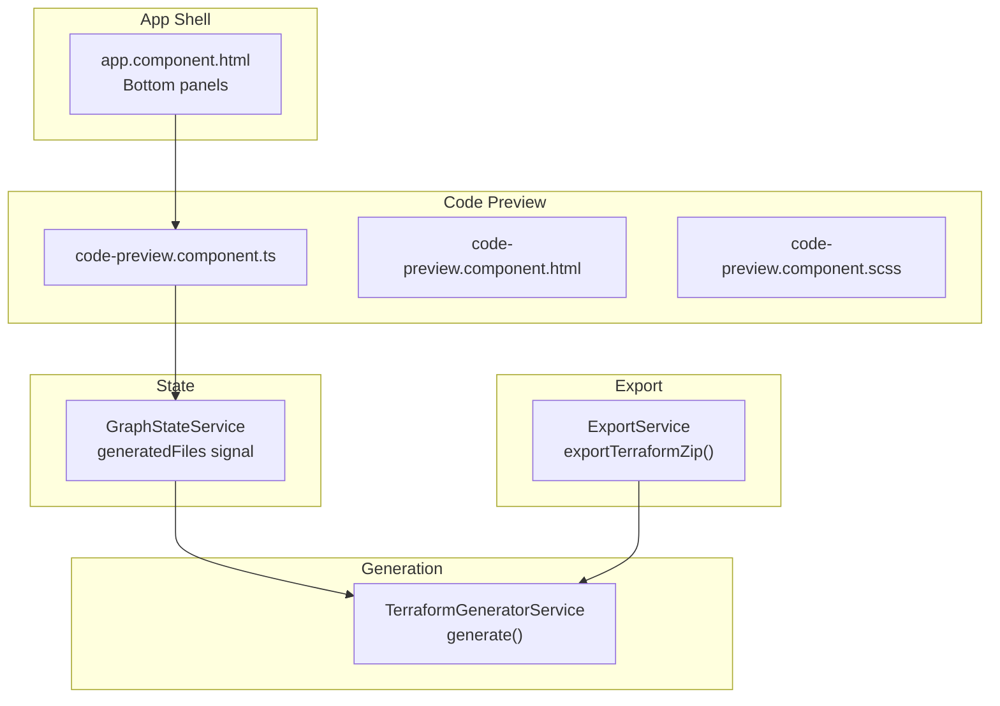
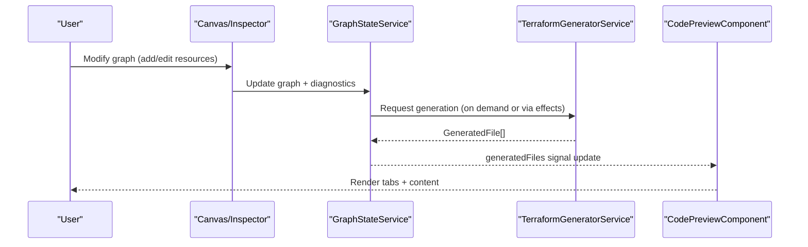
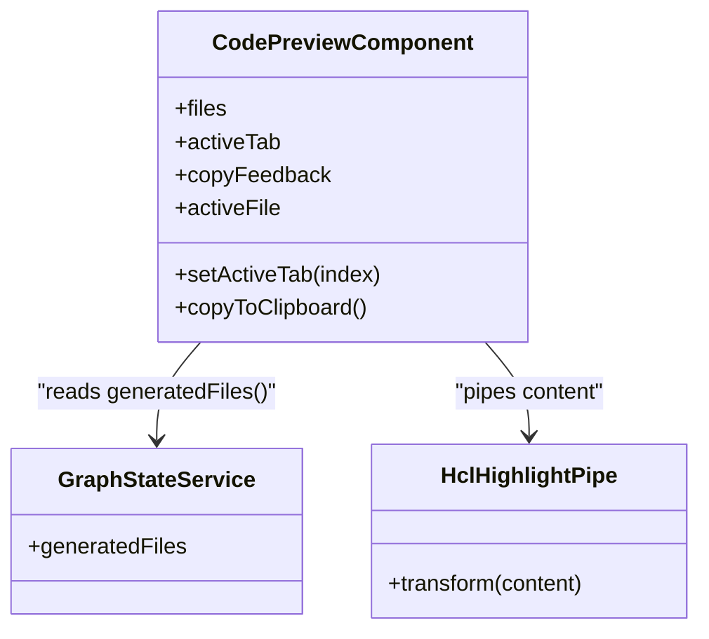
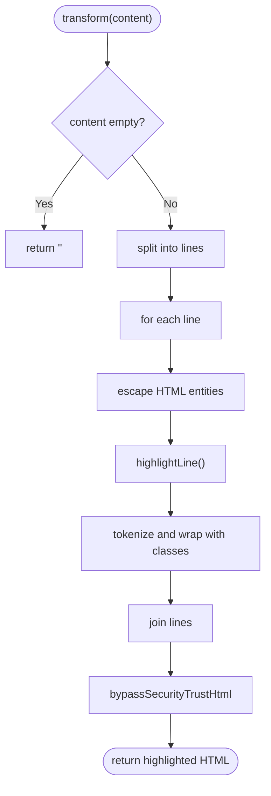
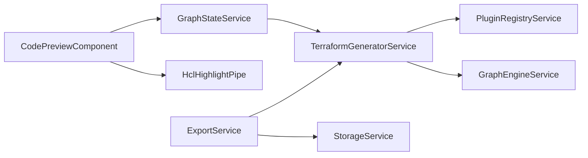

# Code Preview

<cite>
**Referenced Files in This Document**
- [code-preview.component.ts](file://src/app/code-preview/code-preview.component.ts)
- [code-preview.component.html](file://src/app/code-preview/code-preview.component.html)
- [code-preview.component.scss](file://src/app/code-preview/code-preview.component.scss)
- [terraform-generator.service.ts](file://src/app/terraform-engine/terraform-generator.service.ts)
- [export.service.ts](file://src/app/storage/export.service.ts)
- [graph-state.service.ts](file://src/app/core/services/graph-state.service.ts)
- [infra-graph.model.ts](file://src/app/core/models/infra-graph.model.ts)
- [validation.service.ts](file://src/app/validation/validation.service.ts)
- [SYSTEM_DESIGN.md](file://SYSTEM_DESIGN.md)
- [README.md](file://README.md)
</cite>

## Table of Contents
1. [Introduction](#introduction)
2. [Project Structure](#project-structure)
3. [Core Components](#core-components)
4. [Architecture Overview](#architecture-overview)
5. [Detailed Component Analysis](#detailed-component-analysis)
6. [Dependency Analysis](#dependency-analysis)
7. [Performance Considerations](#performance-considerations)
8. [Troubleshooting Guide](#troubleshooting-guide)
9. [Conclusion](#conclusion)
10. [Appendices](#appendices)

## Introduction
This document describes the Code Preview component responsible for rendering Terraform code in a syntax-highlighted, multi-file, tabbed interface at the bottom of the application. It explains how the component integrates with the Terraform generator service to provide real-time code updates, how it organizes and displays multiple files, and how it supports user actions such as copying code to the clipboard. It also covers the current implementation approach (custom HCL highlighting) versus the intended integration with the Monaco Editor, and provides guidance for extending the component with editor configuration, themes, validation integration, and performance optimizations for large outputs.

## Project Structure
The Code Preview feature is organized as a standalone Angular component with a dedicated module folder. It consumes generated files from the application state and renders them in a tabbed UI. The Terraform generation pipeline lives in a separate service that produces the multi-file outputs. Export functionality is handled by a dedicated service that can package the generated files into downloadable archives.

**Diagram sources**
- [app.component.html](file://src/app/layout/app.component.html#L18-L25)
- [code-preview.component.ts](file://src/app/code-preview/code-preview.component.ts#L100-L136)
- [graph-state.service.ts](file://src/app/core/services/graph-state.service.ts#L14-L17)
- [terraform-generator.service.ts](file://src/app/terraform-engine/terraform-generator.service.ts#L16-L51)
- [export.service.ts](file://src/app/storage/export.service.ts#L18-L28)

**Section sources**
- [code-preview.component.ts](file://src/app/code-preview/code-preview.component.ts#L1-L137)
- [code-preview.component.html](file://src/app/code-preview/code-preview.component.html#L1-L32)
- [code-preview.component.scss](file://src/app/code-preview/code-preview.component.scss#L1-L173)
- [graph-state.service.ts](file://src/app/core/services/graph-state.service.ts#L1-L147)
- [terraform-generator.service.ts](file://src/app/terraform-engine/terraform-generator.service.ts#L1-L234)
- [export.service.ts](file://src/app/storage/export.service.ts#L1-L203)
- [SYSTEM_DESIGN.md](file://SYSTEM_DESIGN.md#L233-L262)

## Core Components
- Code Preview component: Provides a tabbed UI for multi-file Terraform outputs, syntax highlighting via a custom pipe, and a copy action.
- Graph State service: Holds the canonical list of generated files and exposes it to consumers via a signal.
- Terraform Generator service: Produces the multi-file Terraform outputs from the current graph.
- Export service: Packages generated files into downloadable archives.

Key responsibilities:
- Real-time updates: The component subscribes to the generated files signal and re-renders when the underlying graph changes.
- Tabbed interface: Renders one tab per generated file and allows switching between them.
- Syntax highlighting: Applies lightweight HCL highlighting using a custom pipe.
- Clipboard integration: Copies the active file’s content to the clipboard with user feedback.

**Section sources**
- [code-preview.component.ts](file://src/app/code-preview/code-preview.component.ts#L100-L136)
- [graph-state.service.ts](file://src/app/core/services/graph-state.service.ts#L14-L17)
- [terraform-generator.service.ts](file://src/app/terraform-engine/terraform-generator.service.ts#L16-L51)
- [export.service.ts](file://src/app/storage/export.service.ts#L18-L28)

## Architecture Overview
The Code Preview component sits at the bottom of the application shell and renders the latest generated Terraform files. The files originate from the Terraform Generator service, which is invoked by higher-level flows (such as export) or continuously updated as the graph changes. The component itself does not generate code; it only renders what is placed into the state.

**Diagram sources**
- [graph-state.service.ts](file://src/app/core/services/graph-state.service.ts#L14-L17)
- [terraform-generator.service.ts](file://src/app/terraform-engine/terraform-generator.service.ts#L16-L51)
- [code-preview.component.ts](file://src/app/code-preview/code-preview.component.ts#L110-L118)

## Detailed Component Analysis

### Code Preview Component
The component is a standalone Angular component that:
- Reads the generated files from the Graph State service.
- Computes the active file based on the selected tab index.
- Provides a method to copy the active file to the clipboard with feedback.
- Uses a custom pipe to apply syntax highlighting to the active file’s content.

**Diagram sources**
- [code-preview.component.ts](file://src/app/code-preview/code-preview.component.ts#L100-L136)
- [graph-state.service.ts](file://src/app/core/services/graph-state.service.ts#L14-L17)

**Section sources**
- [code-preview.component.ts](file://src/app/code-preview/code-preview.component.ts#L100-L136)

### Syntax Highlighting Pipe
The HCL highlighter performs line-by-line processing with tokenization for comments, strings, interpolation references, keywords, booleans, numbers, and attribute names. It escapes HTML first, then wraps tokens with appropriate CSS classes. The resulting HTML is rendered inside a pre/code block styled for monospace fonts and tab indentation.

Highlights:
- Escapes HTML entities before highlighting.
- Matches string literals, interpolation expressions, and word tokens.
- Treats specific HCL keywords distinctly and marks attribute names adjacent to assignments.
- Emits inline comments and numbers with dedicated classes.

**Diagram sources**
- [code-preview.component.ts](file://src/app/code-preview/code-preview.component.ts#L5-L98)

**Section sources**
- [code-preview.component.ts](file://src/app/code-preview/code-preview.component.ts#L5-L98)
- [code-preview.component.html](file://src/app/code-preview/code-preview.component.html#L23-L26)
- [code-preview.component.scss](file://src/app/code-preview/code-preview.component.scss#L109-L151)

### File Organization and Tabs
The component iterates over the generated files and creates a tab for each. The active tab index drives which file is displayed. The UI includes:
- A scrollable tab list with file icons.
- Action area with a feedback indicator and a copy button.
- Content area that renders the active file’s content through the highlight pipe.

Behavior:
- If no files are available, an empty state is shown.
- Switching tabs updates the active file and re-renders the content.

**Section sources**
- [code-preview.component.html](file://src/app/code-preview/code-preview.component.html#L1-L32)
- [code-preview.component.ts](file://src/app/code-preview/code-preview.component.ts#L110-L122)

### Download Functionality
While the Code Preview component does not directly trigger downloads, the Export service orchestrates packaging the generated files into ZIP archives. The component’s role is to expose the generated files to the rest of the application.

Integration points:
- Export service generates files from the current graph and packages them for download.
- The component reads the same files from state, ensuring consistency.

**Section sources**
- [export.service.ts](file://src/app/storage/export.service.ts#L18-L28)
- [terraform-generator.service.ts](file://src/app/terraform-engine/terraform-generator.service.ts#L16-L51)

### Integration with Terraform Generator Service
The generator service produces a set of files including provider, main, variables, outputs, and a README. These files are stored in the Graph State service and consumed by the Code Preview component.

Key outputs:
- providers.tf: Terraform required_version and provider block.
- main.tf: Resource blocks serialized in a deterministic order.
- variables.tf: Project and region variables.
- outputs.tf: Outputs derived from resources.
- README.generated.md: Quick-start instructions.

**Section sources**
- [terraform-generator.service.ts](file://src/app/terraform-engine/terraform-generator.service.ts#L53-L154)
- [graph-state.service.ts](file://src/app/core/services/graph-state.service.ts#L14-L17)

### Real-time Updates and Validation
Real-time updates are driven by signals:
- Graph changes update the generated files signal.
- The Code Preview component reacts to these updates and refreshes the UI.

Validation is handled by a separate service that computes diagnostics. While the Code Preview component does not render diagnostics, the presence of blocking errors can prevent exports and thus indirectly influence when users view the preview.

**Section sources**
- [graph-state.service.ts](file://src/app/core/services/graph-state.service.ts#L14-L17)
- [validation.service.ts](file://src/app/validation/validation.service.ts#L14-L20)

### Monaco Editor Integration (Planned)
According to the system design, the application is intended to integrate Monaco Editor for code preview. The current implementation uses a lightweight HCL highlighter and a simple pre/code display. The planned integration would involve:
- Rendering the generated files in Monaco editors.
- Configuring editor options such as minimap, word wrap, bracket pair colorization, and folding.
- Applying a theme suitable for light/dark modes.
- Enabling features like Find/Replace, Go to Symbol, and formatting on save.

Current status:
- The component currently uses a custom pipe and CSS classes for highlighting.
- The system design explicitly mentions Monaco editor for code preview.

**Section sources**
- [SYSTEM_DESIGN.md](file://SYSTEM_DESIGN.md#L240-L242)
- [SYSTEM_DESIGN.md](file://SYSTEM_DESIGN.md#L502-L503)
- [code-preview.component.ts](file://src/app/code-preview/code-preview.component.ts#L5-L98)

## Dependency Analysis
The Code Preview component depends on:
- Graph State service for generated files.
- The HCL highlight pipe for syntax highlighting.
- The DOM APIs for clipboard operations.

The generator and export services depend on:
- The Graph State service for the canonical graph.
- The plugin registry and graph engine for generating Terraform blocks.

**Diagram sources**
- [code-preview.component.ts](file://src/app/code-preview/code-preview.component.ts#L100-L136)
- [graph-state.service.ts](file://src/app/core/services/graph-state.service.ts#L14-L17)
- [terraform-generator.service.ts](file://src/app/terraform-engine/terraform-generator.service.ts#L11-L14)
- [export.service.ts](file://src/app/storage/export.service.ts#L8-L11)

**Section sources**
- [code-preview.component.ts](file://src/app/code-preview/code-preview.component.ts#L100-L136)
- [graph-state.service.ts](file://src/app/core/services/graph-state.service.ts#L14-L17)
- [terraform-generator.service.ts](file://src/app/terraform-engine/terraform-generator.service.ts#L11-L14)
- [export.service.ts](file://src/app/storage/export.service.ts#L8-L11)

## Performance Considerations
- Large outputs: The current implementation renders all content in the DOM. For very large files, consider virtualization or lazy loading of content.
- Highlighting cost: The HCL highlighter processes line-by-line. For extremely large files, consider streaming or throttling updates.
- Signal updates: Ensure generation is debounced to avoid excessive re-renders during rapid graph changes.
- Clipboard operations: Keep clipboard writes synchronous to preserve user gesture context, as implemented.

[No sources needed since this section provides general guidance]

## Troubleshooting Guide
Common issues and resolutions:
- Empty preview: Ensure the graph contains nodes so that the generator produces files. The component shows an empty state when no files are available.
- Copy fails: The component provides feedback for copy success or failure. Verify clipboard permissions and browser support.
- Stale content: Confirm that the generated files signal is updating. Graph changes should propagate to the preview after generation completes.
- Export failures: The export service handles errors and alerts the user. Check console logs for details.

**Section sources**
- [code-preview.component.ts](file://src/app/code-preview/code-preview.component.ts#L124-L135)
- [export.service.ts](file://src/app/storage/export.service.ts#L24-L27)

## Conclusion
The Code Preview component delivers a focused, real-time view of generated Terraform code with a tabbed interface and syntax highlighting. It integrates cleanly with the application’s state and generation pipeline, enabling users to review and copy code easily. The system design indicates a future integration with Monaco Editor for richer editing experiences, while the current implementation remains performant and accessible.

[No sources needed since this section summarizes without analyzing specific files]

## Appendices

### Editor Configuration Options (Monaco Integration)
The planned Monaco integration should support:
- Editor options: minimap, wordWrap, automatic bracket pair colorization, folding, and suggested edits.
- Theme customization: light/dark variants aligned with the application’s theme.
- Formatting: enable formatting on save and on paste.
- Navigation: symbol navigation, find/replace, and go to symbol in editor.

[No sources needed since this section provides conceptual guidance]

### Theme Customization
- Current theme: The component applies CSS classes for syntax highlighting and relies on monospace fonts.
- Future theme: Monaco themes can be switched dynamically based on user preferences or OS setting.

[No sources needed since this section provides conceptual guidance]

### Performance Optimization for Large Files
- Virtualize long content in Monaco.
- Debounce generation and preview updates.
- Lazy-load inactive tabs’ content.
- Use web workers for heavy generation tasks.

[No sources needed since this section provides general guidance]

### Examples and Extensibility
- Customizing editor behavior: Integrate Monaco configuration in a wrapper component and bind it to the generated files.
- Implementing custom file formats: Extend the generator service to emit additional files and update the preview tabs accordingly.
- Integrating with external code review workflows: Provide a stable, deterministic output and export options compatible with CI/CD pipelines.

[No sources needed since this section provides general guidance]