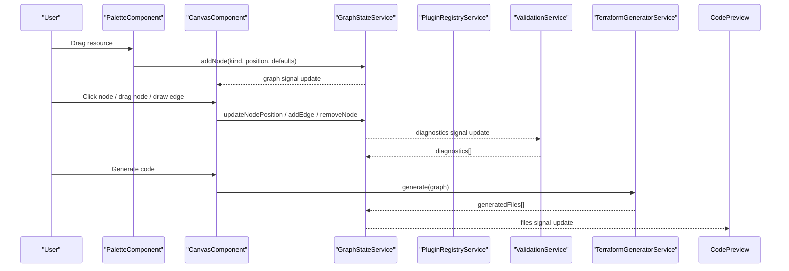
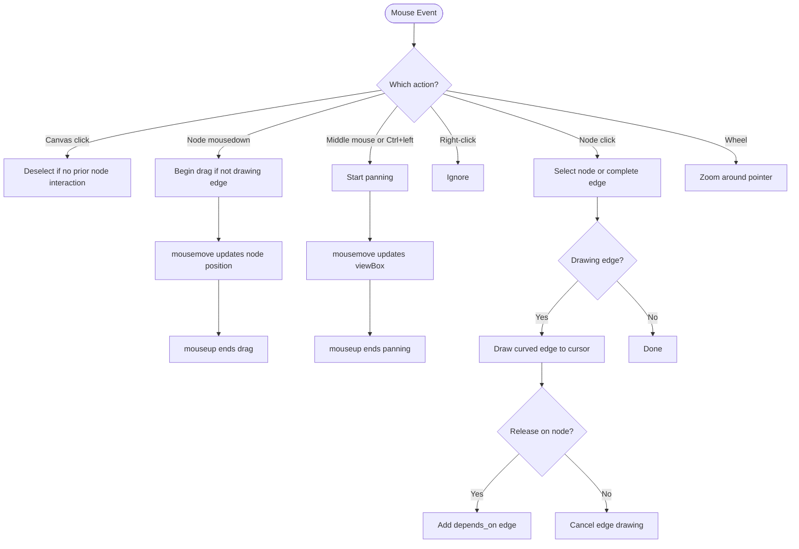
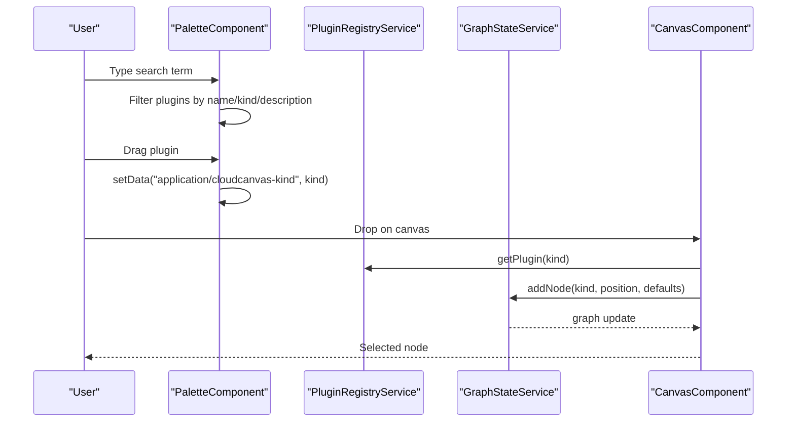
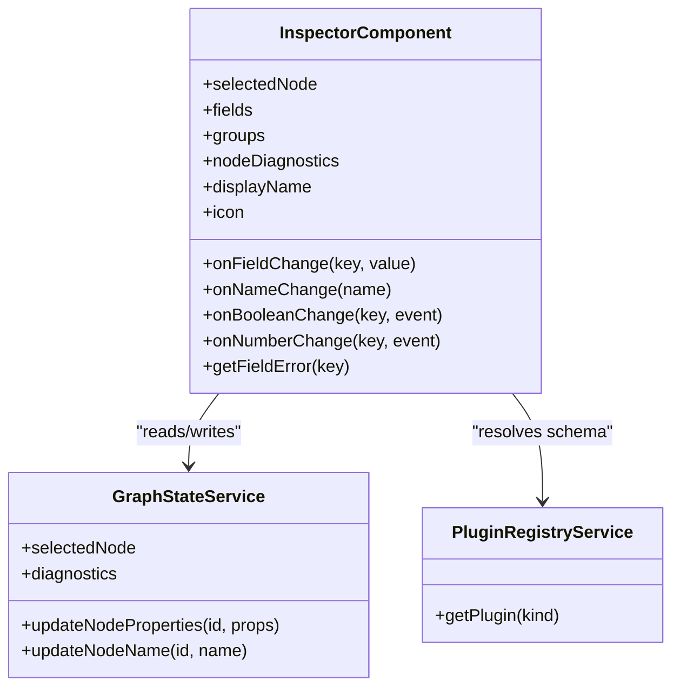
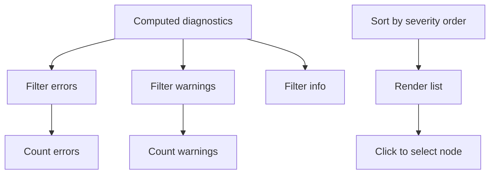
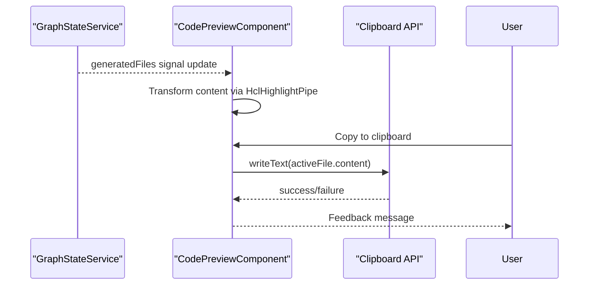
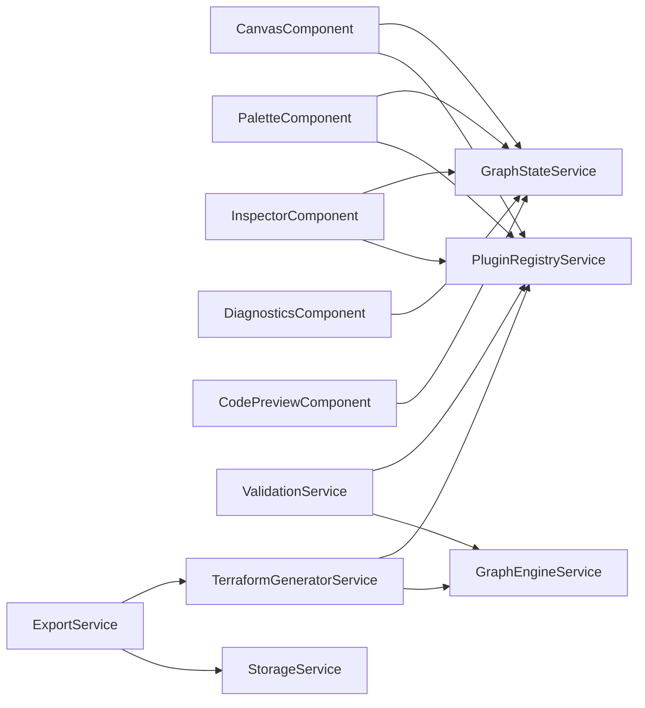

# Core Components

<cite>
**Referenced Files in This Document**
- [canvas.component.ts](file://src/app/canvas/canvas.component.ts)
- [palette.component.ts](file://src/app/palette/palette.component.ts)
- [inspector.component.ts](file://src/app/inspector/inspector.component.ts)
- [diagnostics.component.ts](file://src/app/diagnostics/diagnostics.component.ts)
- [code-preview.component.ts](file://src/app/code-preview/code-preview.component.ts)
- [infra-graph.model.ts](file://src/app/core/models/infra-graph.model.ts)
- [resource-plugin.model.ts](file://src/app/core/models/resource-plugin.model.ts)
- [graph-state.service.ts](file://src/app/core/services/graph-state.service.ts)
- [plugin-registry.service.ts](file://src/app/infra/plugin-registry.service.ts)
- [terraform-generator.service.ts](file://src/app/terraform-engine/terraform-generator.service.ts)
- [validation.service.ts](file://src/app/validation/validation.service.ts)
- [export.service.ts](file://src/app/storage/export.service.ts)
- [storage.service.ts](file://src/app/storage/storage.service.ts)
- [compute-network.plugin.ts](file://src/app/infra/plugins/compute-network.plugin.ts)
- [compute-instance.plugin.ts](file://src/app/infra/plugins/compute-instance.plugin.ts)
</cite>

## Table of Contents
1. [Introduction](#introduction)
2. [Project Structure](#project-structure)
3. [Core Components](#core-components)
4. [Architecture Overview](#architecture-overview)
5. [Detailed Component Analysis](#detailed-component-analysis)
6. [Dependency Analysis](#dependency-analysis)
7. [Performance Considerations](#performance-considerations)
8. [Troubleshooting Guide](#troubleshooting-guide)
9. [Conclusion](#conclusion)
10. [Appendices](#appendices)

## Introduction
This document explains CloudCanvas-TF’s core UI components and their interactions. It covers:
- Canvas system for visual graph editing with drag-and-drop, node manipulation, and edge drawing
- Resource palette for browsing and selecting GCP resources with categorization and search
- Property inspector for schema-driven form generation and real-time property editing
- Diagnostics panel for validation feedback and error reporting
- Code preview component with HCL highlighting and clipboard integration
It also documents component composition patterns, data binding strategies, and user interaction flows, with practical usage and customization guidance.

## Project Structure
CloudCanvas-TF organizes features by domain:
- app/canvas: SVG-based canvas for graph editing
- app/palette: Resource browser with category and search
- app/inspector: Property editor driven by plugin JSON schema
- app/diagnostics: Validation summary and navigation
- app/code-preview: Preview of generated Terraform code with syntax highlighting
- app/core: Shared models and services (GraphStateService)
- app/infra: Plugin registry and resource plugins
- app/terraform-engine: Terraform code generator
- app/validation: Validation orchestrator
- app/storage: Export and IndexedDB persistence

```mermaid
graph TB
subgraph "UI"
Canvas["CanvasComponent"]
Palette["PaletteComponent"]
Inspector["InspectorComponent"]
Diagnostics["DiagnosticsComponent"]
CodePreview["CodePreviewComponent"]
end
subgraph "Core"
GraphState["GraphStateService"]
Registry["PluginRegistryService"]
Models["Models (infra-graph, resource-plugin)"]
end
subgraph "Engines"
TerraformGen["TerraformGeneratorService"]
Validation["ValidationService"]
end
subgraph "Storage"
Export["ExportService"]
Storage["StorageService"]
end
Canvas --> GraphState
Palette --> GraphState
Inspector --> GraphState
Diagnostics --> GraphState
CodePreview --> GraphState
Canvas --> Registry
Inspector --> Registry
Validation --> Registry
TerraformGen --> Registry
Export --> TerraformGen
Export --> Storage
```

**Diagram sources**
- [canvas.component.ts](file://src/app/canvas/canvas.component.ts#L1-L286)
- [palette.component.ts](file://src/app/palette/palette.component.ts#L1-L83)
- [inspector.component.ts](file://src/app/inspector/inspector.component.ts#L1-L103)
- [diagnostics.component.ts](file://src/app/diagnostics/diagnostics.component.ts#L1-L44)
- [code-preview.component.ts](file://src/app/code-preview/code-preview.component.ts#L1-L137)
- [graph-state.service.ts](file://src/app/core/services/graph-state.service.ts#L1-L147)
- [plugin-registry.service.ts](file://src/app/infra/plugin-registry.service.ts#L1-L73)
- [terraform-generator.service.ts](file://src/app/terraform-engine/terraform-generator.service.ts#L1-L234)
- [validation.service.ts](file://src/app/validation/validation.service.ts#L1-L107)
- [export.service.ts](file://src/app/storage/export.service.ts#L1-L203)
- [storage.service.ts](file://src/app/storage/storage.service.ts#L1-L85)

**Section sources**
- [canvas.component.ts](file://src/app/canvas/canvas.component.ts#L1-L286)
- [palette.component.ts](file://src/app/palette/palette.component.ts#L1-L83)
- [inspector.component.ts](file://src/app/inspector/inspector.component.ts#L1-L103)
- [diagnostics.component.ts](file://src/app/diagnostics/diagnostics.component.ts#L1-L44)
- [code-preview.component.ts](file://src/app/code-preview/code-preview.component.ts#L1-L137)
- [graph-state.service.ts](file://src/app/core/services/graph-state.service.ts#L1-L147)
- [plugin-registry.service.ts](file://src/app/infra/plugin-registry.service.ts#L1-L73)
- [terraform-generator.service.ts](file://src/app/terraform-engine/terraform-generator.service.ts#L1-L234)
- [validation.service.ts](file://src/app/validation/validation.service.ts#L1-L107)
- [export.service.ts](file://src/app/storage/export.service.ts#L1-L203)
- [storage.service.ts](file://src/app/storage/storage.service.ts#L1-L85)

## Core Components
- CanvasComponent: Renders nodes and edges, handles drag-and-drop, node dragging, edge drawing, panning, zooming, and selection.
- PaletteComponent: Lists resource plugins by category, supports search, and initiates drag-and-drop onto the canvas.
- InspectorComponent: Builds a property form from plugin JSON schema, binds live updates to node properties, and shows per-field diagnostics.
- DiagnosticsComponent: Aggregates and displays validation messages, counts, and severity icons; navigates to related nodes.
- CodePreviewComponent: Displays generated Terraform files with HCL highlighting and clipboard copy.

**Section sources**
- [canvas.component.ts](file://src/app/canvas/canvas.component.ts#L1-L286)
- [palette.component.ts](file://src/app/palette/palette.component.ts#L1-L83)
- [inspector.component.ts](file://src/app/inspector/inspector.component.ts#L1-L103)
- [diagnostics.component.ts](file://src/app/diagnostics/diagnostics.component.ts#L1-L44)
- [code-preview.component.ts](file://src/app/code-preview/code-preview.component.ts#L1-L137)

## Architecture Overview
The system follows a reactive state model:
- GraphStateService holds the InfraGraph (nodes and edges), selection, diagnostics, and generated files.
- PluginRegistryService registers and exposes resource plugins with JSON schema, defaults, validation, and Terraform generation.
- ValidationService validates nodes via plugin validators and graph topology.
- TerraformGeneratorService serializes the graph into Terraform files using plugin-provided blocks.
- ExportService generates ZIP bundles and triggers downloads; StorageService persists projects via IndexedDB.



**Diagram sources**
- [palette.component.ts](file://src/app/palette/palette.component.ts#L62-L77)
- [canvas.component.ts](file://src/app/canvas/canvas.component.ts#L90-L125)
- [graph-state.service.ts](file://src/app/core/services/graph-state.service.ts#L39-L102)
- [validation.service.ts](file://src/app/validation/validation.service.ts#L14-L20)
- [terraform-generator.service.ts](file://src/app/terraform-engine/terraform-generator.service.ts#L16-L51)
- [code-preview.component.ts](file://src/app/code-preview/code-preview.component.ts#L110-L118)

## Detailed Component Analysis

### Canvas System
CanvasComponent renders an SVG canvas with:
- Nodes: draggable rectangles with icons and labels
- Edges: curved paths between nodes
- Interaction modes: selection, dragging, edge drawing, panning, zooming

Key behaviors:
- Drag-and-drop from palette adds nodes and selects them
- Clicking canvas deselects; clicking nodes selects or completes edges
- Dragging nodes updates positions via GraphStateService
- Drawing edges toggles a temporary path until released on another node
- Panning starts on middle mouse or Ctrl+left mouse; wheel zooms around pointer



**Diagram sources**
- [canvas.component.ts](file://src/app/canvas/canvas.component.ts#L74-L218)

**Section sources**
- [canvas.component.ts](file://src/app/canvas/canvas.component.ts#L1-L286)
- [graph-state.service.ts](file://src/app/core/services/graph-state.service.ts#L1-L147)
- [infra-graph.model.ts](file://src/app/core/models/infra-graph.model.ts#L17-L39)

### Resource Palette
PaletteComponent:
- Groups plugins by category and filters by search term
- Supports expand/collapse categories
- Initiates drag-and-drop with plugin kind in data transfer
- Provides programmatic add-to-canvas with grid-like placement and jitter



**Diagram sources**
- [palette.component.ts](file://src/app/palette/palette.component.ts#L18-L81)
- [canvas.component.ts](file://src/app/canvas/canvas.component.ts#L90-L99)
- [plugin-registry.service.ts](file://src/app/infra/plugin-registry.service.ts#L48-L50)
- [graph-state.service.ts](file://src/app/core/services/graph-state.service.ts#L39-L60)

**Section sources**
- [palette.component.ts](file://src/app/palette/palette.component.ts#L1-L83)
- [plugin-registry.service.ts](file://src/app/infra/plugin-registry.service.ts#L56-L71)

### Property Inspector
InspectorComponent:
- Reads selected node and resolves plugin schema
- Builds grouped fields with labels, types, defaults, and placeholders
- Binds live updates to node properties and name
- Displays per-field diagnostics and severity



**Diagram sources**
- [inspector.component.ts](file://src/app/inspector/inspector.component.ts#L21-L102)
- [plugin-registry.service.ts](file://src/app/infra/plugin-registry.service.ts#L48-L50)
- [graph-state.service.ts](file://src/app/core/services/graph-state.service.ts#L22-L93)

**Section sources**
- [inspector.component.ts](file://src/app/inspector/inspector.component.ts#L1-L103)
- [resource-plugin.model.ts](file://src/app/core/models/resource-plugin.model.ts#L11-L24)

### Diagnostics Panel
DiagnosticsComponent:
- Computes severity counts and sorts diagnostics
- Allows clicking to select related nodes
- Provides severity icons



**Diagram sources**
- [diagnostics.component.ts](file://src/app/diagnostics/diagnostics.component.ts#L14-L33)

**Section sources**
- [diagnostics.component.ts](file://src/app/diagnostics/diagnostics.component.ts#L1-L44)
- [infra-graph.model.ts](file://src/app/core/models/infra-graph.model.ts#L41-L48)

### Code Preview
CodePreviewComponent:
- Exposes a pipe to highlight HCL tokens (comments, strings, keywords, booleans, attributes, numbers)
- Displays generated files in tabs
- Copies active file content to clipboard with feedback



**Diagram sources**
- [code-preview.component.ts](file://src/app/code-preview/code-preview.component.ts#L107-L137)
- [graph-state.service.ts](file://src/app/core/services/graph-state.service.ts#L17)

**Section sources**
- [code-preview.component.ts](file://src/app/code-preview/code-preview.component.ts#L1-L137)

## Dependency Analysis
- CanvasComponent depends on GraphStateService for reactive graph state and PluginRegistryService for node metadata.
- PaletteComponent depends on PluginRegistryService for categories and on GraphStateService to add nodes.
- InspectorComponent depends on GraphStateService for selected node and diagnostics, and on PluginRegistryService for schema.
- DiagnosticsComponent depends on GraphStateService for diagnostics aggregation.
- CodePreviewComponent depends on GraphStateService for generated files.
- ValidationService depends on PluginRegistryService and GraphEngineService to detect cycles and policy violations.
- TerraformGeneratorService depends on PluginRegistryService and GraphEngineService to serialize nodes into Terraform blocks.
- ExportService depends on TerraformGeneratorService and StorageService to produce downloadable artifacts.



**Diagram sources**
- [canvas.component.ts](file://src/app/canvas/canvas.component.ts#L13-L14)
- [palette.component.ts](file://src/app/palette/palette.component.ts#L15-L16)
- [inspector.component.ts](file://src/app/inspector/inspector.component.ts#L22-L23)
- [diagnostics.component.ts](file://src/app/diagnostics/diagnostics.component.ts#L12)
- [code-preview.component.ts](file://src/app/code-preview/code-preview.component.ts#L108)
- [validation.service.ts](file://src/app/validation/validation.service.ts#L9-L12)
- [terraform-generator.service.ts](file://src/app/terraform-engine/terraform-generator.service.ts#L11-L14)
- [export.service.ts](file://src/app/storage/export.service.ts#L8-L11)
- [storage.service.ts](file://src/app/storage/storage.service.ts#L8-L85)

**Section sources**
- [plugin-registry.service.ts](file://src/app/infra/plugin-registry.service.ts#L1-L73)
- [graph-state.service.ts](file://src/app/core/services/graph-state.service.ts#L1-L147)
- [validation.service.ts](file://src/app/validation/validation.service.ts#L1-L107)
- [terraform-generator.service.ts](file://src/app/terraform-engine/terraform-generator.service.ts#L1-L234)
- [export.service.ts](file://src/app/storage/export.service.ts#L1-L203)
- [storage.service.ts](file://src/app/storage/storage.service.ts#L1-L85)

## Performance Considerations
- Reactive signals minimize DOM churn; keep computations in computed() light and avoid heavy work in event handlers.
- Canvas rendering uses SVG with a viewBox; prefer batching updates (e.g., during drag) to reduce reflows.
- Plugin schema iteration is O(P) per node; keep schemas concise and avoid expensive validations on every keystroke.
- Diagnostics computation aggregates across nodes and edges; cache intermediate results when possible.
- Code preview highlights are client-side; limit content size or debounce updates for very large outputs.

## Troubleshooting Guide
Common issues and remedies:
- Nodes not appearing after drag-and-drop
  - Verify data transfer kind matches a registered plugin kind and that defaults are provided.
  - Check GraphStateService addNode logs and ensure nodeCount increments.
- Edges not connecting
  - Confirm edge drawing mode is active and release on a different node; verify no self-loop attempts.
  - Ensure GraphStateService addEdge returns a new edge id and edges array updates.
- Properties not updating
  - Inspect InspectorComponent onFieldChange wiring and GraphStateService updateNodeProperties.
  - Ensure plugin schema defines the property and groups correctly.
- Diagnostics not visible
  - Confirm ValidationService validateAll runs and pushes diagnostics into GraphStateService.
  - Check DiagnosticsComponent severity filtering and sorting logic.
- Export/download fails
  - ExportService requires user gesture context; ensure exportTerraformZip is triggered by a click handler.
  - Validate synchronous ZIP creation and blob download invocation.

**Section sources**
- [canvas.component.ts](file://src/app/canvas/canvas.component.ts#L90-L125)
- [palette.component.ts](file://src/app/palette/palette.component.ts#L55-L77)
- [inspector.component.ts](file://src/app/inspector/inspector.component.ts#L75-L95)
- [diagnostics.component.ts](file://src/app/diagnostics/diagnostics.component.ts#L14-L27)
- [export.service.ts](file://src/app/storage/export.service.ts#L18-L28)

## Conclusion
CloudCanvas-TF’s UI components form a cohesive, reactive system for designing infrastructure graphs. The canvas enables expressive visual modeling, the palette accelerates discovery and selection, the inspector provides precise property control, diagnostics guide correctness, and the code preview streamlines Terraform generation and sharing. Together, they support rapid prototyping and safe validation of GCP infrastructure designs.

## Appendices

### Component Composition Patterns
- Signal-driven updates: All components subscribe to signals from GraphStateService to stay synchronized.
- Plugin-driven forms: Inspector reads plugin JSON schema to generate dynamic forms with grouping and defaults.
- Event delegation: Canvas handles multiple interaction modes via centralized event handlers and state flags.
- Service orchestration: ValidationService and TerraformGeneratorService encapsulate domain logic and are reused across components.

### Data Binding Strategies
- Two-way binding for form controls via Angular forms module; updates are emitted to GraphStateService.
- Computed properties for derived UI state (e.g., nodeMap, groups, counts) to avoid recomputation overhead.
- Safe DOM updates through pipes (e.g., HCL highlight) to prevent XSS and improve readability.

### User Interaction Flows
- Palette to Canvas: Drag-and-drop with kind metadata; Canvas creates nodes and selects them.
- Canvas to Inspector: Selection change triggers schema-based form population and diagnostic queries.
- Inspector to Canvas: Property changes propagate to node attributes; diagnostics update accordingly.
- Diagnostics to Canvas: Clicking a diagnostic centers the related node for quick fixing.

### Practical Examples and Customization
- Adding a new resource type
  - Define a ResourcePlugin with kind, category, displayName, description, icon, schema, defaults, validate, and toTerraform.
  - Register the plugin in PluginRegistryService.
  - Palette and Inspector will automatically discover and render the new resource.
  - Reference: [compute-network.plugin.ts](file://src/app/infra/plugins/compute-network.plugin.ts#L4-L128), [plugin-registry.service.ts](file://src/app/infra/plugin-registry.service.ts#L22-L41)
- Customizing property groups
  - Assign group keys in plugin schema properties to organize fields in the inspector.
  - Reference: [compute-network.plugin.ts](file://src/app/infra/plugins/compute-network.plugin.ts#L38-L53)
- Extending validation
  - Implement plugin-specific validation returning Diagnostic entries; ValidationService aggregates them.
  - Reference: [compute-instance.plugin.ts](file://src/app/infra/plugins/compute-instance.plugin.ts#L61-L80), [validation.service.ts](file://src/app/validation/validation.service.ts#L22-L39)
- Generating outputs
  - Customize TerraformGeneratorService to emit additional files or modify serialization.
  - Reference: [terraform-generator.service.ts](file://src/app/terraform-engine/terraform-generator.service.ts#L53-L154)
- Exporting artifacts
  - Use ExportService to bundle Terraform files and project metadata into ZIP archives.
  - Reference: [export.service.ts](file://src/app/storage/export.service.ts#L18-L59)