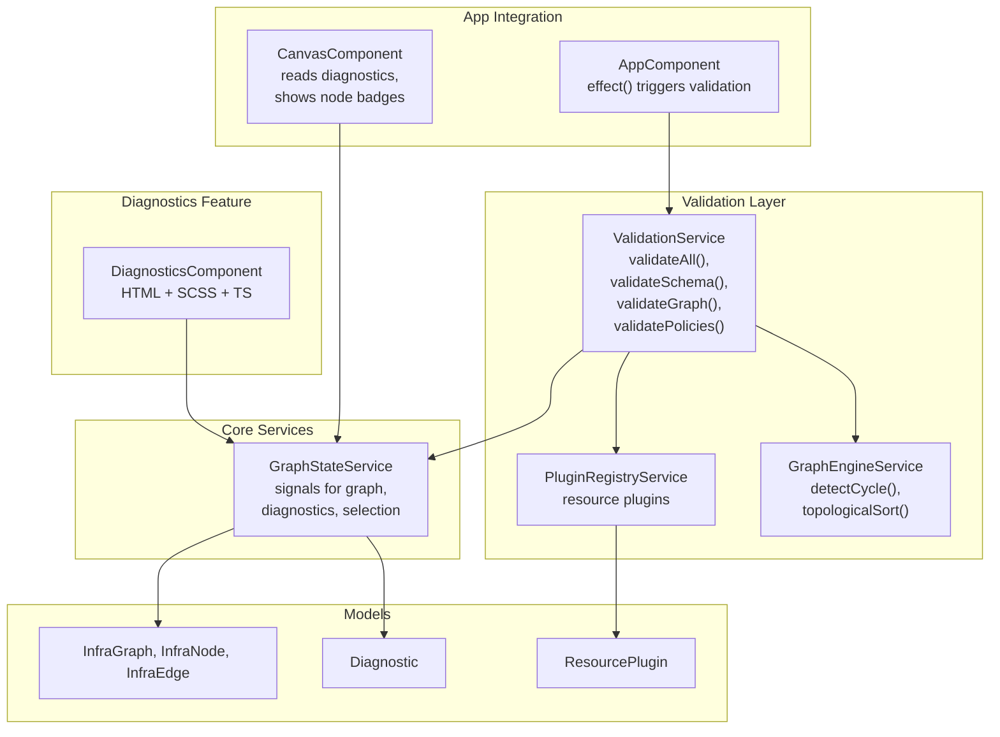
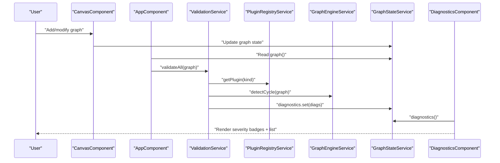
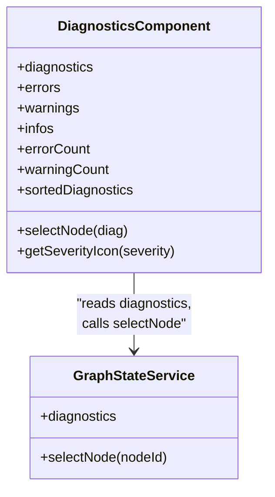
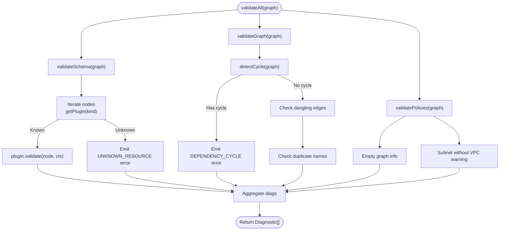
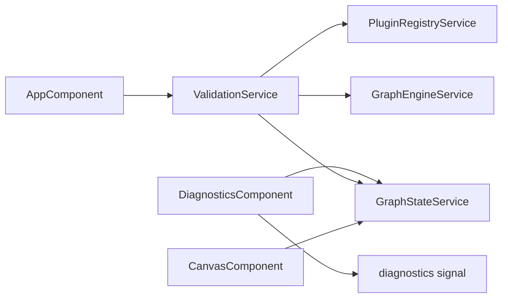

# Diagnostics Panel

<cite>
**Referenced Files in This Document**
- [diagnostics.component.ts](file://src/app/diagnostics/diagnostics.component.ts)
- [diagnostics.component.html](file://src/app/diagnostics/diagnostics.component.html)
- [diagnostics.component.scss](file://src/app/diagnostics/diagnostics.component.scss)
- [validation.service.ts](file://src/app/validation/validation.service.ts)
- [graph-state.service.ts](file://src/app/core/services/graph-state.service.ts)
- [graph-engine.service.ts](file://src/app/graph-engine/graph-engine.service.ts)
- [plugin-registry.service.ts](file://src/app/infra/plugin-registry.service.ts)
- [resource-plugin.model.ts](file://src/app/core/models/resource-plugin.model.ts)
- [infra-graph.model.ts](file://src/app/core/models/infra-graph.model.ts)
- [compute-network.plugin.ts](file://src/app/infra/plugins/compute-network.plugin.ts)
- [compute-subnetwork.plugin.ts](file://src/app/infra/plugins/compute-subnetwork.plugin.ts)
- [app.component.ts](file://src/app/layout/app.component.ts)
- [canvas.component.ts](file://src/app/canvas/canvas.component.ts)
</cite>

## Table of Contents
1. [Introduction](#introduction)
2. [Project Structure](#project-structure)
3. [Core Components](#core-components)
4. [Architecture Overview](#architecture-overview)
5. [Detailed Component Analysis](#detailed-component-analysis)
6. [Dependency Analysis](#dependency-analysis)
7. [Performance Considerations](#performance-considerations)
8. [Troubleshooting Guide](#troubleshooting-guide)
9. [Conclusion](#conclusion)

## Introduction
The Diagnostics Panel is a real-time validation feedback system that surfaces errors, warnings, and informational messages derived from the validation engine. It integrates tightly with the graph state and validation service to continuously reflect the current state of the infrastructure graph. The panel supports severity-based categorization, traceability linking validation issues to specific graph elements, and interactive navigation to resolve issues quickly. It also provides filtering, sorting, and grouping strategies to help users efficiently triage and address validation problems.

## Project Structure
The Diagnostics Panel resides in the diagnostics feature module and collaborates with the validation service, graph engine, plugin registry, and graph state service. The application bootstraps these services and triggers validation on graph changes via an effect in the root component.

**Diagram sources**
- [diagnostics.component.ts](file://src/app/diagnostics/diagnostics.component.ts#L1-L44)
- [validation.service.ts](file://src/app/validation/validation.service.ts#L1-L107)
- [graph-state.service.ts](file://src/app/core/services/graph-state.service.ts#L1-L147)
- [graph-engine.service.ts](file://src/app/graph-engine/graph-engine.service.ts#L1-L127)
- [plugin-registry.service.ts](file://src/app/infra/plugin-registry.service.ts#L1-L73)
- [resource-plugin.model.ts](file://src/app/core/models/resource-plugin.model.ts#L1-L55)
- [infra-graph.model.ts](file://src/app/core/models/infra-graph.model.ts#L1-L118)
- [app.component.ts](file://src/app/layout/app.component.ts#L1-L48)
- [canvas.component.ts](file://src/app/canvas/canvas.component.ts#L1-L286)

**Section sources**
- [diagnostics.component.ts](file://src/app/diagnostics/diagnostics.component.ts#L1-L44)
- [validation.service.ts](file://src/app/validation/validation.service.ts#L1-L107)
- [graph-state.service.ts](file://src/app/core/services/graph-state.service.ts#L1-L147)
- [app.component.ts](file://src/app/layout/app.component.ts#L1-L48)

## Core Components
- DiagnosticsComponent: Renders the diagnostics list, severity badges, and handles navigation to graph elements. It computes counts, severity icons, and a severity-sorted list.
- ValidationService: Orchestrates validation across schema, graph topology, and policy checks, aggregating Diagnostic results.
- GraphStateService: Central state holding the graph, selected node, diagnostics, and generated files. Exposes signals for reactive UI updates.
- GraphEngineService: Provides cycle detection and topological sort utilities used by validation.
- PluginRegistryService: Registers and retrieves resource plugins that implement per-resource validation.
- ResourcePlugin: Defines the contract for resource-specific validation, including schema-driven diagnostics.
- InfraGraph and Diagnostic models: Define the graph structure and diagnostic message shape, including severity, code, nodeId, field, message, and remediation.

Key responsibilities:
- Real-time updates: AppComponent’s effect triggers validation whenever the graph changes, updating GraphStateService.diagnostics.
- Traceability: Each Diagnostic optionally includes nodeId and field to link issues to specific graph elements.
- Navigation: Clicking a diagnostic item selects the associated node in the canvas.
- Severity classification: Diagnostic.severity is 'error' | 'warning' | 'info', used for sorting and visual styling.

**Section sources**
- [diagnostics.component.ts](file://src/app/diagnostics/diagnostics.component.ts#L11-L44)
- [validation.service.ts](file://src/app/validation/validation.service.ts#L14-L105)
- [graph-state.service.ts](file://src/app/core/services/graph-state.service.ts#L14-L30)
- [graph-engine.service.ts](file://src/app/graph-engine/graph-engine.service.ts#L27-L63)
- [plugin-registry.service.ts](file://src/app/infra/plugin-registry.service.ts#L18-L54)
- [resource-plugin.model.ts](file://src/app/core/models/resource-plugin.model.ts#L43-L54)
- [infra-graph.model.ts](file://src/app/core/models/infra-graph.model.ts#L41-L48)

## Architecture Overview
The Diagnostics Panel participates in a reactive pipeline:
- GraphStateService holds the current InfraGraph and diagnostics.
- AppComponent listens to graph changes and invokes ValidationService.validateAll(graph).
- ValidationService aggregates diagnostics from:
  - Schema validation via ResourcePlugin.validate for each node.
  - Graph validation via GraphEngineService.detectCycle and graph integrity checks.
  - Policy validation for common best-practice checks.
- DiagnosticsComponent subscribes to GraphStateService.diagnostics and renders severity badges, sorted items, and remediation hints.

**Diagram sources**
- [app.component.ts](file://src/app/layout/app.component.ts#L31-L42)
- [validation.service.ts](file://src/app/validation/validation.service.ts#L14-L20)
- [plugin-registry.service.ts](file://src/app/infra/plugin-registry.service.ts#L48-L50)
- [graph-engine.service.ts](file://src/app/graph-engine/graph-engine.service.ts#L27-L63)
- [graph-state.service.ts](file://src/app/core/services/graph-state.service.ts#L16-L16)
- [diagnostics.component.ts](file://src/app/diagnostics/diagnostics.component.ts#L14-L27)

## Detailed Component Analysis

### DiagnosticsComponent
Responsibilities:
- Exposes diagnostics via a computed signal from GraphStateService.
- Computes severity buckets (errors, warnings, info) and counts.
- Sorts diagnostics by severity order: error, warning, info.
- Provides a method to navigate to a node by clicking a diagnostic item.
- Maps severity to emoji icons for visual clarity.

Rendering highlights:
- Severity badges show counts for errors and warnings; a success badge appears when there are diagnostics but no errors/warnings.
- Each diagnostic item displays message, optional remediation hint, and a short code.
- Items with a nodeId are clickable and trigger node selection in the canvas.

**Diagram sources**
- [diagnostics.component.ts](file://src/app/diagnostics/diagnostics.component.ts#L11-L44)
- [graph-state.service.ts](file://src/app/core/services/graph-state.service.ts#L16-L16)

**Section sources**
- [diagnostics.component.ts](file://src/app/diagnostics/diagnostics.component.ts#L11-L44)
- [diagnostics.component.html](file://src/app/diagnostics/diagnostics.component.html#L1-L38)
- [diagnostics.component.scss](file://src/app/diagnostics/diagnostics.component.scss#L1-L137)

### ValidationService
Responsibilities:
- validateAll orchestrates three validation phases:
  - validateSchema: Iterates nodes, resolves plugin by kind, and collects plugin.validate results; records unknown resource types as errors.
  - validateGraph: Detects cycles, dangling edges, and duplicate names; emits diagnostics accordingly.
  - validatePolicies: Adds informational suggestions and warnings for common scenarios (e.g., empty graph, subnets without VPC).
- Uses GraphEngineService for cycle detection and PluginRegistryService to resolve resource plugins.

**Diagram sources**
- [validation.service.ts](file://src/app/validation/validation.service.ts#L14-L105)
- [graph-engine.service.ts](file://src/app/graph-engine/graph-engine.service.ts#L27-L63)
- [plugin-registry.service.ts](file://src/app/infra/plugin-registry.service.ts#L48-L50)

**Section sources**
- [validation.service.ts](file://src/app/validation/validation.service.ts#L14-L105)

### GraphStateService
Responsibilities:
- Holds signals for graph, selected node, diagnostics, generated files, project metadata, and dirty state.
- Provides computed selectors for blocking errors and counts.
- Exposes mutation methods to add/remove/update nodes and edges, and to set diagnostics and generated files.

Integration with Diagnostics Panel:
- DiagnosticsComponent reads diagnostics via a computed signal.
- Selecting a node from diagnostics calls GraphStateService.selectNode.

**Section sources**
- [graph-state.service.ts](file://src/app/core/services/graph-state.service.ts#L14-L30)
- [graph-state.service.ts](file://src/app/core/services/graph-state.service.ts#L129-L131)

### GraphEngineService
Responsibilities:
- Implements cycle detection using DFS with color marking and tracks cycle nodes.
- Provides topological sort for dependency ordering.

Usage in ValidationService:
- detectCycle is used to emit a diagnostic when a cycle is found.

**Section sources**
- [graph-engine.service.ts](file://src/app/graph-engine/graph-engine.service.ts#L27-L63)

### Plugin Registry and Resource Plugins
- PluginRegistryService registers built-in resource plugins and exposes getPlugin and grouped categories.
- ResourcePlugin defines validate(node, ctx) returning Diagnostic[], enabling per-resource validation logic.

Examples:
- ComputeNetworkPlugin: Validates required fields, MTU range, and informational guidance.
- ComputeSubnetworkPlugin: Enforces required fields and warns when not attached to a VPC network.

**Section sources**
- [plugin-registry.service.ts](file://src/app/infra/plugin-registry.service.ts#L18-L54)
- [resource-plugin.model.ts](file://src/app/core/models/resource-plugin.model.ts#L43-L54)
- [compute-network.plugin.ts](file://src/app/infra/plugins/compute-network.plugin.ts#L68-L99)
- [compute-subnetwork.plugin.ts](file://src/app/infra/plugins/compute-subnetwork.plugin.ts#L66-L97)

### Integration with Application and Canvas
- AppComponent effect triggers validation on graph changes and sets diagnostics.
- CanvasComponent consumes diagnostics to render node-level indicators for errors and warnings.

**Section sources**
- [app.component.ts](file://src/app/layout/app.component.ts#L31-L42)
- [canvas.component.ts](file://src/app/canvas/canvas.component.ts#L61-L71)

## Dependency Analysis
The Diagnostics Panel depends on:
- GraphStateService for reactive diagnostics and node selection.
- ValidationService for generating diagnostics.
- PluginRegistryService and GraphEngineService for validation logic.
- ResourcePlugin implementations for schema-level validations.

**Diagram sources**
- [diagnostics.component.ts](file://src/app/diagnostics/diagnostics.component.ts#L12-L14)
- [app.component.ts](file://src/app/layout/app.component.ts#L27-L42)
- [validation.service.ts](file://src/app/validation/validation.service.ts#L9-L12)
- [plugin-registry.service.ts](file://src/app/infra/plugin-registry.service.ts#L18-L21)
- [graph-engine.service.ts](file://src/app/graph-engine/graph-engine.service.ts#L10-L11)
- [canvas.component.ts](file://src/app/canvas/canvas.component.ts#L13-L14)

**Section sources**
- [diagnostics.component.ts](file://src/app/diagnostics/diagnostics.component.ts#L1-L44)
- [validation.service.ts](file://src/app/validation/validation.service.ts#L1-L107)
- [graph-state.service.ts](file://src/app/core/services/graph-state.service.ts#L1-L147)
- [plugin-registry.service.ts](file://src/app/infra/plugin-registry.service.ts#L1-L73)
- [graph-engine.service.ts](file://src/app/graph-engine/graph-engine.service.ts#L1-L127)
- [canvas.component.ts](file://src/app/canvas/canvas.component.ts#L1-L286)

## Performance Considerations
- Reactive updates: The effect in AppComponent recomputes diagnostics on every graph change. Keep validation logic efficient and avoid heavy synchronous work in the validation pipeline.
- Sorting cost: Diagnostics are sorted by severity on each render. For very large lists, consider virtualization or pagination to reduce DOM overhead.
- Rendering keys: The diagnostics list uses a composite track key combining code, nodeId, and field to minimize unnecessary re-renders.
- Plugin validation: Each node triggers plugin.validate. If adding many nodes rapidly, consider debouncing validation or batching updates.

## Troubleshooting Guide
Common scenarios and resolutions:
- No diagnostics shown:
  - Ensure AppComponent’s effect runs and ValidationService.validateAll is invoked on graph changes.
  - Verify GraphStateService.diagnostics is being set by the effect.
- Diagnostics appear but no counts:
  - Confirm DiagnosticsComponent computes errorCount and warningCount from filtered arrays.
- Clicking a diagnostic does nothing:
  - Ensure the diagnostic has a nodeId and that GraphStateService.selectNode updates selection.
- Severity icons missing:
  - Confirm getSeverityIcon returns appropriate emoji for 'error', 'warning', 'info'.
- Remediation hints not visible:
  - Ensure Diagnostic.remediation is populated and present in the template.

Operational tips:
- Use the canvas node indicators to visually locate nodes with errors or warnings.
- Fix the highest-severity issues first, as they block further processing.
- Leverage the sorting order (error → warning → info) to prioritize fixes.

**Section sources**
- [diagnostics.component.ts](file://src/app/diagnostics/diagnostics.component.ts#L29-L42)
- [diagnostics.component.html](file://src/app/diagnostics/diagnostics.component.html#L18-L29)
- [canvas.component.ts](file://src/app/canvas/canvas.component.ts#L61-L71)
- [app.component.ts](file://src/app/layout/app.component.ts#L31-L42)

## Conclusion
The Diagnostics Panel provides a robust, real-time validation feedback loop that connects the graph state, validation service, and user interface. Its severity-based classification, traceability to graph elements, and navigation capabilities streamline issue resolution. By leveraging the plugin architecture and graph engine utilities, the system scales to diverse resource types and complex dependency structures. Extending the panel involves adding new Diagnostic entries, customizing rendering, and integrating additional validation rules or external services.