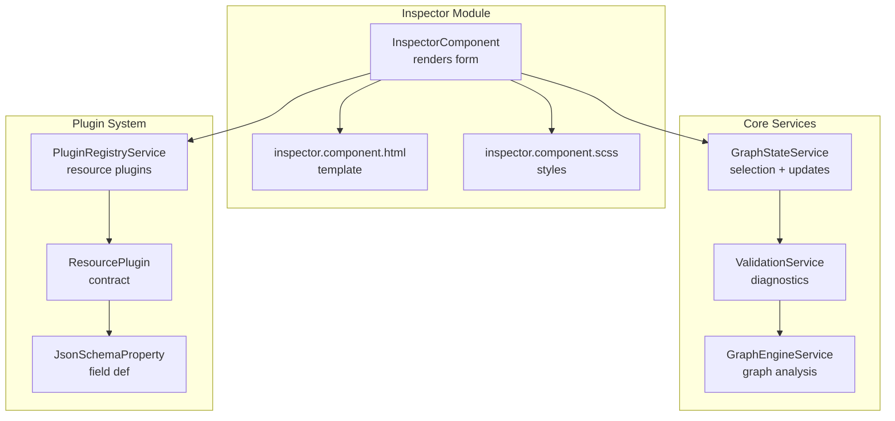
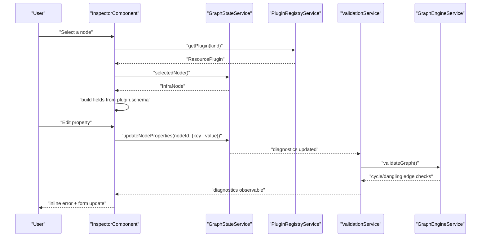
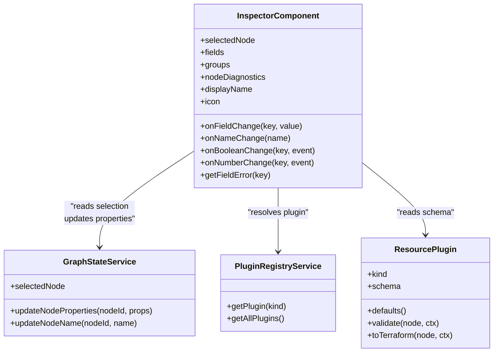

# Property Inspector

<cite>
**Referenced Files in This Document**
- [inspector.component.ts](file://src/app/inspector/inspector.component.ts)
- [inspector.component.html](file://src/app/inspector/inspector.component.html)
- [inspector.component.scss](file://src/app/inspector/inspector.component.scss)
- [README.md](file://src/app/inspector/README.md)
- [resource-plugin.model.ts](file://src/app/core/models/resource-plugin.model.ts)
- [infra-graph.model.ts](file://src/app/core/models/infra-graph.model.ts)
- [graph-state.service.ts](file://src/app/core/services/graph-state.service.ts)
- [plugin-registry.service.ts](file://src/app/infra/plugin-registry.service.ts)
- [validation.service.ts](file://src/app/validation/validation.service.ts)
- [graph-engine.service.ts](file://src/app/graph-engine/graph-engine.service.ts)
- [compute-network.plugin.ts](file://src/app/infra/plugins/compute-network.plugin.ts)
- [compute-subnetwork.plugin.ts](file://src/app/infra/plugins/compute-subnetwork.plugin.ts)
- [SYSTEM_DESIGN.md](file://SYSTEM_DESIGN.md)
</cite>

## Table of Contents
1. [Introduction](#introduction)
2. [Project Structure](#project-structure)
3. [Core Components](#core-components)
4. [Architecture Overview](#architecture-overview)
5. [Detailed Component Analysis](#detailed-component-analysis)
6. [Dependency Analysis](#dependency-analysis)
7. [Performance Considerations](#performance-considerations)
8. [Troubleshooting Guide](#troubleshooting-guide)
9. [Conclusion](#conclusion)
10. [Appendices](#appendices)

## Introduction
The Property Inspector is a schema-driven form renderer that generates dynamic property editors for selected nodes on the canvas. It reads resource definitions from plugins, builds grouped forms with typed controls, and synchronizes property changes back to the graph state in real time. It integrates tightly with the validation system to display diagnostics inline and propagates changes to downstream systems like the Terraform generator.

Key goals:
- Render adaptive forms from JSON Schema-like definitions
- Provide real-time validation feedback and error display
- Synchronize property edits to canvas nodes immediately
- Support custom field types and grouping for complex resources
- Enable plugin-based extension for resource-specific properties

## Project Structure
The inspector lives under the inspector module and collaborates with:
- Core models defining the plugin contract and graph data
- Graph state service for selection and property updates
- Plugin registry for retrieving resource schemas
- Validation service for diagnostics and policy checks

**Diagram sources**
- [inspector.component.ts](file://src/app/inspector/inspector.component.ts#L1-L103)
- [inspector.component.html](file://src/app/inspector/inspector.component.html#L1-L86)
- [inspector.component.scss](file://src/app/inspector/inspector.component.scss#L1-L258)
- [graph-state.service.ts](file://src/app/core/services/graph-state.service.ts#L1-L147)
- [plugin-registry.service.ts](file://src/app/infra/plugin-registry.service.ts#L1-L73)
- [resource-plugin.model.ts](file://src/app/core/models/resource-plugin.model.ts#L1-L55)
- [validation.service.ts](file://src/app/validation/validation.service.ts#L1-L107)
- [graph-engine.service.ts](file://src/app/graph-engine/graph-engine.service.ts#L1-L127)

**Section sources**
- [inspector.component.ts](file://src/app/inspector/inspector.component.ts#L1-L103)
- [inspector.component.html](file://src/app/inspector/inspector.component.html#L1-L86)
- [inspector.component.scss](file://src/app/inspector/inspector.component.scss#L1-L258)
- [README.md](file://src/app/inspector/README.md#L1-L4)
- [SYSTEM_DESIGN.md](file://SYSTEM_DESIGN.md#L93-L104)

## Core Components
- InspectorComponent: orchestrates schema-driven rendering, groups fields, computes diagnostics, and handles property updates.
- GraphStateService: manages the canonical graph, selection, and property mutation.
- PluginRegistryService: registers and retrieves resource plugins that define schemas and validation.
- ValidationService: aggregates diagnostics from schema, graph, and policy layers.
- ResourcePlugin contract: defines schema, defaults, validation, and Terraform generation for each resource.

**Section sources**
- [inspector.component.ts](file://src/app/inspector/inspector.component.ts#L21-L103)
- [graph-state.service.ts](file://src/app/core/services/graph-state.service.ts#L12-L147)
- [plugin-registry.service.ts](file://src/app/infra/plugin-registry.service.ts#L17-L73)
- [resource-plugin.model.ts](file://src/app/core/models/resource-plugin.model.ts#L43-L55)
- [validation.service.ts](file://src/app/validation/validation.service.ts#L7-L107)

## Architecture Overview
The inspector reacts to selection changes and renders a form derived from the selected node’s plugin schema. Each change triggers an update to the graph state, which recomputes diagnostics and can trigger code generation.

**Diagram sources**
- [inspector.component.ts](file://src/app/inspector/inspector.component.ts#L25-L101)
- [graph-state.service.ts](file://src/app/core/services/graph-state.service.ts#L73-L93)
- [plugin-registry.service.ts](file://src/app/infra/plugin-registry.service.ts#L48-L50)
- [validation.service.ts](file://src/app/validation/validation.service.ts#L14-L20)
- [graph-engine.service.ts](file://src/app/graph-engine/graph-engine.service.ts#L27-L63)

## Detailed Component Analysis

### InspectorComponent
Responsibilities:
- Reads the selected node and plugin schema to build a flat list of field entries with keys, configs, values, and groups.
- Groups fields by the group property from the schema.
- Computes diagnostics scoped to the selected node.
- Provides display helpers for name, icon, and display name.
- Handles property changes for strings, numbers, booleans, and select options.
- Exposes a method to fetch the first error for a given field.

Rendering logic:
- Header shows icon, name input, and display name.
- Optional diagnostics banner displays severity icons and messages.
- Form groups are rendered with labels, descriptions, and appropriate controls based on type.
- Inline error messages appear below each field when diagnostics match the field.

State management:
- Uses computed signals to derive fields, groups, diagnostics, and display metadata reactively.
- Delegates property updates to GraphStateService.

Change handling:
- onFieldChange: merges updates into node.properties and increments version.
- onNameChange: updates node.name.
- onBooleanChange/onNumberChange: coerce values and dispatch updates.

Error display:
- getFieldError filters diagnostics for the selected node and severity "error" with matching field.

**Section sources**
- [inspector.component.ts](file://src/app/inspector/inspector.component.ts#L21-L103)
- [inspector.component.html](file://src/app/inspector/inspector.component.html#L1-L86)
- [inspector.component.scss](file://src/app/inspector/inspector.component.scss#L62-L149)

### Schema-Driven Form Rendering
The template dynamically renders controls based on the plugin schema:
- string: text input with placeholder
- number: number input with change handler
- boolean: toggle checkbox with label
- select: dropdown with options

Grouping:
- Fields are grouped by the group property from the schema; default group is "General".

Required indicators:
- Required fields display a red asterisk next to the label.

Descriptions:
- Optional descriptions render beneath labels.

Inline errors:
- For each field, the first error severity "error" is shown below the control.

**Section sources**
- [inspector.component.html](file://src/app/inspector/inspector.component.html#L27-L79)
- [inspector.component.scss](file://src/app/inspector/inspector.component.scss#L119-L149)

### Plugin Registry and Resource Plugins
The registry maintains a map of ResourceKind to ResourcePlugin instances. Each plugin defines:
- kind, category, displayName, description, icon
- schema: a set of JsonSchemaProperty entries
- defaults(): returns initial property values
- validate(node, ctx): returns diagnostics for the node
- toTerraform(node, ctx): produces Terraform blocks

Examples:
- ComputeNetworkPlugin: defines properties for VPC networks, including advanced group fields.
- ComputeSubnetworkPlugin: defines subnet properties and suggests edges to VPC networks.

**Section sources**
- [plugin-registry.service.ts](file://src/app/infra/plugin-registry.service.ts#L17-L73)
- [resource-plugin.model.ts](file://src/app/core/models/resource-plugin.model.ts#L11-L55)
- [compute-network.plugin.ts](file://src/app/infra/plugins/compute-network.plugin.ts#L4-L129)
- [compute-subnetwork.plugin.ts](file://src/app/infra/plugins/compute-subnetwork.plugin.ts#L4-L130)

### Graph State Management
GraphStateService exposes:
- selectedNode computed signal
- updateNodeProperties and updateNodeName methods
- isDirty flag and mutation tracking

These methods update the graph signal and mark the project dirty, enabling downstream effects (validation, code generation).

**Section sources**
- [graph-state.service.ts](file://src/app/core/services/graph-state.service.ts#L12-L147)

### Validation Integration
ValidationService aggregates:
- Schema-level validation from each plugin
- Graph-level checks (cycles, dangling edges, duplicate names)
- Policy advisories (warnings and info)

Diagnostics include severity, code, optional field, message, and optional remediation. The inspector filters diagnostics by nodeId and field to display inline errors.

**Section sources**
- [validation.service.ts](file://src/app/validation/validation.service.ts#L7-L107)
- [graph-engine.service.ts](file://src/app/graph-engine/graph-engine.service.ts#L11-L127)
- [inspector.component.ts](file://src/app/inspector/inspector.component.ts#L55-L101)

### Adaptive Form Rendering and Custom Field Types
Adaptive rendering:
- The template branches on field.config.type to render the appropriate control.
- Group headers separate fields into logical sections.

Custom field types:
- string, number, boolean, select are supported out of the box.
- Additional types can be added by extending the template and adding handlers in the component.

Field metadata:
- label, description, placeholder, required, default, options, group are all schema-driven.

**Section sources**
- [inspector.component.html](file://src/app/inspector/inspector.component.html#L44-L70)
- [resource-plugin.model.ts](file://src/app/core/models/resource-plugin.model.ts#L11-L24)

### Property Synchronization with Canvas Nodes
When a user edits a property:
- The inspector calls GraphStateService.updateNodeProperties with a partial properties object.
- The service merges the update into node.properties and increments version.
- This triggers recomputation of diagnostics and can trigger code generation.

Name changes:
- onNameChange updates node.name directly.

Propagation:
- Diagnostics are filtered by nodeId so that only the selected node’s issues are shown.
- The change is reflected immediately in the form and any downstream consumers.

**Section sources**
- [inspector.component.ts](file://src/app/inspector/inspector.component.ts#L75-L95)
- [graph-state.service.ts](file://src/app/core/services/graph-state.service.ts#L73-L93)
- [inspector.component.ts](file://src/app/inspector/inspector.component.ts#L55-L59)

### Validation Error Display
The inspector shows diagnostics for the selected node:
- Severity icons distinguish errors, warnings, and info.
- Messages are displayed with optional remediation hints.
- Inline errors under each field are derived from diagnostics with matching field names.

**Section sources**
- [inspector.component.html](file://src/app/inspector/inspector.component.html#L12-L25)
- [inspector.component.ts](file://src/app/inspector/inspector.component.ts#L97-L101)
- [validation.service.ts](file://src/app/validation/validation.service.ts#L14-L20)

### Property Change Propagation
Change flow:
- User edits -> Inspector.onFieldChange -> GraphStateService.updateNodeProperties -> diagnostics updated -> UI re-renders with new errors and/or success state.

This ensures immediate feedback and prevents invalid states from persisting.

**Section sources**
- [inspector.component.ts](file://src/app/inspector/inspector.component.ts#L75-L85)
- [graph-state.service.ts](file://src/app/core/services/graph-state.service.ts#L73-L93)
- [validation.service.ts](file://src/app/validation/validation.service.ts#L14-L20)

### Examples and Extensibility

#### Customizing Form Layouts
- Use the group property in JsonSchemaProperty to organize fields into collapsible sections.
- Add descriptions to guide users on complex fields.
- Leverage defaults to prefill sensible values.

**Section sources**
- [compute-network.plugin.ts](file://src/app/infra/plugins/compute-network.plugin.ts#L11-L55)
- [compute-subnetwork.plugin.ts](file://src/app/infra/plugins/compute-subnetwork.plugin.ts#L11-L53)

#### Implementing Complex Validation Rules
- Define plugin.validate to return diagnostics with severity, code, field, message, and optional remediation.
- Use ValidationContext to access the graph and all nodes for cross-node checks.

**Section sources**
- [compute-network.plugin.ts](file://src/app/infra/plugins/compute-network.plugin.ts#L68-L99)
- [compute-subnetwork.plugin.ts](file://src/app/infra/plugins/compute-subnetwork.plugin.ts#L66-L97)
- [validation.service.ts](file://src/app/validation/validation.service.ts#L22-L39)

#### Extending Property Editing Capabilities
- Extend the template to support additional field types (e.g., textarea, multiselect).
- Add handlers in the component to convert values appropriately before dispatching updates.
- Register new plugins in PluginRegistryService to expose new resource types.

**Section sources**
- [inspector.component.html](file://src/app/inspector/inspector.component.html#L44-L70)
- [plugin-registry.service.ts](file://src/app/infra/plugin-registry.service.ts#L17-L42)

## Dependency Analysis
The inspector depends on:
- GraphStateService for selection and property updates
- PluginRegistryService for plugin resolution
- ValidationService indirectly via diagnostics propagation
- ResourcePlugin schema for rendering and defaults

**Diagram sources**
- [inspector.component.ts](file://src/app/inspector/inspector.component.ts#L21-L103)
- [graph-state.service.ts](file://src/app/core/services/graph-state.service.ts#L22-L93)
- [plugin-registry.service.ts](file://src/app/infra/plugin-registry.service.ts#L48-L54)
- [resource-plugin.model.ts](file://src/app/core/models/resource-plugin.model.ts#L43-L55)

**Section sources**
- [inspector.component.ts](file://src/app/inspector/inspector.component.ts#L21-L103)
- [graph-state.service.ts](file://src/app/core/services/graph-state.service.ts#L12-L147)
- [plugin-registry.service.ts](file://src/app/infra/plugin-registry.service.ts#L17-L73)
- [resource-plugin.model.ts](file://src/app/core/models/resource-plugin.model.ts#L11-L55)

## Performance Considerations
- Reactive rendering: computed signals minimize unnecessary re-computation when unrelated parts of the graph change.
- Incremental updates: updateNodeProperties merges partial properties, avoiding full node replacement.
- Debounced effects: upstream effects debounce heavy operations (validation, generation) to reduce churn.
- Deterministic ordering: graph engine ensures stable topological order for deterministic code generation.

[No sources needed since this section provides general guidance]

## Troubleshooting Guide
Common issues and resolutions:
- No inspector content: ensure a node is selected; the inspector shows an empty state when nothing is selected.
- Missing plugin: if a node’s kind is not registered, the inspector will not render fields; verify the plugin registration.
- Validation errors not appearing: confirm diagnostics are being produced and filtered by nodeId and field.
- Property not updating: verify onFieldChange handlers are invoked and GraphStateService.updateNodeProperties is called.

**Section sources**
- [inspector.component.html](file://src/app/inspector/inspector.component.html#L80-L85)
- [plugin-registry.service.ts](file://src/app/infra/plugin-registry.service.ts#L48-L50)
- [validation.service.ts](file://src/app/validation/validation.service.ts#L14-L20)
- [inspector.component.ts](file://src/app/inspector/inspector.component.ts#L75-L85)

## Conclusion
The Property Inspector provides a robust, schema-driven mechanism for editing resource properties. Its tight integration with the plugin system, graph state, and validation pipeline ensures that property changes are synchronized instantly, validated in real time, and surfaced with clear, actionable feedback. By leveraging groups, descriptions, and defaults, it offers an adaptive form experience that scales to complex resources while remaining intuitive for newcomers.

[No sources needed since this section summarizes without analyzing specific files]

## Appendices

### JSON Schema Property Reference
- type: 'string' | 'number' | 'boolean' | 'select'
- label: display label for the field
- description: optional help text
- required: marks field as required
- default: default value
- options: list of selectable values (for select)
- placeholder: input placeholder text
- group: grouping header for the field

**Section sources**
- [resource-plugin.model.ts](file://src/app/core/models/resource-plugin.model.ts#L11-L24)

### Example Plugin Fields
- ComputeNetworkPlugin: name, auto_create_subnetworks, routing_mode, mtu, delete_default_routes_on_create, description (with Advanced group)
- ComputeSubnetworkPlugin: name, ip_cidr_range, region, private_ip_google_access, purpose, description (with Advanced group)

**Section sources**
- [compute-network.plugin.ts](file://src/app/infra/plugins/compute-network.plugin.ts#L11-L55)
- [compute-subnetwork.plugin.ts](file://src/app/infra/plugins/compute-subnetwork.plugin.ts#L11-L53)