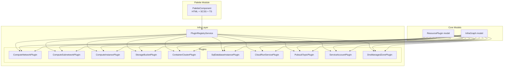
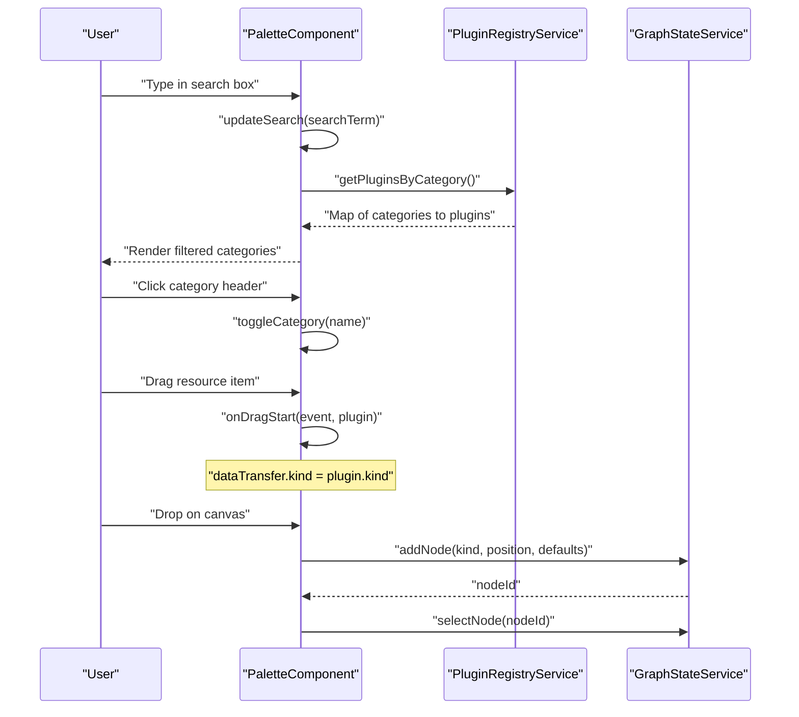
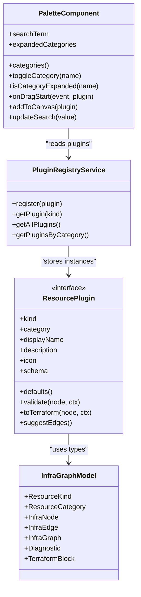

# Resource Palette

<cite>
**Referenced Files in This Document**
- [palette.component.ts](file://src/app/palette/palette.component.ts)
- [palette.component.html](file://src/app/palette/palette.component.html)
- [palette.component.scss](file://src/app/palette/palette.component.scss)
- [plugin-registry.service.ts](file://src/app/infra/plugin-registry.service.ts)
- [resource-plugin.model.ts](file://src/app/core/models/resource-plugin.model.ts)
- [infra-graph.model.ts](file://src/app/core/models/infra-graph.model.ts)
- [compute-network.plugin.ts](file://src/app/infra/plugins/compute-network.plugin.ts)
- [compute-subnetwork.plugin.ts](file://src/app/infra/plugins/compute-subnetwork.plugin.ts)
- [compute-instance.plugin.ts](file://src/app/infra/plugins/compute-instance.plugin.ts)
- [storage-bucket.plugin.ts](file://src/app/infra/plugins/storage-bucket.plugin.ts)
- [container-cluster.plugin.ts](file://src/app/infra/plugins/container-cluster.plugin.ts)
- [sql-database-instance.plugin.ts](file://src/app/infra/plugins/sql-database-instance.plugin.ts)
- [cloud-run-service.plugin.ts](file://src/app/infra/plugins/cloud-run-service.plugin.ts)
- [pubsub-topic.plugin.ts](file://src/app/infra/plugins/pubsub-topic.plugin.ts)
- [service-account.plugin.ts](file://src/app/infra/plugins/service-account.plugin.ts)
- [dns-managed-zone.plugin.ts](file://src/app/infra/plugins/dns-managed-zone.plugin.ts)
</cite>

## Table of Contents
1. [Introduction](#introduction)
2. [Project Structure](#project-structure)
3. [Core Components](#core-components)
4. [Architecture Overview](#architecture-overview)
5. [Detailed Component Analysis](#detailed-component-analysis)
6. [Dependency Analysis](#dependency-analysis)
7. [Performance Considerations](#performance-considerations)
8. [Troubleshooting Guide](#troubleshooting-guide)
9. [Conclusion](#conclusion)
10. [Appendices](#appendices)

## Introduction
The Resource Palette is a categorized resource browser that presents GCP resources organized by service categories such as Networking, Compute, Storage, Kubernetes, Database, Serverless, Security, and Messaging. It provides:
- Search and filtering across resource names, kinds, and descriptions
- Dynamic category expansion and collapse
- Drag-and-drop integration with the canvas to instantiate resources
- Resource iconography and accessible UI affordances
- Integration with the plugin registry for dynamic resource loading
- Responsive layout and accessibility support

## Project Structure
The Resource Palette is implemented as an Angular standalone component with a companion registry service and a set of resource plugins. The palette’s template, styles, and logic are co-located under the palette module, while resource plugins live under the infra/plugins directory and are registered centrally via the plugin registry.

**Diagram sources**
- [palette.component.ts](file://src/app/palette/palette.component.ts#L1-L83)
- [plugin-registry.service.ts](file://src/app/infra/plugin-registry.service.ts#L1-L73)
- [resource-plugin.model.ts](file://src/app/core/models/resource-plugin.model.ts#L43-L54)
- [infra-graph.model.ts](file://src/app/core/models/infra-graph.model.ts#L1-L118)

**Section sources**
- [palette.component.ts](file://src/app/palette/palette.component.ts#L1-L83)
- [plugin-registry.service.ts](file://src/app/infra/plugin-registry.service.ts#L1-L73)

## Core Components
- PaletteComponent: orchestrates search, category expansion, drag-and-drop, and canvas integration
- PluginRegistryService: registers and exposes resource plugins grouped by category
- ResourcePlugin model: defines the contract for resource plugins (schema, defaults, validation, TF generation, edge suggestions)
- InfraGraph model: defines resource kinds, categories, and related types used across the system

Key responsibilities:
- Search and filter: filters plugins by display name, kind, and description
- Category grouping and ordering: maintains a fixed order and excludes empty categories
- Accessibility: ARIA attributes and keyboard navigation support
- Canvas integration: creates nodes with spatially distributed positions and selects them

**Section sources**
- [palette.component.ts](file://src/app/palette/palette.component.ts#L18-L81)
- [plugin-registry.service.ts](file://src/app/infra/plugin-registry.service.ts#L56-L71)
- [resource-plugin.model.ts](file://src/app/core/models/resource-plugin.model.ts#L43-L54)
- [infra-graph.model.ts](file://src/app/core/models/infra-graph.model.ts#L15-L16)

## Architecture Overview
The palette composes a reactive UI driven by signals. It reads from the plugin registry, computes filtered categories, and renders items with icons and descriptions. Users can search, expand/collapse categories, drag resources to the canvas, or click to add instantly.

**Diagram sources**
- [palette.component.ts](file://src/app/palette/palette.component.ts#L55-L77)
- [plugin-registry.service.ts](file://src/app/infra/plugin-registry.service.ts#L56-L71)

## Detailed Component Analysis

### PaletteComponent
Responsibilities:
- Reactive state: search term and expanded categories
- Computed categories: groups plugins by category and applies search filter
- UI interactions: toggling category expansion, drag-and-drop, adding to canvas
- Canvas integration: generates deterministic spread positions and selects the new node

Implementation highlights:
- Search filter checks displayName, kind, and description
- Category expansion toggled via a Set stored in a signal
- Drag-and-drop sets a custom data type for kind
- Adding to canvas computes grid-like positions with jitter to prevent overlap

Accessibility:
- ARIA-expanded on category headers
- Keyboard support for category header and item buttons
- Proper focus styles and hover states

Styling:
- Clean, compact layout with hover effects and subtle transitions
- Category arrow rotation indicates expanded state
- Empty state when no resources match the search

**Section sources**
- [palette.component.ts](file://src/app/palette/palette.component.ts#L18-L81)
- [palette.component.html](file://src/app/palette/palette.component.html#L1-L49)
- [palette.component.scss](file://src/app/palette/palette.component.scss#L1-L216)

### Plugin Registry
Responsibilities:
- Central registration of all resource plugins
- Grouping plugins by category with a fixed order
- Exposing getters for single and all plugins

Behavior:
- Initializes plugins for Network, Compute, Storage, Kubernetes, Database, Serverless, Security, and Messaging
- Ensures categories appear in a predefined order and omits empty ones

Extensibility:
- New plugins are added by registering instances in the constructor
- Categories are reflected automatically if the plugin’s category matches an existing one

**Section sources**
- [plugin-registry.service.ts](file://src/app/infra/plugin-registry.service.ts#L18-L71)

### Resource Plugins (Examples)
Each plugin defines:
- kind: unique resource identifier
- category: determines grouping
- displayName, description, icon: UI metadata
- schema: JSON schema for property editing
- defaults(): initial property values
- validate(): validation diagnostics against graph context
- toTerraform(): generates Terraform blocks
- suggestEdges(): optional edge suggestions

Representative plugins:
- ComputeNetworkPlugin: VPC network with schema, defaults, validation, and TF generation
- ComputeSubnetworkPlugin: Subnetwork with CIDR and region validation
- ComputeInstancePlugin: VM instance with disk and network interface generation
- StorageBucketPlugin: Cloud Storage with retention and access controls
- ContainerClusterPlugin: GKE cluster with networking and node config
- SqlDatabaseInstancePlugin: Managed SQL with tiers and availability
- CloudRunServicePlugin: Serverless container service
- PubsubTopicPlugin: Messaging topic
- ServiceAccountPlugin: IAM service account
- DnsManagedZonePlugin: DNS managed zone

**Section sources**
- [compute-network.plugin.ts](file://src/app/infra/plugins/compute-network.plugin.ts#L4-L128)
- [compute-subnetwork.plugin.ts](file://src/app/infra/plugins/compute-subnetwork.plugin.ts#L4-L129)
- [compute-instance.plugin.ts](file://src/app/infra/plugins/compute-instance.plugin.ts#L4-L127)
- [storage-bucket.plugin.ts](file://src/app/infra/plugins/storage-bucket.plugin.ts#L4-L104)
- [container-cluster.plugin.ts](file://src/app/infra/plugins/container-cluster.plugin.ts#L4-L139)
- [sql-database-instance.plugin.ts](file://src/app/infra/plugins/sql-database-instance.plugin.ts#L4-L48)
- [cloud-run-service.plugin.ts](file://src/app/infra/plugins/cloud-run-service.plugin.ts#L4-L44)
- [pubsub-topic.plugin.ts](file://src/app/infra/plugins/pubsub-topic.plugin.ts#L4-L34)
- [service-account.plugin.ts](file://src/app/infra/plugins/service-account.plugin.ts#L4-L36)
- [dns-managed-zone.plugin.ts](file://src/app/infra/plugins/dns-managed-zone.plugin.ts#L4-L38)

### ResourcePlugin Model
Defines the contract that all plugins must implement:
- kind, category, displayName, description, icon
- schema for property editing
- defaults(), validate(), toTerraform(), optional suggestEdges()

This ensures consistent behavior across plugins and enables the palette to render and interact with them uniformly.

**Section sources**
- [resource-plugin.model.ts](file://src/app/core/models/resource-plugin.model.ts#L43-L54)

### InfraGraph Model
Defines resource kinds, categories, and related types:
- ResourceKind union of supported GCP resources
- ResourceCategory union of palette categories
- InfraNode, InfraEdge, InfraGraph structures
- Diagnostic, TerraformBlock, and related types
- Predefined category-to-kinds mapping and icon mapping

**Section sources**
- [infra-graph.model.ts](file://src/app/core/models/infra-graph.model.ts#L1-L118)

## Dependency Analysis
The palette depends on the plugin registry for resource metadata and on the graph state service for canvas operations. Plugins depend on the resource plugin model and infra graph model.

**Diagram sources**
- [palette.component.ts](file://src/app/palette/palette.component.ts#L15-L16)
- [plugin-registry.service.ts](file://src/app/infra/plugin-registry.service.ts#L18-L53)
- [resource-plugin.model.ts](file://src/app/core/models/resource-plugin.model.ts#L43-L54)
- [infra-graph.model.ts](file://src/app/core/models/infra-graph.model.ts#L1-L118)

**Section sources**
- [palette.component.ts](file://src/app/palette/palette.component.ts#L15-L16)
- [plugin-registry.service.ts](file://src/app/infra/plugin-registry.service.ts#L18-L53)

## Performance Considerations
- Filtering is O(N) per keystroke across all plugins; acceptable for current scale
- Category grouping is O(N); maintain a small, curated set of plugins
- Rendering uses Angular signals and track-by patterns; keep plugin lists reasonably sized
- For very large catalogs:
  - Debounce search input to reduce recomputation frequency
  - Virtualize long lists if categories become deep
  - Cache grouped results when search term is unchanged
  - Lazy-load plugin modules if the registry grows large

[No sources needed since this section provides general guidance]

## Troubleshooting Guide
Common issues and resolutions:
- No resources shown after search
  - Verify the search term is not overly restrictive
  - Confirm plugins are registered and not filtered out by category
- Category does not expand/collapse
  - Ensure the category name matches exactly (case-sensitive)
  - Check that the expandedCategories signal is updating correctly
- Drag-and-drop does not add to canvas
  - Confirm the drop target accepts the kind set during drag start
  - Verify the graph state service supports addNode(kind, position, defaults)
- Iconography appears missing
  - Ensure the plugin’s icon is defined and rendered in the palette item
- Accessibility warnings
  - Confirm ARIA attributes are present on interactive elements
  - Test keyboard navigation for category headers and items

**Section sources**
- [palette.component.ts](file://src/app/palette/palette.component.ts#L55-L77)
- [palette.component.html](file://src/app/palette/palette.component.html#L16-L28)
- [palette.component.scss](file://src/app/palette/palette.component.scss#L102-L110)

## Conclusion
The Resource Palette provides a responsive, accessible, and extensible way to browse, search, and instantiate GCP resources. Its integration with the plugin registry enables dynamic loading of new resource types, while the standardized plugin model ensures consistent behavior across diverse services. With proper categorization and iconography, users can efficiently discover and place resources onto the canvas.

[No sources needed since this section summarizes without analyzing specific files]

## Appendices

### A. Customizing Resource Categories
To change category ordering or add new categories:
- Modify the order array in the registry’s category grouping method
- Ensure plugin.category values align with the new category names
- Rebuild and verify category headers reflect the updated order

**Section sources**
- [plugin-registry.service.ts](file://src/app/infra/plugin-registry.service.ts#L56-L71)

### B. Adding a New Resource Type
Steps:
- Create a new plugin class implementing ResourcePlugin
- Define kind, category, displayName, description, icon, schema, defaults
- Implement validate() and toTerraform() as needed
- Register the plugin instance in the registry constructor
- Optionally add suggestEdges() for canvas wiring hints

Example references:
- [compute-network.plugin.ts](file://src/app/infra/plugins/compute-network.plugin.ts#L4-L128)
- [container-cluster.plugin.ts](file://src/app/infra/plugins/container-cluster.plugin.ts#L4-L139)

**Section sources**
- [plugin-registry.service.ts](file://src/app/infra/plugin-registry.service.ts#L21-L42)
- [resource-plugin.model.ts](file://src/app/core/models/resource-plugin.model.ts#L43-L54)

### C. Optimizing for Large Resource Catalogs
- Debounce search input to limit frequent recomputations
- Consider virtual scrolling for long category lists
- Cache grouped and filtered results when inputs are unchanged
- Split plugin registration into lazy-loaded modules if appropriate

[No sources needed since this section provides general guidance]