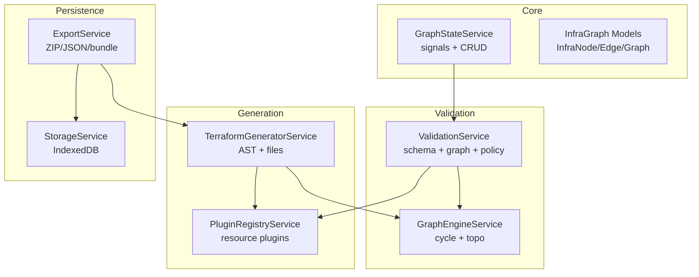
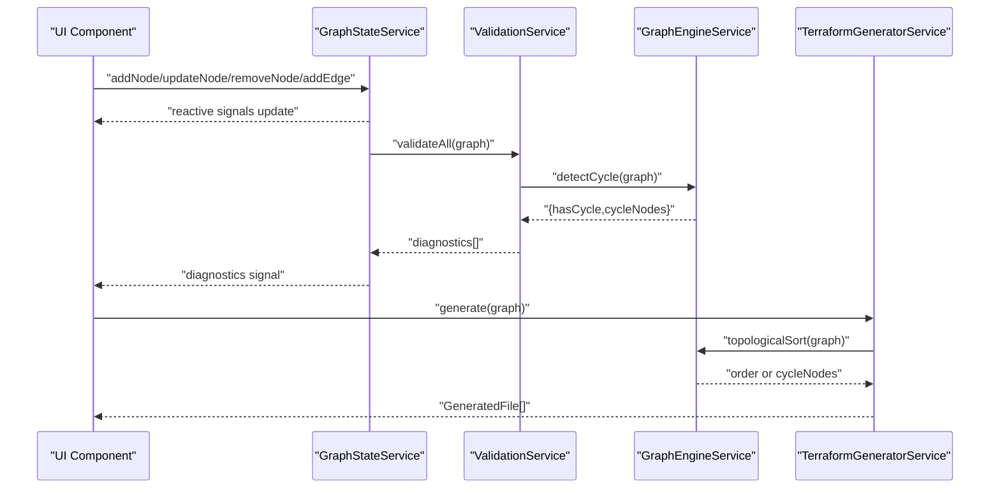
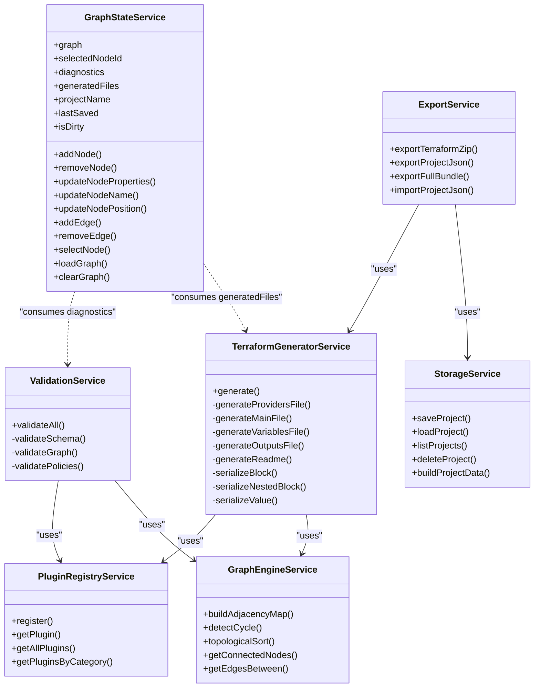

# Core Services

<cite>
**Referenced Files in This Document**
- [graph-state.service.ts](file://src/app/core/services/graph-state.service.ts)
- [validation.service.ts](file://src/app/validation/validation.service.ts)
- [graph-engine.service.ts](file://src/app/graph-engine/graph-engine.service.ts)
- [terraform-generator.service.ts](file://src/app/terraform-engine/terraform-generator.service.ts)
- [infra-graph.model.ts](file://src/app/core/models/infra-graph.model.ts)
- [resource-plugin.model.ts](file://src/app/core/models/resource-plugin.model.ts)
- [plugin-registry.service.ts](file://src/app/infra/plugin-registry.service.ts)
- [compute-network.plugin.ts](file://src/app/infra/plugins/compute-network.plugin.ts)
- [compute-instance.plugin.ts](file://src/app/infra/plugins/compute-instance.plugin.ts)
- [storage.service.ts](file://src/app/storage/storage.service.ts)
- [export.service.ts](file://src/app/storage/export.service.ts)
- [SYSTEM_DESIGN.md](file://SYSTEM_DESIGN.md)
- [main.ts](file://src/main.ts)
- [package.json](file://package.json)
</cite>

## Table of Contents
1. [Introduction](#introduction)
2. [Project Structure](#project-structure)
3. [Core Components](#core-components)
4. [Architecture Overview](#architecture-overview)
5. [Detailed Component Analysis](#detailed-component-analysis)
6. [Dependency Analysis](#dependency-analysis)
7. [Performance Considerations](#performance-considerations)
8. [Troubleshooting Guide](#troubleshooting-guide)
9. [Conclusion](#conclusion)
10. [Appendices](#appendices)

## Introduction
This document explains CloudCanvas-TF’s core service layer with a focus on:
- GraphStateService: signal-based state management, reactive updates, and CRUD for nodes and edges
- ValidationService: schema validation, graph integrity checks, and policy enforcement
- GraphEngineService: dependency analysis, topological sorting, and cycle detection
- TerraformGeneratorService: AST-based code generation, provider configuration, and multi-file output

It also covers service initialization, dependency injection patterns, inter-service communication, usage examples, extension points, and integration patterns with UI components.

## Project Structure
CloudCanvas-TF is an Angular application organized around a canonical InfraGraph model and a plugin-based architecture. The core services reside under src/app/core, src/app/validation, src/app/graph-engine, and src/app/terraform-engine. Plugins are registered centrally and invoked by services to validate and generate Terraform.

**Diagram sources**
- [graph-state.service.ts](file://src/app/core/services/graph-state.service.ts#L1-L147)
- [validation.service.ts](file://src/app/validation/validation.service.ts#L1-L107)
- [graph-engine.service.ts](file://src/app/graph-engine/graph-engine.service.ts#L1-L127)
- [terraform-generator.service.ts](file://src/app/terraform-engine/terraform-generator.service.ts#L1-L234)
- [plugin-registry.service.ts](file://src/app/infra/plugin-registry.service.ts#L1-L73)
- [storage.service.ts](file://src/app/storage/storage.service.ts#L1-L85)
- [export.service.ts](file://src/app/storage/export.service.ts#L1-L203)

**Section sources**
- [SYSTEM_DESIGN.md](file://SYSTEM_DESIGN.md#L245-L262)
- [package.json](file://package.json#L1-L37)

## Core Components
This section documents the four core services and their responsibilities.

- GraphStateService
  - Provides reactive signals for the InfraGraph, selection, diagnostics, generated files, project metadata, and dirty state.
  - Implements CRUD operations for nodes and edges, with automatic updates to derived signals and dirty state.
  - Generates deterministic IDs for nodes and edges.

- ValidationService
  - Orchestrates three validation layers: schema validation per plugin, graph integrity checks (cycles, dangling edges, duplicate names), and policy advisories.
  - Uses GraphEngineService for cycle detection and PluginRegistryService to invoke per-resource validators.

- GraphEngineService
  - Builds adjacency maps, detects cycles using DFS with white/gray/black coloring, and computes a deterministic topological order using Kahn’s algorithm with ID-based tie-breaking.

- TerraformGeneratorService
  - Produces multi-file Terraform outputs (providers, main, variables, outputs, README) from a validated and ordered InfraGraph.
  - Uses PluginRegistryService to transform nodes into Terraform AST blocks and GraphEngineService to ensure deterministic ordering.

**Section sources**
- [graph-state.service.ts](file://src/app/core/services/graph-state.service.ts#L1-L147)
- [validation.service.ts](file://src/app/validation/validation.service.ts#L1-L107)
- [graph-engine.service.ts](file://src/app/graph-engine/graph-engine.service.ts#L1-L127)
- [terraform-generator.service.ts](file://src/app/terraform-engine/terraform-generator.service.ts#L1-L234)

## Architecture Overview
The services collaborate around a canonical InfraGraph. Changes propagate reactively through signals, validation is performed on every meaningful change, and generation produces deterministic Terraform outputs.

**Diagram sources**
- [graph-state.service.ts](file://src/app/core/services/graph-state.service.ts#L1-L147)
- [validation.service.ts](file://src/app/validation/validation.service.ts#L1-L107)
- [graph-engine.service.ts](file://src/app/graph-engine/graph-engine.service.ts#L1-L127)
- [terraform-generator.service.ts](file://src/app/terraform-engine/terraform-generator.service.ts#L1-L234)

## Detailed Component Analysis

### GraphStateService
Responsibilities:
- Reactive state: graph, selectedNodeId, diagnostics, generatedFiles, projectName, lastSaved, isDirty
- Computed signals: selectedNode, hasBlockingErrors, nodeCount, edgeCount
- CRUD operations:
  - Node: addNode, removeNode, updateNodeProperties, updateNodeName, updateNodePosition
  - Edge: addEdge, removeEdge
  - Selection: selectNode
  - Lifecycle: loadGraph, clearGraph

Implementation highlights:
- Uses Angular signals for fine-grained reactivity and minimal change propagation.
- Ensures uniqueness and deterministic IDs for nodes and edges.
- Maintains version counters for nodes to support change tracking.

Usage examples (paths):
- Add a node: [addNode](file://src/app/core/services/graph-state.service.ts#L39-L60)
- Remove a node: [removeNode](file://src/app/core/services/graph-state.service.ts#L62-L71)
- Update node properties: [updateNodeProperties](file://src/app/core/services/graph-state.service.ts#L73-L83)
- Add an edge: [addEdge](file://src/app/core/services/graph-state.service.ts#L104-L119)
- Clear graph: [clearGraph](file://src/app/core/services/graph-state.service.ts#L139-L145)

Integration with UI:
- Canvas components subscribe to signals to render nodes and edges.
- Inspector reads selectedNode to display dynamic forms.
- Diagnostics panel subscribes to diagnostics for error/warning display.

**Section sources**
- [graph-state.service.ts](file://src/app/core/services/graph-state.service.ts#L1-L147)

### ValidationService
Responsibilities:
- validateAll orchestrates schema, graph, and policy validations.
- Schema validation: iterates nodes, finds plugin by kind, invokes plugin.validate.
- Graph validation: cycle detection, dangling edges, duplicate names.
- Policy validation: empty graph hint, subnet without VPC warning.

Interactions:
- Depends on PluginRegistryService for per-resource validation.
- Uses GraphEngineService for cycle detection.

Usage examples (paths):
- Validate entire graph: [validateAll](file://src/app/validation/validation.service.ts#L14-L20)
- Schema validation loop: [validateSchema](file://src/app/validation/validation.service.ts#L22-L39)
- Graph integrity checks: [validateGraph](file://src/app/validation/validation.service.ts#L41-L81)
- Policies: [validatePolicies](file://src/app/validation/validation.service.ts#L83-L105)

**Section sources**
- [validation.service.ts](file://src/app/validation/validation.service.ts#L1-L107)
- [plugin-registry.service.ts](file://src/app/infra/plugin-registry.service.ts#L1-L73)
- [graph-engine.service.ts](file://src/app/graph-engine/graph-engine.service.ts#L1-L127)

### GraphEngineService
Responsibilities:
- buildAdjacencyMap: constructs adjacency sets from edges.
- detectCycle: DFS-based cycle detection returning hasCycle and cycleNodes.
- topologicalSort: Kahn’s algorithm with ID-based tie-breaking; returns order or cycleNodes.
- Utility queries: getConnectedNodes, getEdgesBetween.

Complexity:
- Adjacency map: O(V + E)
- Cycle detection: O(V + E)
- Topological sort: O(V + E) with sorting queues

Usage examples (paths):
- Build adjacency: [buildAdjacencyMap](file://src/app/graph-engine/graph-engine.service.ts#L13-L25)
- Detect cycle: [detectCycle](file://src/app/graph-engine/graph-engine.service.ts#L27-L63)
- Topological sort: [topologicalSort](file://src/app/graph-engine/graph-engine.service.ts#L65-L110)
- Connected nodes: [getConnectedNodes](file://src/app/graph-engine/graph-engine.service.ts#L112-L119)

**Section sources**
- [graph-engine.service.ts](file://src/app/graph-engine/graph-engine.service.ts#L1-L127)

### TerraformGeneratorService
Responsibilities:
- generate: orchestrates generation, builds GeneratorContext, sorts nodes, aggregates blocks, writes files.
- File generation:
  - Providers: pinned provider block and terraform requirements
  - Main: resource blocks serialized deterministically
  - Variables: project_id and region variables
  - Outputs: per-resource id outputs
  - README: generated project summary

Interactions:
- Uses PluginRegistryService to convert nodes to Terraform blocks.
- Uses GraphEngineService for topological order.

Serialization:
- serializeBlock and serializeNestedBlock handle canonical formatting.
- serializeValue handles primitive types, arrays, and references.

Usage examples (paths):
- Generate files: [generate](file://src/app/terraform-engine/terraform-generator.service.ts#L16-L51)
- Providers file: [generateProvidersFile](file://src/app/terraform-engine/terraform-generator.service.ts#L53-L71)
- Main file: [generateMainFile](file://src/app/terraform-engine/terraform-generator.service.ts#L73-L92)
- Variables file: [generateVariablesFile](file://src/app/terraform-engine/terraform-generator.service.ts#L94-L108)
- Outputs file: [generateOutputsFile](file://src/app/terraform-engine/terraform-generator.service.ts#L110-L126)
- README: [generateReadme](file://src/app/terraform-engine/terraform-generator.service.ts#L128-L154)
- Serialize blocks: [serializeBlock](file://src/app/terraform-engine/terraform-generator.service.ts#L156-L176)

**Section sources**
- [terraform-generator.service.ts](file://src/app/terraform-engine/terraform-generator.service.ts#L1-L234)

### Data Models and Plugin Contracts
- InfraGraph models define ResourceKind, InfraNode, InfraEdge, InfraGraph, Diagnostic, TerraformBlock, and GeneratedFile.
- ResourcePlugin defines the contract for validation and generation, including JsonSchema, defaults, and optional edge suggestions.

Usage examples (paths):
- Resource kinds and shapes: [infra-graph.model.ts](file://src/app/core/models/infra-graph.model.ts#L1-L118)
- Plugin contract: [resource-plugin.model.ts](file://src/app/core/models/resource-plugin.model.ts#L1-L55)

**Section sources**
- [infra-graph.model.ts](file://src/app/core/models/infra-graph.model.ts#L1-L118)
- [resource-plugin.model.ts](file://src/app/core/models/resource-plugin.model.ts#L1-L55)

### Plugin Registry and Examples
- PluginRegistryService registers all supported resource plugins and exposes getters for single and grouped plugins.
- Example plugins:
  - ComputeNetworkPlugin: validates MTU range, auto subnet mode, and serializes a network resource.
  - ComputeInstancePlugin: validates required fields, suggests subnet attachment, and generates nested blocks.

Usage examples (paths):
- Register plugins: [plugin-registry.service.ts](file://src/app/infra/plugin-registry.service.ts#L21-L42)
- Network plugin: [compute-network.plugin.ts](file://src/app/infra/plugins/compute-network.plugin.ts#L1-L129)
- Instance plugin: [compute-instance.plugin.ts](file://src/app/infra/plugins/compute-instance.plugin.ts#L1-L128)

**Section sources**
- [plugin-registry.service.ts](file://src/app/infra/plugin-registry.service.ts#L1-L73)
- [compute-network.plugin.ts](file://src/app/infra/plugins/compute-network.plugin.ts#L1-L129)
- [compute-instance.plugin.ts](file://src/app/infra/plugins/compute-instance.plugin.ts#L1-L128)

### Persistence and Export
- StorageService persists projects to IndexedDB with Dexie-like patterns and supports save, load, list, and delete operations.
- ExportService generates Terraform ZIPs, Project JSON, and full bundles synchronously from user gestures, invoking TerraformGeneratorService and StorageService.

Usage examples (paths):
- Save project: [saveProject](file://src/app/storage/storage.service.ts#L30-L38)
- Export Terraform ZIP: [exportTerraformZip](file://src/app/storage/export.service.ts#L18-L28)
- Export full bundle: [exportFullBundle](file://src/app/storage/export.service.ts#L42-L59)

**Section sources**
- [storage.service.ts](file://src/app/storage/storage.service.ts#L1-L85)
- [export.service.ts](file://src/app/storage/export.service.ts#L1-L203)

## Dependency Analysis
Services and their dependencies:

**Diagram sources**
- [graph-state.service.ts](file://src/app/core/services/graph-state.service.ts#L1-L147)
- [validation.service.ts](file://src/app/validation/validation.service.ts#L1-L107)
- [graph-engine.service.ts](file://src/app/graph-engine/graph-engine.service.ts#L1-L127)
- [terraform-generator.service.ts](file://src/app/terraform-engine/terraform-generator.service.ts#L1-L234)
- [plugin-registry.service.ts](file://src/app/infra/plugin-registry.service.ts#L1-L73)
- [storage.service.ts](file://src/app/storage/storage.service.ts#L1-L85)
- [export.service.ts](file://src/app/storage/export.service.ts#L1-L203)

**Section sources**
- [validation.service.ts](file://src/app/validation/validation.service.ts#L1-L107)
- [terraform-generator.service.ts](file://src/app/terraform-engine/terraform-generator.service.ts#L1-L234)
- [export.service.ts](file://src/app/storage/export.service.ts#L1-L203)

## Performance Considerations
- Signal-based state minimizes unnecessary renders; batch updates via graph.update reduce re-computations.
- GraphEngineService algorithms are linear in V+E; keep operations off the UI thread for large graphs.
- TerraformGeneratorService uses deterministic serialization and ID-based sorting to avoid noisy diffs.
- ExportService performs synchronous ZIP creation to preserve user gesture context; keep heavy work short-lived.

[No sources needed since this section provides general guidance]

## Troubleshooting Guide
Common issues and resolutions:
- Circular dependencies
  - Symptom: Diagnostics indicate DEPENDENCY_CYCLE; topologicalSort returns cycleNodes.
  - Action: Remove or rewire edges to eliminate cycles.
  - Reference: [validateGraph](file://src/app/validation/validation.service.ts#L41-L81), [detectCycle](file://src/app/graph-engine/graph-engine.service.ts#L27-L63)

- Dangling edges
  - Symptom: Diagnostics with DANGLING_EDGE for missing from/to node IDs.
  - Action: Ensure both endpoints refer to existing nodes.
  - Reference: [validateGraph](file://src/app/validation/validation.service.ts#L54-L65)

- Duplicate resource names by kind
  - Symptom: Diagnostics with DUPLICATE_NAME.
  - Action: Rename duplicates within the same kind.
  - Reference: [validateGraph](file://src/app/validation/validation.service.ts#L67-L78)

- Unknown resource type
  - Symptom: Diagnostics with UNKNOWN_RESOURCE.
  - Action: Verify node.kind matches a registered plugin.
  - Reference: [validateSchema](file://src/app/validation/validation.service.ts#L22-L39), [plugin-registry.service.ts](file://src/app/infra/plugin-registry.service.ts#L44-L50)

- Export failures
  - Symptom: Alert during export with error message.
  - Action: Check console logs; ensure generator succeeds and user gesture preserved.
  - Reference: [exportTerraformZip](file://src/app/storage/export.service.ts#L18-L28), [triggerDownload](file://src/app/storage/export.service.ts#L184-L197)

**Section sources**
- [validation.service.ts](file://src/app/validation/validation.service.ts#L1-L107)
- [graph-engine.service.ts](file://src/app/graph-engine/graph-engine.service.ts#L1-L127)
- [export.service.ts](file://src/app/storage/export.service.ts#L1-L203)

## Conclusion
CloudCanvas-TF’s core services implement a clean separation of concerns:
- GraphStateService manages canonical state reactively.
- ValidationService ensures correctness and safety.
- GraphEngineService provides reliable dependency analysis.
- TerraformGeneratorService produces deterministic, readable Terraform outputs.

The plugin registry and models enable extensibility, while persistence and export services complete the end-to-end workflow.

[No sources needed since this section summarizes without analyzing specific files]

## Appendices

### Service Initialization and DI Patterns
- All services are root-scoped (@Injectable({ providedIn: 'root' })) enabling singleton behavior and straightforward DI.
- Angular Signals power reactive state; effects can be used to debounce and coordinate cross-service updates.

**Section sources**
- [graph-state.service.ts](file://src/app/core/services/graph-state.service.ts#L12-L21)
- [validation.service.ts](file://src/app/validation/validation.service.ts#L7-L12)
- [graph-engine.service.ts](file://src/app/graph-engine/graph-engine.service.ts#L10-L11)
- [terraform-generator.service.ts](file://src/app/terraform-engine/terraform-generator.service.ts#L9-L14)
- [plugin-registry.service.ts](file://src/app/infra/plugin-registry.service.ts#L17-L18)
- [storage.service.ts](file://src/app/storage/storage.service.ts#L8-L9)
- [export.service.ts](file://src/app/storage/export.service.ts#L6-L7)

### Inter-Service Communication
- GraphStateService emits signals consumed by ValidationService and TerraformGeneratorService.
- ValidationService reports diagnostics back to GraphStateService and UI.
- ExportService coordinates generation and persistence for downloads.

**Section sources**
- [graph-state.service.ts](file://src/app/core/services/graph-state.service.ts#L1-L147)
- [validation.service.ts](file://src/app/validation/validation.service.ts#L1-L107)
- [terraform-generator.service.ts](file://src/app/terraform-engine/terraform-generator.service.ts#L1-L234)
- [export.service.ts](file://src/app/storage/export.service.ts#L1-L203)

### Extension Points and Integration Patterns
- Adding a new resource:
  - Implement ResourcePlugin and register it in PluginRegistryService.
  - Implement schema, defaults, validate, and toTerraform.
  - Reference: [resource-plugin.model.ts](file://src/app/core/models/resource-plugin.model.ts#L43-L54), [plugin-registry.service.ts](file://src/app/infra/plugin-registry.service.ts#L21-L42)
- Extending validation:
  - Add checks in ValidationService.validateGraph or validatePolicies.
  - Reference: [validation.service.ts](file://src/app/validation/validation.service.ts#L41-L105)
- Extending generation:
  - Modify TerraformGeneratorService.generate or add new file generators.
  - Reference: [terraform-generator.service.ts](file://src/app/terraform-engine/terraform-generator.service.ts#L16-L51)

**Section sources**
- [resource-plugin.model.ts](file://src/app/core/models/resource-plugin.model.ts#L1-L55)
- [plugin-registry.service.ts](file://src/app/infra/plugin-registry.service.ts#L1-L73)
- [validation.service.ts](file://src/app/validation/validation.service.ts#L1-L107)
- [terraform-generator.service.ts](file://src/app/terraform-engine/terraform-generator.service.ts#L1-L234)