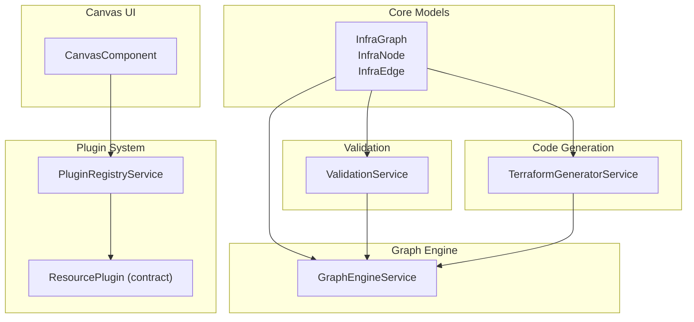
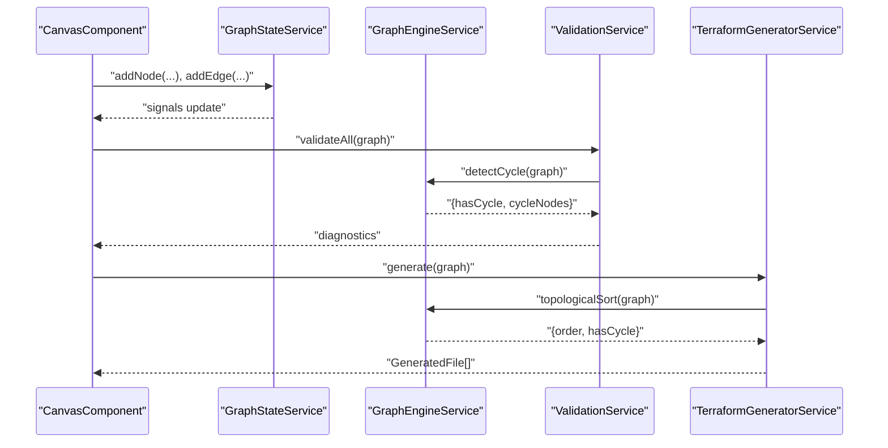
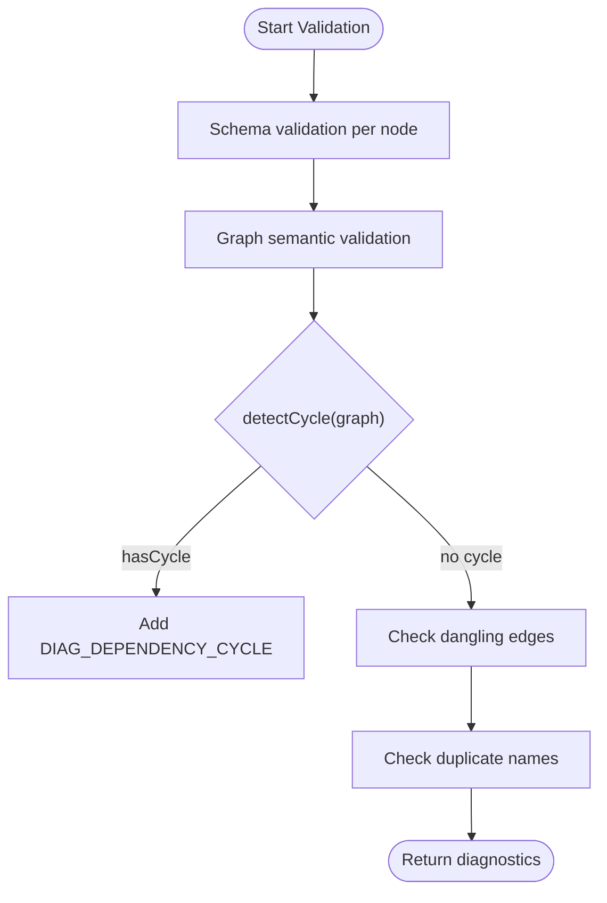
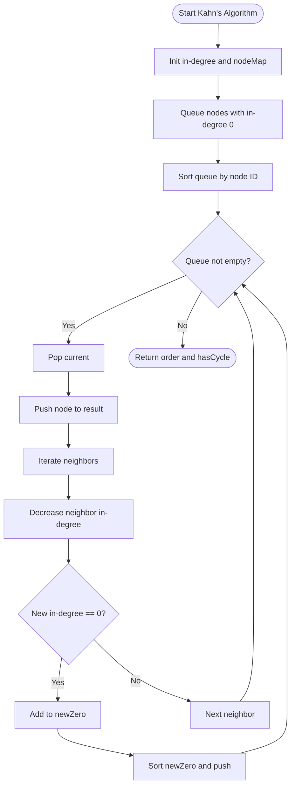
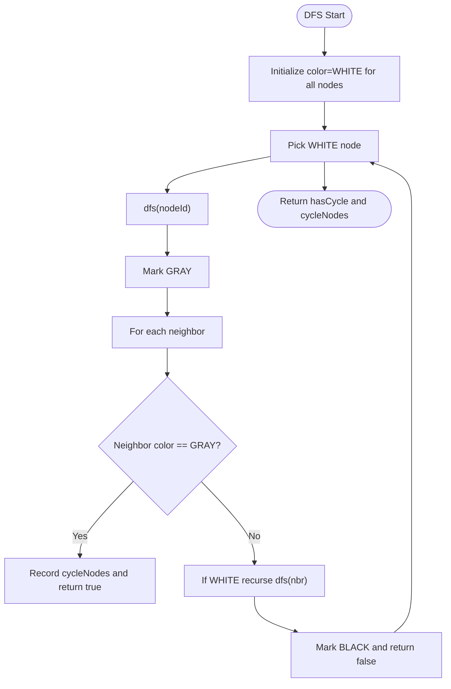
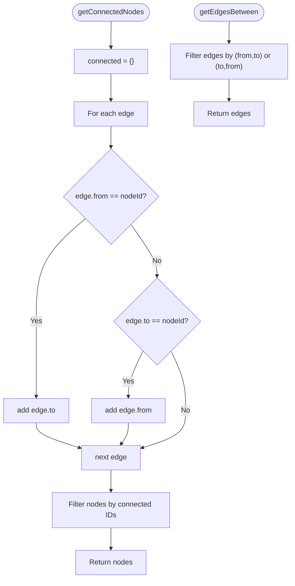
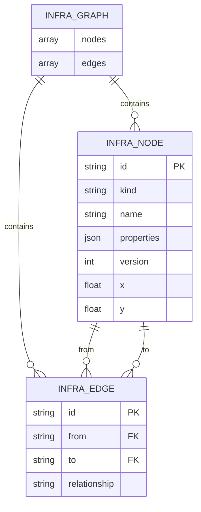
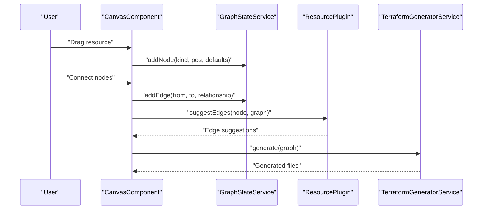
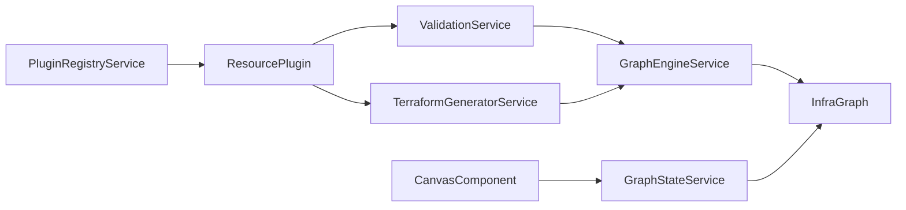

# GraphEngineService

<cite>
**Referenced Files in This Document**
- [graph-engine.service.ts](file://src/app/graph-engine/graph-engine.service.ts)
- [infra-graph.model.ts](file://src/app/core/models/infra-graph.model.ts)
- [graph-state.service.ts](file://src/app/core/services/graph-state.service.ts)
- [validation.service.ts](file://src/app/validation/validation.service.ts)
- [terraform-generator.service.ts](file://src/app/terraform-engine/terraform-generator.service.ts)
- [canvas.component.ts](file://src/app/canvas/canvas.component.ts)
- [plugin-registry.service.ts](file://src/app/infra/plugin-registry.service.ts)
- [resource-plugin.model.ts](file://src/app/core/models/resource-plugin.model.ts)
- [compute-network.plugin.ts](file://src/app/infra/plugins/compute-network.plugin.ts)
- [compute-subnetwork.plugin.ts](file://src/app/infra/plugins/compute-subnetwork.plugin.ts)
- [compute-instance.plugin.ts](file://src/app/infra/plugins/compute-instance.plugin.ts)
- [storage-bucket.plugin.ts](file://src/app/infra/plugins/storage-bucket.plugin.ts)
- [README.md](file://README.md)
- [SYSTEM_DESIGN.md](file://SYSTEM_DESIGN.md)
</cite>

## Table of Contents
1. [Introduction](#introduction)
2. [Project Structure](#project-structure)
3. [Core Components](#core-components)
4. [Architecture Overview](#architecture-overview)
5. [Detailed Component Analysis](#detailed-component-analysis)
6. [Dependency Analysis](#dependency-analysis)
7. [Performance Considerations](#performance-considerations)
8. [Troubleshooting Guide](#troubleshooting-guide)
9. [Conclusion](#conclusion)
10. [Appendices](#appendices)

## Introduction
This document describes the GraphEngineService that powers dependency analysis and graph algorithms for CloudCanvas-TF. It explains how the service constructs adjacency representations, detects cycles, computes topological orderings, and supports graph traversal patterns. It also documents how these capabilities integrate with validation, code generation, and the interactive canvas for building and manipulating infrastructure graphs.

## Project Structure
CloudCanvas-TF organizes features by domain and capability. The graph engine resides under the graph-engine feature and collaborates with the core data model, validation, terraform generation, and the canvas UI.



**Diagram sources**
- [graph-engine.service.ts](file://src/app/graph-engine/graph-engine.service.ts#L1-L127)
- [infra-graph.model.ts](file://src/app/core/models/infra-graph.model.ts#L1-L118)
- [validation.service.ts](file://src/app/validation/validation.service.ts#L1-L107)
- [terraform-generator.service.ts](file://src/app/terraform-engine/terraform-generator.service.ts#L1-L234)
- [canvas.component.ts](file://src/app/canvas/canvas.component.ts#L1-L286)
- [plugin-registry.service.ts](file://src/app/infra/plugin-registry.service.ts#L1-L73)
- [resource-plugin.model.ts](file://src/app/core/models/resource-plugin.model.ts#L1-L55)

**Section sources**
- [README.md](file://README.md#L1-L19)
- [SYSTEM_DESIGN.md](file://SYSTEM_DESIGN.md#L233-L361)

## Core Components
- GraphEngineService: Provides graph algorithms and transformations for dependency analysis and ordering.
- InfraGraph model: Defines the canonical graph representation used across the app.
- ValidationService: Uses GraphEngineService to detect cycles and enforce graph validity.
- TerraformGeneratorService: Uses GraphEngineService to produce a deterministic topological order for code generation.
- CanvasComponent: Drives interactive graph construction and edge drawing.
- PluginRegistryService and ResourcePlugin: Define resource-specific validation and generation behavior.

**Section sources**
- [graph-engine.service.ts](file://src/app/graph-engine/graph-engine.service.ts#L1-L127)
- [infra-graph.model.ts](file://src/app/core/models/infra-graph.model.ts#L1-L118)
- [validation.service.ts](file://src/app/validation/validation.service.ts#L1-L107)
- [terraform-generator.service.ts](file://src/app/terraform-engine/terraform-generator.service.ts#L1-L234)
- [canvas.component.ts](file://src/app/canvas/canvas.component.ts#L1-L286)
- [plugin-registry.service.ts](file://src/app/infra/plugin-registry.service.ts#L1-L73)
- [resource-plugin.model.ts](file://src/app/core/models/resource-plugin.model.ts#L1-L55)

## Architecture Overview
The GraphEngineService sits at the intersection of data modeling, validation, and generation. It consumes the canonical InfraGraph and exposes operations that:
- Build adjacency maps for efficient neighbor queries.
- Detect cycles using depth-first search with coloring.
- Compute topological order using Kahn’s algorithm with deterministic tie-breaking.
- Support traversal utilities for connected nodes and edge queries.



**Diagram sources**
- [canvas.component.ts](file://src/app/canvas/canvas.component.ts#L1-L286)
- [graph-state.service.ts](file://src/app/core/services/graph-state.service.ts#L1-L147)
- [graph-engine.service.ts](file://src/app/graph-engine/graph-engine.service.ts#L1-L127)
- [validation.service.ts](file://src/app/validation/validation.service.ts#L1-L107)
- [terraform-generator.service.ts](file://src/app/terraform-engine/terraform-generator.service.ts#L1-L234)

## Detailed Component Analysis

### GraphEngineService
Responsibilities:
- Build adjacency map from nodes and edges.
- Detect cycles using DFS with white/gray/black coloring.
- Compute topological order using Kahn’s algorithm with ID-based tie-breaking.
- Provide traversal utilities for connected nodes and edges.

Key algorithms and data structures:
- Adjacency map: Map<string, Set<string>> for O(1) neighbor checks.
- Coloring scheme: WHITE/GRAY/BLACK for cycle detection.
- In-degree tracking: Map<string, number> for Kahn’s algorithm.
- Queue with deterministic sorting to ensure stable order.

Complexity:
- Adjacency map construction: O(N + E).
- Cycle detection: O(N + E).
- Topological sort: O(N log N + E) due to sorting queues/ties.
- Traversal utilities: O(E) for connected nodes and O(E) for edge filtering.

Error handling:
- Returns empty order with cycle flag when a cycle is detected.
- Ensures safe fallback to original node set when generating code.

Integration points:
- ValidationService uses detectCycle to flag circular dependencies.
- TerraformGeneratorService uses topologicalSort to produce deterministic output.

```mermaid
classDiagram
class GraphEngineService {
+buildAdjacencyMap(graph) Map
+detectCycle(graph) object
+topologicalSort(graph) TopologicalResult
+getConnectedNodes(graph, nodeId) InfraNode[]
+getEdgesBetween(graph, fromId, toId) InfraEdge[]
}
class InfraGraph {
+nodes InfraNode[]
+edges InfraEdge[]
}
class InfraNode {
+id string
+kind ResourceKind
+name string
+properties Record
+position {x,y}
}
class InfraEdge {
+id string
+from string
+to string
+relationship EdgeRelationship
}
GraphEngineService --> InfraGraph : "reads"
InfraGraph --> InfraNode : "contains"
InfraGraph --> InfraEdge : "contains"
```

**Diagram sources**
- [graph-engine.service.ts](file://src/app/graph-engine/graph-engine.service.ts#L1-L127)
- [infra-graph.model.ts](file://src/app/core/models/infra-graph.model.ts#L1-L118)

**Section sources**
- [graph-engine.service.ts](file://src/app/graph-engine/graph-engine.service.ts#L13-L126)
- [infra-graph.model.ts](file://src/app/core/models/infra-graph.model.ts#L17-L39)

### Dependency Analysis Implementation
- Relationship semantics: Edges represent explicit relationships such as depends_on, network_attachment, and contains.
- Dependency inference: Plugins expose suggestEdges to guide users toward valid connections (e.g., subnet attaching to a VPC).
- Validation: ValidationService leverages GraphEngineService to detect cycles and dangling edges.



**Diagram sources**
- [validation.service.ts](file://src/app/validation/validation.service.ts#L14-L81)
- [graph-engine.service.ts](file://src/app/graph-engine/graph-engine.service.ts#L27-L63)

**Section sources**
- [validation.service.ts](file://src/app/validation/validation.service.ts#L14-L105)
- [resource-plugin.model.ts](file://src/app/core/models/resource-plugin.model.ts#L26-L30)

### Topological Sorting and Ordering
- Kahn’s algorithm is used to compute a dependency-aware order.
- Tie-breaking by node ID ensures deterministic output.
- When cycles are present, the service returns hasCycle=true and an empty order.



**Diagram sources**
- [graph-engine.service.ts](file://src/app/graph-engine/graph-engine.service.ts#L65-L110)

**Section sources**
- [graph-engine.service.ts](file://src/app/graph-engine/graph-engine.service.ts#L65-L110)

### Cycle Detection Mechanisms
- Uses DFS with three-color marking to detect back edges indicating cycles.
- Builds adjacency map once and reuses it for traversal.
- Returns both a boolean and the cycleNodes to aid diagnostics.



**Diagram sources**
- [graph-engine.service.ts](file://src/app/graph-engine/graph-engine.service.ts#L27-L63)

**Section sources**
- [graph-engine.service.ts](file://src/app/graph-engine/graph-engine.service.ts#L27-L63)

### Graph Traversal Patterns
- Connected nodes: Scan edges to collect adjacent nodes regardless of direction.
- Edge queries: Filter edges by ordered pairs (from,to) or unordered pairs for bidirectional lookup.



**Diagram sources**
- [graph-engine.service.ts](file://src/app/graph-engine/graph-engine.service.ts#L112-L126)

**Section sources**
- [graph-engine.service.ts](file://src/app/graph-engine/graph-engine.service.ts#L112-L126)

### Relationship Between Nodes and Edges
- Nodes represent infrastructure resources with kind, name, properties, and position.
- Edges encode relationships such as depends_on, network_attachment, and contains.
- Plugins define resource-specific schemas, validations, and Terraform mappings.



**Diagram sources**
- [infra-graph.model.ts](file://src/app/core/models/infra-graph.model.ts#L17-L39)

**Section sources**
- [infra-graph.model.ts](file://src/app/core/models/infra-graph.model.ts#L17-L39)

### Dependency Inference and Graph Transformation Operations
- Plugins expose suggestEdges to propose valid relationships (e.g., subnet to VPC).
- ValidationService enforces graph correctness and policy.
- TerraformGeneratorService transforms the graph into deterministic Terraform blocks using topological order.



**Diagram sources**
- [canvas.component.ts](file://src/app/canvas/canvas.component.ts#L90-L125)
- [graph-state.service.ts](file://src/app/core/services/graph-state.service.ts#L39-L119)
- [compute-subnetwork.plugin.ts](file://src/app/infra/plugins/compute-subnetwork.plugin.ts#L126-L128)
- [terraform-generator.service.ts](file://src/app/terraform-engine/terraform-generator.service.ts#L16-L51)

**Section sources**
- [canvas.component.ts](file://src/app/canvas/canvas.component.ts#L90-L125)
- [graph-state.service.ts](file://src/app/core/services/graph-state.service.ts#L39-L119)
- [compute-subnetwork.plugin.ts](file://src/app/infra/plugins/compute-subnetwork.plugin.ts#L126-L128)
- [terraform-generator.service.ts](file://src/app/terraform-engine/terraform-generator.service.ts#L16-L51)

### Algorithmic Approaches and Determinism
- Deterministic topological order: Sorting queues and nodes by ID ensures stable output.
- Cycle detection: DFS with coloring guarantees linear-time detection.
- Adjacency map: Efficient neighbor enumeration for traversal-based algorithms.

**Section sources**
- [graph-engine.service.ts](file://src/app/graph-engine/graph-engine.service.ts#L65-L110)
- [graph-engine.service.ts](file://src/app/graph-engine/graph-engine.service.ts#L13-L25)

### Performance Optimizations and Memory Management
- Adjacency map construction: O(N + E) with minimal allocations.
- Kahn’s algorithm: Efficient in-degree updates and queue operations.
- Deterministic sorting: Controlled overhead for stability.
- Large graphs: The system is designed to keep interactivity within acceptable bounds; heavy operations are intended to run in Web Workers (as outlined in system design).

**Section sources**
- [SYSTEM_DESIGN.md](file://SYSTEM_DESIGN.md#L145-L147)
- [graph-engine.service.ts](file://src/app/graph-engine/graph-engine.service.ts#L13-L126)

### Examples of Graph Analysis Scenarios
- Circular dependency detection: ValidationService flags cycles and suggests remediation.
- Duplicate resource names: ValidationService enforces unique names per kind.
- Missing VPC for subnet: Plugin validation warns when a subnet lacks a VPC connection.
- Deterministic generation: TerraformGeneratorService orders resources by dependency.

**Section sources**
- [validation.service.ts](file://src/app/validation/validation.service.ts#L41-L81)
- [compute-subnetwork.plugin.ts](file://src/app/infra/plugins/compute-subnetwork.plugin.ts#L86-L96)
- [terraform-generator.service.ts](file://src/app/terraform-engine/terraform-generator.service.ts#L32-L42)

### Dependency Resolution Patterns and Integration with Canvas
- Canvas allows users to draw edges and select nodes; GraphStateService maintains the canonical graph.
- Plugins provide resource-specific guidance and validation.
- ValidationService and TerraformGeneratorService consume the graph to provide diagnostics and code.

**Section sources**
- [canvas.component.ts](file://src/app/canvas/canvas.component.ts#L107-L125)
- [graph-state.service.ts](file://src/app/core/services/graph-state.service.ts#L104-L119)
- [plugin-registry.service.ts](file://src/app/infra/plugin-registry.service.ts#L48-L54)

## Dependency Analysis
This section maps how the graph engine integrates with other services and models.



**Diagram sources**
- [graph-engine.service.ts](file://src/app/graph-engine/graph-engine.service.ts#L1-L127)
- [validation.service.ts](file://src/app/validation/validation.service.ts#L1-L107)
- [terraform-generator.service.ts](file://src/app/terraform-engine/terraform-generator.service.ts#L1-L234)
- [canvas.component.ts](file://src/app/canvas/canvas.component.ts#L1-L286)
- [graph-state.service.ts](file://src/app/core/services/graph-state.service.ts#L1-L147)
- [plugin-registry.service.ts](file://src/app/infra/plugin-registry.service.ts#L1-L73)
- [resource-plugin.model.ts](file://src/app/core/models/resource-plugin.model.ts#L1-L55)

**Section sources**
- [graph-engine.service.ts](file://src/app/graph-engine/graph-engine.service.ts#L1-L127)
- [validation.service.ts](file://src/app/validation/validation.service.ts#L1-L107)
- [terraform-generator.service.ts](file://src/app/terraform-engine/terraform-generator.service.ts#L1-L234)
- [canvas.component.ts](file://src/app/canvas/canvas.component.ts#L1-L286)
- [graph-state.service.ts](file://src/app/core/services/graph-state.service.ts#L1-L147)
- [plugin-registry.service.ts](file://src/app/infra/plugin-registry.service.ts#L1-L73)
- [resource-plugin.model.ts](file://src/app/core/models/resource-plugin.model.ts#L1-L55)

## Performance Considerations
- Prefer adjacency maps for neighbor queries.
- Use Kahn’s algorithm with ID-based sorting for deterministic order.
- Keep validation and generation off the UI thread using Web Workers as designed.
- Minimize repeated scans by caching derived structures when appropriate.

[No sources needed since this section provides general guidance]

## Troubleshooting Guide
Common issues and resolutions:
- Circular dependencies: Detected by ValidationService; remove or restructure edges to break cycles.
- Dangling edges: Occur when an edge references a missing node; fix by adding the referenced node or removing the edge.
- Duplicate names: Ensure unique names per resource kind; ValidationService reports duplicates.
- Deterministic ordering: If order varies unexpectedly, verify that tie-breaking by node ID is applied consistently.

**Section sources**
- [validation.service.ts](file://src/app/validation/validation.service.ts#L41-L81)
- [graph-engine.service.ts](file://src/app/graph-engine/graph-engine.service.ts#L65-L110)

## Conclusion
The GraphEngineService provides the foundational graph algorithms that enable CloudCanvas-TF to validate dependencies, prevent cycles, and produce deterministic Terraform outputs. Its integration with the canvas, validation, and generation layers ensures a coherent development experience from visual modeling to executable infrastructure code.

[No sources needed since this section summarizes without analyzing specific files]

## Appendices

### Appendix A: Data Model Reference
- InfraNode: Unique identifier, resource kind, logical name, properties, version, and position.
- InfraEdge: Directional or bidirectional relationship between nodes.
- InfraGraph: Aggregates nodes and edges.

**Section sources**
- [infra-graph.model.ts](file://src/app/core/models/infra-graph.model.ts#L17-L39)

### Appendix B: Plugin Contract
- ResourcePlugin defines schema, defaults, validation, and Terraform generation for each resource kind.
- EdgeSuggestion enables dependency inference guidance.

**Section sources**
- [resource-plugin.model.ts](file://src/app/core/models/resource-plugin.model.ts#L43-L54)

### Appendix C: Example Plugin Implementations
- ComputeNetworkPlugin: Validates and generates VPC networks.
- ComputeSubnetworkPlugin: Validates subnet connectivity and suggests VPC attachment.
- ComputeInstancePlugin: Validates VM configuration and suggests subnet attachment.
- StorageBucketPlugin: Validates bucket settings and generates bucket blocks.

**Section sources**
- [compute-network.plugin.ts](file://src/app/infra/plugins/compute-network.plugin.ts#L1-L129)
- [compute-subnetwork.plugin.ts](file://src/app/infra/plugins/compute-subnetwork.plugin.ts#L1-L130)
- [compute-instance.plugin.ts](file://src/app/infra/plugins/compute-instance.plugin.ts#L1-L128)
- [storage-bucket.plugin.ts](file://src/app/infra/plugins/storage-bucket.plugin.ts#L1-L105)