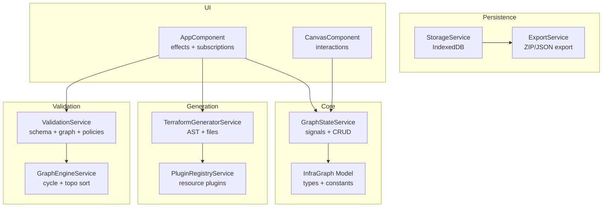
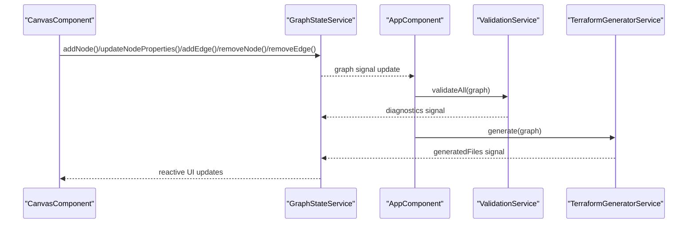
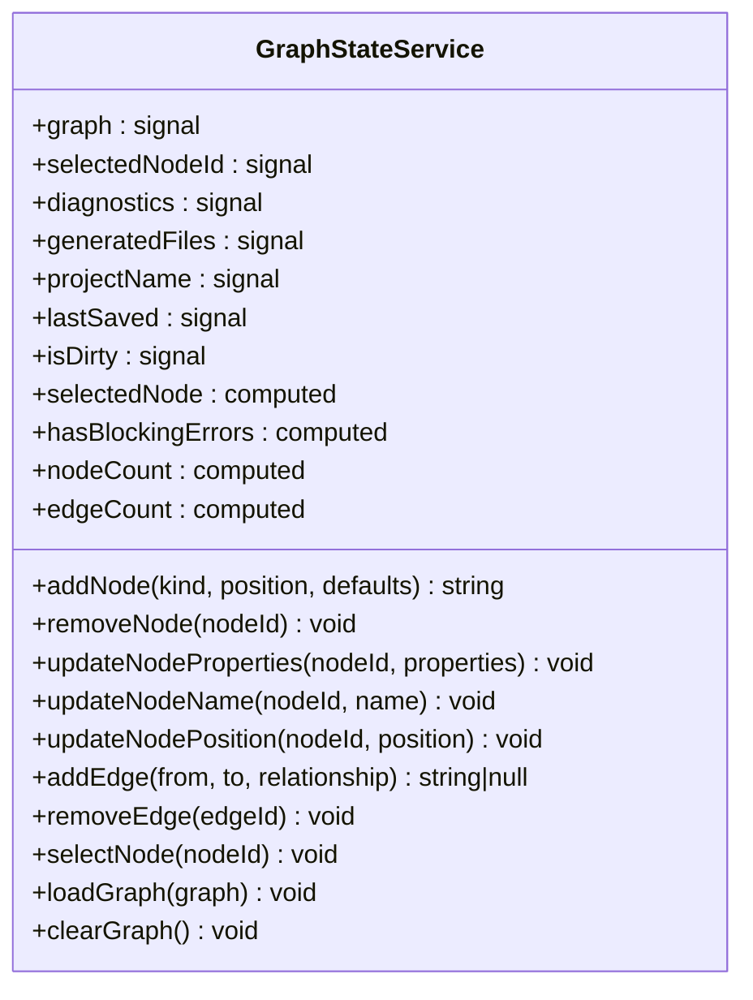
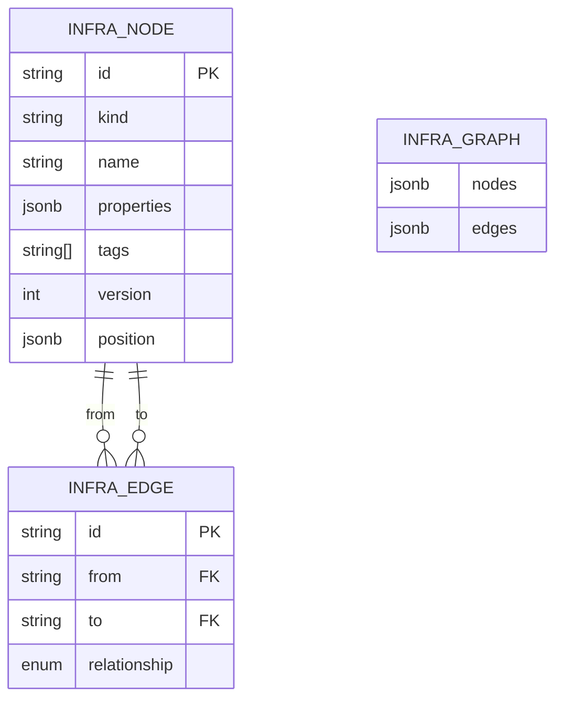
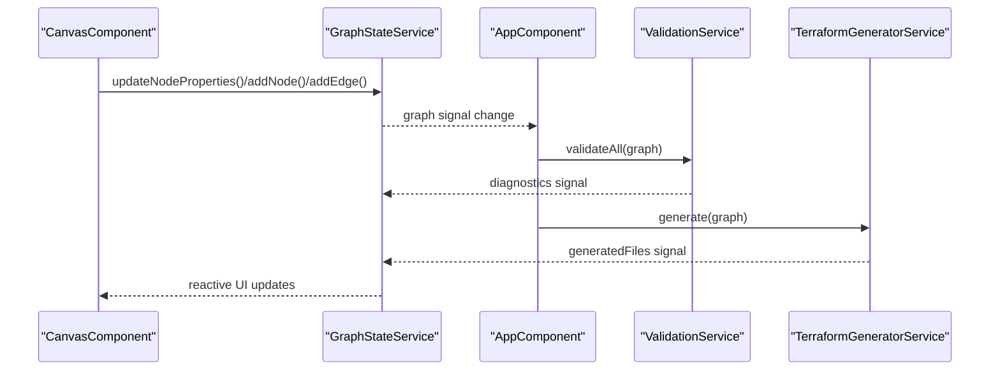
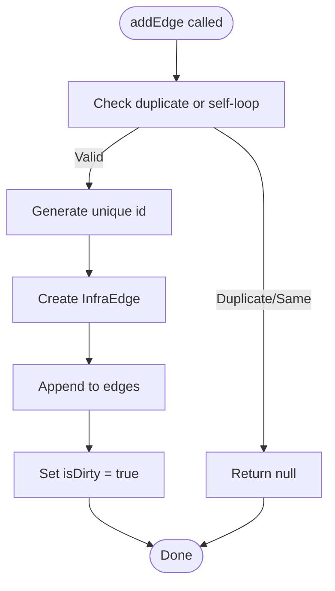
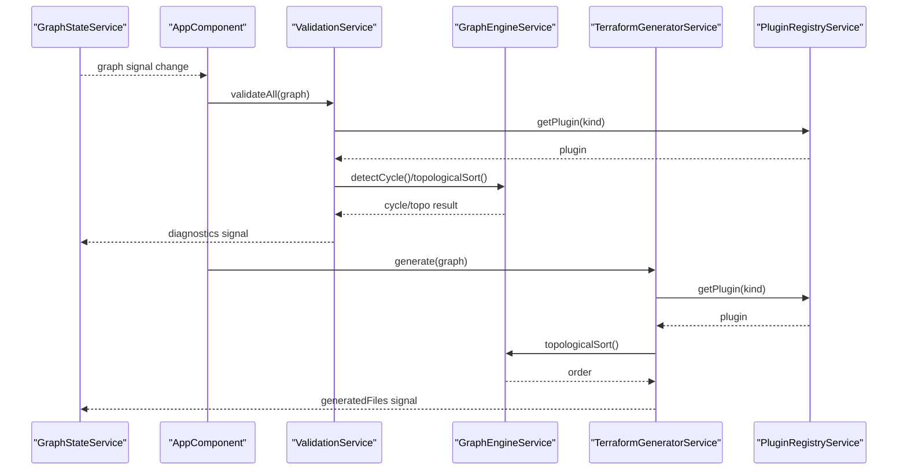
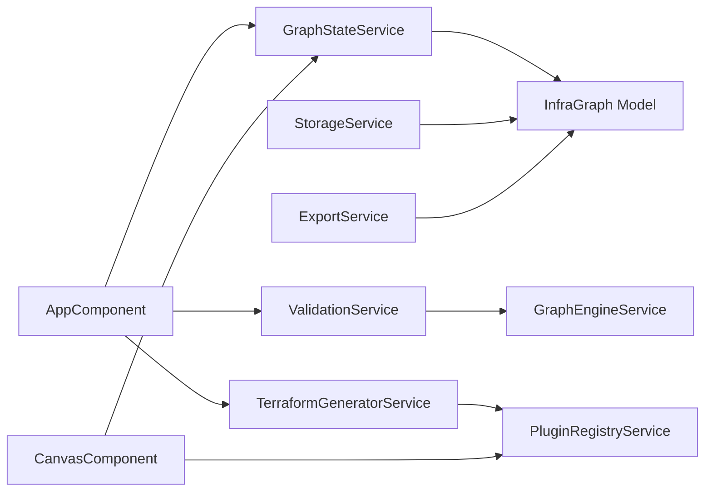

# GraphStateService

<cite>
**Referenced Files in This Document**
- [graph-state.service.ts](file://src/app/core/services/graph-state.service.ts)
- [infra-graph.model.ts](file://src/app/core/models/infra-graph.model.ts)
- [validation.service.ts](file://src/app/validation/validation.service.ts)
- [terraform-generator.service.ts](file://src/app/terraform-engine/terraform-generator.service.ts)
- [graph-engine.service.ts](file://src/app/graph-engine/graph-engine.service.ts)
- [storage.service.ts](file://src/app/storage/storage.service.ts)
- [export.service.ts](file://src/app/storage/export.service.ts)
- [canvas.component.ts](file://src/app/canvas/canvas.component.ts)
- [plugin-registry.service.ts](file://src/app/infra/plugin-registry.service.ts)
- [compute-network.plugin.ts](file://src/app/infra/plugins/compute-network.plugin.ts)
- [compute-instance.plugin.ts](file://src/app/infra/plugins/compute-instance.plugin.ts)
- [resource-plugin.model.ts](file://src/app/core/models/resource-plugin.model.ts)
- [app.component.ts](file://src/app/layout/app.component.ts)
- [SYSTEM_DESIGN.md](file://SYSTEM_DESIGN.md)
</cite>

## Table of Contents
1. [Introduction](#introduction)
2. [Project Structure](#project-structure)
3. [Core Components](#core-components)
4. [Architecture Overview](#architecture-overview)
5. [Detailed Component Analysis](#detailed-component-analysis)
6. [Dependency Analysis](#dependency-analysis)
7. [Performance Considerations](#performance-considerations)
8. [Troubleshooting Guide](#troubleshooting-guide)
9. [Conclusion](#conclusion)
10. [Appendices](#appendices)

## Introduction
This document provides comprehensive documentation for the GraphStateService, the central state management component of CloudCanvas-TF. It explains the signal-based reactive state architecture, canonical graph representation, node positioning, edge creation and validation, and state persistence mechanisms. It also covers reactive update patterns, subscription management, state synchronization across components, and the service’s coordination with validation and Terraform generation. Practical examples of state mutations, batch operations, and state restoration are included, along with performance considerations, memory management, and state consistency patterns.

## Project Structure
The GraphStateService resides in the core services layer and collaborates with validation, Terraform generation, graph engine, storage, and UI components. The canonical data model defines InfraGraph, InfraNode, InfraEdge, and related types. Plugins encapsulate resource-specific validation and Terraform generation logic.

**Diagram sources**
- [graph-state.service.ts](file://src/app/core/services/graph-state.service.ts#L1-L147)
- [infra-graph.model.ts](file://src/app/core/models/infra-graph.model.ts#L1-L118)
- [validation.service.ts](file://src/app/validation/validation.service.ts#L1-L107)
- [terraform-generator.service.ts](file://src/app/terraform-engine/terraform-generator.service.ts#L1-L234)
- [graph-engine.service.ts](file://src/app/graph-engine/graph-engine.service.ts#L1-L127)
- [storage.service.ts](file://src/app/storage/storage.service.ts#L1-L85)
- [export.service.ts](file://src/app/storage/export.service.ts#L1-L203)
- [canvas.component.ts](file://src/app/canvas/canvas.component.ts#L1-L286)
- [app.component.ts](file://src/app/layout/app.component.ts#L1-L48)

**Section sources**
- [graph-state.service.ts](file://src/app/core/services/graph-state.service.ts#L1-L147)
- [infra-graph.model.ts](file://src/app/core/models/infra-graph.model.ts#L1-L118)
- [SYSTEM_DESIGN.md](file://SYSTEM_DESIGN.md#L233-L382)

## Core Components
- GraphStateService: Canonical state container with Angular signals for graph, selection, diagnostics, generated files, project metadata, and dirty flag. Provides CRUD operations for nodes and edges, and state restoration utilities.
- InfraGraph Model: Defines ResourceKind, ResourceCategory, InfraNode, InfraEdge, Diagnostic, TerraformBlock, GeneratedFile, ProjectData, and related constants and mappings.
- ValidationService: Orchestrates schema, graph, and policy validations using plugins and the graph engine.
- TerraformGeneratorService: Generates Terraform files from the canonical graph using plugins and graph engine ordering.
- GraphEngineService: Implements cycle detection and topological sorting for dependency-aware ordering.
- StorageService and ExportService: Persist and export projects using IndexedDB and synchronous ZIP creation.
- CanvasComponent and AppComponent: UI integrations that mutate state and subscribe to reactive updates.

**Section sources**
- [graph-state.service.ts](file://src/app/core/services/graph-state.service.ts#L1-L147)
- [infra-graph.model.ts](file://src/app/core/models/infra-graph.model.ts#L1-L118)
- [validation.service.ts](file://src/app/validation/validation.service.ts#L1-L107)
- [terraform-generator.service.ts](file://src/app/terraform-engine/terraform-generator.service.ts#L1-L234)
- [graph-engine.service.ts](file://src/app/graph-engine/graph-engine.service.ts#L1-L127)
- [storage.service.ts](file://src/app/storage/storage.service.ts#L1-L85)
- [export.service.ts](file://src/app/storage/export.service.ts#L1-L203)
- [canvas.component.ts](file://src/app/canvas/canvas.component.ts#L1-L286)
- [app.component.ts](file://src/app/layout/app.component.ts#L1-L48)

## Architecture Overview
The GraphStateService is the single source of truth for the canonical InfraGraph. UI components subscribe to signals and call service methods to mutate state. Reactive effects in the application orchestrate validation and Terraform generation whenever the graph changes.

**Diagram sources**
- [canvas.component.ts](file://src/app/canvas/canvas.component.ts#L1-L286)
- [graph-state.service.ts](file://src/app/core/services/graph-state.service.ts#L1-L147)
- [app.component.ts](file://src/app/layout/app.component.ts#L1-L48)
- [validation.service.ts](file://src/app/validation/validation.service.ts#L1-L107)
- [terraform-generator.service.ts](file://src/app/terraform-engine/terraform-generator.service.ts#L1-L234)

## Detailed Component Analysis

### GraphStateService: Signal-Based Reactive State
- Canonical graph: a signal holding nodes and edges.
- Selection: selectedNodeId signal and a computed selectedNode derived from the graph.
- Diagnostics and generated files: signals updated reactively by the application effect.
- Dirty tracking: isDirty toggled on mutations to coordinate persistence and UX.
- Computed metrics: nodeCount and edgeCount for UI and analytics.

Key mutation APIs:
- addNode(kind, position, defaults): creates a unique node id, computes a logical name, and appends to nodes. Marks dirty.
- removeNode(nodeId): removes node and incident edges; clears selection if needed; marks dirty.
- updateNodeProperties(nodeId, properties): merges properties and increments version; marks dirty.
- updateNodeName(nodeId, name): updates logical name; marks dirty.
- updateNodePosition(nodeId, position): updates SVG coordinates; does not mark dirty.
- addEdge(from, to, relationship): validates uniqueness and self-loops; creates unique id; marks dirty.
- removeEdge(edgeId): removes edge; marks dirty.
- selectNode(nodeId): updates selection.
- loadGraph(graph): replaces graph, clears selection, resets dirty.
- clearGraph(): resets graph, selection, diagnostics, generated files, and dirty.

Reactive subscriptions:
- AppComponent registers an effect that reads graph(), runs validation and generation, and writes diagnostics and generatedFiles signals.

State consistency:
- All mutations use immutable updates via signal.update() to ensure Angular Signals’ change detection triggers.
- Version increments on property updates enable downstream caches to refresh when content changes.

**Section sources**
- [graph-state.service.ts](file://src/app/core/services/graph-state.service.ts#L1-L147)
- [app.component.ts](file://src/app/layout/app.component.ts#L1-L48)

#### Class Diagram: GraphStateService

**Diagram sources**
- [graph-state.service.ts](file://src/app/core/services/graph-state.service.ts#L1-L147)

### Canonical Graph Representation
- InfraNode: id, kind, name, properties, optional tags, version, position.
- InfraEdge: id, from, to, relationship.
- InfraGraph: nodes[], edges[].
- ResourceKind and ResourceCategory enumerate supported GCP resources and categories.
- Constants: RESOURCE_CATEGORIES and RESOURCE_ICONS map kinds to UI metadata.

Node positioning:
- Nodes carry x/y coordinates for SVG rendering. CanvasComponent translates mouse events to SVG coordinates and updates positions via GraphStateService.

Edge semantics:
- Relationship types include depends_on, network_attachment, contains. ValidationService enforces graph-level constraints.

**Section sources**
- [infra-graph.model.ts](file://src/app/core/models/infra-graph.model.ts#L1-L118)
- [canvas.component.ts](file://src/app/canvas/canvas.component.ts#L1-L286)

#### Data Model Diagram

**Diagram sources**
- [infra-graph.model.ts](file://src/app/core/models/infra-graph.model.ts#L17-L39)

### Reactive Update Patterns and Subscription Management
- Angular Signals drive reactivity. GraphStateService exposes writable signals for graph, selection, diagnostics, generated files, project metadata, and dirty flag.
- AppComponent registers an effect that:
  - Reads the current graph.
  - Invokes ValidationService.validateAll(graph) and assigns results to diagnostics.
  - Invokes TerraformGeneratorService.generate(graph) and assigns results to generatedFiles.
- UI components subscribe to signals via computed() and direct signal reads to render and respond to changes.

Subscription lifecycle:
- Effects are established at component initialization and live for the app lifetime.
- Signals are garbage collected when no subscribers remain; however, root-provided services persist for the app lifecycle.

**Section sources**
- [app.component.ts](file://src/app/layout/app.component.ts#L1-L48)
- [graph-state.service.ts](file://src/app/core/services/graph-state.service.ts#L1-L147)

#### Sequence Diagram: Reactive Update Flow

**Diagram sources**
- [canvas.component.ts](file://src/app/canvas/canvas.component.ts#L1-L286)
- [graph-state.service.ts](file://src/app/core/services/graph-state.service.ts#L1-L147)
- [app.component.ts](file://src/app/layout/app.component.ts#L1-L48)
- [validation.service.ts](file://src/app/validation/validation.service.ts#L1-L107)
- [terraform-generator.service.ts](file://src/app/terraform-engine/terraform-generator.service.ts#L1-L234)

### CRUD Operations: Nodes and Edges
- Node creation:
  - Generates unique id and logical name from kind and count.
  - Initializes version and position.
  - Appends to nodes; marks dirty.
- Node deletion:
  - Removes node and all incident edges.
  - Clears selection if the deleted node was selected.
  - Marks dirty.
- Node property updates:
  - Merges provided properties into existing ones.
  - Increments version to trigger downstream recomputation.
  - Marks dirty.
- Node name and position updates:
  - Updates logical name and SVG coordinates.
  - Position updates do not mark dirty to avoid excessive persistence triggers.
- Edge creation:
  - Prevents duplicates and self-loops.
  - Generates unique id and appends to edges; marks dirty.
- Edge deletion:
  - Removes specific edge by id; marks dirty.

Batch operations:
- Batch mutations can be composed by invoking multiple methods; each mutation marks dirty independently. For heavy batch scenarios, consider debouncing persistence and grouping UI updates.

State restoration:
- loadGraph(graph): replaces current graph, clears selection, and resets dirty flag.
- clearGraph(): resets to empty state and clears diagnostics and generated files.

**Section sources**
- [graph-state.service.ts](file://src/app/core/services/graph-state.service.ts#L39-L145)

### Automatic Dirty State Tracking
- isDirty is set to true on add/remove/update operations that alter the canonical graph.
- isDirty is reset to false during loadGraph() and clearGraph().
- UI and persistence layers can use isDirty to decide whether to prompt unsaved changes or trigger auto-save.

**Section sources**
- [graph-state.service.ts](file://src/app/core/services/graph-state.service.ts#L20-L20)
- [graph-state.service.ts](file://src/app/core/services/graph-state.service.ts#L58-L58)
- [graph-state.service.ts](file://src/app/core/services/graph-state.service.ts#L67-L67)
- [graph-state.service.ts](file://src/app/core/services/graph-state.service.ts#L82-L82)
- [graph-state.service.ts](file://src/app/core/services/graph-state.service.ts#L117-L117)
- [graph-state.service.ts](file://src/app/core/services/graph-state.service.ts#L136-L136)
- [graph-state.service.ts](file://src/app/core/services/graph-state.service.ts#L144-L144)

### Edge Creation and Validation
- Edge creation:
  - Validates uniqueness and self-loops.
  - Assigns unique id and relationship type.
- GraphEngineService:
  - Provides cycle detection and topological sort used by generators.
- ValidationService:
  - Detects dangling edges and duplicate names.
  - Checks for circular dependencies and missing node references.

**Section sources**
- [graph-state.service.ts](file://src/app/core/services/graph-state.service.ts#L104-L119)
- [graph-engine.service.ts](file://src/app/graph-engine/graph-engine.service.ts#L27-L63)
- [validation.service.ts](file://src/app/validation/validation.service.ts#L41-L81)

#### Flowchart: Edge Creation Validation

**Diagram sources**
- [graph-state.service.ts](file://src/app/core/services/graph-state.service.ts#L104-L119)

### State Persistence Mechanisms
- StorageService:
  - IndexedDB-backed persistence with a single object store keyed by project name.
  - Provides saveProject, loadProject, listProjects, and deleteProject.
  - Builds ProjectData with schemaVersion, graph, and metadata.
- ExportService:
  - Generates Terraform files and exports as ZIP or JSON.
  - Synchronous ZIP creation preserves user gesture context for downloads.
  - Supports full bundle export combining Terraform files and project JSON.

Integration:
- GraphStateService does not directly persist; it coordinates with StorageService and ExportService through higher-level components and workflows.

**Section sources**
- [storage.service.ts](file://src/app/storage/storage.service.ts#L1-L85)
- [export.service.ts](file://src/app/storage/export.service.ts#L1-L203)

### Coordination with Validation and Terraform Generation
- ValidationService:
  - Runs schema validation per node via plugins.
  - Performs graph-level checks (cycles, dangling edges, duplicate names).
  - Applies policy advisories (e.g., subnet without VPC).
- TerraformGeneratorService:
  - Uses GraphEngineService for topological ordering.
  - Iterates nodes in dependency order and aggregates Terraform blocks via plugins.
  - Produces providers.tf, main.tf, variables.tf, outputs.tf, and a README.

**Section sources**
- [validation.service.ts](file://src/app/validation/validation.service.ts#L14-L20)
- [terraform-generator.service.ts](file://src/app/terraform-engine/terraform-generator.service.ts#L16-L51)
- [graph-engine.service.ts](file://src/app/graph-engine/graph-engine.service.ts#L65-L110)

#### Sequence Diagram: Validation and Generation

**Diagram sources**
- [app.component.ts](file://src/app/layout/app.component.ts#L33-L41)
- [validation.service.ts](file://src/app/validation/validation.service.ts#L14-L20)
- [terraform-generator.service.ts](file://src/app/terraform-engine/terraform-generator.service.ts#L16-L51)
- [graph-engine.service.ts](file://src/app/graph-engine/graph-engine.service.ts#L65-L110)
- [plugin-registry.service.ts](file://src/app/infra/plugin-registry.service.ts#L1-L73)

### Practical Examples

- State mutation example: Adding a node and connecting it to another node
  - Steps: addNode(kind, position, defaults) → addEdge(fromId, toId, relationship) → observe diagnostics and generatedFiles updates.
  - References: [graph-state.service.ts](file://src/app/core/services/graph-state.service.ts#L39-L60), [graph-state.service.ts](file://src/app/core/services/graph-state.service.ts#L104-L119)

- Batch operation example: Moving multiple nodes and updating properties
  - Steps: updateNodePosition(nodeId, newPosition) for several nodes → updateNodeProperties(nodeId, updates) for several nodes → observe reactive UI updates.
  - References: [graph-state.service.ts](file://src/app/core/services/graph-state.service.ts#L95-L102), [graph-state.service.ts](file://src/app/core/services/graph-state.service.ts#L73-L83)

- State restoration example: Loading a project
  - Steps: loadProject(name) → StorageService retrieves ProjectData → ExportService.importProjectJson(file) parses → GraphStateService.loadGraph(projectData.graph) → AppComponent recomputes diagnostics and generated files.
  - References: [storage.service.ts](file://src/app/storage/storage.service.ts#L40-L48), [export.service.ts](file://src/app/storage/export.service.ts#L61-L79), [graph-state.service.ts](file://src/app/core/services/graph-state.service.ts#L133-L137), [app.component.ts](file://src/app/layout/app.component.ts#L33-L41)

- State synchronization across components:
  - CanvasComponent subscribes to graph signals and reacts to selection changes.
  - AppComponent orchestrates validation and generation on every graph change.
  - References: [canvas.component.ts](file://src/app/canvas/canvas.component.ts#L34-L41), [app.component.ts](file://src/app/layout/app.component.ts#L33-L41)

**Section sources**
- [graph-state.service.ts](file://src/app/core/services/graph-state.service.ts#L39-L137)
- [canvas.component.ts](file://src/app/canvas/canvas.component.ts#L34-L41)
- [app.component.ts](file://src/app/layout/app.component.ts#L33-L41)
- [storage.service.ts](file://src/app/storage/storage.service.ts#L40-L48)
- [export.service.ts](file://src/app/storage/export.service.ts#L61-L79)

## Dependency Analysis
- GraphStateService depends on InfraGraph model types and Angular Signals.
- AppComponent depends on GraphStateService, ValidationService, and TerraformGeneratorService to orchestrate reactive updates.
- ValidationService depends on PluginRegistryService and GraphEngineService.
- TerraformGeneratorService depends on PluginRegistryService and GraphEngineService.
- CanvasComponent depends on GraphStateService and PluginRegistryService for rendering and interactions.
- StorageService and ExportService depend on InfraGraph model types and project data structures.

**Diagram sources**
- [graph-state.service.ts](file://src/app/core/services/graph-state.service.ts#L1-L147)
- [infra-graph.model.ts](file://src/app/core/models/infra-graph.model.ts#L1-L118)
- [app.component.ts](file://src/app/layout/app.component.ts#L1-L48)
- [validation.service.ts](file://src/app/validation/validation.service.ts#L1-L107)
- [terraform-generator.service.ts](file://src/app/terraform-engine/terraform-generator.service.ts#L1-L234)
- [graph-engine.service.ts](file://src/app/graph-engine/graph-engine.service.ts#L1-L127)
- [canvas.component.ts](file://src/app/canvas/canvas.component.ts#L1-L286)
- [plugin-registry.service.ts](file://src/app/infra/plugin-registry.service.ts#L1-L73)
- [storage.service.ts](file://src/app/storage/storage.service.ts#L1-L85)
- [export.service.ts](file://src/app/storage/export.service.ts#L1-L203)

**Section sources**
- [graph-state.service.ts](file://src/app/core/services/graph-state.service.ts#L1-L147)
- [app.component.ts](file://src/app/layout/app.component.ts#L1-L48)
- [validation.service.ts](file://src/app/validation/validation.service.ts#L1-L107)
- [terraform-generator.service.ts](file://src/app/terraform-engine/terraform-generator.service.ts#L1-L234)
- [graph-engine.service.ts](file://src/app/graph-engine/graph-engine.service.ts#L1-L127)
- [canvas.component.ts](file://src/app/canvas/canvas.component.ts#L1-L286)
- [plugin-registry.service.ts](file://src/app/infra/plugin-registry.service.ts#L1-L73)
- [storage.service.ts](file://src/app/storage/storage.service.ts#L1-L85)
- [export.service.ts](file://src/app/storage/export.service.ts#L1-L203)

## Performance Considerations
- Signal-based immutability ensures efficient change detection and minimal re-rendering.
- Debounce expensive operations (validation, generation) using Angular Signals’ reactive pipeline or external debouncing to avoid thrashing on rapid successive mutations.
- Prefer batch updates where possible to reduce redundant computations.
- Use GraphEngineService’s topological sort to ensure deterministic, dependency-aware ordering for generation.
- For large graphs, consider viewport culling and lazy evaluation in UI components.
- Avoid marking dirty on frequent position updates; only persist when necessary.

[No sources needed since this section provides general guidance]

## Troubleshooting Guide
Common issues and resolutions:
- Circular dependencies detected:
  - Cause: addEdge creates a cycle.
  - Resolution: Remove or rewire edges to eliminate cycles; ValidationService reports cycle diagnostics.
  - References: [validation.service.ts](file://src/app/validation/validation.service.ts#L41-L51), [graph-engine.service.ts](file://src/app/graph-engine/graph-engine.service.ts#L27-L63)

- Duplicate resource names:
  - Cause: Multiple nodes share the same kind:name combination.
  - Resolution: Change node names to be unique within kind.
  - References: [validation.service.ts](file://src/app/validation/validation.service.ts#L67-L78)

- Dangling edges:
  - Cause: Edge references missing node ids.
  - Resolution: Ensure both from and to nodes exist before adding edges.
  - References: [validation.service.ts](file://src/app/validation/validation.service.ts#L53-L65)

- Export failures:
  - Cause: Generator exceptions or invalid graph state.
  - Resolution: Inspect diagnostics; fix validation errors; retry export.
  - References: [export.service.ts](file://src/app/storage/export.service.ts#L18-L28), [app.component.ts](file://src/app/layout/app.component.ts#L33-L41)

- Persistence issues:
  - Cause: IndexedDB quota exceeded or transaction errors.
  - Resolution: Clear old projects; handle errors gracefully; retry.
  - References: [storage.service.ts](file://src/app/storage/storage.service.ts#L30-L38), [storage.service.ts](file://src/app/storage/storage.service.ts#L60-L68)

**Section sources**
- [validation.service.ts](file://src/app/validation/validation.service.ts#L41-L81)
- [graph-engine.service.ts](file://src/app/graph-engine/graph-engine.service.ts#L27-L63)
- [export.service.ts](file://src/app/storage/export.service.ts#L18-L28)
- [storage.service.ts](file://src/app/storage/storage.service.ts#L30-L38)
- [storage.service.ts](file://src/app/storage/storage.service.ts#L60-L68)
- [app.component.ts](file://src/app/layout/app.component.ts#L33-L41)

## Conclusion
GraphStateService is the backbone of CloudCanvas-TF’s reactive state management. Its signal-based design, canonical graph representation, and tight integration with validation and generation services enable a responsive, deterministic, and extensible architecture. By leveraging Angular Signals, plugin-based resource logic, and robust persistence/export workflows, the system delivers a powerful visual modeling experience with clean, editable Terraform outputs.

[No sources needed since this section summarizes without analyzing specific files]

## Appendices

### Example Plugin Integrations
- ComputeNetworkPlugin demonstrates schema definition, defaults, validation, and Terraform block generation.
- ComputeInstancePlugin illustrates edge suggestions and reference generation via GeneratorContext.

**Section sources**
- [compute-network.plugin.ts](file://src/app/infra/plugins/compute-network.plugin.ts#L1-L129)
- [compute-instance.plugin.ts](file://src/app/infra/plugins/compute-instance.plugin.ts#L1-L128)
- [resource-plugin.model.ts](file://src/app/core/models/resource-plugin.model.ts#L1-L55)