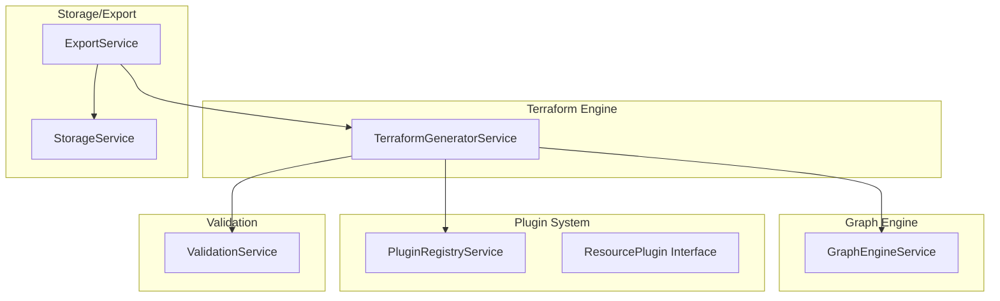
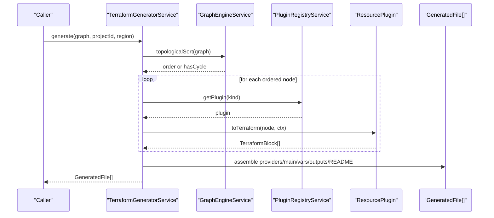
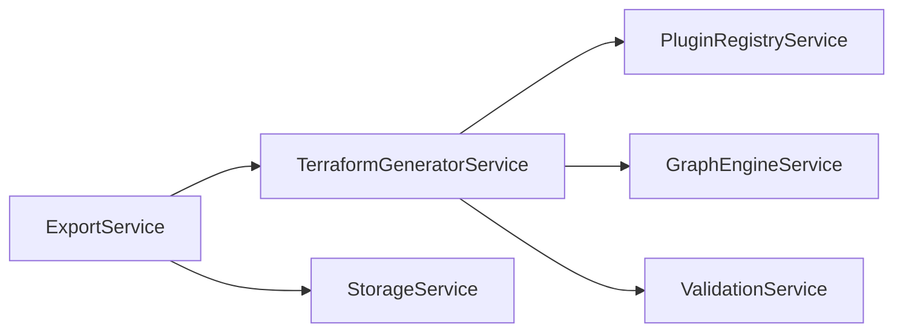

# TerraformGeneratorService

<cite>
**Referenced Files in This Document**
- [terraform-generator.service.ts](file://src/app/terraform-engine/terraform-generator.service.ts)
- [graph-engine.service.ts](file://src/app/graph-engine/graph-engine.service.ts)
- [validation.service.ts](file://src/app/validation/validation.service.ts)
- [plugin-registry.service.ts](file://src/app/infra/plugin-registry.service.ts)
- [resource-plugin.model.ts](file://src/app/core/models/resource-plugin.model.ts)
- [infra-graph.model.ts](file://src/app/core/models/infra-graph.model.ts)
- [export.service.ts](file://src/app/storage/export.service.ts)
- [storage.service.ts](file://src/app/storage/storage.service.ts)
- [compute-instance.plugin.ts](file://src/app/infra/plugins/compute-instance.plugin.ts)
- [storage-bucket.plugin.ts](file://src/app/infra/plugins/storage-bucket.plugin.ts)
- [compute-network.plugin.ts](file://src/app/infra/plugins/compute-network.plugin.ts)
- [container-cluster.plugin.ts](file://src/app/infra/plugins/container-cluster.plugin.ts)
- [SYSTEM_DESIGN.md](file://SYSTEM_DESIGN.md)
</cite>

## Table of Contents
1. [Introduction](#introduction)
2. [Project Structure](#project-structure)
3. [Core Components](#core-components)
4. [Architecture Overview](#architecture-overview)
5. [Detailed Component Analysis](#detailed-component-analysis)
6. [Dependency Analysis](#dependency-analysis)
7. [Performance Considerations](#performance-considerations)
8. [Troubleshooting Guide](#troubleshooting-guide)
9. [Conclusion](#conclusion)
10. [Appendices](#appendices)

## Introduction
This document describes the TerraformGeneratorService, the AST-first engine responsible for generating Terraform configurations from a visual infrastructure graph. It explains how the service orchestrates plugin-based resource generation, manages provider configuration, preserves HCL structure, and organizes multi-file output. It also documents integration with the graph engine for dependency resolution, validation results for conditional generation, and the plugin system that encapsulates resource-specific logic.

## Project Structure
The TerraformGeneratorService resides in the terraform-engine module and collaborates with:
- Graph engine for dependency ordering
- Plugin registry for resource-specific generation
- Validation service for preconditions
- Storage/export services for packaging and distribution



**Diagram sources**
- [terraform-generator.service.ts](file://src/app/terraform-engine/terraform-generator.service.ts#L10-L51)
- [graph-engine.service.ts](file://src/app/graph-engine/graph-engine.service.ts#L11-L110)
- [plugin-registry.service.ts](file://src/app/infra/plugin-registry.service.ts#L18-L54)
- [resource-plugin.model.ts](file://src/app/core/models/resource-plugin.model.ts#L43-L54)
- [validation.service.ts](file://src/app/validation/validation.service.ts#L8-L20)
- [export.service.ts](file://src/app/storage/export.service.ts#L7-L28)
- [storage.service.ts](file://src/app/storage/storage.service.ts#L9-L38)

**Section sources**
- [SYSTEM_DESIGN.md](file://SYSTEM_DESIGN.md#L233-L262)
- [terraform-generator.service.ts](file://src/app/terraform-engine/terraform-generator.service.ts#L1-L51)

## Core Components
- TerraformGeneratorService: Orchestrates generation from InfraGraph to GeneratedFile[] using plugins and graph ordering.
- GraphEngineService: Provides topological sorting and cycle detection to ensure deterministic, dependency-aware ordering.
- PluginRegistryService: Registers and retrieves resource plugins by kind.
- ResourcePlugin: Defines the contract for schema, defaults, validation, and Terraform block generation.
- ValidationService: Validates schema, graph integrity, and policy advisories.
- ExportService: Packages GeneratedFile[] into ZIP archives and triggers downloads.
- StorageService: Builds project data for persistence and export bundles.

**Section sources**
- [terraform-generator.service.ts](file://src/app/terraform-engine/terraform-generator.service.ts#L10-L51)
- [graph-engine.service.ts](file://src/app/graph-engine/graph-engine.service.ts#L11-L110)
- [plugin-registry.service.ts](file://src/app/infra/plugin-registry.service.ts#L18-L54)
- [resource-plugin.model.ts](file://src/app/core/models/resource-plugin.model.ts#L43-L54)
- [validation.service.ts](file://src/app/validation/validation.service.ts#L8-L20)
- [export.service.ts](file://src/app/storage/export.service.ts#L7-L28)
- [storage.service.ts](file://src/app/storage/storage.service.ts#L70-L83)

## Architecture Overview
The generation pipeline follows an AST-first approach:
1. Canonical InfraGraph is normalized and validated.
2. GraphEngineService computes a dependency-aware order (topological sort) or detects cycles.
3. PluginRegistryService resolves a ResourcePlugin for each node.
4. Each plugin generates TerraformBlock instances representing AST nodes.
5. The generator aggregates blocks and writes multi-file outputs: providers.tf, main.tf, variables.tf, outputs.tf, and a README.



**Diagram sources**
- [terraform-generator.service.ts](file://src/app/terraform-engine/terraform-generator.service.ts#L16-L51)
- [graph-engine.service.ts](file://src/app/graph-engine/graph-engine.service.ts#L65-L110)
- [plugin-registry.service.ts](file://src/app/infra/plugin-registry.service.ts#L48-L50)
- [resource-plugin.model.ts](file://src/app/core/models/resource-plugin.model.ts#L51-L53)

## Detailed Component Analysis

### TerraformGeneratorService
Responsibilities:
- Build a nodeMap for reference resolution.
- Compute topological order via GraphEngineService.
- Iterate nodes in order, invoking plugins to produce TerraformBlock arrays.
- Serialize blocks into HCL and organize into GeneratedFile[].

Key behaviors:
- Providers file: pinned terraform block and provider block with variables.
- Main file: resource blocks in deterministic order; falls back to a note when no resources.
- Variables file: project_id and region variables.
- Outputs file: per-resource outputs derived from block names.
- README: lists generated resources and quick-start commands.

AST serialization:
- serializeBlock: resource blocks with sorted attributes and nested blocks.
- serializeNestedBlock: specialized handling for boot_disk, network_interface, versioning, and generic nested blocks.
- serializeValue: handles strings, numbers, booleans, arrays, and references.

Integration points:
- Uses GeneratorContext.getNodeReference to construct ${kind.name.attr} references.
- Leverages PluginRegistryService.getPlugin to dispatch generation.
- Delegates multi-file assembly to dedicated private methods.

**Section sources**
- [terraform-generator.service.ts](file://src/app/terraform-engine/terraform-generator.service.ts#L16-L51)
- [terraform-generator.service.ts](file://src/app/terraform-engine/terraform-generator.service.ts#L53-L154)
- [terraform-generator.service.ts](file://src/app/terraform-engine/terraform-generator.service.ts#L156-L232)

#### Class Diagram: Generator and Context
```mermaid
classDiagram
class TerraformGeneratorService {
+generate(graph, projectId, region) GeneratedFile[]
-generateProvidersFile(projectId, region) GeneratedFile
-generateMainFile(blocks) GeneratedFile
-generateVariablesFile(projectId, region) GeneratedFile
-generateOutputsFile(blocks) GeneratedFile
-generateReadme(graph) GeneratedFile
-serializeBlock(block) string
-serializeNestedBlock(nested) string[]
-serializeValue(val) string
}
class GraphEngineService {
+topologicalSort(graph) TopologicalResult
+detectCycle(graph) { hasCycle; cycleNodes }
}
class PluginRegistryService {
+getPlugin(kind) ResourcePlugin
+getAllPlugins() ResourcePlugin[]
}
class GeneratorContext {
+graph InfraGraph
+nodeMap Map<string, InfraNode>
+getNodeReference(nodeId, attribute) string
}
TerraformGeneratorService --> GraphEngineService : "orders nodes"
TerraformGeneratorService --> PluginRegistryService : "dispatches plugins"
TerraformGeneratorService --> GeneratorContext : "builds"
```

**Diagram sources**
- [terraform-generator.service.ts](file://src/app/terraform-engine/terraform-generator.service.ts#L10-L51)
- [graph-engine.service.ts](file://src/app/graph-engine/graph-engine.service.ts#L11-L110)
- [plugin-registry.service.ts](file://src/app/infra/plugin-registry.service.ts#L18-L54)
- [resource-plugin.model.ts](file://src/app/core/models/resource-plugin.model.ts#L37-L41)

### GraphEngineService
Responsibilities:
- Build adjacency map from edges.
- Detect cycles using DFS with white/gray/black coloring.
- Compute topological order using Kahn’s algorithm with ID-based tie-breaking for determinism.

Impact on generation:
- If a cycle is detected, the generator falls back to iterating nodes in original order.
- Otherwise, nodes are processed in dependency-aware order to ensure HCL readability and stable diffs.

**Section sources**
- [graph-engine.service.ts](file://src/app/graph-engine/graph-engine.service.ts#L13-L110)

### Plugin System and Resource Abstraction
The plugin system defines a contract for each resource:
- kind: Resource identifier.
- category: Used for grouping in UI.
- schema: JSON schema for dynamic forms.
- defaults(): Provides default property values.
- validate(): Validates node properties and graph context.
- toTerraform(): Produces TerraformBlock[] from InfraNode and GeneratorContext.
- suggestEdges?(): Suggests valid connections for UI hints.

Examples:
- ComputeInstancePlugin: Generates google_compute_instance with boot_disk and network_interface nested blocks; resolves subnet references via getNodeReference.
- StorageBucketPlugin: Generates google_storage_bucket with optional versioning nested block.
- ComputeNetworkPlugin: Generates VPC network with configurable attributes.
- ContainerClusterPlugin: Generates GKE cluster with optional VPC/subnetwork references.

**Section sources**
- [resource-plugin.model.ts](file://src/app/core/models/resource-plugin.model.ts#L43-L54)
- [compute-instance.plugin.ts](file://src/app/infra/plugins/compute-instance.plugin.ts#L82-L122)
- [storage-bucket.plugin.ts](file://src/app/infra/plugins/storage-bucket.plugin.ts#L83-L103)
- [compute-network.plugin.ts](file://src/app/infra/plugins/compute-network.plugin.ts#L101-L123)
- [container-cluster.plugin.ts](file://src/app/infra/plugins/container-cluster.plugin.ts#L93-L131)

### Validation Integration for Conditional Generation
ValidationService provides:
- Schema checks per node via plugin.validate.
- Graph integrity checks: cycles, dangling edges, duplicate names.
- Policy advisories: subnet without VPC, empty graph guidance.

These diagnostics inform whether generation should proceed and help guide users toward valid configurations. The generator does not depend on ValidationService for ordering but relies on its results to ensure correctness before export.

**Section sources**
- [validation.service.ts](file://src/app/validation/validation.service.ts#L14-L105)

### Multi-File Output Organization
The generator produces a deterministic set of files:
- providers.tf: terraform required_providers and provider block referencing variables.
- main.tf: resource blocks serialized in dependency order; empty note when no resources.
- variables.tf: project_id and region variables.
- outputs.tf: per-resource outputs named by cleaned resource names.
- README.generated.md: generated resource list and quick-start commands.

This structure aligns with the system design’s output conventions and export expectations.

**Section sources**
- [terraform-generator.service.ts](file://src/app/terraform-engine/terraform-generator.service.ts#L53-L154)
- [SYSTEM_DESIGN.md](file://SYSTEM_DESIGN.md#L428-L449)

### Export and Persistence Integration
ExportService:
- Invokes TerraformGeneratorService.generate to produce GeneratedFile[].
- Packages files into ZIP archives synchronously from user gestures.
- Supports full bundle exports including project.json alongside terraform files.

StorageService:
- Builds ProjectData for persistence and export bundles.
- Uses IndexedDB for local save/load.

**Section sources**
- [export.service.ts](file://src/app/storage/export.service.ts#L18-L59)
- [storage.service.ts](file://src/app/storage/storage.service.ts#L70-L83)

## Dependency Analysis
The generator depends on:
- PluginRegistryService for resource-specific logic.
- GraphEngineService for dependency ordering and cycle detection.
- ValidationService for preconditions (not for ordering).
- ExportService for packaging and StorageService for project metadata.



**Diagram sources**
- [terraform-generator.service.ts](file://src/app/terraform-engine/terraform-generator.service.ts#L11-L14)
- [export.service.ts](file://src/app/storage/export.service.ts#L8-L11)

**Section sources**
- [terraform-generator.service.ts](file://src/app/terraform-engine/terraform-generator.service.ts#L11-L14)
- [export.service.ts](file://src/app/storage/export.service.ts#L8-L11)

## Performance Considerations
- Topological sort and cycle detection are O(V+E) with adjacency maps and Kahn’s algorithm.
- Plugin generation scales linearly with node count; nested block serialization is proportional to attribute counts.
- Serialization uses deterministic sorting of keys to minimize diffs.
- ExportService creates ZIPs synchronously from user gestures to preserve browser download context.

[No sources needed since this section provides general guidance]

## Troubleshooting Guide
Common issues and resolutions:
- Circular dependencies: The graph engine detects cycles and the generator falls back to processing nodes in original order. Resolve by removing edges causing cycles.
- Unknown resource type: ValidationService reports UNKNOWN_RESOURCE diagnostics; ensure the plugin is registered for the node kind.
- Empty graph: ValidationService emits EMPTY_GRAPH info; add resources to the canvas.
- Missing referenced nodes: ValidationService reports DANGLING_EDGE diagnostics; ensure all referenced node IDs exist.
- Duplicate resource names: ValidationService reports DUPLICATE_NAME diagnostics; ensure unique names per resource kind.

**Section sources**
- [graph-engine.service.ts](file://src/app/graph-engine/graph-engine.service.ts#L27-L63)
- [validation.service.ts](file://src/app/validation/validation.service.ts#L41-L81)

## Conclusion
The TerraformGeneratorService implements a robust, AST-first generation pipeline that:
- Preserves HCL structure and determinism.
- Integrates tightly with the graph engine for dependency-aware ordering.
- Encapsulates resource-specific logic via a plugin contract.
- Produces multi-file outputs aligned with best practices for Terraform handoffs.
- Coordinates with validation and export/persistence layers to provide a complete workflow from design to delivery.

[No sources needed since this section summarizes without analyzing specific files]

## Appendices

### Example Generated Terraform Blocks (by plugin)
- Compute Instance: Generates a google_compute_instance with boot_disk and network_interface nested blocks; resolves subnet references via getNodeReference.
- Storage Bucket: Generates a google_storage_bucket with optional versioning nested block.
- VPC Network: Generates a google_compute_network with configurable attributes.
- GKE Cluster: Generates a google_container_cluster with optional VPC/subnetwork references.

**Section sources**
- [compute-instance.plugin.ts](file://src/app/infra/plugins/compute-instance.plugin.ts#L82-L122)
- [storage-bucket.plugin.ts](file://src/app/infra/plugins/storage-bucket.plugin.ts#L83-L103)
- [compute-network.plugin.ts](file://src/app/infra/plugins/compute-network.plugin.ts#L101-L123)
- [container-cluster.plugin.ts](file://src/app/infra/plugins/container-cluster.plugin.ts#L93-L131)

### Provider Setup Patterns
- providers.tf includes terraform required_providers and provider block referencing variables for project_id and region.
- variables.tf defines project_id and region variables with defaults.

**Section sources**
- [terraform-generator.service.ts](file://src/app/terraform-engine/terraform-generator.service.ts#L53-L108)

### File Structure Organization
- providers.tf: terraform and provider blocks.
- main.tf: resource blocks in dependency order.
- variables.tf: project_id and region variables.
- outputs.tf: per-resource outputs.
- README.generated.md: generated resource list and quick-start.

**Section sources**
- [terraform-generator.service.ts](file://src/app/terraform-engine/terraform-generator.service.ts#L53-L154)
- [SYSTEM_DESIGN.md](file://SYSTEM_DESIGN.md#L428-L449)