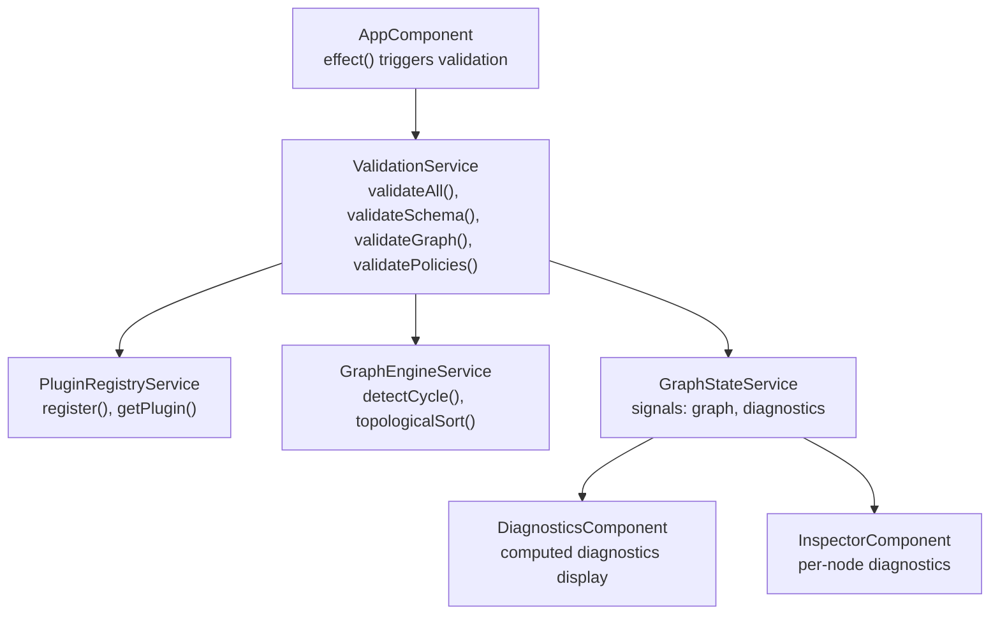
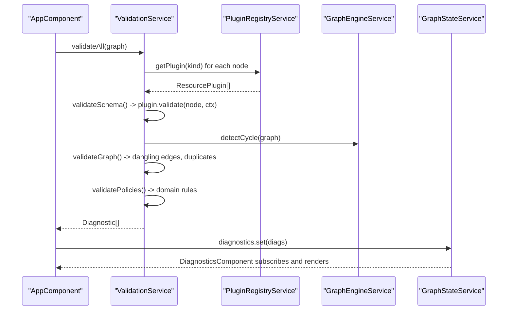
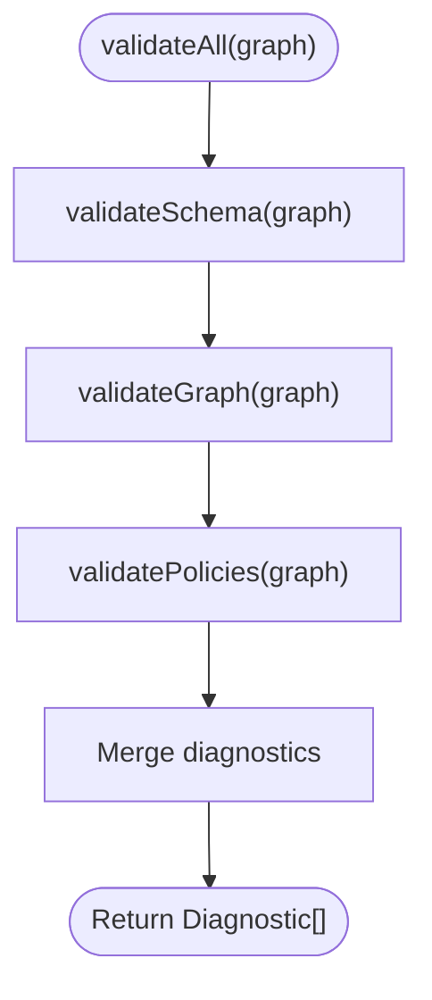
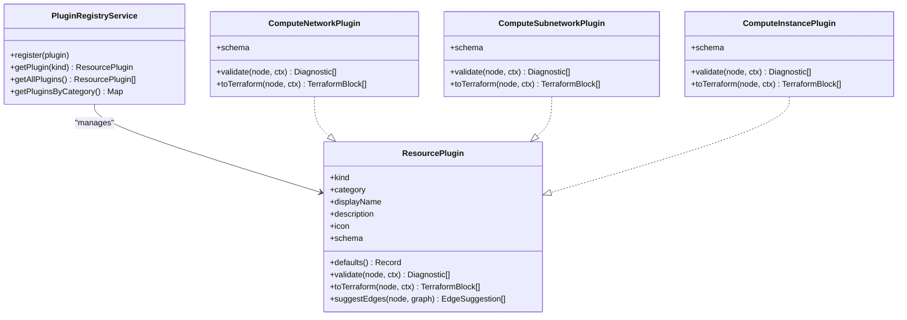
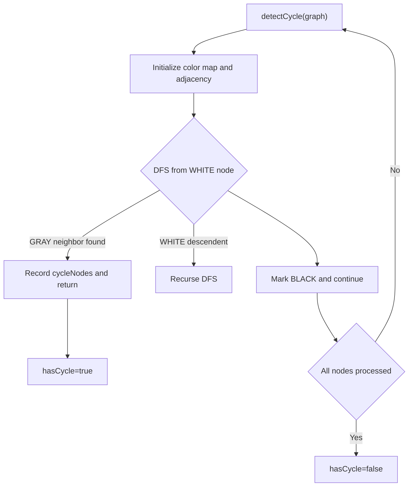
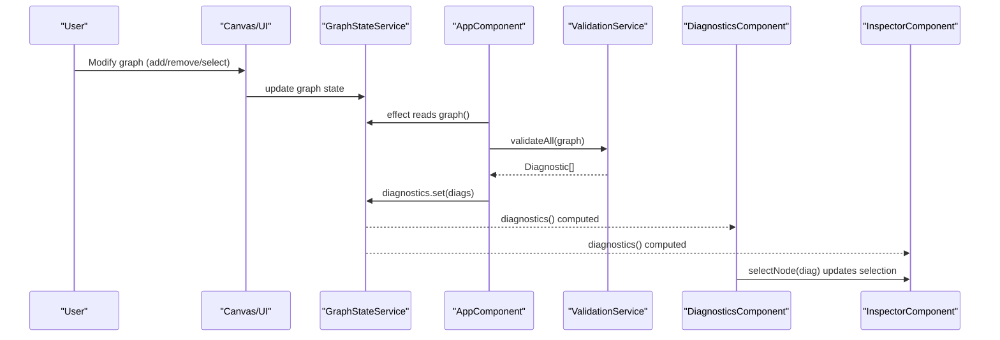
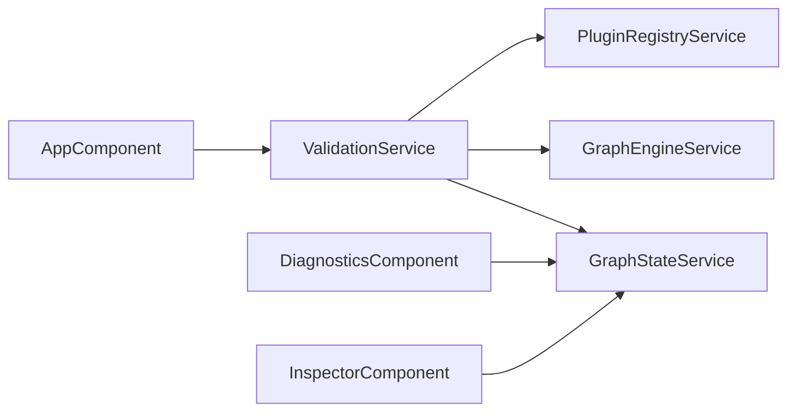

# ValidationService

<cite>
**Referenced Files in This Document**
- [validation.service.ts](file://src/app/validation/validation.service.ts)
- [README.md](file://src/app/validation/README.md)
- [graph-engine.service.ts](file://src/app/graph-engine/graph-engine.service.ts)
- [plugin-registry.service.ts](file://src/app/infra/plugin-registry.service.ts)
- [resource-plugin.model.ts](file://src/app/core/models/resource-plugin.model.ts)
- [infra-graph.model.ts](file://src/app/core/models/infra-graph.model.ts)
- [graph-state.service.ts](file://src/app/core/services/graph-state.service.ts)
- [app.component.ts](file://src/app/layout/app.component.ts)
- [diagnostics.component.ts](file://src/app/diagnostics/diagnostics.component.ts)
- [inspector.component.ts](file://src/app/inspector/inspector.component.ts)
- [compute-network.plugin.ts](file://src/app/infra/plugins/compute-network.plugin.ts)
- [compute-subnetwork.plugin.ts](file://src/app/infra/plugins/compute-subnetwork.plugin.ts)
- [compute-instance.plugin.ts](file://src/app/infra/plugins/compute-instance.plugin.ts)
</cite>

## Table of Contents
1. [Introduction](#introduction)
2. [Project Structure](#project-structure)
3. [Core Components](#core-components)
4. [Architecture Overview](#architecture-overview)
5. [Detailed Component Analysis](#detailed-component-analysis)
6. [Dependency Analysis](#dependency-analysis)
7. [Performance Considerations](#performance-considerations)
8. [Troubleshooting Guide](#troubleshooting-guide)
9. [Conclusion](#conclusion)
10. [Appendices](#appendices)

## Introduction
This document describes the ValidationService that powers comprehensive infrastructure validation in CloudCanvas-TF. It covers the schema validation system driven by JSON Schema definitions, graph integrity checks for dependencies and relationships, and policy enforcement mechanisms. It also explains validation contexts, error collection and reporting, real-time validation triggers, and how validation results propagate to the diagnostics system. The document details the validation pipeline architecture, custom validator registration via plugins, and validation rule configuration. Examples of validation scenarios, error handling patterns, and integration with the inspector component for immediate feedback are included. Finally, it outlines validation performance optimization, caching strategies, and extensibility for custom policies.

## Project Structure
The validation subsystem is centered around the ValidationService and integrates with:
- Plugin Registry for per-resource validators and JSON Schemas
- Graph Engine for dependency and integrity checks
- Graph State for reactive updates and diagnostics propagation
- UI components for diagnostics display and inspector integration

**Diagram sources**
- [validation.service.ts](file://src/app/validation/validation.service.ts#L14-L105)
- [plugin-registry.service.ts](file://src/app/infra/plugin-registry.service.ts#L18-L72)
- [graph-engine.service.ts](file://src/app/graph-engine/graph-engine.service.ts#L11-L126)
- [graph-state.service.ts](file://src/app/core/services/graph-state.service.ts#L13-L146)
- [app.component.ts](file://src/app/layout/app.component.ts#L31-L42)
- [diagnostics.component.ts](file://src/app/diagnostics/diagnostics.component.ts#L11-L43)
- [inspector.component.ts](file://src/app/inspector/inspector.component.ts#L21-L102)

**Section sources**
- [validation.service.ts](file://src/app/validation/validation.service.ts#L1-L107)
- [plugin-registry.service.ts](file://src/app/infra/plugin-registry.service.ts#L1-L73)
- [graph-engine.service.ts](file://src/app/graph-engine/graph-engine.service.ts#L1-L127)
- [graph-state.service.ts](file://src/app/core/services/graph-state.service.ts#L1-L147)
- [app.component.ts](file://src/app/layout/app.component.ts#L1-L48)
- [diagnostics.component.ts](file://src/app/diagnostics/diagnostics.component.ts#L1-L44)
- [inspector.component.ts](file://src/app/inspector/inspector.component.ts#L1-L103)

## Core Components
- ValidationService orchestrates three validation passes:
  - Schema validation: delegates to ResourcePlugin.validate() for each node using JSON Schema definitions.
  - Graph integrity validation: detects cycles, dangling edges, and duplicate names.
  - Policy validation: enforces domain-specific rules (e.g., subnet without VPC).
- PluginRegistryService registers and retrieves ResourcePlugin instances keyed by ResourceKind.
- GraphEngineService provides cycle detection and topological sorting for dependency validation.
- GraphStateService stores the InfraGraph and diagnostics signals consumed by UI components.
- UI integration:
  - AppComponent reacts to graph changes and triggers validation and generation.
  - DiagnosticsComponent displays aggregated diagnostics with severity ordering and quick selection.
  - InspectorComponent shows per-node diagnostics and field-level errors.

**Section sources**
- [validation.service.ts](file://src/app/validation/validation.service.ts#L14-L105)
- [plugin-registry.service.ts](file://src/app/infra/plugin-registry.service.ts#L18-L72)
- [graph-engine.service.ts](file://src/app/graph-engine/graph-engine.service.ts#L11-L126)
- [graph-state.service.ts](file://src/app/core/services/graph-state.service.ts#L13-L146)
- [diagnostics.component.ts](file://src/app/diagnostics/diagnostics.component.ts#L11-L43)
- [inspector.component.ts](file://src/app/inspector/inspector.component.ts#L21-L102)
- [app.component.ts](file://src/app/layout/app.component.ts#L31-L42)

## Architecture Overview
The ValidationService composes three validation layers:
- Per-resource schema validation via ResourcePlugin.validate() using JSON Schema property definitions.
- Graph-level integrity checks via GraphEngineService.
- Policy-level checks for domain-specific constraints.

**Diagram sources**
- [validation.service.ts](file://src/app/validation/validation.service.ts#L14-L105)
- [plugin-registry.service.ts](file://src/app/infra/plugin-registry.service.ts#L44-L54)
- [graph-engine.service.ts](file://src/app/graph-engine/graph-engine.service.ts#L27-L63)
- [graph-state.service.ts](file://src/app/core/services/graph-state.service.ts#L16-L16)
- [app.component.ts](file://src/app/layout/app.component.ts#L31-L42)
- [diagnostics.component.ts](file://src/app/diagnostics/diagnostics.component.ts#L14-L14)

## Detailed Component Analysis

### ValidationService
Responsibilities:
- Compose validation pipeline: schema → graph → policies.
- Build ValidationContext for plugin validators.
- Aggregate diagnostics and propagate to GraphStateService.

Key behaviors:
- validateAll: runs all validation passes and flattens diagnostics.
- validateSchema: iterates nodes, resolves plugin by kind, invokes plugin.validate(), and records unknown resource errors.
- validateGraph: cycle detection, dangling edge checks, duplicate name detection.
- validatePolicies: lightweight domain rules (e.g., empty graph hint, subnet without VPC).

**Diagram sources**
- [validation.service.ts](file://src/app/validation/validation.service.ts#L14-L105)

**Section sources**
- [validation.service.ts](file://src/app/validation/validation.service.ts#L14-L105)

### Plugin Registry and Resource Plugins
- PluginRegistryService registers ResourcePlugin instances and exposes getPlugin(kind).
- ResourcePlugin defines:
  - kind, category, displayName, description, icon
  - schema: JSON Schema for UI and validation
  - defaults(): default property values
  - validate(node, ctx): returns Diagnostic[]
  - toTerraform(node, ctx): generates Terraform blocks
  - suggestEdges(node, graph): optional edge suggestions

Example plugins demonstrate:
- JSON Schema with properties, types, defaults, and grouping.
- Validation logic using ValidationContext.graph and allNodes.
- Edge-aware validations (e.g., subnet requires VPC connection).

**Diagram sources**
- [plugin-registry.service.ts](file://src/app/infra/plugin-registry.service.ts#L18-L72)
- [resource-plugin.model.ts](file://src/app/core/models/resource-plugin.model.ts#L43-L54)
- [compute-network.plugin.ts](file://src/app/infra/plugins/compute-network.plugin.ts#L4-L128)
- [compute-subnetwork.plugin.ts](file://src/app/infra/plugins/compute-subnetwork.plugin.ts#L4-L129)
- [compute-instance.plugin.ts](file://src/app/infra/plugins/compute-instance.plugin.ts#L4-L127)

**Section sources**
- [plugin-registry.service.ts](file://src/app/infra/plugin-registry.service.ts#L18-L72)
- [resource-plugin.model.ts](file://src/app/core/models/resource-plugin.model.ts#L11-L54)
- [compute-network.plugin.ts](file://src/app/infra/plugins/compute-network.plugin.ts#L11-L99)
- [compute-subnetwork.plugin.ts](file://src/app/infra/plugins/compute-subnetwork.plugin.ts#L11-L97)
- [compute-instance.plugin.ts](file://src/app/infra/plugins/compute-instance.plugin.ts#L11-L80)

### Graph Integrity Checks
- Cycle detection: uses DFS with color-marking to detect cycles and collect cycle nodes.
- Topological sort: Kahn’s algorithm for dependency ordering when no cycle is present.
- Dangling edges: verifies both ends of edges reference existing nodes.
- Duplicate names: ensures uniqueness of name per kind.

**Diagram sources**
- [graph-engine.service.ts](file://src/app/graph-engine/graph-engine.service.ts#L27-L63)

**Section sources**
- [graph-engine.service.ts](file://src/app/graph-engine/graph-engine.service.ts#L13-L126)
- [validation.service.ts](file://src/app/validation/validation.service.ts#L41-L81)

### Policy Enforcement Mechanisms
- Empty graph hint: informational diagnostic when no nodes exist.
- Subnet without VPC: warning when subnetworks exist without a VPC network in the graph.

These policies are lightweight and operate over the entire graph.

**Section sources**
- [validation.service.ts](file://src/app/validation/validation.service.ts#L83-L105)

### Validation Contexts and JSON Schema Definitions
- ValidationContext provides graph and allNodes to validators for cross-node checks.
- JSON Schema definitions live in ResourcePlugin.schema and drive:
  - Inspector UI rendering (fields, groups, defaults)
  - Validation rules (required fields, ranges, enums)
  - Terraform generation mapping

**Section sources**
- [resource-plugin.model.ts](file://src/app/core/models/resource-plugin.model.ts#L32-L35)
- [resource-plugin.model.ts](file://src/app/core/models/resource-plugin.model.ts#L22-L24)
- [compute-network.plugin.ts](file://src/app/infra/plugins/compute-network.plugin.ts#L11-L55)
- [compute-subnetwork.plugin.ts](file://src/app/infra/plugins/compute-subnetwork.plugin.ts#L11-L53)
- [compute-instance.plugin.ts](file://src/app/infra/plugins/compute-instance.plugin.ts#L11-L50)

### Error Collection and Reporting
- Diagnostic interface supports severity, code, optional nodeId and field, message, and remediation.
- ValidationService aggregates diagnostics from all passes.
- GraphStateService stores diagnostics as a signal for UI consumption.
- DiagnosticsComponent sorts and displays diagnostics by severity, with clickable items selecting the associated node.
- InspectorComponent filters diagnostics by selected node and field-level errors.

**Section sources**
- [infra-graph.model.ts](file://src/app/core/models/infra-graph.model.ts#L41-L48)
- [validation.service.ts](file://src/app/validation/validation.service.ts#L14-L20)
- [graph-state.service.ts](file://src/app/core/services/graph-state.service.ts#L16-L16)
- [diagnostics.component.ts](file://src/app/diagnostics/diagnostics.component.ts#L14-L27)
- [inspector.component.ts](file://src/app/inspector/inspector.component.ts#L55-L101)

### Real-Time Validation Triggers and Propagation
- AppComponent uses Angular effect to react to graph changes.
- On each change, it invokes ValidationService.validateAll(graph), sets diagnostics, and regenerates Terraform files.
- DiagnosticsComponent and InspectorComponent subscribe to GraphStateService diagnostics and selected node to reflect validation results immediately.

**Diagram sources**
- [app.component.ts](file://src/app/layout/app.component.ts#L31-L42)
- [graph-state.service.ts](file://src/app/core/services/graph-state.service.ts#L14-L16)
- [validation.service.ts](file://src/app/validation/validation.service.ts#L14-L20)
- [diagnostics.component.ts](file://src/app/diagnostics/diagnostics.component.ts#L14-L14)
- [inspector.component.ts](file://src/app/inspector/inspector.component.ts#L29-L33)

**Section sources**
- [app.component.ts](file://src/app/layout/app.component.ts#L31-L42)
- [graph-state.service.ts](file://src/app/core/services/graph-state.service.ts#L14-L16)
- [validation.service.ts](file://src/app/validation/validation.service.ts#L14-L20)
- [diagnostics.component.ts](file://src/app/diagnostics/diagnostics.component.ts#L14-L14)
- [inspector.component.ts](file://src/app/inspector/inspector.component.ts#L29-L33)

### Validation Scenarios and Examples
- Unknown resource type: recorded as an error diagnostic when no plugin is found for a node kind.
- Circular dependency: reported as an error diagnostic with cycle information.
- Dangling edge: reported as an error diagnostic for missing from/to nodes.
- Duplicate resource name: reported as an error diagnostic when multiple nodes share the same kind:name pair.
- Subnet without VPC: reported as a warning diagnostic when subnetworks exist without a VPC network.
- Required fields and ranges: enforced by ResourcePlugin.validate() using JSON Schema constraints.

**Section sources**
- [validation.service.ts](file://src/app/validation/validation.service.ts#L22-L81)
- [compute-network.plugin.ts](file://src/app/infra/plugins/compute-network.plugin.ts#L68-L98)
- [compute-subnetwork.plugin.ts](file://src/app/infra/plugins/compute-subnetwork.plugin.ts#L66-L96)
- [compute-instance.plugin.ts](file://src/app/infra/plugins/compute-instance.plugin.ts#L61-L79)

### Integration with Inspector Component
- InspectorComponent computes per-node diagnostics filtered by selected node id.
- It displays field-level errors by matching Diagnostic.field to the edited field.
- Clicking a diagnostic item selects the associated node in the canvas.

**Section sources**
- [inspector.component.ts](file://src/app/inspector/inspector.component.ts#L55-L101)
- [infra-graph.model.ts](file://src/app/core/models/infra-graph.model.ts#L41-L48)

## Dependency Analysis
The ValidationService depends on:
- PluginRegistryService for per-resource validators and JSON Schema.
- GraphEngineService for dependency integrity checks.
- GraphStateService for reactive diagnostics propagation.

**Diagram sources**
- [validation.service.ts](file://src/app/validation/validation.service.ts#L9-L12)
- [plugin-registry.service.ts](file://src/app/infra/plugin-registry.service.ts#L18-L72)
- [graph-engine.service.ts](file://src/app/graph-engine/graph-engine.service.ts#L11-L126)
- [graph-state.service.ts](file://src/app/core/services/graph-state.service.ts#L13-L146)
- [app.component.ts](file://src/app/layout/app.component.ts#L28-L29)
- [diagnostics.component.ts](file://src/app/diagnostics/diagnostics.component.ts#L12-L12)
- [inspector.component.ts](file://src/app/inspector/inspector.component.ts#L22-L23)

**Section sources**
- [validation.service.ts](file://src/app/validation/validation.service.ts#L9-L12)
- [plugin-registry.service.ts](file://src/app/infra/plugin-registry.service.ts#L18-L72)
- [graph-engine.service.ts](file://src/app/graph-engine/graph-engine.service.ts#L11-L126)
- [graph-state.service.ts](file://src/app/core/services/graph-state.service.ts#L13-L146)
- [app.component.ts](file://src/app/layout/app.component.ts#L28-L29)
- [diagnostics.component.ts](file://src/app/diagnostics/diagnostics.component.ts#L12-L12)
- [inspector.component.ts](file://src/app/inspector/inspector.component.ts#L22-L23)

## Performance Considerations
- Complexity:
  - validateSchema: O(N) over nodes, plus per-plugin validate cost.
  - validateGraph: O(N + E) for cycles, dangling edges, and duplicate names.
  - validatePolicies: O(N) for simple scans (e.g., subnetwork count).
  - detectCycle: O(N + E) using DFS with adjacency map.
- Optimization opportunities:
  - Memoization of plugin.validate() results by node id and version to avoid recomputation when properties have not changed.
  - Incremental graph validation: only re-run integrity checks for modified nodes and affected edges.
  - Parallelize per-node plugin validations when safe and independent.
  - Debounce validation on rapid property edits to reduce thrashing.
- Caching strategies:
  - Cache plugin.schema and defaults() to avoid repeated construction.
  - Cache ValidationContext-derived results (e.g., node-to-kind maps) when graph mutations are batched.

[No sources needed since this section provides general guidance]

## Troubleshooting Guide
Common issues and resolutions:
- Unknown resource type error: ensure the node kind is registered in PluginRegistryService.
- Circular dependency error: review edges to remove cycles; use topological order guidance.
- Dangling edge error: verify both from and to node ids exist in the graph.
- Duplicate name error: rename nodes so each kind:name pair is unique.
- Subnet without VPC warning: connect subnetworks to a VPC network node.
- Field-level validation errors in inspector: adjust values according to JSON Schema constraints and remediation hints.

**Section sources**
- [validation.service.ts](file://src/app/validation/validation.service.ts#L29-L38)
- [validation.service.ts](file://src/app/validation/validation.service.ts#L43-L51)
- [validation.service.ts](file://src/app/validation/validation.service.ts#L54-L65)
- [validation.service.ts](file://src/app/validation/validation.service.ts#L70-L77)
- [compute-subnetwork.plugin.ts](file://src/app/infra/plugins/compute-subnetwork.plugin.ts#L86-L95)
- [inspector.component.ts](file://src/app/inspector/inspector.component.ts#L97-L101)

## Conclusion
The ValidationService provides a modular, extensible validation framework for CloudCanvas-TF. It leverages JSON Schema-driven plugins for precise schema validation, robust graph integrity checks for dependencies, and pragmatic policy enforcement for domain rules. Real-time validation is tightly integrated with the UI via reactive signals, enabling immediate feedback through diagnostics and inspector components. The architecture supports performance optimizations, incremental validation, and extensibility for custom validators and policies.

## Appendices

### Validation Pipeline Summary
- Input: InfraGraph
- Outputs: Diagnostic[]
- Steps:
  1) Schema validation per node via ResourcePlugin.validate()
  2) Graph integrity checks (cycles, dangling edges, duplicates)
  3) Policy checks (domain-specific rules)
  4) Aggregation and propagation to diagnostics UI

**Section sources**
- [validation.service.ts](file://src/app/validation/validation.service.ts#L14-L105)
- [README.md](file://src/app/validation/README.md#L1-L4)