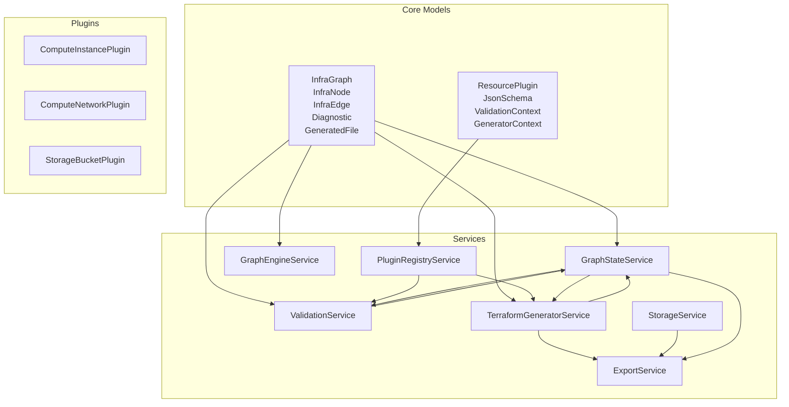
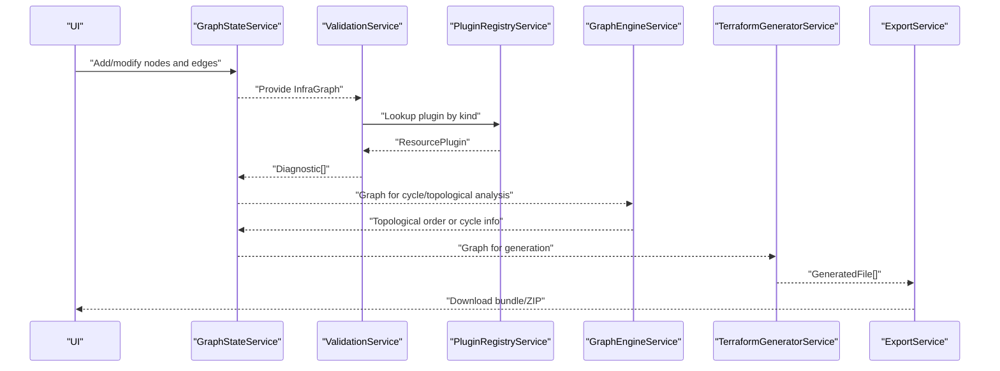
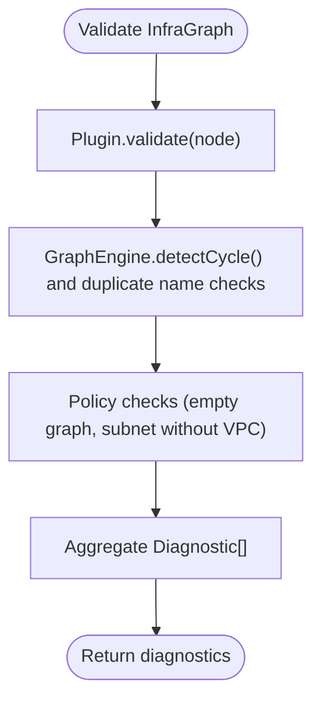
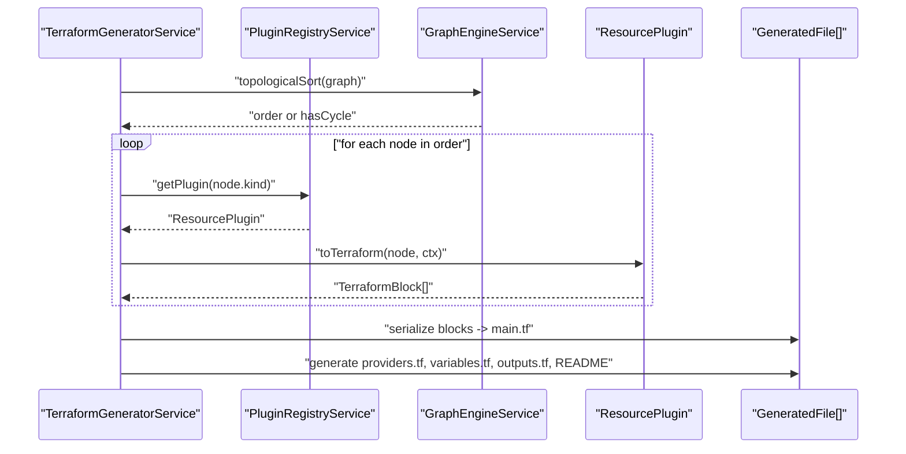
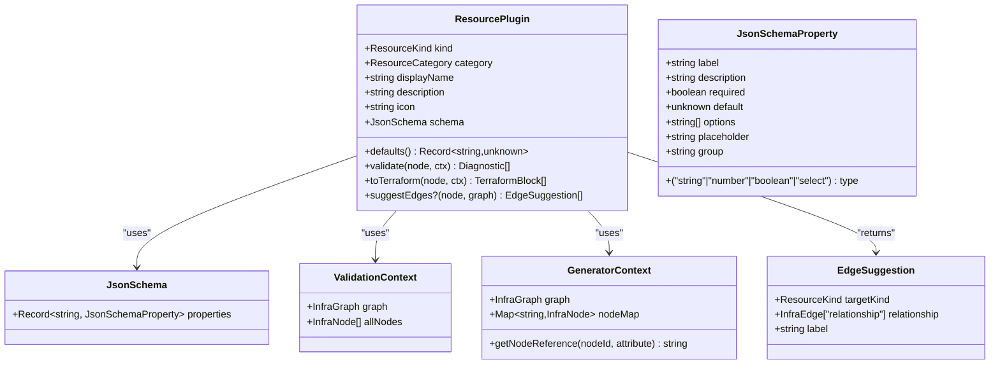
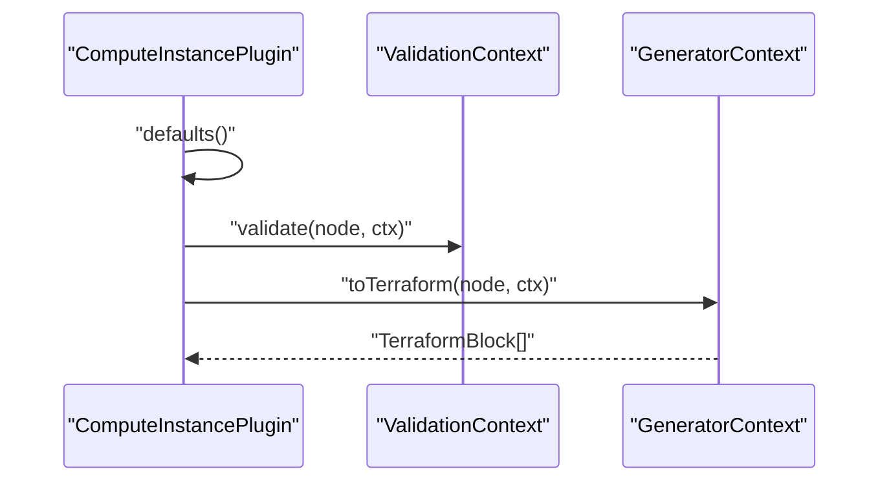
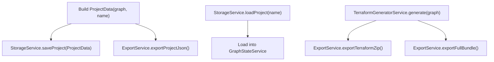
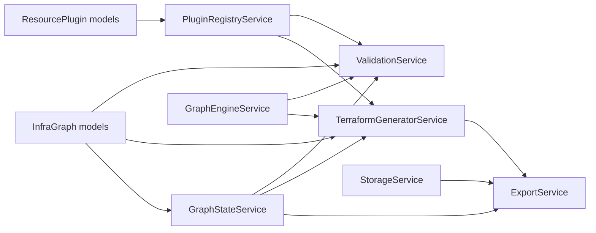

# Data Models and Types

<cite>
**Referenced Files in This Document**
- [infra-graph.model.ts](file://src/app/core/models/infra-graph.model.ts)
- [resource-plugin.model.ts](file://src/app/core/models/resource-plugin.model.ts)
- [graph-state.service.ts](file://src/app/core/services/graph-state.service.ts)
- [graph-engine.service.ts](file://src/app/graph-engine/graph-engine.service.ts)
- [validation.service.ts](file://src/app/validation/validation.service.ts)
- [terraform-generator.service.ts](file://src/app/terraform-engine/terraform-generator.service.ts)
- [export.service.ts](file://src/app/storage/export.service.ts)
- [storage.service.ts](file://src/app/storage/storage.service.ts)
- [plugin-registry.service.ts](file://src/app/infra/plugin-registry.service.ts)
- [compute-instance.plugin.ts](file://src/app/infra/plugins/compute-instance.plugin.ts)
- [compute-network.plugin.ts](file://src/app/infra/plugins/compute-network.plugin.ts)
- [storage-bucket.plugin.ts](file://src/app/infra/plugins/storage-bucket.plugin.ts)
- [diagnostics.component.ts](file://src/app/diagnostics/diagnostics.component.ts)
</cite>

## Table of Contents
1. [Introduction](#introduction)
2. [Project Structure](#project-structure)
3. [Core Components](#core-components)
4. [Architecture Overview](#architecture-overview)
5. [Detailed Component Analysis](#detailed-component-analysis)
6. [Dependency Analysis](#dependency-analysis)
7. [Performance Considerations](#performance-considerations)
8. [Troubleshooting Guide](#troubleshooting-guide)
9. [Conclusion](#conclusion)
10. [Appendices](#appendices)

## Introduction
This document describes the core data models and types that define CloudCanvas-TF’s infrastructure design representation and generation pipeline. It focuses on:
- The canonical InfraGraph structure and its nodes, edges, and metadata
- The InfraNode and InfraEdge definitions, including resource kinds and relationships
- The Diagnostic type for validation errors and warnings
- The GeneratedFile structure for Terraform code output
- The ResourcePlugin interface and related types (JsonSchema, ValidationContext, GeneratorContext)
- Type relationships, usage contexts, and serialization patterns for persistence and export

## Project Structure
The data model lives primarily under the core models and is consumed by services across the application:
- Core models define typed structures for infrastructure graphs, diagnostics, and Terraform output
- Services orchestrate validation, graph operations, plugin-driven generation, and persistence
- Plugins implement resource-specific validation and Terraform translation logic



**Diagram sources**
- [infra-graph.model.ts](file://src/app/core/models/infra-graph.model.ts#L1-L118)
- [resource-plugin.model.ts](file://src/app/core/models/resource-plugin.model.ts#L1-L55)
- [graph-state.service.ts](file://src/app/core/services/graph-state.service.ts#L1-L147)
- [graph-engine.service.ts](file://src/app/graph-engine/graph-engine.service.ts#L1-L127)
- [validation.service.ts](file://src/app/validation/validation.service.ts#L1-L107)
- [terraform-generator.service.ts](file://src/app/terraform-engine/terraform-generator.service.ts#L1-L173)
- [export.service.ts](file://src/app/storage/export.service.ts#L1-L203)
- [storage.service.ts](file://src/app/storage/storage.service.ts#L1-L85)
- [plugin-registry.service.ts](file://src/app/infra/plugin-registry.service.ts#L1-L73)
- [compute-instance.plugin.ts](file://src/app/infra/plugins/compute-instance.plugin.ts#L1-L128)
- [compute-network.plugin.ts](file://src/app/infra/plugins/compute-network.plugin.ts#L1-L129)
- [storage-bucket.plugin.ts](file://src/app/infra/plugins/storage-bucket.plugin.ts#L1-L105)

**Section sources**
- [infra-graph.model.ts](file://src/app/core/models/infra-graph.model.ts#L1-L118)
- [resource-plugin.model.ts](file://src/app/core/models/resource-plugin.model.ts#L1-L55)

## Core Components
This section documents the primary data structures and their roles.

- InfraGraph: The canonical representation of an infrastructure design. It consists of a set of nodes and edges.
- InfraNode: Represents a single infrastructure resource with identity, type, name, properties, tags, version, and position.
- InfraEdge: Represents a directed relationship between two nodes, with a specific relationship type.
- Diagnostic: Encapsulates validation messages with severity, code, optional node/field context, and remediation hints.
- GeneratedFile: Represents a single file produced during Terraform generation, with filename and content.
- ProjectData and ProjectMetadata: Encapsulate persisted projects with schema version, graph, and metadata.
- TerraformBlock, TerraformValue, TerraformReference, TerraformNestedBlock: Internal representation of Terraform constructs used by generators.

These types are defined in the core models and are used across services for validation, generation, persistence, and UI rendering.

**Section sources**
- [infra-graph.model.ts](file://src/app/core/models/infra-graph.model.ts#L17-L118)

## Architecture Overview
The data model drives a pipeline:
- GraphStateService maintains the current InfraGraph and diagnostics
- ValidationService validates nodes against plugins and graph topology
- GraphEngineService performs graph analysis (cycles, topological sort)
- PluginRegistryService provides resource plugins
- TerraformGeneratorService translates validated nodes into Terraform blocks and files
- ExportService packages files and project data for download
- StorageService persists and retrieves projects



**Diagram sources**
- [graph-state.service.ts](file://src/app/core/services/graph-state.service.ts#L1-L147)
- [validation.service.ts](file://src/app/validation/validation.service.ts#L1-L107)
- [plugin-registry.service.ts](file://src/app/infra/plugin-registry.service.ts#L1-L73)
- [graph-engine.service.ts](file://src/app/graph-engine/graph-engine.service.ts#L1-L127)
- [terraform-generator.service.ts](file://src/app/terraform-engine/terraform-generator.service.ts#L1-L173)
- [export.service.ts](file://src/app/storage/export.service.ts#L1-L203)

## Detailed Component Analysis

### InfraGraph, InfraNode, InfraEdge, and Related Types
- InfraGraph: Holds nodes and edges forming the infrastructure graph.
- InfraNode: Identifiers and metadata for a resource, including kind, name, properties, tags, version, and position.
- InfraEdge: Directed edge with relationship type indicating dependency or attachment semantics.
- EdgeRelationship: Enumerated relationship types used to express connectivity semantics.
- ResourceKind and ResourceCategory: Strongly typed resource identifiers and categories.
- Diagnostic: Severity, code, optional nodeId/field, message, and remediation.
- GeneratedFile: Output artifact with filename and content.
- ProjectData and ProjectMetadata: Persisted project envelope with schema version and metadata.

```mermaid
classDiagram
class InfraGraph {
+InfraNode[] nodes
+InfraEdge[] edges
}
class InfraNode {
+string id
+ResourceKind kind
+string name
+Record~string, unknown~ properties
+string[] tags
+number version
+{x : number,y : number} position
}
class InfraEdge {
+string id
+string from
+string to
+EdgeRelationship relationship
}
class Diagnostic {
+("error"|"warning"|"info") severity
+string code
+string nodeId
+string field
+string message
+string remediation
}
class GeneratedFile {
+string filename
+string content
}
class ProjectData {
+number schemaVersion
+InfraGraph graph
+ProjectMetadata metadata
}
class ProjectMetadata {
+string name
+string createdAt
+string updatedAt
+string terraformVersion
+string providerVersion
}
InfraGraph --> InfraNode : "contains"
InfraGraph --> InfraEdge : "contains"
ProjectData --> InfraGraph : "embeds"
ProjectData --> ProjectMetadata : "embeds"
```

**Diagram sources**
- [infra-graph.model.ts](file://src/app/core/models/infra-graph.model.ts#L17-L118)

**Section sources**
- [infra-graph.model.ts](file://src/app/core/models/infra-graph.model.ts#L1-L118)

### Diagnostic Type and Validation Pipeline
- Diagnostic carries structured validation feedback with severity and optional node/field context.
- ValidationService orchestrates:
  - Schema validation via ResourcePlugin.validate
  - Graph-level checks (cycles, dangling edges, duplicate names)
  - Policy checks (e.g., empty graph, subnet without VPC)
- Diagnostics are surfaced to the UI via GraphStateService and rendered by the Diagnostics component.



**Diagram sources**
- [validation.service.ts](file://src/app/validation/validation.service.ts#L14-L105)
- [graph-engine.service.ts](file://src/app/graph-engine/graph-engine.service.ts#L27-L63)

**Section sources**
- [validation.service.ts](file://src/app/validation/validation.service.ts#L1-L107)
- [diagnostics.component.ts](file://src/app/diagnostics/diagnostics.component.ts#L1-L43)

### GeneratedFile and Terraform Generation
- GeneratedFile represents a single output file produced by the generator.
- TerraformGeneratorService:
  - Builds a nodeMap and GeneratorContext
  - Sorts nodes topologically (or falls back to raw order if cycle detected)
  - Invokes ResourcePlugin.toTerraform for each node
  - Serializes blocks into main.tf and auxiliary files (providers.tf, variables.tf, outputs.tf)
  - Generates a README.generated.md summarizing resources
- The generator uses a deterministic serialization strategy for attributes and nested blocks.



**Diagram sources**
- [terraform-generator.service.ts](file://src/app/terraform-engine/terraform-generator.service.ts#L16-L173)
- [plugin-registry.service.ts](file://src/app/infra/plugin-registry.service.ts#L48-L50)
- [graph-engine.service.ts](file://src/app/graph-engine/graph-engine.service.ts#L65-L110)

**Section sources**
- [terraform-generator.service.ts](file://src/app/terraform-engine/terraform-generator.service.ts#L1-L173)

### ResourcePlugin Interface and Related Types
- ResourcePlugin defines the contract for translating InfraNode into Terraform blocks and validating them.
- JsonSchema and JsonSchemaProperty describe property definitions for UI forms.
- ValidationContext and GeneratorContext provide graph-scoped utilities to validators and generators.
- Plugins implement defaults(), validate(), toTerraform(), and optionally suggestEdges().



**Diagram sources**
- [resource-plugin.model.ts](file://src/app/core/models/resource-plugin.model.ts#L11-L55)

**Section sources**
- [resource-plugin.model.ts](file://src/app/core/models/resource-plugin.model.ts#L1-L55)

### Example: Compute Instance Plugin
- Implements ResourcePlugin for google_compute_instance
- Defines JsonSchema with properties for machine type, zone, disk images, and advanced options
- Validates required fields and suggests edge to subnet
- Translates properties into Terraform resource blocks with nested boot_disk and network_interface



**Diagram sources**
- [compute-instance.plugin.ts](file://src/app/infra/plugins/compute-instance.plugin.ts#L4-L128)

**Section sources**
- [compute-instance.plugin.ts](file://src/app/infra/plugins/compute-instance.plugin.ts#L1-L128)

### Example: Network and Storage Plugins
- ComputeNetworkPlugin: Validates MTU range and routing modes; produces a google_compute_network block
- StorageBucketPlugin: Validates bucket naming and access controls; produces a google_storage_bucket block with optional nested blocks

**Section sources**
- [compute-network.plugin.ts](file://src/app/infra/plugins/compute-network.plugin.ts#L1-L129)
- [storage-bucket.plugin.ts](file://src/app/infra/plugins/storage-bucket.plugin.ts#L1-L105)

### Persistence and Export Patterns
- ProjectData encapsulates InfraGraph and metadata for persistence
- StorageService persists projects using IndexedDB with a simple object store keyed by project name
- ExportService generates Terraform files and bundles them into ZIP archives, or exports a JSON project file
- ExportService synchronously triggers downloads from user gestures to ensure browser compatibility



**Diagram sources**
- [storage.service.ts](file://src/app/storage/storage.service.ts#L30-L83)
- [export.service.ts](file://src/app/storage/export.service.ts#L18-L79)
- [terraform-generator.service.ts](file://src/app/terraform-engine/terraform-generator.service.ts#L16-L51)

**Section sources**
- [storage.service.ts](file://src/app/storage/storage.service.ts#L1-L85)
- [export.service.ts](file://src/app/storage/export.service.ts#L1-L203)

## Dependency Analysis
- Core models are consumed by services and plugins
- ValidationService depends on PluginRegistryService and GraphEngineService
- TerraformGeneratorService depends on PluginRegistryService and GraphEngineService
- ExportService depends on TerraformGeneratorService and StorageService
- GraphStateService coordinates UI state and feeds diagnostics and generated files



**Diagram sources**
- [infra-graph.model.ts](file://src/app/core/models/infra-graph.model.ts#L1-L118)
- [resource-plugin.model.ts](file://src/app/core/models/resource-plugin.model.ts#L1-L55)
- [graph-state.service.ts](file://src/app/core/services/graph-state.service.ts#L1-L147)
- [graph-engine.service.ts](file://src/app/graph-engine/graph-engine.service.ts#L1-L127)
- [validation.service.ts](file://src/app/validation/validation.service.ts#L1-L107)
- [terraform-generator.service.ts](file://src/app/terraform-engine/terraform-generator.service.ts#L1-L173)
- [export.service.ts](file://src/app/storage/export.service.ts#L1-L203)
- [storage.service.ts](file://src/app/storage/storage.service.ts#L1-L85)
- [plugin-registry.service.ts](file://src/app/infra/plugin-registry.service.ts#L1-L73)

**Section sources**
- [plugin-registry.service.ts](file://src/app/infra/plugin-registry.service.ts#L1-L73)
- [validation.service.ts](file://src/app/validation/validation.service.ts#L1-L107)
- [terraform-generator.service.ts](file://src/app/terraform-engine/terraform-generator.service.ts#L1-L173)
- [export.service.ts](file://src/app/storage/export.service.ts#L1-L203)

## Performance Considerations
- Topological sorting and cycle detection use efficient graph algorithms suitable for typical infrastructure graphs
- Plugin-based generation scales linearly with node count; consider batching UI updates when adding many nodes
- Serialization of Terraform blocks sorts attributes deterministically to aid readability and diff stability
- IndexedDB operations are asynchronous; batch writes when importing large projects

## Troubleshooting Guide
Common diagnostics and their causes:
- UNKNOWN_RESOURCE: A node references a kind without a registered plugin
- DEPENDENCY_CYCLE: Circular dependency detected among nodes
- DANGLING_EDGE: An edge references a missing node
- DUPLICATE_NAME: Two nodes share the same kind:name combination
- EMPTY_GRAPH: No resources added yet
- SUBNET_WITHOUT_VPC: Subnets exist without a VPC network

Resolution tips:
- Fix cycles by removing or reworking edges
- Ensure all referenced nodes exist before creating edges
- Rename duplicates to ensure uniqueness per kind
- Add a VPC network before adding subnets

**Section sources**
- [validation.service.ts](file://src/app/validation/validation.service.ts#L22-L105)

## Conclusion
CloudCanvas-TF’s data model centers on InfraGraph with strongly typed nodes and edges, complemented by Diagnostic and GeneratedFile structures. The ResourcePlugin interface enables extensible, plugin-driven validation and Terraform generation. Together with services for state, validation, graph analysis, and persistence/export, the system provides a robust foundation for designing, validating, and exporting infrastructure configurations.

## Appendices

### Type Relationships Summary
- InfraGraph aggregates InfraNode and InfraEdge
- Diagnostic is produced by validation and displayed in the UI
- GeneratedFile is produced by the generator and exported by ExportService
- ProjectData wraps InfraGraph and metadata for persistence
- ResourcePlugin defines the contract for each infrastructure resource type

**Section sources**
- [infra-graph.model.ts](file://src/app/core/models/infra-graph.model.ts#L17-L118)
- [resource-plugin.model.ts](file://src/app/core/models/resource-plugin.model.ts#L1-L55)
- [export.service.ts](file://src/app/storage/export.service.ts#L18-L79)
- [storage.service.ts](file://src/app/storage/storage.service.ts#L70-L83)