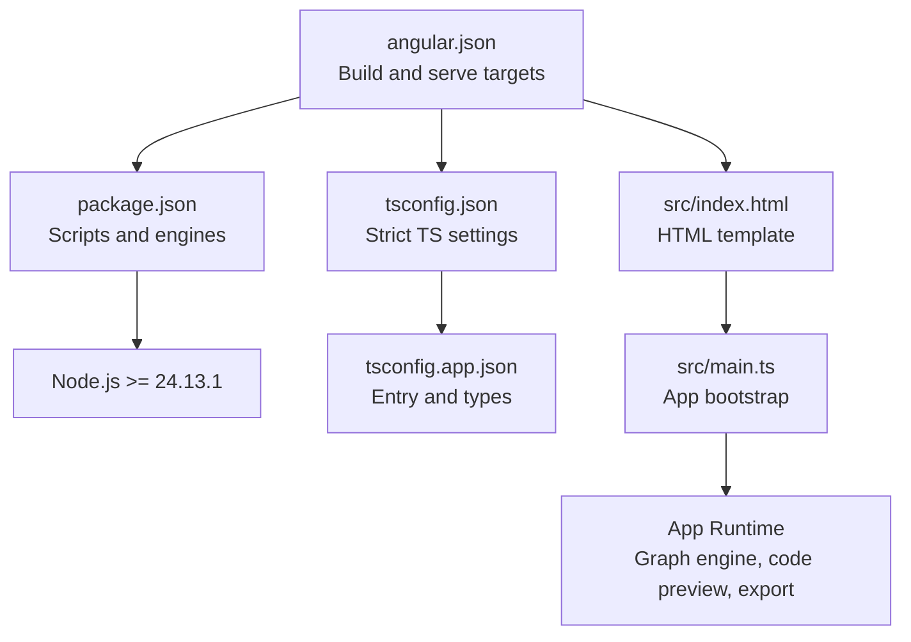
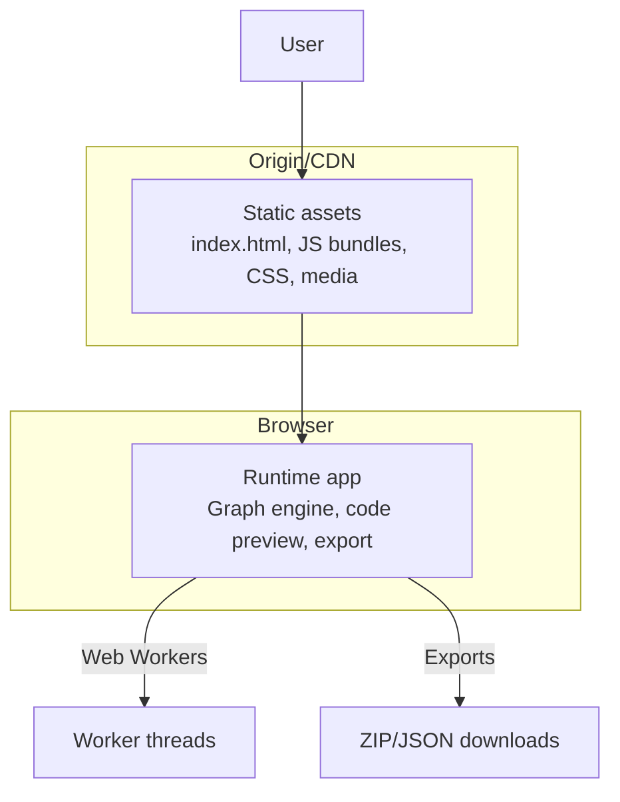
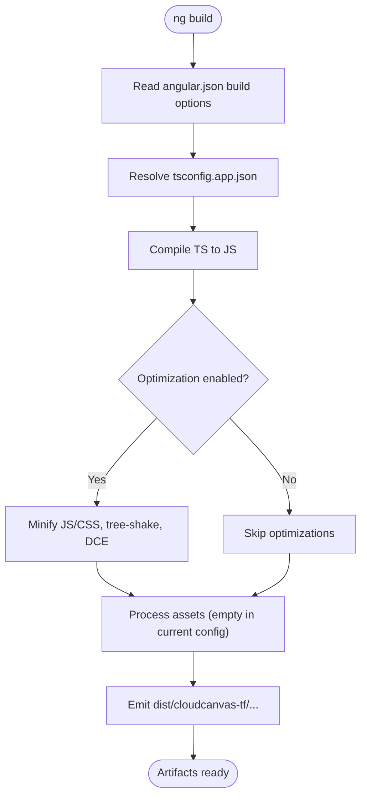
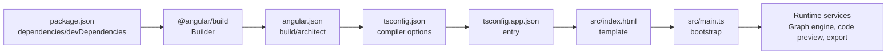

# Deployment and Production

<cite>
**Referenced Files in This Document**
- [angular.json](file://angular.json)
- [package.json](file://package.json)
- [tsconfig.json](file://tsconfig.json)
- [tsconfig.app.json](file://tsconfig.app.json)
- [src/index.html](file://src/index.html)
- [src/main.ts](file://src/main.ts)
- [SYSTEM_DESIGN.md](file://SYSTEM_DESIGN.md)
- [src/app/storage/export.service.ts](file://src/app/storage/export.service.ts)
- [src/app/code-preview/code-preview.component.ts](file://src/app/code-preview/code-preview.component.ts)
- [src/app/graph-engine/graph-engine.service.ts](file://src/app/graph-engine/graph-engine.service.ts)
</cite>

## Table of Contents
1. [Introduction](#introduction)
2. [Project Structure](#project-structure)
3. [Core Components](#core-components)
4. [Architecture Overview](#architecture-overview)
5. [Detailed Component Analysis](#detailed-component-analysis)
6. [Dependency Analysis](#dependency-analysis)
7. [Performance Considerations](#performance-considerations)
8. [Troubleshooting Guide](#troubleshooting-guide)
9. [Conclusion](#conclusion)
10. [Appendices](#appendices)

## Introduction
This document provides deployment and production guidance for CloudCanvas-TF, focusing on the Angular build process, optimization strategies, asset management, environment configuration, static site hosting options, CDN configuration, performance optimization, production deployment topology, security, monitoring, and CI/CD integration patterns. It synthesizes configuration from the repository and aligns recommended practices with the system design and performance goals documented in the project.

## Project Structure
CloudCanvas-TF is an Angular 21 application configured as a modern Angular workspace. The build and toolchain are defined in workspace configuration files, while the application bootstraps from a standalone component. The repository includes a system design document that outlines performance, security, observability, and export/download workflows relevant to production deployment.

**Diagram sources**
- [angular.json](file://angular.json#L1-L34)
- [package.json](file://package.json#L1-L37)
- [tsconfig.json](file://tsconfig.json#L1-L23)
- [tsconfig.app.json](file://tsconfig.app.json#L1-L14)
- [src/index.html](file://src/index.html#L1-L34)
- [src/main.ts](file://src/main.ts#L1-L7)

**Section sources**
- [angular.json](file://angular.json#L1-L34)
- [package.json](file://package.json#L1-L37)
- [tsconfig.json](file://tsconfig.json#L1-L23)
- [tsconfig.app.json](file://tsconfig.app.json#L1-L14)
- [src/index.html](file://src/index.html#L1-L34)
- [src/main.ts](file://src/main.ts#L1-L7)

## Core Components
- Build and serve targets: The Angular workspace defines a single application target with build and dev-server configurations. The builder is the Angular application builder, and the serve target references the build target.
- Scripts and engines: The package script section includes commands for development and testing. The engines section enforces a minimum Node.js version.
- TypeScript configuration: Strict compiler options and Angular compiler strictness are enabled. The application entry is explicitly declared in the app tsconfig.
- Application bootstrap: The application bootstraps a standalone component at runtime.

**Section sources**
- [angular.json](file://angular.json#L11-L26)
- [package.json](file://package.json#L5-L11)
- [tsconfig.json](file://tsconfig.json#L4-L21)
- [tsconfig.app.json](file://tsconfig.app.json#L7-L12)
- [src/main.ts](file://src/main.ts#L1-L7)

## Architecture Overview
The production-ready SPA is served statically from a CDN or origin server. The application performs CPU-intensive tasks (validation, Terraform generation) in Web Workers as outlined in the system design. Export workflows generate deterministic artifacts suitable for distribution and CI handoffs.

[No sources needed since this diagram shows conceptual workflow, not actual code structure]

## Detailed Component Analysis

### Angular Build and Optimization
- Build target: The application builder is configured with a browser entry, TypeScript configuration, empty assets array, and a styles entry. There is no explicit optimization configuration in the workspace file.
- Serve target: The dev server references the build target for development iteration.
- Scripts: The package script section defines commands for development and testing. Production builds should leverage the Angular application builder with appropriate optimization flags.
- TypeScript strictness: Strict compiler options and Angular strict template settings are enabled, improving reliability and maintainability.

**Diagram sources**
- [angular.json](file://angular.json#L12-L19)
- [tsconfig.app.json](file://tsconfig.app.json#L1-L14)

**Section sources**
- [angular.json](file://angular.json#L11-L26)
- [tsconfig.json](file://tsconfig.json#L4-L21)
- [tsconfig.app.json](file://tsconfig.app.json#L1-L14)

### Asset Management and Environment Configuration
- Assets: The current configuration declares an empty assets array. For production, consider adding favicon, icons, and preconnect directives in the HTML template. Preconnect entries for fonts are present in the template.
- Environment configuration: There is no environment-specific configuration in the workspace. For production, define environment files and configure the Angular CLI to select the production environment during build.

**Section sources**
- [angular.json](file://angular.json#L17)
- [src/index.html](file://src/index.html#L13-L15)

### Static Site Hosting Options and CDN Configuration
- Hosting: Serve the built artifacts from a static host or CDN. Ensure trailing slash behavior and base href alignment with the hosting path.
- CDN: Enable HTTP/2, compression, and cache headers. Configure long-term caching for immutable assets and short-lived caching for index.html. Use preconnect directives for third-party domains.
- Routing: For SPAs, configure the host to return index.html for all routes to support client-side routing.

[No sources needed since this section provides general guidance]

### Performance Optimization Techniques
- Bundle size: Leverage tree-shaking and DCE by keeping imports scoped. Split large modules and defer non-critical features.
- Rendering: The system design emphasizes Web Workers for heavy operations. Keep the UI responsive by avoiding blocking the main thread.
- Caching: Use cache-control headers and ETags. Separate vendor and application bundles for granular cache updates.
- Monitoring: The system design documents optional client telemetry for durations and FPS sampling. Instrument critical paths in production.

**Section sources**
- [SYSTEM_DESIGN.md](file://SYSTEM_DESIGN.md#L145-L163)
- [SYSTEM_DESIGN.md](file://SYSTEM_DESIGN.md#L477-L483)

### Production Deployment Topology
- Servers: Single static host or CDN edge locations. Ensure HTTPS termination at the CDN or origin.
- Security: Enforce CSP headers, HSTS, and secure cookies. Sanitize user inputs and avoid embedding secrets in generated artifacts.
- Monitoring: Track availability, latency, error rates, and client-side telemetry. Alert on regressions and resource exhaustion.

**Section sources**
- [SYSTEM_DESIGN.md](file://SYSTEM_DESIGN.md#L467-L474)
- [SYSTEM_DESIGN.md](file://SYSTEM_DESIGN.md#L477-L483)

### Build Configuration in angular.json and Optimization Flags
- Current configuration: The workspace does not set explicit optimization flags. For production, enable optimization to minify and tree-shake.
- Optimization flags: Typical production flags include enabling script/style optimizations, enabling advanced optimizations, and setting a production environment. These are applied via the Angular CLI build command and environment selection.

**Section sources**
- [angular.json](file://angular.json#L12-L19)

### Bundle Analysis
- Analyze bundle composition using the Angular CLI with analyzer tools. Identify large dependencies and refactor or lazy-load where appropriate.

[No sources needed since this section provides general guidance]

### Deployment Best Practices for Angular Applications
- Immutable caching: Versioned filenames for vendor bundles; cache-busting via content hashing.
- Progressive Web App: Add a service worker and manifest for offline-capable experiences. Ensure deterministic exports and reliable downloads.
- CI/CD: Automate builds, tests, and deployments. Gate releases with quality gates and security scans.

**Section sources**
- [SYSTEM_DESIGN.md](file://SYSTEM_DESIGN.md#L410-L455)

### Caching Strategies
- Long-lived immutable assets: Vendor chunks and hashed assets.
- Short-lived index.html: Allow fresh HTML for routing and analytics.
- Conditional requests: Use ETags and Last-Modified for efficient updates.

[No sources needed since this section provides general guidance]

### Progressive Web App Features
- Service worker: Integrate a service worker for offline readiness and background sync.
- Manifest: Provide a web app manifest for installability and home screen presence.
- Offline export: Ensure export workflows remain functional offline.

**Section sources**
- [SYSTEM_DESIGN.md](file://SYSTEM_DESIGN.md#L410-L455)

### Production Troubleshooting
- Boot failures: Capture and log bootstrap errors. Verify runtime dependencies and polyfills.
- Export failures: Validate worker availability and handle fallbacks gracefully.
- Performance regressions: Use telemetry and profiling to isolate bottlenecks.

**Section sources**
- [src/main.ts](file://src/main.ts#L4-L6)
- [src/app/storage/export.service.ts](file://src/app/storage/export.service.ts#L18-L28)
- [SYSTEM_DESIGN.md](file://SYSTEM_DESIGN.md#L458-L464)

### Performance Monitoring and Maintenance
- Metrics: Track generation/validation durations, node counts, and FPS sampling.
- Maintenance: Regular dependency updates, vulnerability scans, and performance budgets.

**Section sources**
- [SYSTEM_DESIGN.md](file://SYSTEM_DESIGN.md#L477-L483)

### Examples of Deployment Scripts and CI/CD Integration Patterns
- Build and test: Use npm scripts to compile and run tests in CI.
- Deploy: Push built artifacts to a static host or CDN. Configure redirects and caching headers.
- Gatekeeping: Run linters, tests, and security scans before deploying.

**Section sources**
- [package.json](file://package.json#L5-L11)

## Dependency Analysis
The application depends on Angular core libraries and RxJS. The build pipeline is driven by the Angular application builder. The runtime leverages Web Workers for heavy computation as described in the system design.

**Diagram sources**
- [package.json](file://package.json#L12-L32)
- [angular.json](file://angular.json#L11-L19)
- [tsconfig.json](file://tsconfig.json#L3-L21)
- [tsconfig.app.json](file://tsconfig.app.json#L1-L14)
- [src/index.html](file://src/index.html#L1-L34)
- [src/main.ts](file://src/main.ts#L1-L7)

**Section sources**
- [package.json](file://package.json#L12-L32)
- [angular.json](file://angular.json#L11-L19)
- [tsconfig.json](file://tsconfig.json#L3-L21)
- [tsconfig.app.json](file://tsconfig.app.json#L1-L14)
- [src/index.html](file://src/index.html#L1-L34)
- [src/main.ts](file://src/main.ts#L1-L7)

## Performance Considerations
- Large graphs: The system design specifies that heavy operations must run in Web Workers to keep the UI responsive.
- Rendering thresholds: Interactive performance targets are defined for node counts on typical developer machines.
- Worker orchestration: Use RxJS for async pipelines and worker coordination.

**Section sources**
- [SYSTEM_DESIGN.md](file://SYSTEM_DESIGN.md#L145-L147)
- [SYSTEM_DESIGN.md](file://SYSTEM_DESIGN.md#L242-L243)

## Troubleshooting Guide
- Bootstrap errors: Inspect the captured error during application bootstrap and verify runtime dependencies.
- Export failures: Validate worker availability and provide user feedback with plain-text fallbacks.
- Import mismatches: Attempt migrations and preview changes before applying.

**Section sources**
- [src/main.ts](file://src/main.ts#L4-L6)
- [src/app/storage/export.service.ts](file://src/app/storage/export.service.ts#L18-L28)
- [SYSTEM_DESIGN.md](file://SYSTEM_DESIGN.md#L458-L464)

## Conclusion
CloudCanvas-TF is structured as a modern Angular SPA with strong TypeScript and Angular compiler strictness. For production, enable optimization in the Angular build, configure environment-specific settings, and adopt robust static hosting and CDN practices. Align performance and security measures with the system design, and instrument monitoring to ensure reliable operation at scale.

## Appendices

### Build and Serve Targets
- Build target: Defined in the Angular workspace with a browser entry and styles configuration.
- Serve target: References the build target for development.

**Section sources**
- [angular.json](file://angular.json#L11-L26)

### TypeScript Configuration
- Strict compiler options and Angular strict template settings are enabled.
- Application entry is explicitly declared.

**Section sources**
- [tsconfig.json](file://tsconfig.json#L4-L21)
- [tsconfig.app.json](file://tsconfig.app.json#L7-L12)

### Application Bootstrap
- Standalone component bootstrap with error logging.

**Section sources**
- [src/main.ts](file://src/main.ts#L1-L7)

### Export Workflows
- Export Terraform ZIP, Project JSON, and full bundle with synchronous user gesture context.

**Section sources**
- [src/app/storage/export.service.ts](file://src/app/storage/export.service.ts#L18-L56)

### Code Preview Component
- Reactive display of generated files with clipboard copy functionality.

**Section sources**
- [src/app/code-preview/code-preview.component.ts](file://src/app/code-preview/code-preview.component.ts#L107-L136)

### Graph Engine Service
- Topological sorting and cycle detection for deterministic generation.

**Section sources**
- [src/app/graph-engine/graph-engine.service.ts](file://src/app/graph-engine/graph-engine.service.ts#L10-L41)