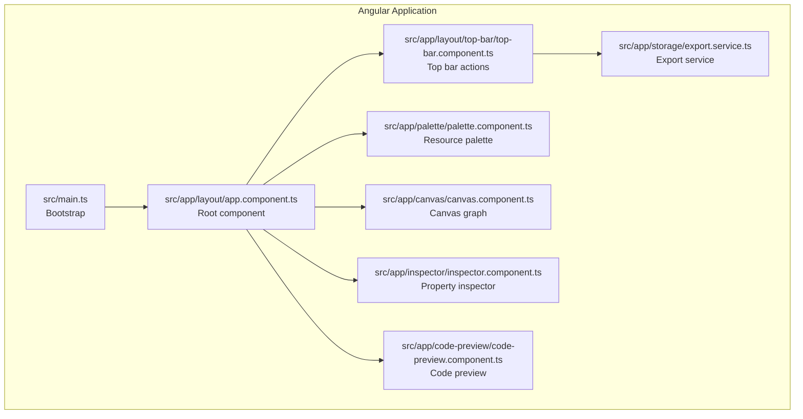
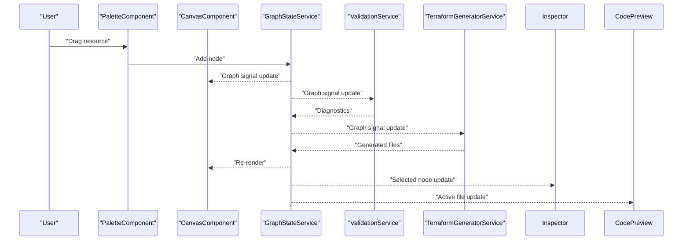
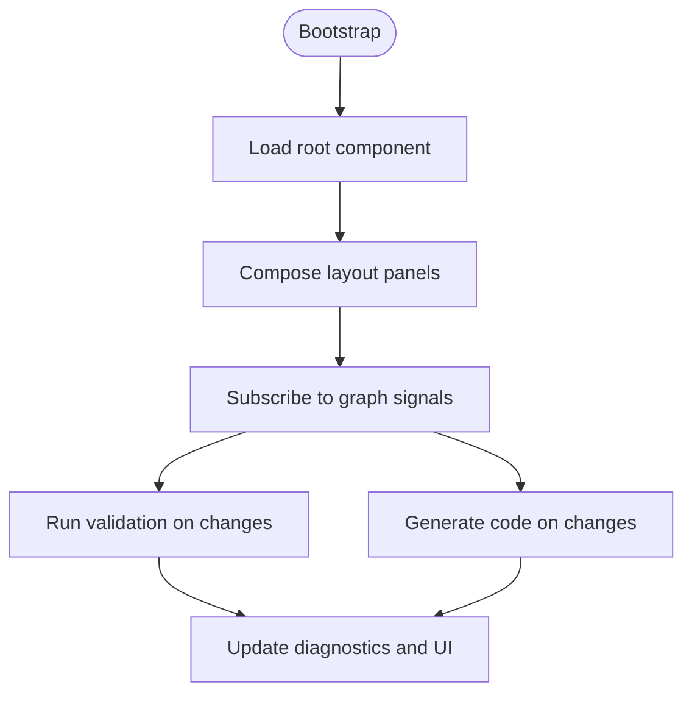
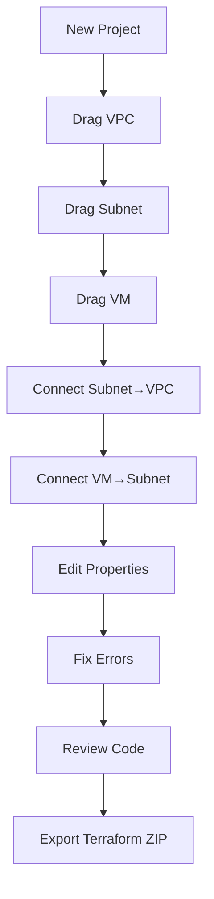
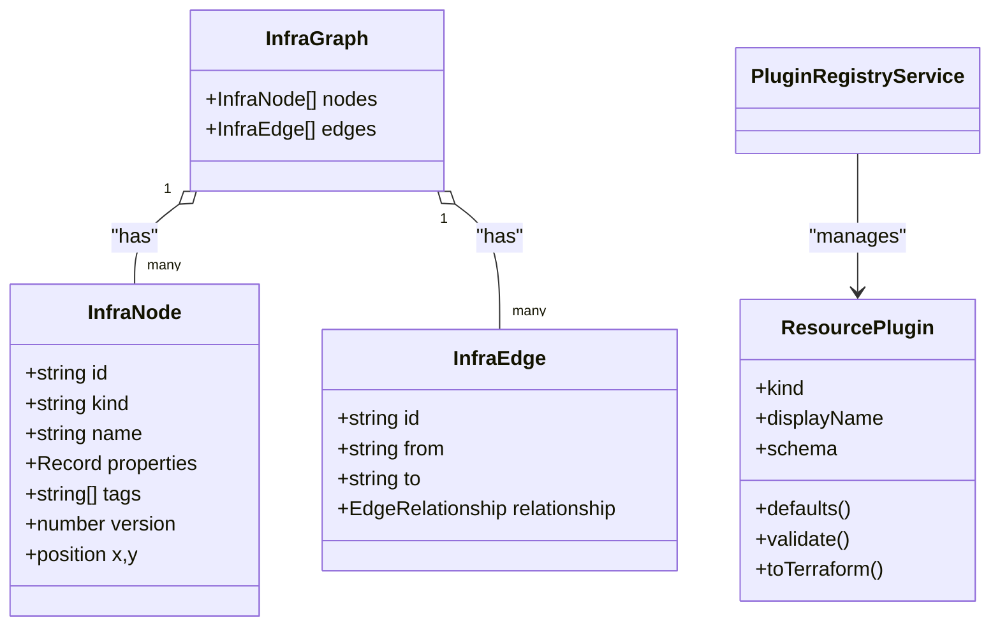
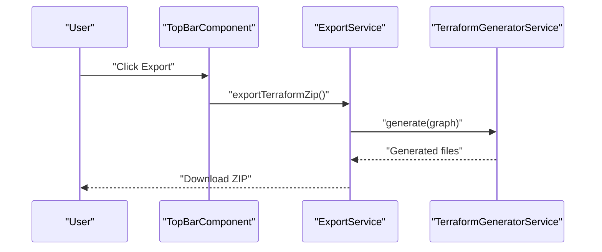
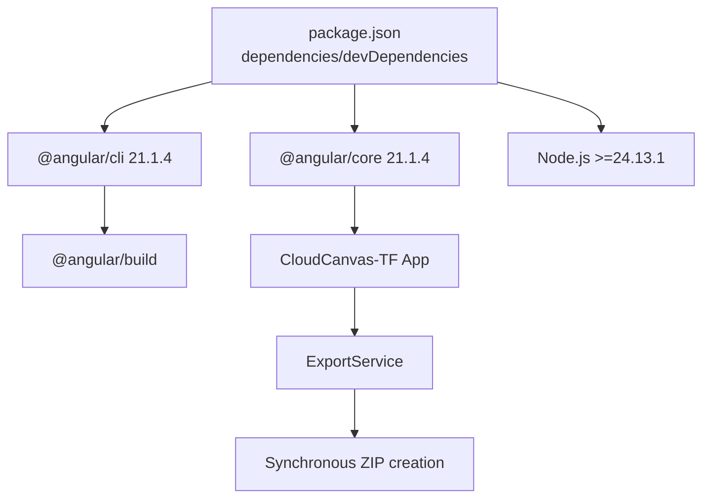

# Getting Started

<cite>
**Referenced Files in This Document**
- [README.md](file://README.md)
- [package.json](file://package.json)
- [angular.json](file://angular.json)
- [SYSTEM_DESIGN.md](file://SYSTEM_DESIGN.md)
- [walkthrough.md.resolved](file://walkthrough.md.resolved)
- [src/main.ts](file://src/main.ts)
- [src/app/layout/app.component.ts](file://src/app/layout/app.component.ts)
- [src/app/layout/top-bar/top-bar.component.ts](file://src/app/layout/top-bar/top-bar.component.ts)
- [src/app/palette/palette.component.ts](file://src/app/palette/palette.component.ts)
- [src/app/canvas/canvas.component.ts](file://src/app/canvas/canvas.component.ts)
- [src/app/inspector/inspector.component.ts](file://src/app/inspector/inspector.component.ts)
- [src/app/code-preview/code-preview.component.ts](file://src/app/code-preview/code-preview.component.ts)
- [src/app/storage/export.service.ts](file://src/app/storage/export.service.ts)
- [src/app/core/models/infra-graph.model.ts](file://src/app/core/models/infra-graph.model.ts)
- [src/app/infra/plugin-registry.service.ts](file://src/app/infra/plugin-registry.service.ts)
</cite>

## Table of Contents
1. [Introduction](#introduction)
2. [Project Structure](#project-structure)
3. [Core Components](#core-components)
4. [Architecture Overview](#architecture-overview)
5. [Detailed Component Analysis](#detailed-component-analysis)
6. [Dependency Analysis](#dependency-analysis)
7. [Performance Considerations](#performance-considerations)
8. [Troubleshooting Guide](#troubleshooting-guide)
9. [Conclusion](#conclusion)
10. [Appendices](#appendices)

## Introduction
CloudCanvas-TF is a visual infrastructure design studio for Google Cloud that outputs clean, editable Terraform. It is an Angular 21 application with a modern dark theme, featuring a drag-and-drop canvas, a searchable resource palette, a property inspector, real-time validation, and a live Terraform code preview. The application is designed to help developers and DevOps engineers rapidly prototype cloud architectures and export deterministic Terraform outputs for version control and CI/CD.

This guide walks you through prerequisites, installation, development environment setup, and the minimal standalone bootstrap app structure. It also provides a practical example of creating a simple infrastructure design and demonstrates the complete workflow from canvas creation to code generation and export.

## Project Structure
CloudCanvas-TF follows a feature-first Angular workspace layout with a standalone bootstrap app. The application is structured around a central graph model representing infrastructure nodes and edges, with services orchestrating validation, generation, and persistence.

**Diagram sources**
- [src/main.ts](file://src/main.ts#L1-L7)
- [src/app/layout/app.component.ts](file://src/app/layout/app.component.ts#L1-L48)
- [src/app/layout/top-bar/top-bar.component.ts](file://src/app/layout/top-bar/top-bar.component.ts#L1-L96)
- [src/app/palette/palette.component.ts](file://src/app/palette/palette.component.ts#L1-L83)
- [src/app/canvas/canvas.component.ts](file://src/app/canvas/canvas.component.ts#L1-L286)
- [src/app/inspector/inspector.component.ts](file://src/app/inspector/inspector.component.ts#L1-L103)
- [src/app/code-preview/code-preview.component.ts](file://src/app/code-preview/code-preview.component.ts#L1-L137)
- [src/app/storage/export.service.ts](file://src/app/storage/export.service.ts#L1-L203)

**Section sources**
- [README.md](file://README.md#L1-L19)
- [angular.json](file://angular.json#L1-L34)
- [src/main.ts](file://src/main.ts#L1-L7)
- [src/app/layout/app.component.ts](file://src/app/layout/app.component.ts#L1-L48)

## Core Components
- Bootstrap and Root Component: The application bootstraps the root component and wires together the UI panels.
- Top Bar: Provides project actions including saving, importing, exporting, and creating new projects.
- Palette: A searchable, categorized list of GCP resource plugins with drag-and-drop support.
- Canvas: An SVG-based graph surface supporting node placement, selection, movement, edge drawing, and deletion.
- Inspector: A dynamic form panel driven by resource schemas for editing properties and viewing diagnostics.
- Code Preview: Live rendering of generated Terraform files with syntax highlighting and clipboard copy.
- Export Service: Generates and downloads Terraform ZIPs, Project JSON, and full bundles.

**Section sources**
- [src/app/layout/app.component.ts](file://src/app/layout/app.component.ts#L1-L48)
- [src/app/layout/top-bar/top-bar.component.ts](file://src/app/layout/top-bar/top-bar.component.ts#L1-L96)
- [src/app/palette/palette.component.ts](file://src/app/palette/palette.component.ts#L1-L83)
- [src/app/canvas/canvas.component.ts](file://src/app/canvas/canvas.component.ts#L1-L286)
- [src/app/inspector/inspector.component.ts](file://src/app/inspector/inspector.component.ts#L1-L103)
- [src/app/code-preview/code-preview.component.ts](file://src/app/code-preview/code-preview.component.ts#L1-L137)
- [src/app/storage/export.service.ts](file://src/app/storage/export.service.ts#L1-L203)

## Architecture Overview
The application uses a signal-based reactive architecture. Changes to the graph propagate through validation and generation services, updating diagnostics and generated files in real time. The UI reacts to these signals, keeping the canvas, inspector, diagnostics, and code preview synchronized.

**Diagram sources**
- [src/app/layout/app.component.ts](file://src/app/layout/app.component.ts#L31-L42)
- [src/app/palette/palette.component.ts](file://src/app/palette/palette.component.ts#L62-L77)
- [src/app/canvas/canvas.component.ts](file://src/app/canvas/canvas.component.ts#L90-L99)
- [src/app/inspector/inspector.component.ts](file://src/app/inspector/inspector.component.ts#L25-L42)
- [src/app/code-preview/code-preview.component.ts](file://src/app/code-preview/code-preview.component.ts#L107-L118)

## Detailed Component Analysis

### Prerequisites and Setup
- Toolchain requirements:
  - Angular CLI: 21.1.4
  - Node.js: >=24.13.1
- Install dependencies and start the development server:
  - Install dependencies: npm install
  - Start development server: npm run start
- The Angular workspace configuration and build targets are defined in angular.json.

**Section sources**
- [README.md](file://README.md#L5-L13)
- [package.json](file://package.json#L33-L35)
- [angular.json](file://angular.json#L11-L26)

### Minimal Standalone Bootstrap App
- The application bootstraps the root component directly without a traditional NgModule.
- The root component composes the layout panels and subscribes to graph changes to drive validation and generation.

**Diagram sources**
- [src/main.ts](file://src/main.ts#L1-L7)
- [src/app/layout/app.component.ts](file://src/app/layout/app.component.ts#L26-L42)

**Section sources**
- [src/main.ts](file://src/main.ts#L1-L7)
- [src/app/layout/app.component.ts](file://src/app/layout/app.component.ts#L12-L25)

### First-Time User Guidance
- Navigate the interface:
  - Top Bar: Project name, save state, validate, export, settings.
  - Palette: Searchable, categorized resource list; drag resources onto the canvas.
  - Canvas: Pan/zoom; select/move/delete nodes; draw edges between nodes.
  - Inspector: Dynamic form for selected node properties; view diagnostics.
  - Diagnostics Panel: Errors/warnings/info; click to navigate to affected nodes.
  - Code Preview: Tabs for generated files; copy to clipboard.
- Add resources via drag-and-drop:
  - Drag a resource from the Palette onto the Canvas; the system places the node and selects it.
- Edit properties in the inspector:
  - Select a node to open the inspector; edit fields; validation updates immediately.
- Export Terraform code:
  - Use the Top Bar export menu to download a Terraform ZIP, Project JSON, or Full Bundle.

**Section sources**
- [SYSTEM_DESIGN.md](file://SYSTEM_DESIGN.md#L194-L230)
- [src/app/layout/top-bar/top-bar.component.ts](file://src/app/layout/top-bar/top-bar.component.ts#L41-L67)
- [src/app/palette/palette.component.ts](file://src/app/palette/palette.component.ts#L55-L77)
- [src/app/canvas/canvas.component.ts](file://src/app/canvas/canvas.component.ts#L106-L125)
- [src/app/inspector/inspector.component.ts](file://src/app/inspector/inspector.component.ts#L75-L85)
- [src/app/code-preview/code-preview.component.ts](file://src/app/code-preview/code-preview.component.ts#L120-L135)

### Practical Example: Creating a Simple Infrastructure Design
- Workflow overview:
  1. Create a new project.
  2. Drag a VPC network, subnet, and VM onto the canvas.
  3. Connect the subnet to the VPC and the VM to the subnet.
  4. Edit properties in the inspector; fix validation errors.
  5. Review the generated Terraform code in the preview.
  6. Export the Terraform ZIP for download.

**Diagram sources**
- [SYSTEM_DESIGN.md](file://SYSTEM_DESIGN.md#L166-L180)
- [src/app/layout/top-bar/top-bar.component.ts](file://src/app/layout/top-bar/top-bar.component.ts#L69-L76)
- [src/app/palette/palette.component.ts](file://src/app/palette/palette.component.ts#L62-L77)
- [src/app/canvas/canvas.component.ts](file://src/app/canvas/canvas.component.ts#L111-L121)
- [src/app/storage/export.service.ts](file://src/app/storage/export.service.ts#L18-L28)

**Section sources**
- [SYSTEM_DESIGN.md](file://SYSTEM_DESIGN.md#L166-L180)
- [src/app/layout/top-bar/top-bar.component.ts](file://src/app/layout/top-bar/top-bar.component.ts#L69-L76)
- [src/app/palette/palette.component.ts](file://src/app/palette/palette.component.ts#L62-L77)
- [src/app/canvas/canvas.component.ts](file://src/app/canvas/canvas.component.ts#L111-L121)
- [src/app/storage/export.service.ts](file://src/app/storage/export.service.ts#L18-L28)

### Data Model and Plugin Architecture
- Core data model:
  - InfraNode: identifier, kind, name, properties, optional tags, version, position.
  - InfraEdge: identifier, from/to node IDs, relationship type.
  - InfraGraph: collections of nodes and edges.
- Plugin contract:
  - ResourcePlugin defines schema, defaults, validation, and Terraform generation for each resource kind.
- Registry:
  - PluginRegistryService registers and exposes plugins grouped by category.

**Diagram sources**
- [src/app/core/models/infra-graph.model.ts](file://src/app/core/models/infra-graph.model.ts#L17-L39)
- [src/app/infra/plugin-registry.service.ts](file://src/app/infra/plugin-registry.service.ts#L17-L54)

**Section sources**
- [src/app/core/models/infra-graph.model.ts](file://src/app/core/models/infra-graph.model.ts#L1-L118)
- [src/app/infra/plugin-registry.service.ts](file://src/app/infra/plugin-registry.service.ts#L1-L73)

### Export and Download Workflow
- Export options:
  - Terraform ZIP: providers.tf, main.tf, variables.tf, outputs.tf, README.
  - Project JSON: canonical project representation for import.
  - Full Bundle: Terraform files plus project.json and diagnostics.
- The export service generates files, packages them synchronously, and triggers a download within the user gesture context.

**Diagram sources**
- [src/app/layout/top-bar/top-bar.component.ts](file://src/app/layout/top-bar/top-bar.component.ts#L45-L51)
- [src/app/storage/export.service.ts](file://src/app/storage/export.service.ts#L18-L28)

**Section sources**
- [src/app/storage/export.service.ts](file://src/app/storage/export.service.ts#L13-L59)
- [SYSTEM_DESIGN.md](file://SYSTEM_DESIGN.md#L422-L455)

## Dependency Analysis
- Angular CLI and Angular core libraries are aligned to version 21.1.4.
- Node.js engine requirement is >=24.13.1.
- The application uses a signal-based state management pattern with effects reacting to graph changes.
- The export service performs synchronous ZIP creation and download to preserve user gesture context.

**Diagram sources**
- [package.json](file://package.json#L12-L35)
- [angular.json](file://angular.json#L11-L26)
- [src/app/storage/export.service.ts](file://src/app/storage/export.service.ts#L83-L167)

**Section sources**
- [package.json](file://package.json#L12-L35)
- [angular.json](file://angular.json#L11-L26)

## Performance Considerations
- Interactive scalability targets hundreds of nodes on typical laptops.
- Heavy operations (sorting, validating, generating) run in Web Workers.
- Deterministic ordering ensures stable diffs and readability.
- Avoid long-running tasks on the main thread; leverage signals and debounced updates.

[No sources needed since this section provides general guidance]

## Troubleshooting Guide
- Node.js version mismatch:
  - Symptom: npm install fails or runtime errors.
  - Resolution: Ensure Node.js meets the minimum requirement.
- Angular CLI version mismatch:
  - Symptom: ng serve/build fails with version conflicts.
  - Resolution: Align Angular CLI to 21.1.4.
- Port already in use:
  - Symptom: Development server fails to start on default port.
  - Resolution: Stop the conflicting process or configure a different port in the dev server options.
- Drag-and-drop not working:
  - Symptom: Cannot place resources from palette to canvas.
  - Resolution: Verify palette drag handlers and canvas drop events; ensure plugin kinds are registered.
- Export fails:
  - Symptom: Export dialog closes without downloading.
  - Resolution: Confirm export is triggered synchronously from a user gesture; check console for errors.
- Validation errors preventing export:
  - Symptom: Export blocked due to critical errors.
  - Resolution: Fix required fields and address warnings surfaced in the diagnostics panel.

**Section sources**
- [package.json](file://package.json#L33-L35)
- [src/app/layout/top-bar/top-bar.component.ts](file://src/app/layout/top-bar/top-bar.component.ts#L45-L67)
- [src/app/storage/export.service.ts](file://src/app/storage/export.service.ts#L18-L28)

## Conclusion
You are ready to start designing cloud infrastructure visually with CloudCanvas-TF. Use the palette to add resources, connect them on the canvas, edit properties in the inspector, and review the generated Terraform in the code preview. Export your work as a ZIP, Project JSON, or Full Bundle for further use. If you encounter setup issues, verify your Node.js and Angular CLI versions and follow the troubleshooting steps above.

[No sources needed since this section summarizes without analyzing specific files]

## Appendices

### Quick Start Commands
- Install dependencies: npm install
- Start development server: npm run start

**Section sources**
- [README.md](file://README.md#L9-L13)

### Implementation Walkthrough Highlights
- Architecture overview and verification results illustrate the end-to-end flow from palette to export.
- The walkthrough confirms layout, drag-and-drop, property editing, code generation, validation, and export functionality.

**Section sources**
- [walkthrough.md.resolved](file://walkthrough.md.resolved#L8-L17)
- [walkthrough.md.resolved](file://walkthrough.md.resolved#L82-L89)