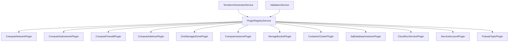
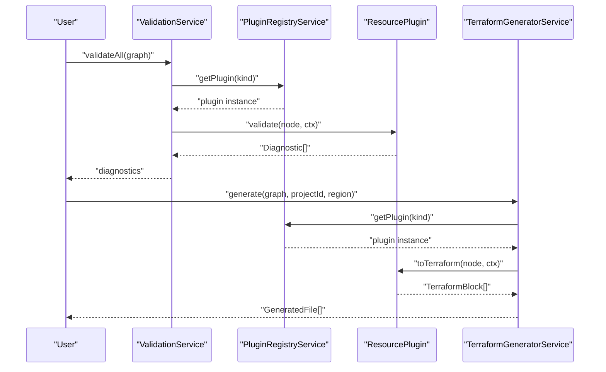
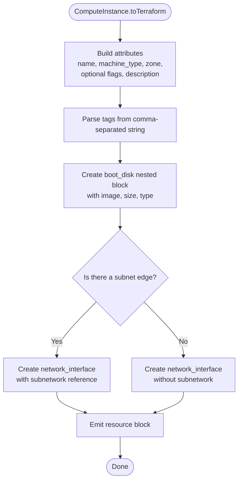
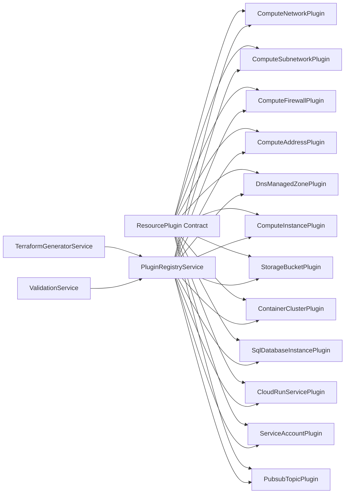

# GCP Resource Plugins

<cite>
**Referenced Files in This Document**
- [resource-plugin.model.ts](file://src/app/core/models/resource-plugin.model.ts)
- [plugin-registry.service.ts](file://src/app/infra/plugin-registry.service.ts)
- [terraform-generator.service.ts](file://src/app/terraform-engine/terraform-generator.service.ts)
- [validation.service.ts](file://src/app/validation/validation.service.ts)
- [compute-network.plugin.ts](file://src/app/infra/plugins/compute-network.plugin.ts)
- [compute-subnetwork.plugin.ts](file://src/app/infra/plugins/compute-subnetwork.plugin.ts)
- [compute-firewall.plugin.ts](file://src/app/infra/plugins/compute-firewall.plugin.ts)
- [compute-address.plugin.ts](file://src/app/infra/plugins/compute-address.plugin.ts)
- [dns-managed-zone.plugin.ts](file://src/app/infra/plugins/dns-managed-zone.plugin.ts)
- [compute-instance.plugin.ts](file://src/app/infra/plugins/compute-instance.plugin.ts)
- [storage-bucket.plugin.ts](file://src/app/infra/plugins/storage-bucket.plugin.ts)
- [container-cluster.plugin.ts](file://src/app/infra/plugins/container-cluster.plugin.ts)
- [sql-database-instance.plugin.ts](file://src/app/infra/plugins/sql-database-instance.plugin.ts)
- [cloud-run-service.plugin.ts](file://src/app/infra/plugins/cloud-run-service.plugin.ts)
- [service-account.plugin.ts](file://src/app/infra/plugins/service-account.plugin.ts)
- [pubsub-topic.plugin.ts](file://src/app/infra/plugins/pubsub-topic.plugin.ts)
</cite>

## Table of Contents
1. [Introduction](#introduction)
2. [Project Structure](#project-structure)
3. [Core Components](#core-components)
4. [Architecture Overview](#architecture-overview)
5. [Detailed Component Analysis](#detailed-component-analysis)
6. [Dependency Analysis](#dependency-analysis)
7. [Performance Considerations](#performance-considerations)
8. [Troubleshooting Guide](#troubleshooting-guide)
9. [Conclusion](#conclusion)
10. [Appendices](#appendices)

## Introduction
This document describes the 12 implemented GCP resource plugins that power the Terraform generation pipeline. It explains each plugin’s resource schema, validation rules, and Terraform block generation strategy. It also highlights common patterns across plugins, resource-specific validations, and edge-case handling. The goal is to help both developers and operators understand how each plugin maps configuration to Terraform resources and how the system enforces correctness and best practices.

## Project Structure
The plugin system is organized around a central plugin registry that registers all supported GCP resources. Each plugin implements a common interface to define:
- Resource schema (JsonSchema)
- Defaults
- Validation logic
- Terraform block generation
- Optional edge suggestions for graph connections

The Terraform generator orchestrates the generation of provider, main, variables, outputs, and README files. Validation ensures schema compliance, graph integrity, and policy checks.

**Diagram sources**
- [plugin-registry.service.ts](file://src/app/infra/plugin-registry.service.ts#L18-L50)
- [terraform-generator.service.ts](file://src/app/terraform-engine/terraform-generator.service.ts#L32-L51)
- [validation.service.ts](file://src/app/validation/validation.service.ts#L22-L38)

**Section sources**
- [plugin-registry.service.ts](file://src/app/infra/plugin-registry.service.ts#L1-L73)
- [terraform-generator.service.ts](file://src/app/terraform-engine/terraform-generator.service.ts#L1-L234)
- [validation.service.ts](file://src/app/validation/validation.service.ts#L1-L107)

## Core Components
- ResourcePlugin interface: Defines the contract for all plugins, including schema, defaults, validation, and Terraform generation.
- PluginRegistryService: Registers and exposes plugins by kind, and groups them by category.
- TerraformGeneratorService: Generates Terraform files from the graph by invoking each plugin’s toTerraform method and serializing blocks.
- ValidationService: Validates schema, graph integrity, and applies policy checks (e.g., duplicate names, dangling edges, missing VPC for subnets).

Key implementation patterns:
- Schema-driven UI: JsonSchema drives form fields, labels, groups, and defaults.
- ValidationContext and GeneratorContext: Provide graph and node lookup utilities for cross-resource checks and references.
- Nested blocks: Many resources emit nested blocks (e.g., boot_disk, network_interface, versioning) via TerraformGeneratorService serialization.

**Section sources**
- [resource-plugin.model.ts](file://src/app/core/models/resource-plugin.model.ts#L43-L54)
- [plugin-registry.service.ts](file://src/app/infra/plugin-registry.service.ts#L48-L71)
- [terraform-generator.service.ts](file://src/app/terraform-engine/terraform-generator.service.ts#L16-L51)
- [validation.service.ts](file://src/app/validation/validation.service.ts#L14-L20)

## Architecture Overview
The system generates Terraform configuration from a graph of resources. Each plugin contributes a TerraformBlock per resource, and the generator serializes them into main.tf along with providers.tf, variables.tf, outputs.tf, and a generated README.

**Diagram sources**
- [validation.service.ts](file://src/app/validation/validation.service.ts#L14-L38)
- [plugin-registry.service.ts](file://src/app/infra/plugin-registry.service.ts#L48-L50)
- [terraform-generator.service.ts](file://src/app/terraform-engine/terraform-generator.service.ts#L32-L51)

## Detailed Component Analysis

### Network Resources

#### ComputeNetwork (VPC Network)
- Schema: name, auto_create_subnetworks, routing_mode, mtu, delete_default_routes_on_create, description.
- Defaults: sensible defaults for routing_mode, mtu, and booleans.
- Validation: enforces required name; validates MTU range; warns when auto-create subnetworks is enabled.
- Terraform generation: emits google_compute_network with attributes; conditionally adds mtu and advanced flags.

Common patterns:
- Uses node.name fallback when property is absent.
- Serializes only non-default attributes.

Edge cases:
- MTU out-of-range triggers an error diagnostic.

**Section sources**
- [compute-network.plugin.ts](file://src/app/infra/plugins/compute-network.plugin.ts#L11-L55)
- [compute-network.plugin.ts](file://src/app/infra/plugins/compute-network.plugin.ts#L57-L66)
- [compute-network.plugin.ts](file://src/app/infra/plugins/compute-network.plugin.ts#L68-L99)
- [compute-network.plugin.ts](file://src/app/infra/plugins/compute-network.plugin.ts#L101-L123)

#### ComputeSubnetwork (Subnet)
- Schema: name, ip_cidr_range, region, private_ip_google_access, purpose, description.
- Defaults: sets defaults for CIDR, region, and boolean toggles.
- Validation: requires name, CIDR, and region; warns if not attached to a VPC network.
- Terraform generation: resolves VPC network reference via edge; sets network attribute; includes optional description.

Edge cases:
- Missing VPC edge produces a warning diagnostic.
- Suggests attaching to a VPC network.

**Section sources**
- [compute-subnetwork.plugin.ts](file://src/app/infra/plugins/compute-subnetwork.plugin.ts#L11-L53)
- [compute-subnetwork.plugin.ts](file://src/app/infra/plugins/compute-subnetwork.plugin.ts#L55-L64)
- [compute-subnetwork.plugin.ts](file://src/app/infra/plugins/compute-subnetwork.plugin.ts#L66-L97)
- [compute-subnetwork.plugin.ts](file://src/app/infra/plugins/compute-subnetwork.plugin.ts#L99-L124)
- [compute-subnetwork.plugin.ts](file://src/app/infra/plugins/compute-subnetwork.plugin.ts#L126-L128)

#### ComputeFirewall (Firewall Rule)
- Schema: name, direction, priority, protocol, ports, source_ranges.
- Defaults: sensible defaults for direction, priority, protocol, and source ranges.
- Validation: enforces required name; warns when source_ranges is open to the internet.
- Terraform generation: emits google_compute_firewall with nested allow block.

Edge cases:
- Open firewall rule triggers a warning diagnostic.

**Section sources**
- [compute-firewall.plugin.ts](file://src/app/infra/plugins/compute-firewall.plugin.ts#L11-L20)
- [compute-firewall.plugin.ts](file://src/app/infra/plugins/compute-firewall.plugin.ts#L22-L31)
- [compute-firewall.plugin.ts](file://src/app/infra/plugins/compute-firewall.plugin.ts#L33-L40)
- [compute-firewall.plugin.ts](file://src/app/infra/plugins/compute-firewall.plugin.ts#L42-L44)

#### ComputeAddress (Static IP)
- Schema: name, address_type, region.
- Defaults: sets default address_type and region.
- Validation: enforces required name.
- Terraform generation: emits google_compute_address with attributes.

Edge cases:
- None explicitly handled; plugin suggests no edges.

**Section sources**
- [compute-address.plugin.ts](file://src/app/infra/plugins/compute-address.plugin.ts#L11-L17)
- [compute-address.plugin.ts](file://src/app/infra/plugins/compute-address.plugin.ts#L19-L25)
- [compute-address.plugin.ts](file://src/app/infra/plugins/compute-address.plugin.ts#L27-L33)
- [compute-address.plugin.ts](file://src/app/infra/plugins/compute-address.plugin.ts#L35-L36)

#### DnsManagedZone (Cloud DNS Zone)
- Schema: name, dns_name, visibility, zone_description.
- Defaults: sets default visibility and empty description.
- Validation: enforces required name and dns_name.
- Terraform generation: emits google_dns_managed_zone with optional visibility and description.

Edge cases:
- Missing dns_name triggers an error diagnostic with remediation guidance.

**Section sources**
- [dns-managed-zone.plugin.ts](file://src/app/infra/plugins/dns-managed-zone.plugin.ts#L11-L18)
- [dns-managed-zone.plugin.ts](file://src/app/infra/plugins/dns-managed-zone.plugin.ts#L20-L27)
- [dns-managed-zone.plugin.ts](file://src/app/infra/plugins/dns-managed-zone.plugin.ts#L29-L35)
- [dns-managed-zone.plugin.ts](file://src/app/infra/plugins/dns-managed-zone.plugin.ts#L37-L38)

### Compute Resource

#### ComputeInstance (VM Instance)
- Schema: name, machine_type, zone, boot disk options, can_ip_forward, tags, allow_stopping_for_update, description.
- Defaults: sets defaults for machine type, zone, boot disk, and toggles.
- Validation: enforces required name and zone; warns if not connected to a subnet.
- Terraform generation: constructs attributes and nested blocks for boot_disk and network_interface; optionally connects to a subnet via reference.

Edge cases:
- No subnet connection produces a warning diagnostic.
- Tags are parsed from comma-separated string.

**Diagram sources**
- [compute-instance.plugin.ts](file://src/app/infra/plugins/compute-instance.plugin.ts#L82-L122)

**Section sources**
- [compute-instance.plugin.ts](file://src/app/infra/plugins/compute-instance.plugin.ts#L11-L50)
- [compute-instance.plugin.ts](file://src/app/infra/plugins/compute-instance.plugin.ts#L52-L59)
- [compute-instance.plugin.ts](file://src/app/infra/plugins/compute-instance.plugin.ts#L61-L80)
- [compute-instance.plugin.ts](file://src/app/infra/plugins/compute-instance.plugin.ts#L82-L122)
- [compute-instance.plugin.ts](file://src/app/infra/plugins/compute-instance.plugin.ts#L124-L126)

### Storage Resource

#### StorageBucket (Cloud Storage)
- Schema: name, location, storage_class, uniform_bucket_level_access, versioning, force_destroy, public_access_prevention.
- Defaults: enables uniform bucket-level access by default; others default to conservative values.
- Validation: enforces required name; warns when public_access_prevention is not enforced and when ACL mode is used.
- Terraform generation: emits google_storage_bucket with optional versioning nested block.

Edge cases:
- Warns about potential public access risk and ACL mode security posture.

**Section sources**
- [storage-bucket.plugin.ts](file://src/app/infra/plugins/storage-bucket.plugin.ts#L11-L52)
- [storage-bucket.plugin.ts](file://src/app/infra/plugins/storage-bucket.plugin.ts#L54-L60)
- [storage-bucket.plugin.ts](file://src/app/infra/plugins/storage-bucket.plugin.ts#L62-L81)
- [storage-bucket.plugin.ts](file://src/app/infra/plugins/storage-bucket.plugin.ts#L83-L103)

### Kubernetes Resource

#### ContainerCluster (GKE Cluster)
- Schema: name, location, initial_node_count, remove_default_node_pool, deletion_protection, node_machine_type, node_disk_size_gb, enable_autopilot, networking_mode, description.
- Defaults: sets defaults for counts, toggles, and node configuration.
- Validation: enforces required name and location; warns about high-cost combinations; informs about default network usage.
- Terraform generation: sets attributes; optionally attaches to VPC and subnet via references; supports autopilot and networking modes.

Edge cases:
- Missing subnet connection is informational.
- Suggests attaching to VPC and subnet.

**Section sources**
- [container-cluster.plugin.ts](file://src/app/infra/plugins/container-cluster.plugin.ts#L11-L53)
- [container-cluster.plugin.ts](file://src/app/infra/plugins/container-cluster.plugin.ts#L55-L62)
- [container-cluster.plugin.ts](file://src/app/infra/plugins/container-cluster.plugin.ts#L64-L91)
- [container-cluster.plugin.ts](file://src/app/infra/plugins/container-cluster.plugin.ts#L93-L131)
- [container-cluster.plugin.ts](file://src/app/infra/plugins/container-cluster.plugin.ts#L133-L138)

### Database Resource

#### SqlDatabaseInstance (Cloud SQL)
- Schema: name, database_version, tier, region, deletion_protection, availability_type.
- Defaults: sets defaults for version, tier, region, and protection.
- Validation: enforces required name; warns when deletion protection is disabled.
- Terraform generation: emits google_sql_database_instance with nested settings block.

Edge cases:
- Deletion protection disabled triggers a warning diagnostic.

**Section sources**
- [sql-database-instance.plugin.ts](file://src/app/infra/plugins/sql-database-instance.plugin.ts#L11-L20)
- [sql-database-instance.plugin.ts](file://src/app/infra/plugins/sql-database-instance.plugin.ts#L22-L31)
- [sql-database-instance.plugin.ts](file://src/app/infra/plugins/sql-database-instance.plugin.ts#L33-L45)
- [sql-database-instance.plugin.ts](file://src/app/infra/plugins/sql-database-instance.plugin.ts#L47-L48)

### Serverless Resource

#### CloudRunService (Cloud Run)
- Schema: name, location, image, port, max_instances, cpu, memory.
- Defaults: sets defaults for location, port, scaling, and resources.
- Validation: enforces required name and image.
- Terraform generation: emits google_cloud_run_v2_service with template nested block.

Edge cases:
- Missing image triggers an error diagnostic.

**Section sources**
- [cloud-run-service.plugin.ts](file://src/app/infra/plugins/cloud-run-service.plugin.ts#L11-L21)
- [cloud-run-service.plugin.ts](file://src/app/infra/plugins/cloud-run-service.plugin.ts#L23-L32)
- [cloud-run-service.plugin.ts](file://src/app/infra/plugins/cloud-run-service.plugin.ts#L34-L41)
- [cloud-run-service.plugin.ts](file://src/app/infra/plugins/cloud-run-service.plugin.ts#L43-L44)

### Security Resource

#### ServiceAccount
- Schema: account_id, display_name, sa_description.
- Defaults: empty strings.
- Validation: enforces required account_id.
- Terraform generation: emits google_service_account with optional display name and description.

Edge cases:
- None explicitly handled.

**Section sources**
- [service-account.plugin.ts](file://src/app/infra/plugins/service-account.plugin.ts#L11-L17)
- [service-account.plugin.ts](file://src/app/infra/plugins/service-account.plugin.ts#L19-L25)
- [service-account.plugin.ts](file://src/app/infra/plugins/service-account.plugin.ts#L27-L33)
- [service-account.plugin.ts](file://src/app/infra/plugins/service-account.plugin.ts#L35-L36)

### Messaging Resource

#### PubsubTopic
- Schema: name, message_retention_duration.
- Defaults: sets default retention duration.
- Validation: enforces required name.
- Terraform generation: emits google_pubsub_topic with optional retention setting.

Edge cases:
- None explicitly handled.

**Section sources**
- [pubsub-topic.plugin.ts](file://src/app/infra/plugins/pubsub-topic.plugin.ts#L11-L16)
- [pubsub-topic.plugin.ts](file://src/app/infra/plugins/pubsub-topic.plugin.ts#L18-L24)
- [pubsub-topic.plugin.ts](file://src/app/infra/plugins/pubsub-topic.plugin.ts#L26-L31)
- [pubsub-topic.plugin.ts](file://src/app/infra/plugins/pubsub-topic.plugin.ts#L33-L34)

## Dependency Analysis
- Registry-to-plugins: The registry maintains a map keyed by ResourceKind and returns the appropriate plugin for each node.
- Generator-to-plugins: The generator iterates nodes in topological order and invokes each plugin’s toTerraform method.
- Validation-to-plugins: ValidationService calls each plugin’s validate method and aggregates diagnostics.
- Cross-resource references: GeneratorContext.getNodeReference allows plugins to reference attributes of other nodes (e.g., network.id, subnet.name).

**Diagram sources**
- [resource-plugin.model.ts](file://src/app/core/models/resource-plugin.model.ts#L43-L54)
- [plugin-registry.service.ts](file://src/app/infra/plugin-registry.service.ts#L18-L50)
- [terraform-generator.service.ts](file://src/app/terraform-engine/terraform-generator.service.ts#L32-L51)
- [validation.service.ts](file://src/app/validation/validation.service.ts#L22-L38)

**Section sources**
- [plugin-registry.service.ts](file://src/app/infra/plugin-registry.service.ts#L48-L71)
- [terraform-generator.service.ts](file://src/app/terraform-engine/terraform-generator.service.ts#L22-L30)
- [validation.service.ts](file://src/app/validation/validation.service.ts#L22-L38)

## Performance Considerations
- Topological sorting: The generator sorts nodes to respect dependencies, preventing cycles and ensuring correct emission order.
- Reference resolution: Using getNodeReference avoids string concatenation errors and ensures accurate inter-resource references.
- Conditional emission: Plugins only include attributes and nested blocks when non-default or explicitly set, reducing noise in generated files.

[No sources needed since this section provides general guidance]

## Troubleshooting Guide
Common diagnostics and remedies:
- UNKNOWN_RESOURCE: A node references an unsupported kind; ensure the plugin is registered.
- DEPENDENCY_CYCLE: Circular edges detected; break the cycle to allow generation.
- DANGLING_EDGE: An edge points to a missing node; fix node IDs.
- DUPLICATE_NAME: Duplicate resource names for the same type; rename to be unique.
- SUBNET_WITHOUT_VPC: Subnets exist without a VPC; add a VPC and connect subnets.
- REQUIRED_FIELD: A required field is missing; fill in the field as indicated.
- OPEN_FIREWALL: Firewall allows 0.0.0.0/0; restrict source ranges for production.
- PUBLIC_BUCKET_RISK: Public access prevention not enforced; set to enforced.
- NO_DELETION_PROTECTION: Deletion protection disabled; enable for production databases.
- HIGH_COST_CLUSTER: Large node count with high-tier machines may be expensive; adjust sizing.

**Section sources**
- [validation.service.ts](file://src/app/validation/validation.service.ts#L30-L36)
- [validation.service.ts](file://src/app/validation/validation.service.ts#L43-L51)
- [validation.service.ts](file://src/app/validation/validation.service.ts#L54-L65)
- [validation.service.ts](file://src/app/validation/validation.service.ts#L67-L78)
- [validation.service.ts](file://src/app/validation/validation.service.ts#L94-L102)
- [compute-firewall.plugin.ts](file://src/app/infra/plugins/compute-firewall.plugin.ts#L29-L30)
- [storage-bucket.plugin.ts](file://src/app/infra/plugins/storage-bucket.plugin.ts#L67-L72)
- [sql-database-instance.plugin.ts](file://src/app/infra/plugins/sql-database-instance.plugin.ts#L29-L30)
- [container-cluster.plugin.ts](file://src/app/infra/plugins/container-cluster.plugin.ts#L74-L79)

## Conclusion
The plugin architecture cleanly separates concerns between schema, validation, and Terraform generation. Each plugin encapsulates resource-specific logic while adhering to a shared interface. The registry and generator coordinate to produce valid, policy-aware Terraform configurations. ValidationService complements this by enforcing schema compliance and operational best practices.

[No sources needed since this section summarizes without analyzing specific files]

## Appendices

### Common Patterns Across Plugins
- JsonSchema drives UI and defaults; plugins define required fields, options, and grouping.
- ValidationContext provides access to the entire graph for cross-node checks (e.g., subnet-VPC connectivity).
- GeneratorContext provides getNodeReference for robust inter-resource references.
- Nested blocks are emitted via TerraformGeneratorService with dedicated serializers for common structures (boot_disk, network_interface, versioning).

**Section sources**
- [resource-plugin.model.ts](file://src/app/core/models/resource-plugin.model.ts#L11-L24)
- [resource-plugin.model.ts](file://src/app/core/models/resource-plugin.model.ts#L32-L41)
- [terraform-generator.service.ts](file://src/app/terraform-engine/terraform-generator.service.ts#L156-L217)