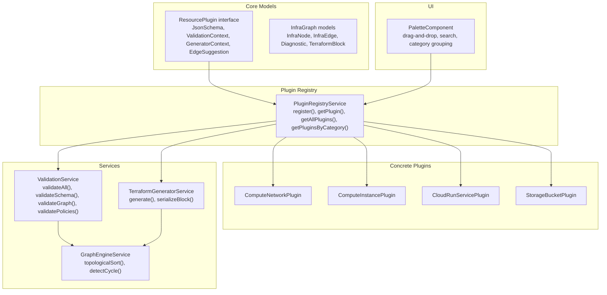
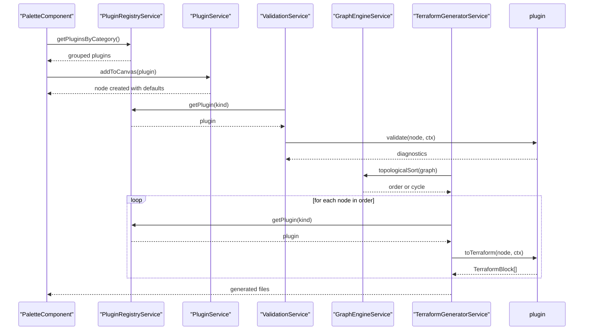
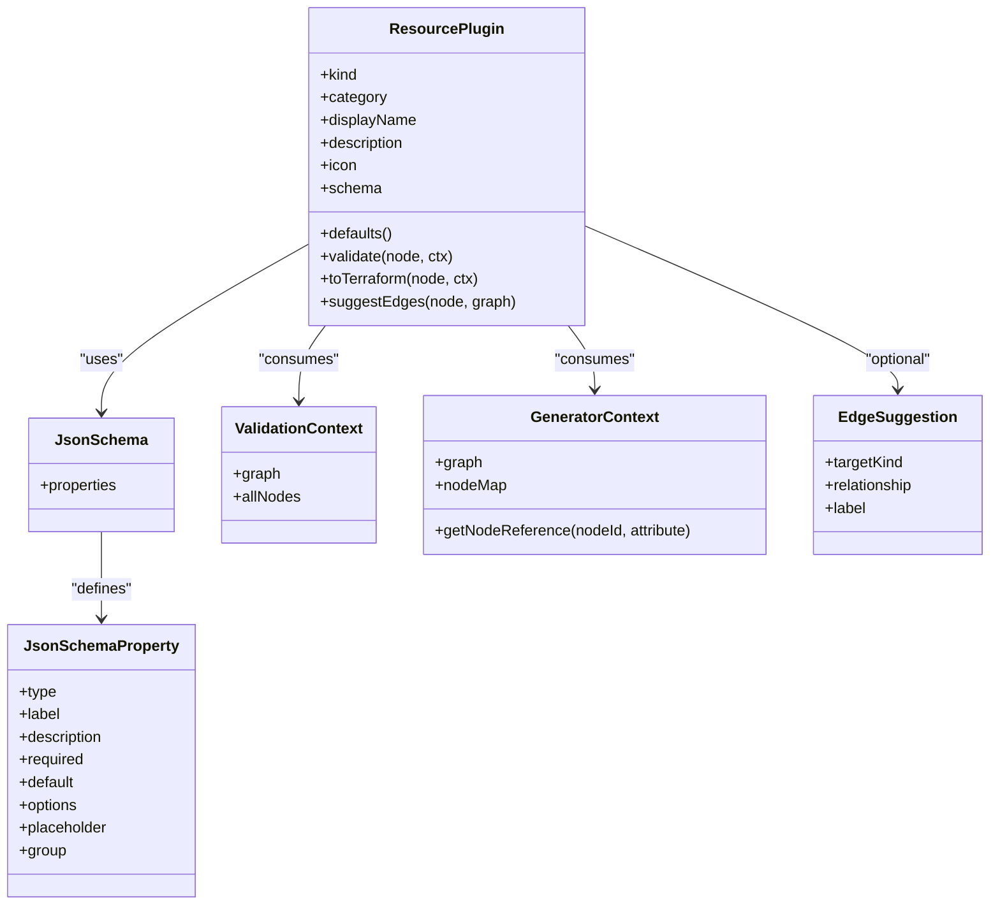
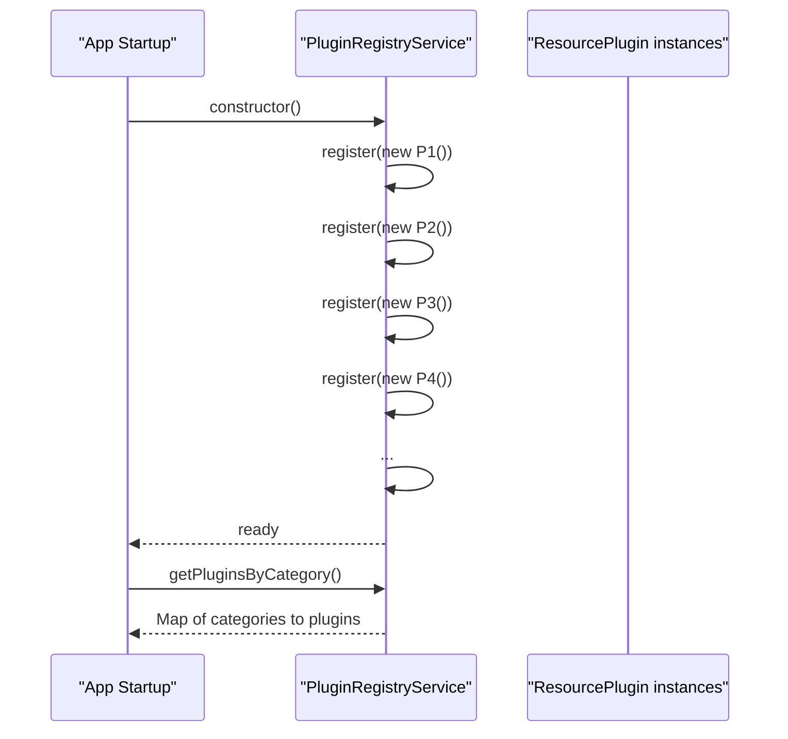
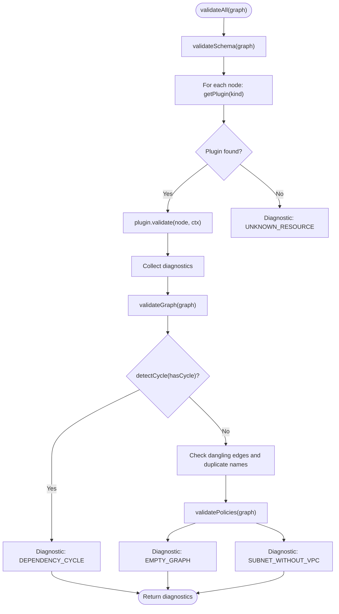
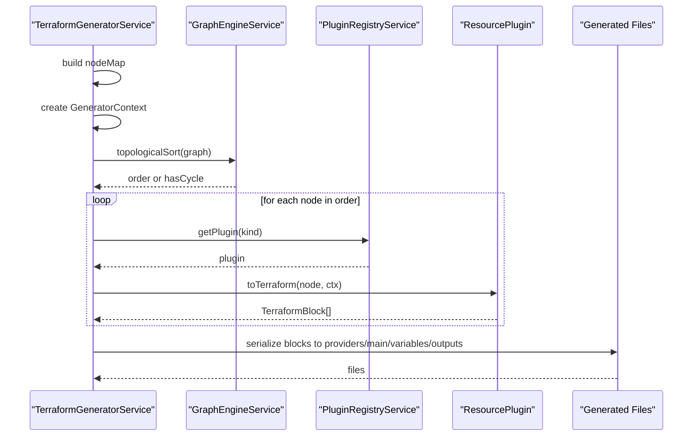
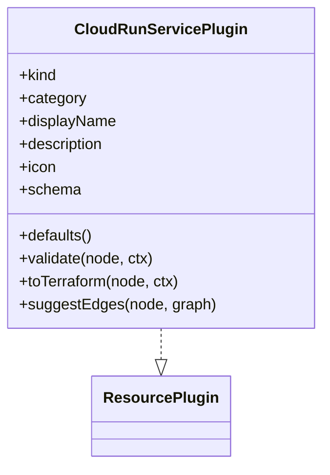
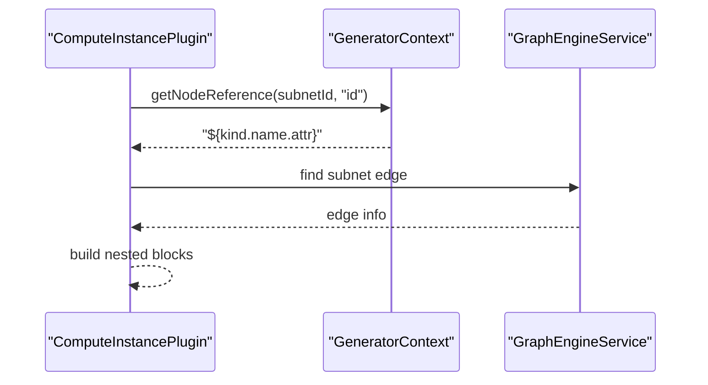
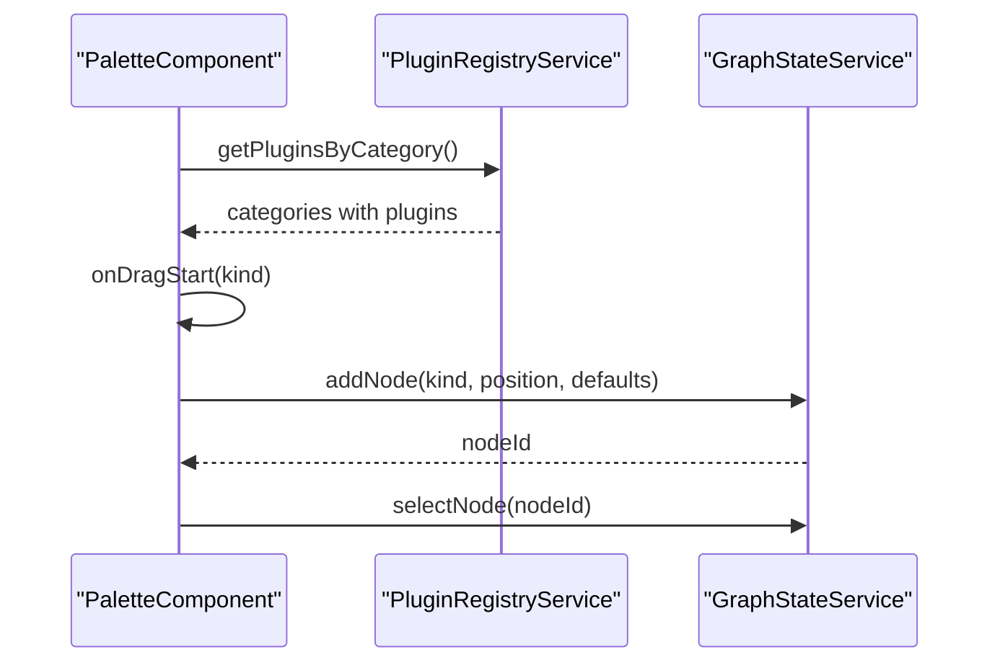
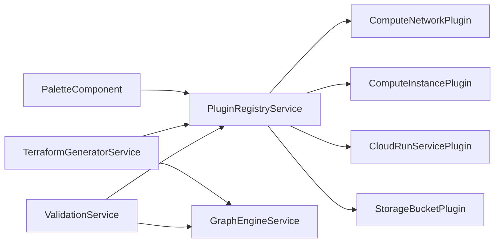

# Plugin Architecture

<cite>
**Referenced Files in This Document**
- [resource-plugin.model.ts](file://src/app/core/models/resource-plugin.model.ts)
- [infra-graph.model.ts](file://src/app/core/models/infra-graph.model.ts)
- [plugin-registry.service.ts](file://src/app/infra/plugin-registry.service.ts)
- [cloud-run-service.plugin.ts](file://src/app/infra/plugins/cloud-run-service.plugin.ts)
- [compute-instance.plugin.ts](file://src/app/infra/plugins/compute-instance.plugin.ts)
- [compute-network.plugin.ts](file://src/app/infra/plugins/compute-network.plugin.ts)
- [storage-bucket.plugin.ts](file://src/app/infra/plugins/storage-bucket.plugin.ts)
- [validation.service.ts](file://src/app/validation/validation.service.ts)
- [terraform-generator.service.ts](file://src/app/terraform-engine/terraform-generator.service.ts)
- [graph-engine.service.ts](file://src/app/graph-engine/graph-engine.service.ts)
- [palette.component.ts](file://src/app/palette/palette.component.ts)
</cite>

## Table of Contents
1. [Introduction](#introduction)
2. [Project Structure](#project-structure)
3. [Core Components](#core-components)
4. [Architecture Overview](#architecture-overview)
5. [Detailed Component Analysis](#detailed-component-analysis)
6. [Dependency Analysis](#dependency-analysis)
7. [Performance Considerations](#performance-considerations)
8. [Troubleshooting Guide](#troubleshooting-guide)
9. [Conclusion](#conclusion)
10. [Appendices](#appendices)

## Introduction
This document explains the ResourcePlugin interface and plugin contract architecture used to model infrastructure resources, define property forms, validate configurations, and generate Terraform code. It covers the plugin lifecycle, registration patterns, and integration with the core system, including practical examples of implementing custom plugins and handling validation logic. The plugin contract ensures extensibility and maintainability by encapsulating resource-specific behavior behind a consistent interface.

## Project Structure
The plugin architecture spans several modules:
- Core models define the plugin contract, graph structures, and Terraform serialization types.
- Plugin registry centralizes plugin discovery and grouping.
- Individual plugins implement the contract for specific resource kinds.
- Services orchestrate validation and Terraform generation.
- UI components integrate plugins into the palette and graph canvas.

**Diagram sources**
- [resource-plugin.model.ts](file://src/app/core/models/resource-plugin.model.ts#L43-L54)
- [infra-graph.model.ts](file://src/app/core/models/infra-graph.model.ts#L1-L118)
- [plugin-registry.service.ts](file://src/app/infra/plugin-registry.service.ts#L17-L72)
- [cloud-run-service.plugin.ts](file://src/app/infra/plugins/cloud-run-service.plugin.ts#L4-L44)
- [compute-instance.plugin.ts](file://src/app/infra/plugins/compute-instance.plugin.ts#L4-L127)
- [compute-network.plugin.ts](file://src/app/infra/plugins/compute-network.plugin.ts#L4-L128)
- [storage-bucket.plugin.ts](file://src/app/infra/plugins/storage-bucket.plugin.ts#L4-L104)
- [validation.service.ts](file://src/app/validation/validation.service.ts#L7-L106)
- [terraform-generator.service.ts](file://src/app/terraform-engine/terraform-generator.service.ts#L9-L233)
- [graph-engine.service.ts](file://src/app/graph-engine/graph-engine.service.ts#L10-L126)
- [palette.component.ts](file://src/app/palette/palette.component.ts#L14-L82)

**Section sources**
- [resource-plugin.model.ts](file://src/app/core/models/resource-plugin.model.ts#L1-L55)
- [infra-graph.model.ts](file://src/app/core/models/infra-graph.model.ts#L1-L118)
- [plugin-registry.service.ts](file://src/app/infra/plugin-registry.service.ts#L17-L72)
- [validation.service.ts](file://src/app/validation/validation.service.ts#L7-L106)
- [terraform-generator.service.ts](file://src/app/terraform-engine/terraform-generator.service.ts#L9-L233)
- [graph-engine.service.ts](file://src/app/graph-engine/graph-engine.service.ts#L10-L126)
- [palette.component.ts](file://src/app/palette/palette.component.ts#L14-L82)

## Core Components
This section documents the plugin contract and core data structures that enable extensible, maintainable resource modeling.

- ResourcePlugin interface
  - kind: Unique resource identifier used to register and retrieve plugins.
  - category: Logical grouping for UI presentation and filtering.
  - displayName, description, icon: Metadata for UI rendering and user guidance.
  - schema: JSON form schema describing editable properties and groups.
  - defaults(): Returns initial property values for new nodes.
  - validate(node, ctx): Validates a node against resource-specific rules and graph context.
  - toTerraform(node, ctx): Produces Terraform resource blocks and nested blocks.
  - suggestEdges(node, graph)?: Optional edge suggestions for connecting related resources.

- JsonSchema and JsonSchemaProperty
  - properties: A dictionary keyed by property names with type, label, description, required, default, options, placeholder, and group.

- ValidationContext and GeneratorContext
  - ValidationContext: Provides access to the full graph and all nodes for cross-node validations.
  - GeneratorContext: Provides access to the graph, a node map, and a helper to generate Terraform references between nodes.

- EdgeSuggestion
  - Describes suggested connections to related resource kinds with a relationship type and label.

- InfraGraph, InfraNode, InfraEdge, Diagnostic, TerraformBlock
  - Core graph structures and diagnostic reporting used by plugins and services.

**Section sources**
- [resource-plugin.model.ts](file://src/app/core/models/resource-plugin.model.ts#L11-L54)
- [infra-graph.model.ts](file://src/app/core/models/infra-graph.model.ts#L17-L77)

## Architecture Overview
The plugin architecture follows a contract-driven design:
- Plugins implement ResourcePlugin for a specific ResourceKind.
- PluginRegistryService registers plugins and exposes lookup and grouping APIs.
- ValidationService orchestrates schema, graph, and policy validations using plugin-provided validators.
- TerraformGeneratorService generates Terraform files by delegating to plugins and using GraphEngineService for ordering.
- UI components (PaletteComponent) present plugins and create nodes with defaults.

**Diagram sources**
- [palette.component.ts](file://src/app/palette/palette.component.ts#L21-L77)
- [plugin-registry.service.ts](file://src/app/infra/plugin-registry.service.ts#L48-L71)
- [validation.service.ts](file://src/app/validation/validation.service.ts#L14-L39)
- [graph-engine.service.ts](file://src/app/graph-engine/graph-engine.service.ts#L65-L110)
- [terraform-generator.service.ts](file://src/app/terraform-engine/terraform-generator.service.ts#L16-L51)

## Detailed Component Analysis

### ResourcePlugin Interface and Contract
The ResourcePlugin interface defines the contract that all resource plugins must implement. It includes:
- Identification and metadata: kind, category, displayName, description, icon.
- Property form definition: schema with JsonSchema and JsonSchemaProperty.
- Lifecycle hooks: defaults(), validate(), toTerraform(), and optional suggestEdges().
- Context-aware operations: ValidationContext and GeneratorContext provide graph and node references.

**Diagram sources**
- [resource-plugin.model.ts](file://src/app/core/models/resource-plugin.model.ts#L11-L54)

**Section sources**
- [resource-plugin.model.ts](file://src/app/core/models/resource-plugin.model.ts#L43-L54)

### Plugin Registry and Lifecycle
PluginRegistryService manages plugin registration and discovery:
- Registers plugins during construction by kind.
- Exposes getPlugin(kind), getAllPlugins(), and getPluginsByCategory() for UI and services.
- getPluginsByCategory() maintains a fixed order and filters empty categories.

**Diagram sources**
- [plugin-registry.service.ts](file://src/app/infra/plugin-registry.service.ts#L21-L42)
- [plugin-registry.service.ts](file://src/app/infra/plugin-registry.service.ts#L56-L71)

**Section sources**
- [plugin-registry.service.ts](file://src/app/infra/plugin-registry.service.ts#L17-L72)

### Validation Orchestration
ValidationService coordinates multiple validation layers:
- validateSchema: Iterates nodes, retrieves plugin by kind, and runs plugin.validate() with ValidationContext.
- validateGraph: Uses GraphEngineService to detect cycles, dangling edges, and duplicate names.
- validatePolicies: Adds informational and warning diagnostics for empty graphs and common misconfigurations.

**Diagram sources**
- [validation.service.ts](file://src/app/validation/validation.service.ts#L14-L105)
- [graph-engine.service.ts](file://src/app/graph-engine/graph-engine.service.ts#L27-L63)

**Section sources**
- [validation.service.ts](file://src/app/validation/validation.service.ts#L7-L106)
- [graph-engine.service.ts](file://src/app/graph-engine/graph-engine.service.ts#L10-L126)

### Terraform Generation Pipeline
TerraformGeneratorService transforms the graph into Terraform files:
- Builds a nodeMap for reference resolution.
- Creates a GeneratorContext with getNodeReference to produce Terraform references.
- Sorts nodes topologically; if a cycle exists, falls back to insertion order.
- Delegates to plugins via toTerraform(node, ctx) and serializes blocks to files.

**Diagram sources**
- [terraform-generator.service.ts](file://src/app/terraform-engine/terraform-generator.service.ts#L16-L51)
- [graph-engine.service.ts](file://src/app/graph-engine/graph-engine.service.ts#L65-L110)
- [plugin-registry.service.ts](file://src/app/infra/plugin-registry.service.ts#L48-L54)

**Section sources**
- [terraform-generator.service.ts](file://src/app/terraform-engine/terraform-generator.service.ts#L9-L233)
- [graph-engine.service.ts](file://src/app/graph-engine/graph-engine.service.ts#L10-L126)

### Example Plugins

#### Cloud Run Service Plugin
Implements ResourcePlugin for a serverless container service:
- kind: google_cloud_run_v2_service
- category: Serverless
- schema: Properties include name, location, image, port, max_instances, CPU, and memory.
- defaults(): Initializes default values for all properties.
- validate(): Enforces required fields and returns diagnostics.
- toTerraform(): Produces a Terraform resource block with nested template block.
- suggestEdges(): No suggestions.

**Diagram sources**
- [cloud-run-service.plugin.ts](file://src/app/infra/plugins/cloud-run-service.plugin.ts#L4-L44)

**Section sources**
- [cloud-run-service.plugin.ts](file://src/app/infra/plugins/cloud-run-service.plugin.ts#L4-L44)

#### Compute Instance Plugin
Implements ResourcePlugin for a VM instance:
- kind: google_compute_instance
- category: Compute
- schema: Includes machine type, zone, boot disk options, advanced toggles, and tags.
- defaults(): Returns default values for all properties.
- validate(): Checks required fields and warns if no subnet connection exists.
- toTerraform(): Builds attributes and nested blocks for boot disk and network interface; resolves subnet reference via GeneratorContext.
- suggestEdges(): Suggests attaching to a subnet.

**Diagram sources**
- [compute-instance.plugin.ts](file://src/app/infra/plugins/compute-instance.plugin.ts#L106-L113)
- [terraform-generator.service.ts](file://src/app/terraform-engine/terraform-generator.service.ts#L22-L30)
- [graph-engine.service.ts](file://src/app/graph-engine/graph-engine.service.ts#L112-L125)

**Section sources**
- [compute-instance.plugin.ts](file://src/app/infra/plugins/compute-instance.plugin.ts#L4-L127)

#### Compute Network Plugin
Implements ResourcePlugin for a VPC network:
- kind: google_compute_network
- category: Network
- schema: Includes name, auto-create subnetworks, routing mode, MTU, and advanced toggles.
- defaults(): Initializes defaults for all properties.
- validate(): Enforces required fields, validates MTU range, and emits informational diagnostics.
- toTerraform(): Serializes attributes and optional nested blocks.

**Section sources**
- [compute-network.plugin.ts](file://src/app/infra/plugins/compute-network.plugin.ts#L4-L128)

#### Storage Bucket Plugin
Implements ResourcePlugin for object storage:
- kind: google_storage_bucket
- category: Storage
- schema: Includes name, location, storage class, access controls, and advanced toggles.
- defaults(): Returns default values for all properties.
- validate(): Enforces required fields and emits warnings for security posture.
- toTerraform(): Serializes attributes and conditionally adds nested blocks for versioning.

**Section sources**
- [storage-bucket.plugin.ts](file://src/app/infra/plugins/storage-bucket.plugin.ts#L4-L104)

### UI Integration and Registration Patterns
- PaletteComponent integrates plugins into the UI:
  - Groups plugins by category and supports search and expansion.
  - Handles drag-and-drop events to create nodes with defaults.
  - Uses PluginRegistryService to retrieve plugins and defaults.

**Diagram sources**
- [palette.component.ts](file://src/app/palette/palette.component.ts#L21-L77)
- [plugin-registry.service.ts](file://src/app/infra/plugin-registry.service.ts#L56-L71)

**Section sources**
- [palette.component.ts](file://src/app/palette/palette.component.ts#L14-L82)
- [plugin-registry.service.ts](file://src/app/infra/plugin-registry.service.ts#L17-L72)

## Dependency Analysis
The plugin architecture exhibits low coupling and high cohesion:
- Plugins depend only on core models and the registry.
- Services depend on the registry and graph engine, enabling separation of concerns.
- UI depends on the registry for discovery and defaults.

**Diagram sources**
- [plugin-registry.service.ts](file://src/app/infra/plugin-registry.service.ts#L17-L72)
- [validation.service.ts](file://src/app/validation/validation.service.ts#L7-L12)
- [terraform-generator.service.ts](file://src/app/terraform-engine/terraform-generator.service.ts#L9-L14)
- [palette.component.ts](file://src/app/palette/palette.component.ts#L3-L5)

**Section sources**
- [plugin-registry.service.ts](file://src/app/infra/plugin-registry.service.ts#L17-L72)
- [validation.service.ts](file://src/app/validation/validation.service.ts#L7-L12)
- [terraform-generator.service.ts](file://src/app/terraform-engine/terraform-generator.service.ts#L9-L14)
- [palette.component.ts](file://src/app/palette/palette.component.ts#L3-L5)

## Performance Considerations
- ValidationService iterates all nodes and performs O(V+E) graph checks; keep plugin.validate() efficient.
- TerraformGeneratorService sorts topologically; ensure plugins do not introduce cycles.
- GeneratorContext.getNodeReference is O(1) lookups via nodeMap; avoid repeated scans.
- UI filtering and grouping are client-side; keep plugin lists manageable.

[No sources needed since this section provides general guidance]

## Troubleshooting Guide
Common issues and resolutions:
- Unknown resource type: Diagnostics indicate an unregistered kind; verify plugin registration and kind match.
- Circular dependencies: GraphEngineService detects cycles; remove edges causing loops.
- Duplicate resource names: ValidationService reports duplicates; ensure unique names per kind.
- Missing references: If getNodeReference returns a fallback, inspect nodeMap and graph edges.
- Security posture warnings: StorageBucketPlugin warns on weak access controls; adjust public_access_prevention and uniform_bucket_level_access.

**Section sources**
- [validation.service.ts](file://src/app/validation/validation.service.ts#L22-L39)
- [graph-engine.service.ts](file://src/app/graph-engine/graph-engine.service.ts#L27-L63)
- [storage-bucket.plugin.ts](file://src/app/infra/plugins/storage-bucket.plugin.ts#L62-L81)

## Conclusion
The ResourcePlugin interface and plugin contract architecture provide a robust foundation for modeling infrastructure resources. By encapsulating resource-specific behavior behind a consistent interface, the system achieves:
- Extensibility: New resource kinds can be added by implementing ResourcePlugin and registering them.
- Maintainability: Validation, generation, and UI logic remain decoupled from resource specifics.
- Consistency: Uniform property forms, diagnostics, and Terraform output improve developer experience.

[No sources needed since this section summarizes without analyzing specific files]

## Appendices

### Practical Implementation Checklist
- Define kind and category aligned with InfraGraph ResourceKind and ResourceCategory.
- Build JsonSchema with labeled, grouped properties and defaults.
- Implement defaults() returning initial property values.
- Implement validate() using ValidationContext to enforce required fields and cross-node constraints.
- Implement toTerraform() using GeneratorContext to produce TerraformBlock arrays.
- Optionally implement suggestEdges() to guide UI connections.
- Register the plugin in PluginRegistryService.

**Section sources**
- [infra-graph.model.ts](file://src/app/core/models/infra-graph.model.ts#L1-L15)
- [resource-plugin.model.ts](file://src/app/core/models/resource-plugin.model.ts#L43-L54)
- [plugin-registry.service.ts](file://src/app/infra/plugin-registry.service.ts#L21-L42)