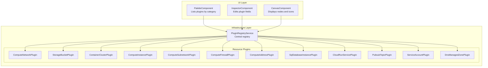
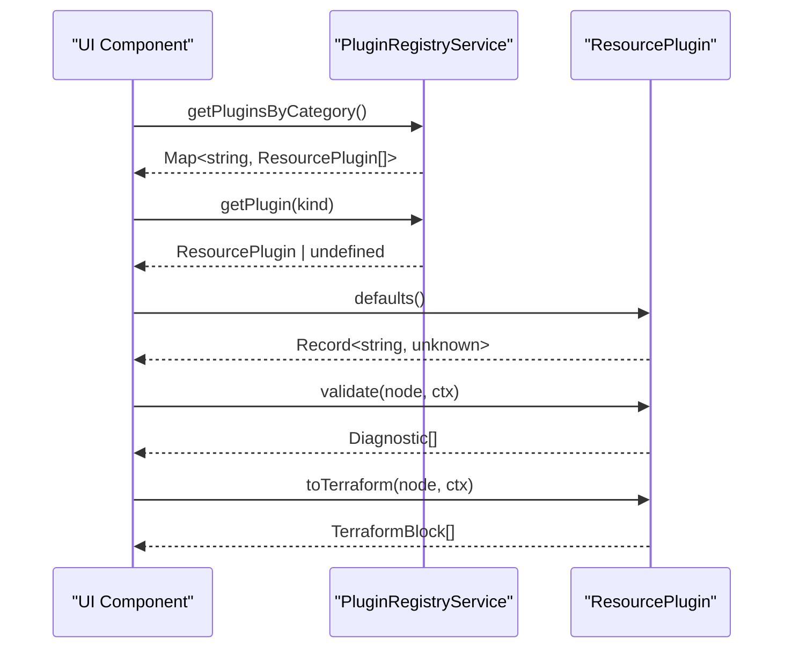
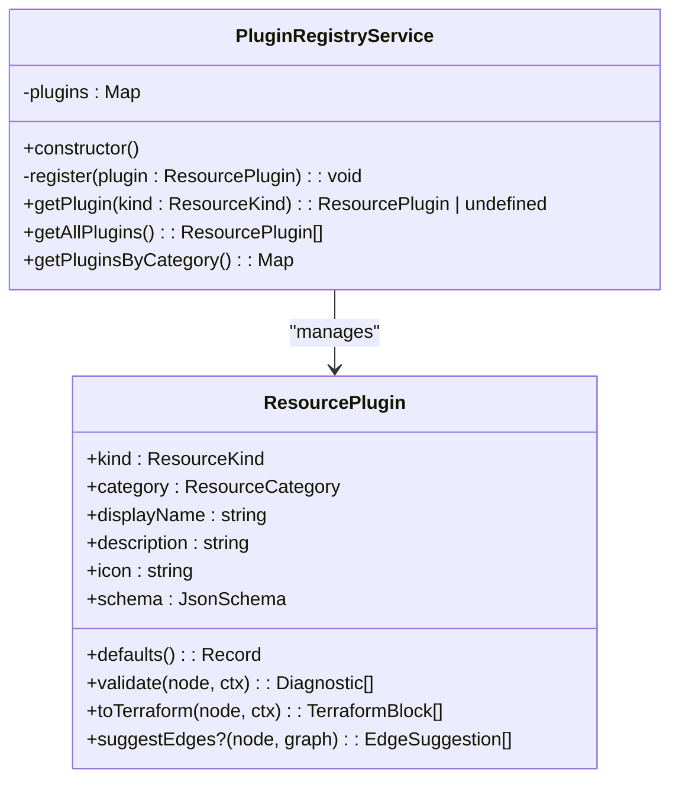
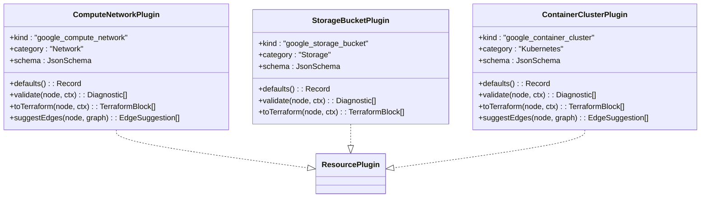
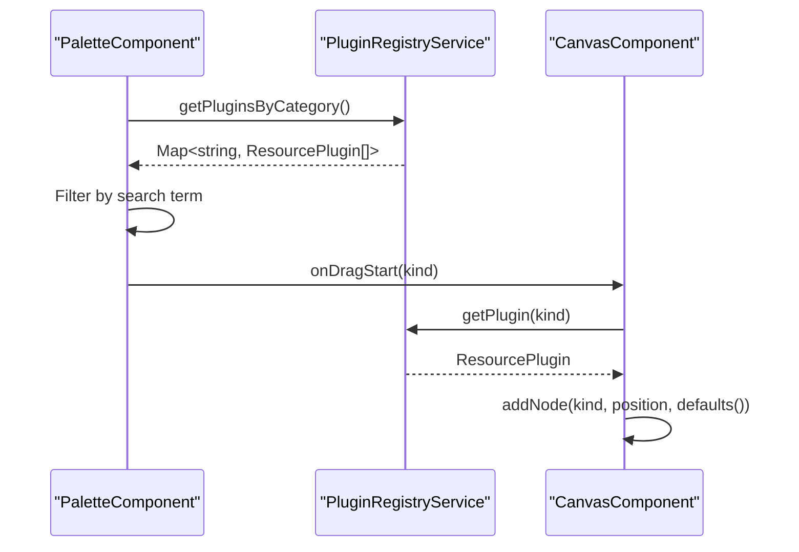
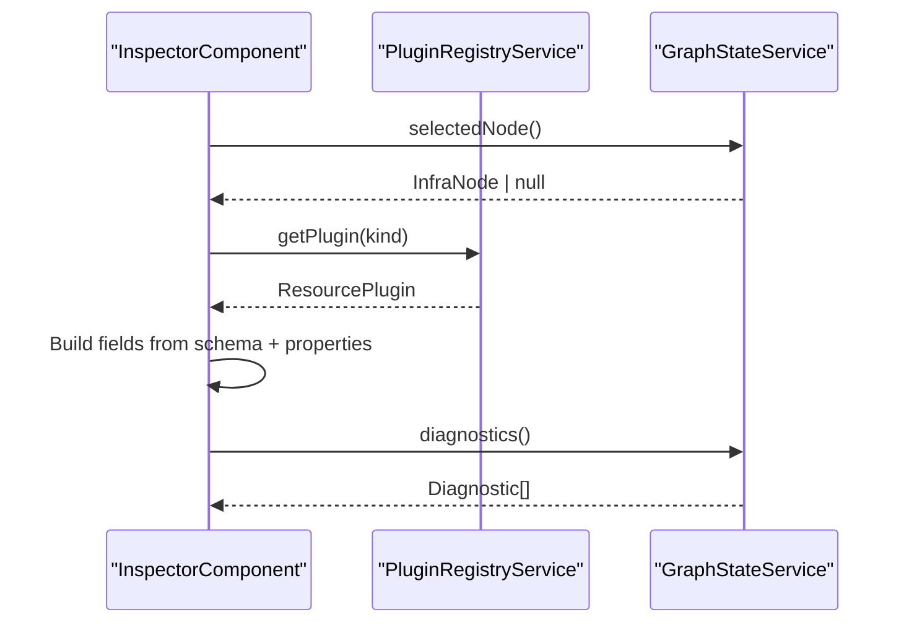
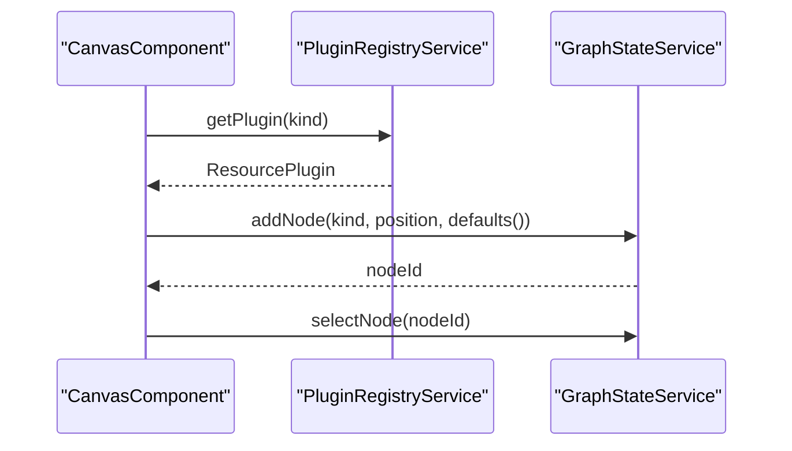
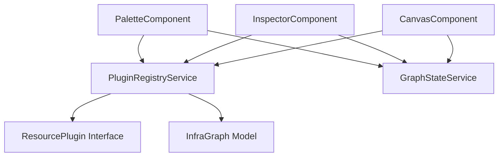

# Plugin Registry Service

<cite>
**Referenced Files in This Document**
- [plugin-registry.service.ts](file://src/app/infra/plugin-registry.service.ts)
- [resource-plugin.model.ts](file://src/app/core/models/resource-plugin.model.ts)
- [infra-graph.model.ts](file://src/app/core/models/infra-graph.model.ts)
- [compute-network.plugin.ts](file://src/app/infra/plugins/compute-network.plugin.ts)
- [storage-bucket.plugin.ts](file://src/app/infra/plugins/storage-bucket.plugin.ts)
- [container-cluster.plugin.ts](file://src/app/infra/plugins/container-cluster.plugin.ts)
- [palette.component.ts](file://src/app/palette/palette.component.ts)
- [palette.component.html](file://src/app/palette/palette.component.html)
- [inspector.component.ts](file://src/app/inspector/inspector.component.ts)
- [canvas.component.ts](file://src/app/canvas/canvas.component.ts)
- [graph-state.service.ts](file://src/app/core/services/graph-state.service.ts)
- [app.component.ts](file://src/app/layout/app.component.ts)
</cite>

## Table of Contents
1. [Introduction](#introduction)
2. [Project Structure](#project-structure)
3. [Core Components](#core-components)
4. [Architecture Overview](#architecture-overview)
5. [Detailed Component Analysis](#detailed-component-analysis)
6. [Dependency Analysis](#dependency-analysis)
7. [Performance Considerations](#performance-considerations)
8. [Troubleshooting Guide](#troubleshooting-guide)
9. [Conclusion](#conclusion)

## Introduction
This document explains the PluginRegistryService implementation and its role in the CloudCanvas-TF plugin architecture. It covers the registry pattern for managing resource plugins, dynamic plugin loading via the registry, and category-based organization. It documents the plugin registration process, lookup mechanisms, and retrieval methods, including the getPluginsByCategory function that organizes plugins by service categories (Network, Compute, Storage, etc.). Practical examples demonstrate plugin registration, querying specific plugins, and iterating through all registered plugins. Finally, it explains how the service integrates with UI components to power the palette, inspector, and canvas.

## Project Structure
The plugin system is organized under the infra module with a central registry and a set of resource plugins. The registry is injected into UI components to drive the palette, inspector, and canvas experiences.

**Diagram sources**
- [plugin-registry.service.ts](file://src/app/infra/plugin-registry.service.ts#L17-L72)
- [palette.component.ts](file://src/app/palette/palette.component.ts#L14-L83)
- [inspector.component.ts](file://src/app/inspector/inspector.component.ts#L21-L103)
- [canvas.component.ts](file://src/app/canvas/canvas.component.ts#L12-L286)

**Section sources**
- [plugin-registry.service.ts](file://src/app/infra/plugin-registry.service.ts#L1-L73)
- [palette.component.ts](file://src/app/palette/palette.component.ts#L1-L83)
- [inspector.component.ts](file://src/app/inspector/inspector.component.ts#L1-L103)
- [canvas.component.ts](file://src/app/canvas/canvas.component.ts#L1-L286)

## Core Components
- PluginRegistryService: Central registry that registers plugins at startup and exposes lookup and grouping APIs.
- ResourcePlugin interface: Contract that each plugin implements, including metadata, schema, defaults, validation, and Terraform generation.
- ResourceKind and ResourceCategory types: Strongly typed identifiers and categories used to organize plugins.
- UI integration: PaletteComponent uses the registry to display categorized plugins, InspectorComponent uses it to render configurable fields, and CanvasComponent uses it to resolve display names and icons.

Key responsibilities:
- Registration: Constructor wires up all plugin instances into the registry.
- Lookup: getPlugin(kind) retrieves a specific plugin by ResourceKind.
- Enumeration: getAllPlugins() returns all registered plugins.
- Grouping: getPluginsByCategory() organizes plugins by predefined categories and filters out empty categories.

**Section sources**
- [plugin-registry.service.ts](file://src/app/infra/plugin-registry.service.ts#L17-L72)
- [resource-plugin.model.ts](file://src/app/core/models/resource-plugin.model.ts#L43-L54)
- [infra-graph.model.ts](file://src/app/core/models/infra-graph.model.ts#L1-L118)
- [palette.component.ts](file://src/app/palette/palette.component.ts#L14-L83)
- [inspector.component.ts](file://src/app/inspector/inspector.component.ts#L21-L103)
- [canvas.component.ts](file://src/app/canvas/canvas.component.ts#L12-L286)

## Architecture Overview
The registry follows a classic registry pattern:
- Centralized registration during construction.
- Fast O(1) lookup by ResourceKind using a Map.
- Category-based grouping for UI presentation.
- Loose coupling between UI components and plugin implementations.

**Diagram sources**
- [plugin-registry.service.ts](file://src/app/infra/plugin-registry.service.ts#L48-L71)
- [resource-plugin.model.ts](file://src/app/core/models/resource-plugin.model.ts#L43-L54)
- [palette.component.ts](file://src/app/palette/palette.component.ts#L21-L40)
- [inspector.component.ts](file://src/app/inspector/inspector.component.ts#L27-L42)
- [canvas.component.ts](file://src/app/canvas/canvas.component.ts#L90-L99)

## Detailed Component Analysis

### PluginRegistryService
- Purpose: Manage all resource plugins in a centralized registry.
- Registration: Constructor instantiates and registers plugins for all supported ResourceKinds.
- Lookup: getPlugin(kind) returns the matching plugin or undefined.
- Enumeration: getAllPlugins() returns an array of all plugins.
- Grouping: getPluginsByCategory() returns a Map keyed by category name with ordered categories and filtered empty ones.

Implementation highlights:
- Uses Map<ResourceKind, ResourcePlugin> for efficient lookups.
- getPluginsByCategory maintains a fixed order of categories and removes empty ones.

**Diagram sources**
- [plugin-registry.service.ts](file://src/app/infra/plugin-registry.service.ts#L17-L72)
- [resource-plugin.model.ts](file://src/app/core/models/resource-plugin.model.ts#L43-L54)

**Section sources**
- [plugin-registry.service.ts](file://src/app/infra/plugin-registry.service.ts#L17-L72)

### ResourcePlugin Interface
Defines the contract that each plugin must implement:
- Metadata: kind, category, displayName, description, icon.
- Schema: JsonSchema describing configurable properties.
- Behavior: defaults(), validate(), toTerraform(), optional suggestEdges().

Examples of implementations:
- ComputeNetworkPlugin: Defines schema for VPC networks and generates Terraform blocks accordingly.
- StorageBucketPlugin: Defines schema for buckets and applies validations and defaults.
- ContainerClusterPlugin: Defines schema for GKE clusters, validates relationships, and suggests edges.

**Diagram sources**
- [compute-network.plugin.ts](file://src/app/infra/plugins/compute-network.plugin.ts#L4-L128)
- [storage-bucket.plugin.ts](file://src/app/infra/plugins/storage-bucket.plugin.ts#L4-L104)
- [container-cluster.plugin.ts](file://src/app/infra/plugins/container-cluster.plugin.ts#L4-L139)
- [resource-plugin.model.ts](file://src/app/core/models/resource-plugin.model.ts#L43-L54)

**Section sources**
- [resource-plugin.model.ts](file://src/app/core/models/resource-plugin.model.ts#L43-L54)
- [compute-network.plugin.ts](file://src/app/infra/plugins/compute-network.plugin.ts#L4-L128)
- [storage-bucket.plugin.ts](file://src/app/infra/plugins/storage-bucket.plugin.ts#L4-L104)
- [container-cluster.plugin.ts](file://src/app/infra/plugins/container-cluster.plugin.ts#L4-L139)

### PaletteComponent Integration
- Uses getPluginsByCategory() to present plugins grouped by category.
- Supports search filtering across displayName, kind, and description.
- Drags plugin kinds onto the canvas and adds nodes with defaults.

**Diagram sources**
- [palette.component.ts](file://src/app/palette/palette.component.ts#L21-L60)
- [palette.component.html](file://src/app/palette/palette.component.html#L13-L41)
- [canvas.component.ts](file://src/app/canvas/canvas.component.ts#L90-L99)
- [plugin-registry.service.ts](file://src/app/infra/plugin-registry.service.ts#L48-L54)

**Section sources**
- [palette.component.ts](file://src/app/palette/palette.component.ts#L14-L83)
- [palette.component.html](file://src/app/palette/palette.component.html#L1-L49)
- [canvas.component.ts](file://src/app/canvas/canvas.component.ts#L90-L99)

### InspectorComponent Integration
- Retrieves the selected node and looks up its plugin via getPlugin().
- Builds a field list from the plugin’s schema and current node properties.
- Groups fields by category and displays diagnostics for the selected node.

**Diagram sources**
- [inspector.component.ts](file://src/app/inspector/inspector.component.ts#L21-L73)
- [plugin-registry.service.ts](file://src/app/infra/plugin-registry.service.ts#L48-L50)
- [graph-state.service.ts](file://src/app/core/services/graph-state.service.ts#L22-L30)

**Section sources**
- [inspector.component.ts](file://src/app/inspector/inspector.component.ts#L21-L103)
- [graph-state.service.ts](file://src/app/core/services/graph-state.service.ts#L1-L147)

### CanvasComponent Integration
- Resolves display names and icons using the registry and global icon map.
- Handles drag-and-drop from the palette to add nodes with defaults.
- Manages selection, dragging, edge drawing, and deletion.

**Diagram sources**
- [canvas.component.ts](file://src/app/canvas/canvas.component.ts#L48-L55)
- [canvas.component.ts](file://src/app/canvas/canvas.component.ts#L90-L99)
- [plugin-registry.service.ts](file://src/app/infra/plugin-registry.service.ts#L48-L54)
- [graph-state.service.ts](file://src/app/core/services/graph-state.service.ts#L39-L60)

**Section sources**
- [canvas.component.ts](file://src/app/canvas/canvas.component.ts#L12-L286)
- [graph-state.service.ts](file://src/app/core/services/graph-state.service.ts#L1-L147)

## Dependency Analysis
The registry is a singleton service injected across UI components. It depends on the ResourcePlugin interface and ResourceKind/ResourceCategory types. Plugins depend on the core models and implement the ResourcePlugin interface.

**Diagram sources**
- [plugin-registry.service.ts](file://src/app/infra/plugin-registry.service.ts#L1-L73)
- [resource-plugin.model.ts](file://src/app/core/models/resource-plugin.model.ts#L1-L55)
- [infra-graph.model.ts](file://src/app/core/models/infra-graph.model.ts#L1-L118)
- [palette.component.ts](file://src/app/palette/palette.component.ts#L1-L83)
- [inspector.component.ts](file://src/app/inspector/inspector.component.ts#L1-L103)
- [canvas.component.ts](file://src/app/canvas/canvas.component.ts#L1-L286)
- [graph-state.service.ts](file://src/app/core/services/graph-state.service.ts#L1-L147)

**Section sources**
- [plugin-registry.service.ts](file://src/app/infra/plugin-registry.service.ts#L1-L73)
- [resource-plugin.model.ts](file://src/app/core/models/resource-plugin.model.ts#L1-L55)
- [infra-graph.model.ts](file://src/app/core/models/infra-graph.model.ts#L1-L118)
- [palette.component.ts](file://src/app/palette/palette.component.ts#L1-L83)
- [inspector.component.ts](file://src/app/inspector/inspector.component.ts#L1-L103)
- [canvas.component.ts](file://src/app/canvas/canvas.component.ts#L1-L286)
- [graph-state.service.ts](file://src/app/core/services/graph-state.service.ts#L1-L147)

## Performance Considerations
- Lookup complexity: getPlugin(kind) is O(1) due to Map usage.
- Grouping complexity: getPluginsByCategory iterates all plugins once and initializes categories in constant time, resulting in O(N) for N plugins.
- UI rendering: The palette filters plugins per keystroke; consider debouncing search input for large registries.
- Memory: Plugins are singletons instantiated once; minimal overhead.

[No sources needed since this section provides general guidance]

## Troubleshooting Guide
Common issues and resolutions:
- Plugin not found by kind: Verify the plugin’s kind matches ResourceKind and that it is registered in the constructor.
- Empty category list: getPluginsByCategory removes empty categories; ensure plugins have non-empty lists.
- Incorrect display name/icon: Confirm the plugin’s displayName and icon fields are set and that the global icon map includes the kind.
- Validation errors: Inspect Diagnostic messages returned by plugin.validate() and address required fields or invalid values.
- Edge suggestions: Some plugins implement suggestEdges(); ensure graph context is accurate for suggestions.

**Section sources**
- [plugin-registry.service.ts](file://src/app/infra/plugin-registry.service.ts#L48-L71)
- [resource-plugin.model.ts](file://src/app/core/models/resource-plugin.model.ts#L43-L54)
- [infra-graph.model.ts](file://src/app/core/models/infra-graph.model.ts#L93-L118)
- [inspector.component.ts](file://src/app/inspector/inspector.component.ts#L55-L101)

## Conclusion
PluginRegistryService is the backbone of the plugin architecture, providing fast lookups, enumeration, and category-based organization. It cleanly decouples UI components from individual plugin implementations while enabling dynamic plugin loading at startup. Together with the ResourcePlugin interface and supporting models, it enables a scalable and maintainable plugin ecosystem integrated across the palette, inspector, and canvas.