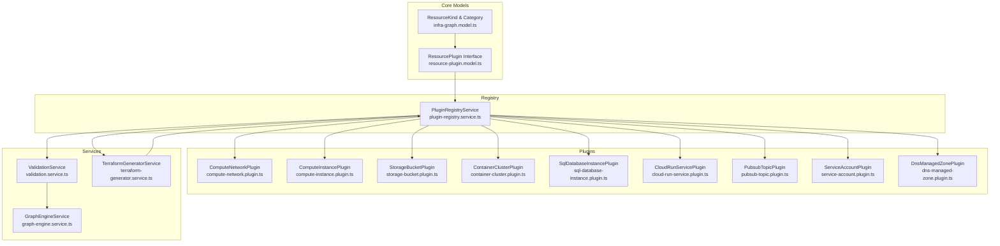
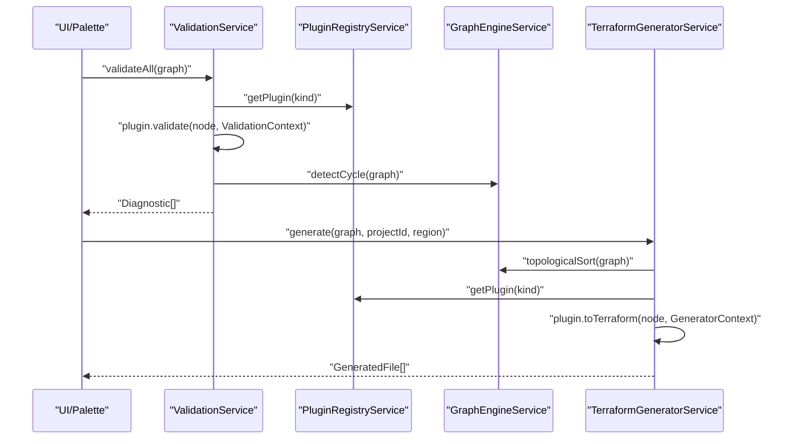
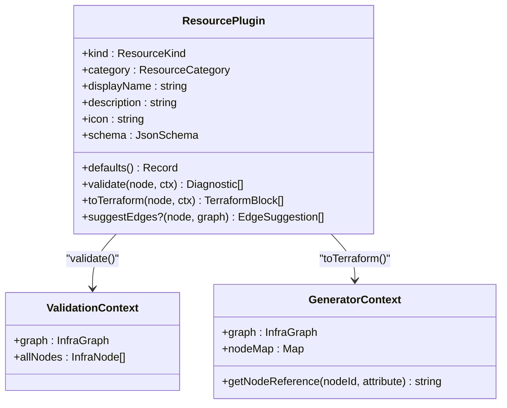
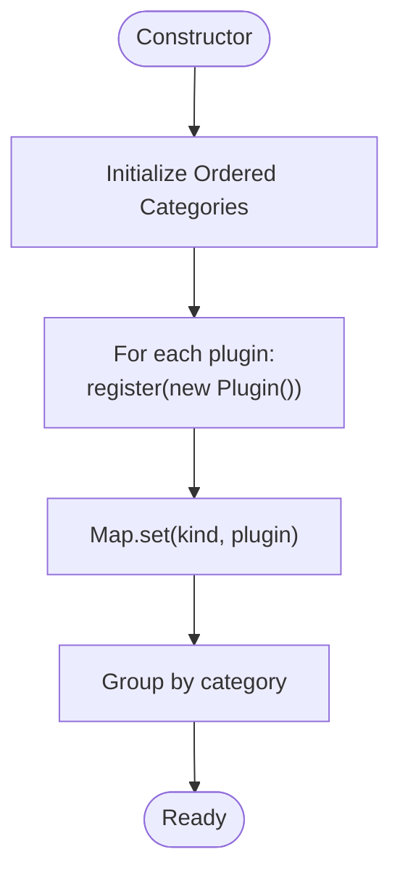
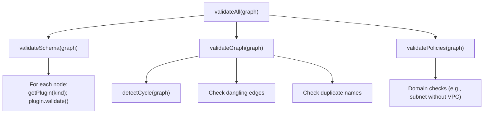
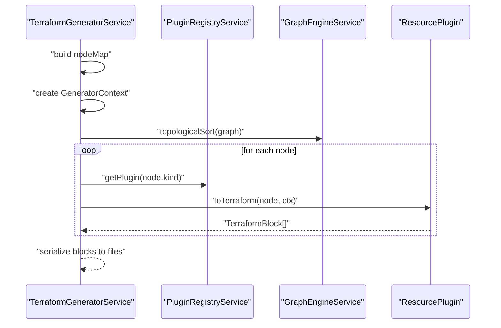
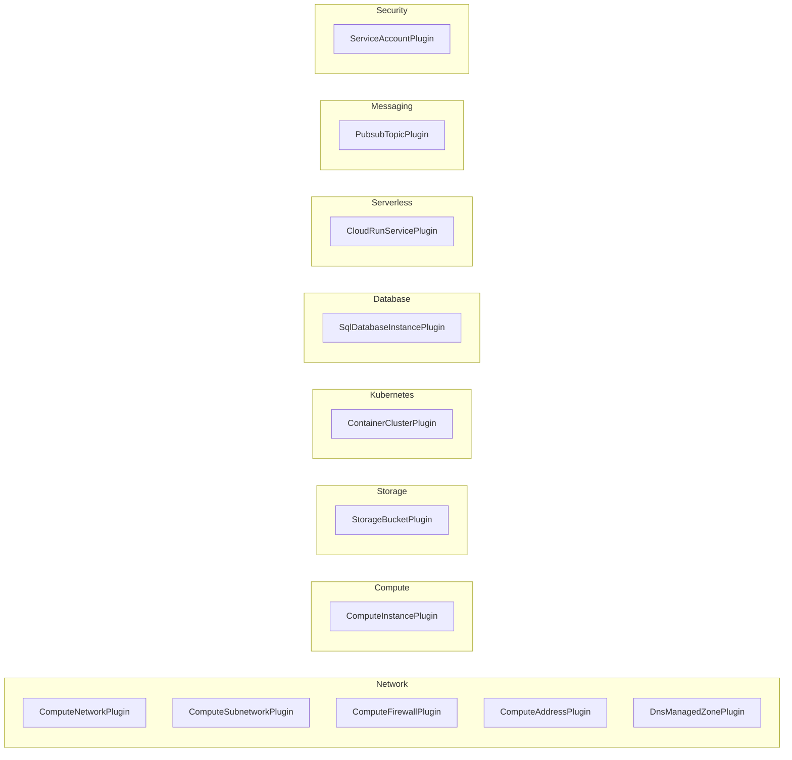
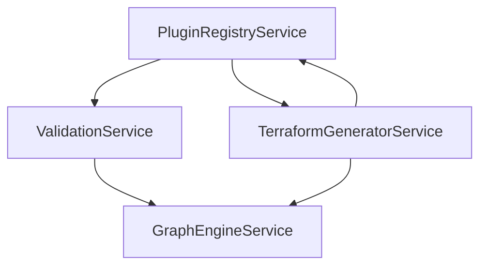

# Plugin System

<cite>
**Referenced Files in This Document**
- [resource-plugin.model.ts](file://src/app/core/models/resource-plugin.model.ts)
- [infra-graph.model.ts](file://src/app/core/models/infra-graph.model.ts)
- [plugin-registry.service.ts](file://src/app/infra/plugin-registry.service.ts)
- [terraform-generator.service.ts](file://src/app/terraform-engine/terraform-generator.service.ts)
- [validation.service.ts](file://src/app/validation/validation.service.ts)
- [graph-engine.service.ts](file://src/app/graph-engine/graph-engine.service.ts)
- [compute-network.plugin.ts](file://src/app/infra/plugins/compute-network.plugin.ts)
- [compute-instance.plugin.ts](file://src/app/infra/plugins/compute-instance.plugin.ts)
- [storage-bucket.plugin.ts](file://src/app/infra/plugins/storage-bucket.plugin.ts)
- [container-cluster.plugin.ts](file://src/app/infra/plugins/container-cluster.plugin.ts)
- [sql-database-instance.plugin.ts](file://src/app/infra/plugins/sql-database-instance.plugin.ts)
- [cloud-run-service.plugin.ts](file://src/app/infra/plugins/cloud-run-service.plugin.ts)
- [pubsub-topic.plugin.ts](file://src/app/infra/plugins/pubsub-topic.plugin.ts)
- [service-account.plugin.ts](file://src/app/infra/plugins/service-account.plugin.ts)
- [dns-managed-zone.plugin.ts](file://src/app/infra/plugins/dns-managed-zone.plugin.ts)
</cite>

## Table of Contents
1. [Introduction](#introduction)
2. [Project Structure](#project-structure)
3. [Core Components](#core-components)
4. [Architecture Overview](#architecture-overview)
5. [Detailed Component Analysis](#detailed-component-analysis)
6. [Dependency Analysis](#dependency-analysis)
7. [Performance Considerations](#performance-considerations)
8. [Troubleshooting Guide](#troubleshooting-guide)
9. [Conclusion](#conclusion)
10. [Appendices](#appendices)

## Introduction
This document explains CloudCanvas-TF’s plugin architecture for modeling infrastructure resources and generating Terraform configurations. It covers the ResourcePlugin interface and plugin contract, the PluginRegistryService for dynamic loading and categorization, and the integration with validation and generation services. It also documents the existing GCP resource plugins across network, compute, storage, and other service categories, and provides practical guidance for developing custom plugins and extending the platform.

## Project Structure
The plugin system is centered around core models, a registry service, and a set of resource plugins. Generation and validation services consume the registry to transform an infrastructure graph into Terraform files and to enforce correctness.

**Diagram sources**
- [infra-graph.model.ts](file://src/app/core/models/infra-graph.model.ts#L1-L118)
- [resource-plugin.model.ts](file://src/app/core/models/resource-plugin.model.ts#L1-L55)
- [plugin-registry.service.ts](file://src/app/infra/plugin-registry.service.ts#L1-L73)
- [compute-network.plugin.ts](file://src/app/infra/plugins/compute-network.plugin.ts#L1-L129)
- [compute-instance.plugin.ts](file://src/app/infra/plugins/compute-instance.plugin.ts#L1-L128)
- [storage-bucket.plugin.ts](file://src/app/infra/plugins/storage-bucket.plugin.ts#L1-L105)
- [container-cluster.plugin.ts](file://src/app/infra/plugins/container-cluster.plugin.ts#L1-L140)
- [sql-database-instance.plugin.ts](file://src/app/infra/plugins/sql-database-instance.plugin.ts#L1-L49)
- [cloud-run-service.plugin.ts](file://src/app/infra/plugins/cloud-run-service.plugin.ts#L1-L45)
- [pubsub-topic.plugin.ts](file://src/app/infra/plugins/pubsub-topic.plugin.ts#L1-L35)
- [service-account.plugin.ts](file://src/app/infra/plugins/service-account.plugin.ts#L1-L37)
- [dns-managed-zone.plugin.ts](file://src/app/infra/plugins/dns-managed-zone.plugin.ts#L1-L39)
- [validation.service.ts](file://src/app/validation/validation.service.ts#L1-L107)
- [terraform-generator.service.ts](file://src/app/terraform-engine/terraform-generator.service.ts#L1-L234)
- [graph-engine.service.ts](file://src/app/graph-engine/graph-engine.service.ts#L1-L127)

**Section sources**
- [plugin-registry.service.ts](file://src/app/infra/plugin-registry.service.ts#L1-L73)
- [resource-plugin.model.ts](file://src/app/core/models/resource-plugin.model.ts#L1-L55)
- [infra-graph.model.ts](file://src/app/core/models/infra-graph.model.ts#L1-L118)

## Core Components
- ResourcePlugin interface defines the contract for all resource plugins, including identification, display metadata, JSON schema, defaults, validation, and Terraform generation.
- ValidationContext and GeneratorContext provide the runtime context for validation and generation respectively.
- PluginRegistryService dynamically registers plugins by kind and exposes lookup, enumeration, and category-based grouping.
- ValidationService orchestrates schema, graph, and policy validations using the registry and graph engine.
- TerraformGeneratorService transforms validated graphs into Terraform files using registered plugins and a topological traversal.

Key responsibilities:
- ResourcePlugin: Define resource shape (schema), defaults, validation rules, and Terraform block generation.
- PluginRegistryService: Central registry keyed by ResourceKind; supports category grouping and retrieval.
- ValidationService: Validates per-resource rules via plugins and global graph constraints.
- TerraformGeneratorService: Generates providers, main resources, variables, outputs, and README.

**Section sources**
- [resource-plugin.model.ts](file://src/app/core/models/resource-plugin.model.ts#L11-L55)
- [plugin-registry.service.ts](file://src/app/infra/plugin-registry.service.ts#L17-L73)
- [validation.service.ts](file://src/app/validation/validation.service.ts#L7-L107)
- [terraform-generator.service.ts](file://src/app/terraform-engine/terraform-generator.service.ts#L9-L234)

## Architecture Overview
The plugin architecture follows a contract-driven design:
- Plugins implement ResourcePlugin and are registered centrally.
- ValidationService invokes plugin.validate for each node.
- TerraformGeneratorService retrieves plugins by node kind and calls toTerraform to produce Terraform blocks.
- GraphEngineService provides topological sorting and cycle detection to ensure deterministic generation order.

**Diagram sources**
- [validation.service.ts](file://src/app/validation/validation.service.ts#L14-L105)
- [terraform-generator.service.ts](file://src/app/terraform-engine/terraform-generator.service.ts#L16-L51)
- [plugin-registry.service.ts](file://src/app/infra/plugin-registry.service.ts#L48-L54)
- [graph-engine.service.ts](file://src/app/graph-engine/graph-engine.service.ts#L65-L110)

## Detailed Component Analysis

### ResourcePlugin Interface and Contract
The ResourcePlugin interface defines:
- Identification: kind (ResourceKind), category (ResourceCategory), displayName, description, icon.
- Schema: JsonSchema describing configurable properties.
- Defaults: returns default property values.
- Validation: validate(node, ValidationContext) returning Diagnostic[].
- Generation: toTerraform(node, GeneratorContext) returning TerraformBlock[].
- Optional edge suggestions: suggestEdges(node, graph) returning EdgeSuggestion[].

ValidationContext provides access to the entire InfraGraph and all nodes for cross-node checks.
GeneratorContext provides access to the graph, a node map, and a helper to construct Terraform references between nodes.

**Diagram sources**
- [resource-plugin.model.ts](file://src/app/core/models/resource-plugin.model.ts#L32-L54)

**Section sources**
- [resource-plugin.model.ts](file://src/app/core/models/resource-plugin.model.ts#L11-L55)

### PluginRegistryService Design
Responsibilities:
- Registers plugins during construction by instantiating each plugin and storing by kind.
- Provides getPlugin(kind) for lookup.
- Exposes getAllPlugins() for enumeration.
- Groups plugins by category with a fixed ordering and filters empty categories.

Registration pattern:
- Import each plugin implementation.
- Instantiate and pass to register() in constructor.
- The registry maintains a Map<ResourceKind, ResourcePlugin>.

Category-based organization:
- Uses a predefined order to ensure consistent UI presentation.
- Aggregates plugins into groups keyed by category.

Extension mechanism:
- To add a new resource, implement ResourcePlugin, add import, instantiate in constructor, and export from registry.

**Diagram sources**
- [plugin-registry.service.ts](file://src/app/infra/plugin-registry.service.ts#L21-L71)

**Section sources**
- [plugin-registry.service.ts](file://src/app/infra/plugin-registry.service.ts#L17-L73)

### Validation Pipeline
ValidationService integrates:
- Schema validation: iterates nodes, resolves plugin by kind, and calls plugin.validate with ValidationContext.
- Graph validation: detects cycles, dangling edges, and duplicate names.
- Policy validation: applies domain-specific checks (e.g., subnet without VPC).

**Diagram sources**
- [validation.service.ts](file://src/app/validation/validation.service.ts#L14-L105)
- [graph-engine.service.ts](file://src/app/graph-engine/graph-engine.service.ts#L27-L81)

**Section sources**
- [validation.service.ts](file://src/app/validation/validation.service.ts#L7-L107)
- [graph-engine.service.ts](file://src/app/graph-engine/graph-engine.service.ts#L1-L127)

### Generation Pipeline
TerraformGeneratorService:
- Builds a nodeMap for reference resolution.
- Constructs GeneratorContext with getNodeReference helper.
- Sorts nodes topologically to respect dependencies.
- Iterates nodes, retrieves plugin by kind, and collects Terraform blocks.
- Produces providers.tf, main.tf, variables.tf, outputs.tf, and README.generated.md.

**Diagram sources**
- [terraform-generator.service.ts](file://src/app/terraform-engine/terraform-generator.service.ts#L16-L51)
- [plugin-registry.service.ts](file://src/app/infra/plugin-registry.service.ts#L48-L54)
- [graph-engine.service.ts](file://src/app/graph-engine/graph-engine.service.ts#L65-L110)

**Section sources**
- [terraform-generator.service.ts](file://src/app/terraform-engine/terraform-generator.service.ts#L9-L234)

### Existing GCP Resource Plugins
The platform ships with plugins for multiple GCP services organized by category:

- Network
  - VPC Network: defines schema for network properties and validates MTU range and auto subnet mode.
  - Subnetwork: schema for regional/subnet configuration.
  - Firewall: schema for firewall rules.
  - Address: schema for static address allocation.
  - DNS Managed Zone: schema for DNS zones.

- Compute
  - VM Instance: schema for machine type, zone, disk images/sizes/types, and network attachment suggestions.

- Storage
  - Cloud Storage Bucket: schema for location, storage class, uniform access, versioning, and public access prevention.

- Kubernetes
  - GKE Cluster: schema for cluster configuration, node pools, networking modes, and VPC/subnet attachments.

- Database
  - Cloud SQL Instance: schema for database versions, tiers, regions, deletion protection, and availability.

- Serverless
  - Cloud Run Service: schema for service name, region, container image, CPU/memory, and scaling.

- Messaging
  - Pub/Sub Topic: schema for topic name and retention duration.

- Security
  - Service Account: schema for account identifiers and descriptions.

**Diagram sources**
- [compute-network.plugin.ts](file://src/app/infra/plugins/compute-network.plugin.ts#L4-L129)
- [compute-instance.plugin.ts](file://src/app/infra/plugins/compute-instance.plugin.ts#L4-L128)
- [storage-bucket.plugin.ts](file://src/app/infra/plugins/storage-bucket.plugin.ts#L4-L105)
- [container-cluster.plugin.ts](file://src/app/infra/plugins/container-cluster.plugin.ts#L4-L140)
- [sql-database-instance.plugin.ts](file://src/app/infra/plugins/sql-database-instance.plugin.ts#L4-L49)
- [cloud-run-service.plugin.ts](file://src/app/infra/plugins/cloud-run-service.plugin.ts#L4-L45)
- [pubsub-topic.plugin.ts](file://src/app/infra/plugins/pubsub-topic.plugin.ts#L4-L35)
- [service-account.plugin.ts](file://src/app/infra/plugins/service-account.plugin.ts#L4-L37)
- [dns-managed-zone.plugin.ts](file://src/app/infra/plugins/dns-managed-zone.plugin.ts#L4-L39)

**Section sources**
- [compute-network.plugin.ts](file://src/app/infra/plugins/compute-network.plugin.ts#L1-L129)
- [compute-instance.plugin.ts](file://src/app/infra/plugins/compute-instance.plugin.ts#L1-L128)
- [storage-bucket.plugin.ts](file://src/app/infra/plugins/storage-bucket.plugin.ts#L1-L105)
- [container-cluster.plugin.ts](file://src/app/infra/plugins/container-cluster.plugin.ts#L1-L140)
- [sql-database-instance.plugin.ts](file://src/app/infra/plugins/sql-database-instance.plugin.ts#L1-L49)
- [cloud-run-service.plugin.ts](file://src/app/infra/plugins/cloud-run-service.plugin.ts#L1-L45)
- [pubsub-topic.plugin.ts](file://src/app/infra/plugins/pubsub-topic.plugin.ts#L1-L35)
- [service-account.plugin.ts](file://src/app/infra/plugins/service-account.plugin.ts#L1-L37)
- [dns-managed-zone.plugin.ts](file://src/app/infra/plugins/dns-managed-zone.plugin.ts#L1-L39)

### Plugin Development Guide
To implement a new ResourcePlugin:
1. Define kind and category consistent with ResourceKind and ResourceCategory.
2. Build JsonSchema with properties, types, labels, descriptions, defaults, and optional groups.
3. Implement defaults() returning a record of default values.
4. Implement validate(node, ValidationContext):
   - Use ValidationContext.graph and ValidationContext.allNodes for cross-node checks.
   - Return Diagnostic[] with severity, code, nodeId, field, message, and optional remediation.
5. Implement toTerraform(node, GeneratorContext):
   - Use GeneratorContext.nodeMap and getNodeReference(nodeId, attribute) to reference other nodes.
   - Return TerraformBlock[] with blockType, resourceType, name, attributes, and optional nestedBlocks.
6. Optionally implement suggestEdges(node, graph) to propose connections.
7. Register the plugin in PluginRegistryService constructor by importing and instantiating it.

Example references:
- JsonSchema definition and defaults: see any plugin’s schema and defaults method.
- ValidationContext usage: see plugins that check edges or cross-node properties.
- GeneratorContext usage: see plugins that reference other nodes via getNodeReference.

**Section sources**
- [resource-plugin.model.ts](file://src/app/core/models/resource-plugin.model.ts#L11-L55)
- [plugin-registry.service.ts](file://src/app/infra/plugin-registry.service.ts#L21-L42)
- [terraform-generator.service.ts](file://src/app/terraform-engine/terraform-generator.service.ts#L22-L30)

### Lifecycle Management and Integration
- Registration lifecycle: plugins are constructed and registered at startup; retrieval is O(1) via Map lookup.
- Validation lifecycle: executed before generation; diagnostics collected and surfaced to the UI.
- Generation lifecycle: executed after validation; uses topological order to ensure dependencies are satisfied.
- Extension lifecycle: adding a new plugin requires implementing ResourcePlugin, registering it, and ensuring schema and defaults align with the intended resource.

Integration points:
- PluginRegistryService is injected into ValidationService and TerraformGeneratorService.
- GraphEngineService is used by ValidationService and TerraformGeneratorService for graph analysis.

**Section sources**
- [plugin-registry.service.ts](file://src/app/infra/plugin-registry.service.ts#L17-L73)
- [validation.service.ts](file://src/app/validation/validation.service.ts#L7-L12)
- [terraform-generator.service.ts](file://src/app/terraform-engine/terraform-generator.service.ts#L9-L14)
- [graph-engine.service.ts](file://src/app/graph-engine/graph-engine.service.ts#L1-L127)

## Dependency Analysis
The following diagram shows key dependencies among services and the registry:

**Diagram sources**
- [plugin-registry.service.ts](file://src/app/infra/plugin-registry.service.ts#L1-L73)
- [validation.service.ts](file://src/app/validation/validation.service.ts#L1-L107)
- [terraform-generator.service.ts](file://src/app/terraform-engine/terraform-generator.service.ts#L1-L234)
- [graph-engine.service.ts](file://src/app/graph-engine/graph-engine.service.ts#L1-L127)

**Section sources**
- [plugin-registry.service.ts](file://src/app/infra/plugin-registry.service.ts#L1-L73)
- [validation.service.ts](file://src/app/validation/validation.service.ts#L1-L107)
- [terraform-generator.service.ts](file://src/app/terraform-engine/terraform-generator.service.ts#L1-L234)
- [graph-engine.service.ts](file://src/app/graph-engine/graph-engine.service.ts#L1-L127)

## Performance Considerations
- Plugin lookup is O(1) via Map<ResourceKind, ResourcePlugin>.
- Topological sort is O(V+E) and ensures deterministic generation order.
- Validation runs in O(N) over nodes plus plugin-defined checks; consider lightweight checks in validate and defer heavy computations to generation where appropriate.
- Reference resolution in GeneratorContext is O(1) via nodeMap.

[No sources needed since this section provides general guidance]

## Troubleshooting Guide
Common issues and resolutions:
- Unknown resource type: Diagnostics include UNKNOWN_RESOURCE when a node kind has no registered plugin.
- Circular dependencies: DEPENDENCY_CYCLE detected by GraphEngineService; remove cycles to resolve.
- Dangling edges: Diagnostics report missing from/to nodes; ensure both ends of edges refer to existing nodes.
- Duplicate names: DUPLICATE_NAME reported when two nodes share the same kind:name pair; rename to be unique.
- Domain-specific warnings: e.g., SUBNET_WITHOUT_VPC suggests adding a VPC network before subnets.

**Section sources**
- [validation.service.ts](file://src/app/validation/validation.service.ts#L30-L104)
- [graph-engine.service.ts](file://src/app/graph-engine/graph-engine.service.ts#L27-L81)

## Conclusion
CloudCanvas-TF’s plugin architecture cleanly separates resource modeling, validation, and generation through a well-defined ResourcePlugin contract. The PluginRegistryService centralizes discovery and categorization, while ValidationService and TerraformGeneratorService integrate tightly with the registry and graph engine. The existing GCP plugins demonstrate robust patterns for schema definition, validation, and Terraform generation, and the documented extension process enables adding new resource types with minimal friction.

[No sources needed since this section summarizes without analyzing specific files]

## Appendices

### Practical Examples Index
- Implementing a new plugin:
  - See ComputeNetworkPlugin for JsonSchema, defaults, validate, and toTerraform patterns.
  - See ComputeInstancePlugin for edge-aware validation and nested block generation.
  - See StorageBucketPlugin for advanced nested blocks and security-related validations.
  - See ContainerClusterPlugin for multi-hop references (VPC and subnet) and edge suggestions.
- Extending with new resource types:
  - Add kind to ResourceKind union and category to ResourceCategory.
  - Implement ResourcePlugin and register in PluginRegistryService constructor.
  - Provide schema, defaults, validate, and toTerraform tailored to the resource.

**Section sources**
- [compute-network.plugin.ts](file://src/app/infra/plugins/compute-network.plugin.ts#L4-L129)
- [compute-instance.plugin.ts](file://src/app/infra/plugins/compute-instance.plugin.ts#L4-L128)
- [storage-bucket.plugin.ts](file://src/app/infra/plugins/storage-bucket.plugin.ts#L4-L105)
- [container-cluster.plugin.ts](file://src/app/infra/plugins/container-cluster.plugin.ts#L4-L140)
- [infra-graph.model.ts](file://src/app/core/models/infra-graph.model.ts#L1-L118)
- [plugin-registry.service.ts](file://src/app/infra/plugin-registry.service.ts#L21-L42)