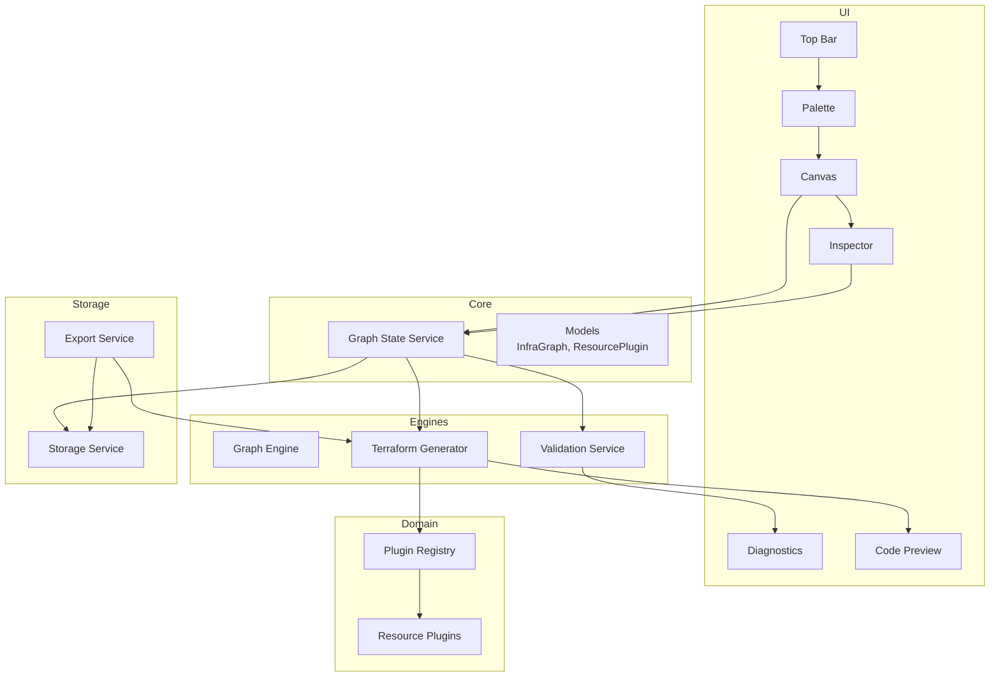
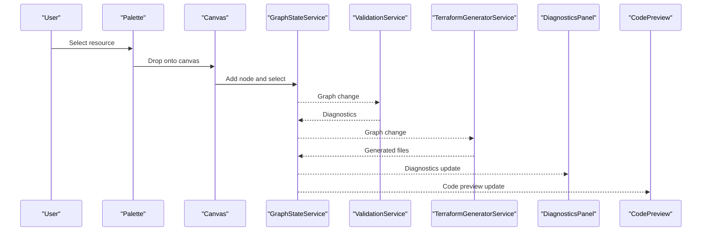
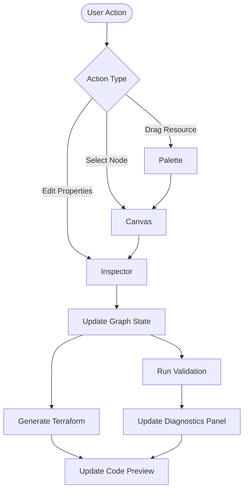
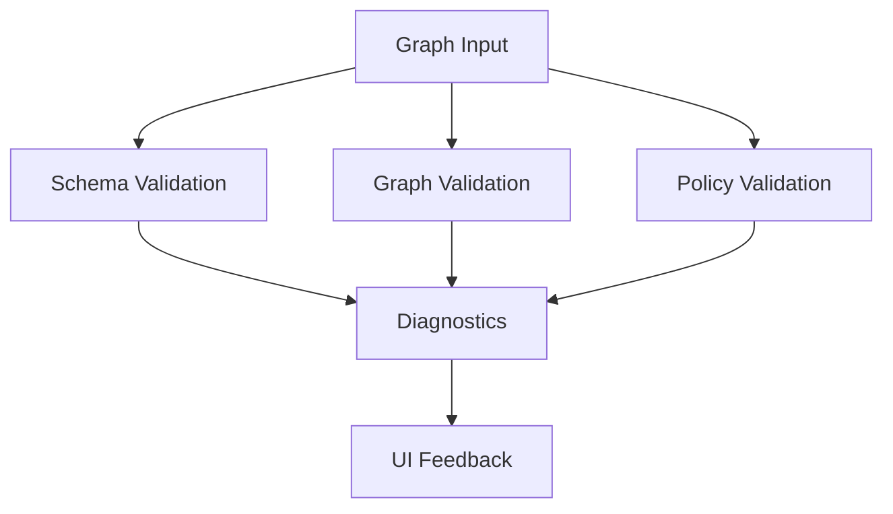
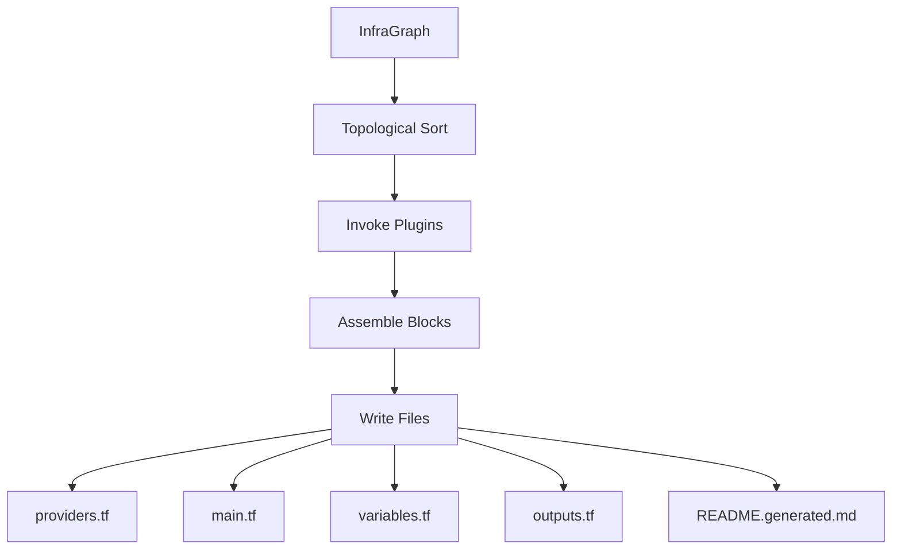
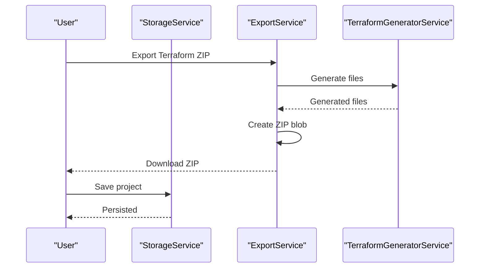
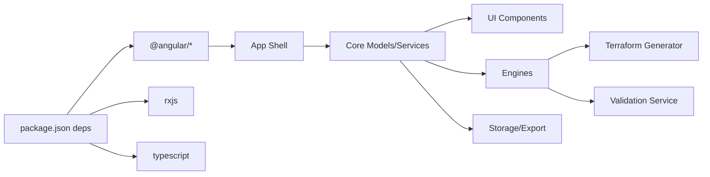

# Project Overview

<cite>
**Referenced Files in This Document**
- [README.md](file://README.md)
- [SYSTEM_DESIGN.md](file://SYSTEM_DESIGN.md)
- [package.json](file://package.json)
- [walkthrough.md.resolved](file://walkthrough.md.resolved)
- [src/app/layout/app.component.ts](file://src/app/layout/app.component.ts)
- [src/app/core/models/infra-graph.model.ts](file://src/app/core/models/infra-graph.model.ts)
- [src/app/core/models/resource-plugin.model.ts](file://src/app/core/models/resource-plugin.model.ts)
- [src/app/infra/plugin-registry.service.ts](file://src/app/infra/plugin-registry.service.ts)
- [src/app/terraform-engine/terraform-generator.service.ts](file://src/app/terraform-engine/terraform-generator.service.ts)
- [src/app/validation/validation.service.ts](file://src/app/validation/validation.service.ts)
- [src/app/canvas/canvas.component.ts](file://src/app/canvas/canvas.component.ts)
- [src/app/palette/palette.component.ts](file://src/app/palette/palette.component.ts)
- [src/app/inspector/inspector.component.ts](file://src/app/inspector/inspector.component.ts)
- [src/app/storage/storage.service.ts](file://src/app/storage/storage.service.ts)
- [src/app/storage/export.service.ts](file://src/app/storage/export.service.ts)
</cite>

## Table of Contents
1. [Introduction](#introduction)
2. [Project Structure](#project-structure)
3. [Core Components](#core-components)
4. [Architecture Overview](#architecture-overview)
5. [Detailed Component Analysis](#detailed-component-analysis)
6. [Dependency Analysis](#dependency-analysis)
7. [Performance Considerations](#performance-considerations)
8. [Troubleshooting Guide](#troubleshooting-guide)
9. [Conclusion](#conclusion)

## Introduction
CloudCanvas-TF is a visual infrastructure design studio for Google Cloud Platform (GCP) that lowers the barrier to Infrastructure as Code (IaC) by enabling users to compose cloud architectures through a drag-and-drop interface. The application automatically generates clean, editable Terraform configurations, allowing both beginners and experienced practitioners to collaborate effectively. It targets application developers with basic cloud knowledge, DevOps/platform engineers needing rapid prototyping, and startup teams requiring quick, cost- and security-conscious architecture drafts.

Key benefits:
- Accelerated first-draft architecture creation with visual modeling
- Deterministic, readable Terraform outputs suitable for Git workflows
- Real-time validation and policy advisories for safer, more cost-effective designs
- Practical export formats for immediate handoff to CI/CD pipelines
- Local persistence for iterative design across browser sessions

Use cases:
- Rapid prototyping of GCP networks, compute, storage, and Kubernetes clusters
- Onboarding non-Terraform-savvy team members into IaC workflows
- Preparing architecture artifacts for code review and audit
- Generating reproducible Terraform for CI/CD pipelines

## Project Structure
CloudCanvas-TF follows a feature-first Angular workspace layout with clear module boundaries:
- Core: foundational models, services, and global state
- UI: layout, palette, canvas, inspector, diagnostics, and code preview
- Domain: resource plugins and plugin registry
- Engines: graph engine, Terraform generator, and validation service
- Storage: IndexedDB-backed persistence and export utilities
- Workers: offloading heavy computation to Web Workers

**Diagram sources**
- [src/app/layout/app.component.ts](file://src/app/layout/app.component.ts#L12-L47)
- [src/app/core/models/infra-graph.model.ts](file://src/app/core/models/infra-graph.model#L17-L39)
- [src/app/core/models/resource-plugin.model.ts](file://src/app/core/models/resource-plugin.model#L43-L54)
- [src/app/infra/plugin-registry.service.ts](file://src/app/infra/plugin-registry.service.ts#L17-L72)
- [src/app/terraform-engine/terraform-generator.service.ts](file://src/app/terraform-engine/terraform-generator.service.ts#L9-L51)
- [src/app/validation/validation.service.ts](file://src/app/validation/validation.service.ts#L7-L20)
- [src/app/storage/storage.service.ts](file://src/app/storage/storage.service.ts#L8-L84)
- [src/app/storage/export.service.ts](file://src/app/storage/export.service.ts#L6-L59)

**Section sources**
- [SYSTEM_DESIGN.md](file://SYSTEM_DESIGN.md#L245-L262)
- [walkthrough.md.resolved](file://walkthrough.md.resolved#L19-L52)

## Core Components
- InfraGraph data model: canonical representation of nodes, edges, and diagnostics, enabling deterministic Terraform generation and validation.
- ResourcePlugin contract: schema-driven plugin interface for each GCP resource, encapsulating validation and Terraform serialization.
- PluginRegistry: centralized registry mapping resource kinds to their plugins, supporting categorization and discovery.
- GraphEngine: dependency intelligence for cycle detection and topological sorting to ensure stable, dependency-aware ordering.
- TerraformGenerator: AST-first generation pipeline producing providers.tf, main.tf, variables.tf, outputs.tf, and a generated README.
- ValidationService: layered validation (schema, graph, policy) producing actionable diagnostics.
- UI components: palette, canvas, inspector, diagnostics panel, and code preview for a cohesive visual workflow.
- Storage and Export: IndexedDB persistence and pure-JavaScript ZIP generation for project JSON and Terraform bundles.

Practical example:
- Adding a VPC, subnet, and VM to the canvas triggers real-time validation and Terraform generation. The inspector dynamically renders schema-driven fields, and the code preview updates with canonical HCL. Export produces a ready-to-commit Terraform ZIP.

**Section sources**
- [src/app/core/models/infra-graph.model.ts](file://src/app/core/models/infra-graph.model#L1-L118)
- [src/app/core/models/resource-plugin.model.ts](file://src/app/core/models/resource-plugin.model#L1-L55)
- [src/app/infra/plugin-registry.service.ts](file://src/app/infra/plugin-registry.service.ts#L17-L72)
- [src/app/terraform-engine/terraform-generator.service.ts](file://src/app/terraform-engine/terraform-generator.service.ts#L9-L51)
- [src/app/validation/validation.service.ts](file://src/app/validation/validation.service.ts#L7-L20)
- [src/app/storage/export.service.ts](file://src/app/storage/export.service.ts#L6-L59)

## Architecture Overview
CloudCanvas-TF employs a schema-driven, plugin-based Angular SPA centered on a canonical InfraGraph. Changes propagate through effects that trigger validation and generation, with heavy computations offloaded to Web Workers. The system produces deterministic Terraform outputs and practical export artifacts.

**Diagram sources**
- [src/app/layout/app.component.ts](file://src/app/layout/app.component.ts#L32-L42)
- [src/app/palette/palette.component.ts](file://src/app/palette/palette.component.ts#L55-L77)
- [src/app/canvas/canvas.component.ts](file://src/app/canvas/canvas.component.ts#L90-L99)
- [src/app/validation/validation.service.ts](file://src/app/validation/validation.service.ts#L14-L20)
- [src/app/terraform-engine/terraform-generator.service.ts](file://src/app/terraform-engine/terraform-generator.service.ts#L16-L51)

## Detailed Component Analysis

### Visual Design Studio: Canvas, Palette, Inspector
- Palette: searchable, categorized resource catalog with drag-and-drop support, enabling rapid resource insertion.
- Canvas: SVG-based graph surface with pan/zoom, node dragging, edge drawing, and contextual feedback (selection, errors, warnings).
- Inspector: dynamic form rendered from resource schemas, with grouped fields, validation hints, and real-time property updates.

**Diagram sources**
- [src/app/palette/palette.component.ts](file://src/app/palette/palette.component.ts#L55-L77)
- [src/app/canvas/canvas.component.ts](file://src/app/canvas/canvas.component.ts#L106-L125)
- [src/app/inspector/inspector.component.ts](file://src/app/inspector/inspector.component.ts#L75-L85)
- [src/app/validation/validation.service.ts](file://src/app/validation/validation.service.ts#L14-L20)
- [src/app/terraform-engine/terraform-generator.service.ts](file://src/app/terraform-engine/terraform-generator.service.ts#L16-L51)

**Section sources**
- [src/app/palette/palette.component.ts](file://src/app/palette/palette.component.ts#L1-L83)
- [src/app/canvas/canvas.component.ts](file://src/app/canvas/canvas.component.ts#L1-L286)
- [src/app/inspector/inspector.component.ts](file://src/app/inspector/inspector.component.ts#L1-L103)

### Validation and Policy Engine
- Layered validation: schema-level checks, graph-level integrity (cycles, dangling edges, duplicate names), and policy advisories (e.g., subnet without VPC).
- Diagnostics: structured messages with severity, code, optional node/field targeting, and remediation guidance.

**Diagram sources**
- [src/app/validation/validation.service.ts](file://src/app/validation/validation.service.ts#L14-L105)

**Section sources**
- [src/app/validation/validation.service.ts](file://src/app/validation/validation.service.ts#L1-L107)

### Terraform Generation Engine
- AST-first generation: each plugin emits Terraform blocks; the generator orders nodes topologically, builds provider blocks, resource blocks, variables, outputs, and a generated README.
- Deterministic output: canonical formatting, stable ordering, and consistent filenames enable reliable diffs and reviews.

**Diagram sources**
- [src/app/terraform-engine/terraform-generator.service.ts](file://src/app/terraform-engine/terraform-generator.service.ts#L32-L51)
- [src/app/terraform-engine/terraform-generator.service.ts](file://src/app/terraform-engine/terraform-generator.service.ts#L53-L154)

**Section sources**
- [src/app/terraform-engine/terraform-generator.service.ts](file://src/app/terraform-engine/terraform-generator.service.ts#L1-L234)

### Storage and Export
- IndexedDB persistence: auto-save and manual snapshots stored as project JSON with schema versioning.
- Export: ZIP generation without external dependencies, supporting Terraform-only ZIP, project JSON, and full bundle with diagnostics and architecture metadata.

**Diagram sources**
- [src/app/storage/export.service.ts](file://src/app/storage/export.service.ts#L18-L28)
- [src/app/storage/storage.service.ts](file://src/app/storage/storage.service.ts#L30-L38)
- [src/app/terraform-engine/terraform-generator.service.ts](file://src/app/terraform-engine/terraform-generator.service.ts#L16-L51)

**Section sources**
- [src/app/storage/storage.service.ts](file://src/app/storage/storage.service.ts#L1-L85)
- [src/app/storage/export.service.ts](file://src/app/storage/export.service.ts#L1-L203)

### Conceptual Overview
Beginners unfamiliar with IaC can start by dragging resources from the palette onto the canvas, connecting them visually, and editing properties in the inspector. The system validates inputs and displays diagnostics, while the code preview shows the resulting Terraform. Experienced developers appreciate the deterministic, readable outputs and the ability to export artifacts for CI/CD.

## Dependency Analysis
CloudCanvas-TF leverages Angular 21 with standalone components, signals, and RxJS for reactive flows. The plugin architecture isolates resource-specific logic, and the separation of concerns ensures maintainability and testability.

**Diagram sources**
- [package.json](file://package.json#L12-L32)
- [walkthrough.md.resolved](file://walkthrough.md.resolved#L21-L30)

**Section sources**
- [package.json](file://package.json#L1-L37)
- [walkthrough.md.resolved](file://walkthrough.md.resolved#L1-L89)

## Performance Considerations
- Interactive scale: designed for 200–500 nodes on typical laptops with heavy operations offloaded to Web Workers.
- Determinism: same input graph yields identical output files, minimizing noise in reviews.
- Rendering: SVG canvas with pan/zoom and viewport-aware calculations; node grouping and minimal DOM updates.

## Troubleshooting Guide
Common scenarios and remedies:
- Circular dependencies: the validation engine reports a dependency cycle; remove the circular edge to resolve.
- Dangling edges: edges referencing missing nodes are flagged; ensure both source and target nodes exist.
- Duplicate resource names: unique names per resource kind are required; adjust names to be distinct.
- Empty graph: helpful info diagnostics guide adding resources from the palette.
- Export failures: the export service provides user-friendly alerts and preserves the user gesture for downloads.

**Section sources**
- [src/app/validation/validation.service.ts](file://src/app/validation/validation.service.ts#L41-L105)
- [src/app/storage/export.service.ts](file://src/app/storage/export.service.ts#L18-L28)

## Conclusion
CloudCanvas-TF delivers a pragmatic balance: a friendly visual design experience for beginners and expert-acceptable Terraform outputs for advanced users. Its schema-driven plugin architecture, deterministic generation, and practical export formats make it a strong fit for modern IaC workflows, team collaboration, and CI/CD handoffs.