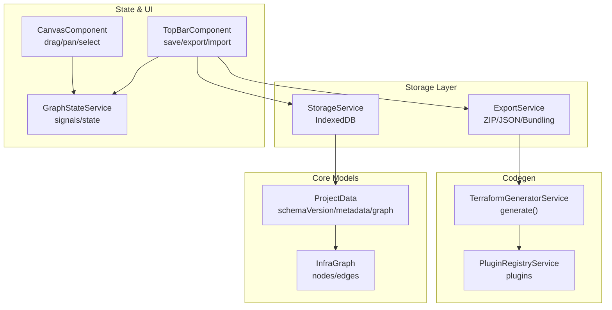
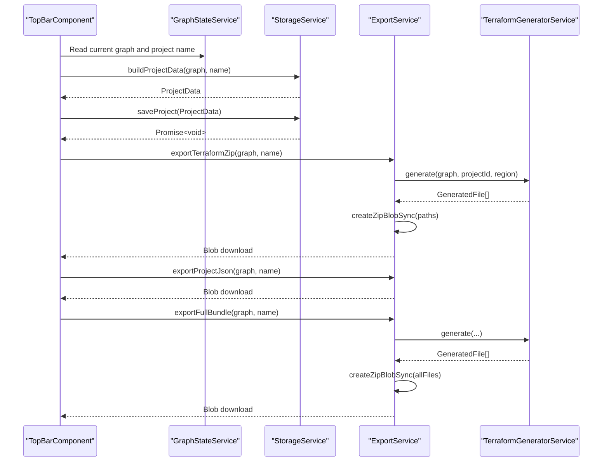
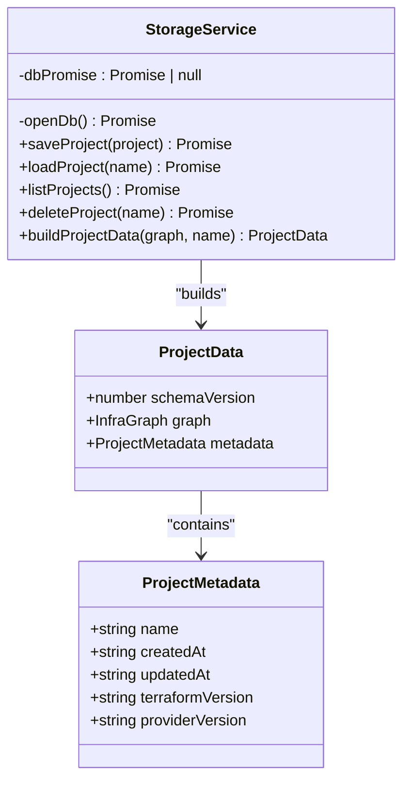
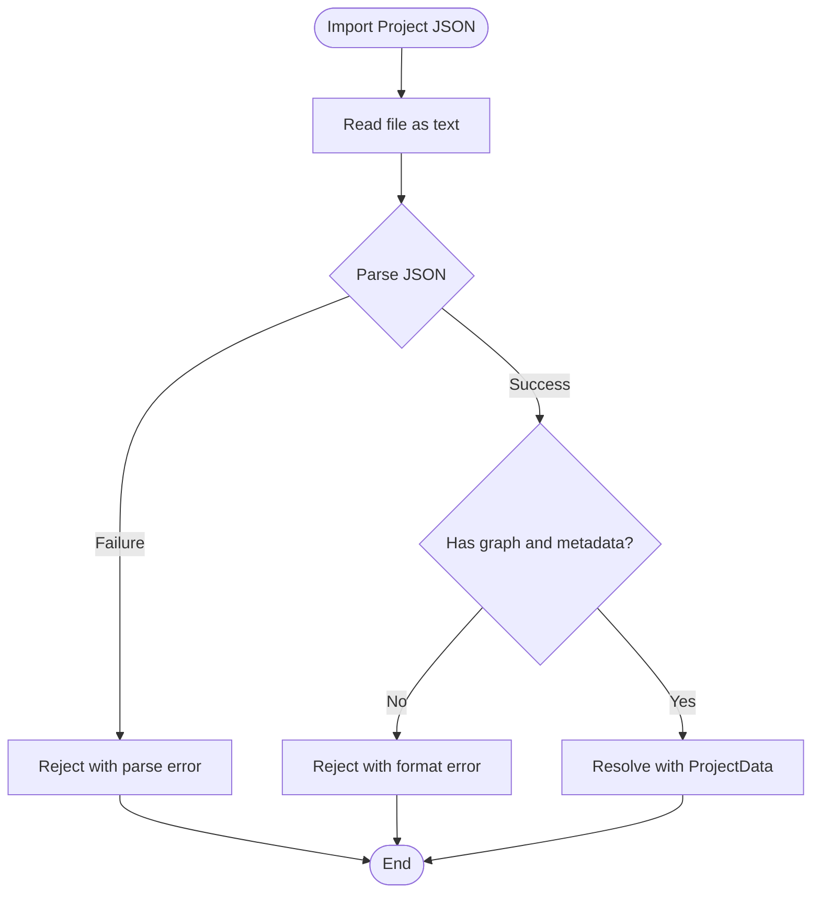
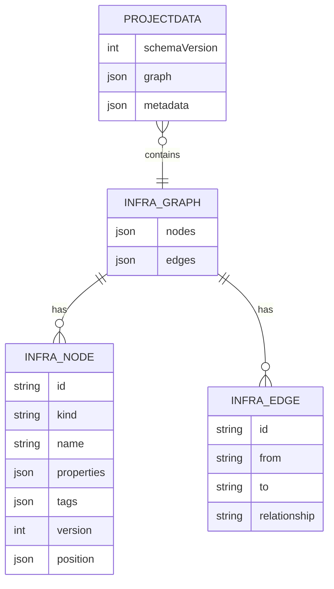
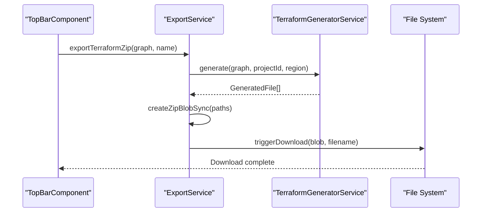
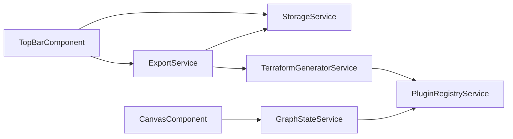

# Storage and Persistence

<cite>
**Referenced Files in This Document**
- [storage.service.ts](file://src/app/storage/storage.service.ts)
- [export.service.ts](file://src/app/storage/export.service.ts)
- [infra-graph.model.ts](file://src/app/core/models/infra-graph.model.ts)
- [graph-state.service.ts](file://src/app/core/services/graph-state.service.ts)
- [terraform-generator.service.ts](file://src/app/terraform-engine/terraform-generator.service.ts)
- [top-bar.component.ts](file://src/app/layout/top-bar/top-bar.component.ts)
- [canvas.component.ts](file://src/app/canvas/canvas.component.ts)
- [plugin-registry.service.ts](file://src/app/infra/plugin-registry.service.ts)
- [SYSTEM_DESIGN.md](file://SYSTEM_DESIGN.md)
</cite>

## Table of Contents
1. [Introduction](#introduction)
2. [Project Structure](#project-structure)
3. [Core Components](#core-components)
4. [Architecture Overview](#architecture-overview)
5. [Detailed Component Analysis](#detailed-component-analysis)
6. [Dependency Analysis](#dependency-analysis)
7. [Performance Considerations](#performance-considerations)
8. [Troubleshooting Guide](#troubleshooting-guide)
9. [Conclusion](#conclusion)
10. [Appendices](#appendices)

## Introduction
This document explains CloudCanvas-TF’s storage and persistence system with a focus on:
- Local persistence using IndexedDB via the StorageService
- Project serialization and metadata management
- Export workflows via the ExportService (JSON, ZIP, and full bundle)
- Project data structure and versioning
- Import validation and error handling
- Performance considerations, backup strategies, and data migration patterns
- Programmatic storage operations and UI integration

## Project Structure
The storage and persistence functionality spans several modules:
- Storage module: StorageService and ExportService
- Core models: InfraGraph and ProjectData
- State management: GraphStateService
- Code generation: TerraformGeneratorService
- UI integration: TopBarComponent and CanvasComponent
- Plugins: PluginRegistryService

**Diagram sources**
- [storage.service.ts](file://src/app/storage/storage.service.ts#L1-L85)
- [export.service.ts](file://src/app/storage/export.service.ts#L1-L203)
- [infra-graph.model.ts](file://src/app/core/models/infra-graph.model.ts#L1-L118)
- [graph-state.service.ts](file://src/app/core/services/graph-state.service.ts#L1-L147)
- [terraform-generator.service.ts](file://src/app/terraform-engine/terraform-generator.service.ts#L1-L234)
- [plugin-registry.service.ts](file://src/app/infra/plugin-registry.service.ts#L1-L73)
- [top-bar.component.ts](file://src/app/layout/top-bar/top-bar.component.ts#L1-L96)
- [canvas.component.ts](file://src/app/canvas/canvas.component.ts#L1-L286)

**Section sources**
- [storage.service.ts](file://src/app/storage/storage.service.ts#L1-L85)
- [export.service.ts](file://src/app/storage/export.service.ts#L1-L203)
- [infra-graph.model.ts](file://src/app/core/models/infra-graph.model.ts#L1-L118)
- [graph-state.service.ts](file://src/app/core/services/graph-state.service.ts#L1-L147)
- [terraform-generator.service.ts](file://src/app/terraform-engine/terraform-generator.service.ts#L1-L234)
- [plugin-registry.service.ts](file://src/app/infra/plugin-registry.service.ts#L1-L73)
- [top-bar.component.ts](file://src/app/layout/top-bar/top-bar.component.ts#L1-L96)
- [canvas.component.ts](file://src/app/canvas/canvas.component.ts#L1-L286)

## Core Components
- StorageService: IndexedDB-backed persistence for projects with CRUD operations and project data construction.
- ExportService: Exports Terraform ZIP, Project JSON, and full bundle; includes synchronous ZIP creation and import validation.
- InfraGraph and ProjectData: Canonical data model for serialized graph representation and metadata.
- GraphStateService: Application state for the current graph, selection, diagnostics, and dirty flag.
- TerraformGeneratorService: Generates Terraform files from the graph for export.
- TopBarComponent: Orchestrates save/export/import actions and integrates with StorageService and ExportService.
- CanvasComponent: UI for graph manipulation; interacts with GraphStateService.

**Section sources**
- [storage.service.ts](file://src/app/storage/storage.service.ts#L1-L85)
- [export.service.ts](file://src/app/storage/export.service.ts#L1-L203)
- [infra-graph.model.ts](file://src/app/core/models/infra-graph.model.ts#L79-L91)
- [graph-state.service.ts](file://src/app/core/services/graph-state.service.ts#L1-L147)
- [terraform-generator.service.ts](file://src/app/terraform-engine/terraform-generator.service.ts#L16-L51)
- [top-bar.component.ts](file://src/app/layout/top-bar/top-bar.component.ts#L32-L94)

## Architecture Overview
The storage and persistence architecture centers on:
- IndexedDB for local persistence
- ProjectData as the canonical serialized form
- ExportService orchestrating generation and packaging
- UI components triggering persistence and export actions

**Diagram sources**
- [top-bar.component.ts](file://src/app/layout/top-bar/top-bar.component.ts#L32-L67)
- [storage.service.ts](file://src/app/storage/storage.service.ts#L70-L83)
- [export.service.ts](file://src/app/storage/export.service.ts#L18-L59)
- [terraform-generator.service.ts](file://src/app/terraform-engine/terraform-generator.service.ts#L16-L51)

## Detailed Component Analysis

### StorageService
Responsibilities:
- IndexedDB database initialization and schema versioning
- CRUD operations for projects keyed by metadata.name
- ProjectData construction with schemaVersion and metadata timestamps

Key behaviors:
- Lazy openDb with memoized promise
- Transaction-based put/get/getAll/delete
- buildProjectData sets schemaVersion and timestamps

**Diagram sources**
- [storage.service.ts](file://src/app/storage/storage.service.ts#L9-L83)
- [infra-graph.model.ts](file://src/app/core/models/infra-graph.model.ts#L79-L91)

**Section sources**
- [storage.service.ts](file://src/app/storage/storage.service.ts#L12-L83)
- [infra-graph.model.ts](file://src/app/core/models/infra-graph.model.ts#L79-L91)

### ExportService
Responsibilities:
- Export Terraform ZIP, Project JSON, and full bundle
- Synchronous ZIP creation using in-memory buffers and CRC32
- Import validation for Project JSON
- Filename sanitization and download triggers

Workflow highlights:
- exportTerraformZip: generate files, build paths, create ZIP, trigger download
- exportProjectJson: build ProjectData, stringify, trigger download
- exportFullBundle: combine Terraform files and project.json into a ZIP
- importProjectJson: read file, parse JSON, validate presence of graph and metadata
- createZipBlobSync: constructs local file headers, central directory entries, and end-of-central-directory
- triggerDownload: creates a temporary anchor element and initiates download within user gesture

**Diagram sources**
- [export.service.ts](file://src/app/storage/export.service.ts#L61-L79)

**Section sources**
- [export.service.ts](file://src/app/storage/export.service.ts#L18-L79)
- [export.service.ts](file://src/app/storage/export.service.ts#L83-L167)
- [export.service.ts](file://src/app/storage/export.service.ts#L184-L197)
- [export.service.ts](file://src/app/storage/export.service.ts#L199-L201)

### Project Data Structure and Versioning
ProjectData encapsulates:
- schemaVersion: integer version for migrations
- graph: InfraGraph (nodes and edges)
- metadata: name, timestamps, and version constraints for Terraform and provider

InfraGraph defines:
- nodes: array of InfraNode with id, kind, name, properties, tags, version, position
- edges: array of InfraEdge with id, from, to, relationship

**Diagram sources**
- [infra-graph.model.ts](file://src/app/core/models/infra-graph.model.ts#L79-L91)
- [infra-graph.model.ts](file://src/app/core/models/infra-graph.model.ts#L36-L39)
- [infra-graph.model.ts](file://src/app/core/models/infra-graph.model.ts#L17-L34)

**Section sources**
- [infra-graph.model.ts](file://src/app/core/models/infra-graph.model.ts#L79-L91)
- [infra-graph.model.ts](file://src/app/core/models/infra-graph.model.ts#L36-L39)
- [infra-graph.model.ts](file://src/app/core/models/infra-graph.model.ts#L17-L34)

### Import/Export Workflows
- Export workflows:
  - Terraform ZIP: generates provider/main/variables/outputs files and zips them
  - Project JSON: serializes ProjectData
  - Full bundle: zips Terraform files plus project.json
- Import workflow:
  - Reads JSON, validates structure, loads graph and project name into GraphStateService

Integration points:
- TopBarComponent triggers save/export/import actions
- CanvasComponent manipulates graph state

**Diagram sources**
- [top-bar.component.ts](file://src/app/layout/top-bar/top-bar.component.ts#L45-L51)
- [export.service.ts](file://src/app/storage/export.service.ts#L18-L28)
- [terraform-generator.service.ts](file://src/app/terraform-engine/terraform-generator.service.ts#L16-L51)

**Section sources**
- [top-bar.component.ts](file://src/app/layout/top-bar/top-bar.component.ts#L45-L67)
- [export.service.ts](file://src/app/storage/export.service.ts#L18-L59)
- [terraform-generator.service.ts](file://src/app/terraform-engine/terraform-generator.service.ts#L16-L51)

### UI Integration
- TopBarComponent:
  - Save: builds ProjectData and persists via StorageService
  - Export: delegates to ExportService for Terraform ZIP, Project JSON, or bundle
  - Import: opens file picker, validates JSON, loads into GraphStateService
- CanvasComponent:
  - Manipulates graph state via GraphStateService signals
  - Integrates with plugin registry for resource metadata

**Section sources**
- [top-bar.component.ts](file://src/app/layout/top-bar/top-bar.component.ts#L32-L94)
- [canvas.component.ts](file://src/app/canvas/canvas.component.ts#L1-L286)
- [plugin-registry.service.ts](file://src/app/infra/plugin-registry.service.ts#L1-L73)

## Dependency Analysis
- StorageService depends on InfraGraph and ProjectData models
- ExportService depends on StorageService and TerraformGeneratorService
- TopBarComponent depends on StorageService and ExportService
- TerraformGeneratorService depends on PluginRegistryService and GraphEngineService
- CanvasComponent depends on GraphStateService and PluginRegistryService

**Diagram sources**
- [top-bar.component.ts](file://src/app/layout/top-bar/top-bar.component.ts#L15-L17)
- [storage.service.ts](file://src/app/storage/storage.service.ts#L1-L2)
- [export.service.ts](file://src/app/storage/export.service.ts#L3-L4)
- [terraform-generator.service.ts](file://src/app/terraform-engine/terraform-generator.service.ts#L6-L7)
- [plugin-registry.service.ts](file://src/app/infra/plugin-registry.service.ts#L1-L3)
- [canvas.component.ts](file://src/app/canvas/canvas.component.ts#L1-L4)
- [graph-state.service.ts](file://src/app/core/services/graph-state.service.ts#L1-L10)

**Section sources**
- [top-bar.component.ts](file://src/app/layout/top-bar/top-bar.component.ts#L15-L17)
- [storage.service.ts](file://src/app/storage/storage.service.ts#L1-L2)
- [export.service.ts](file://src/app/storage/export.service.ts#L3-L4)
- [terraform-generator.service.ts](file://src/app/terraform-engine/terraform-generator.service.ts#L6-L7)
- [plugin-registry.service.ts](file://src/app/infra/plugin-registry.service.ts#L1-L3)
- [canvas.component.ts](file://src/app/canvas/canvas.component.ts#L1-L4)
- [graph-state.service.ts](file://src/app/core/services/graph-state.service.ts#L1-L10)

## Performance Considerations
- IndexedDB transactions: Use readwrite transactions for saves and readonly for reads to minimize contention.
- Large projects: Consider batching IndexedDB operations and deferring heavy operations to Web Workers as outlined in the system design.
- ZIP generation: Synchronous creation avoids async overhead but should be invoked from user gestures to ensure browser download behavior.
- Deterministic generation: Topological sorting ensures stable ordering, reducing diff noise and improving performance for large graphs.

[No sources needed since this section provides general guidance]

## Troubleshooting Guide
Common issues and strategies:
- Export failures: ExportService wraps operations in try/catch and alerts the user with a message derived from the error.
- Import validation: importProjectJson rejects on parse errors or missing graph/metadata fields.
- IndexedDB errors: Transactions reject with error objects; callers should handle rejections and inform users.
- Download failures: triggerDownload relies on user gesture; ensure it is called synchronously from a user action.

**Section sources**
- [export.service.ts](file://src/app/storage/export.service.ts#L18-L28)
- [export.service.ts](file://src/app/storage/export.service.ts#L61-L79)
- [storage.service.ts](file://src/app/storage/storage.service.ts#L32-L37)
- [export.service.ts](file://src/app/storage/export.service.ts#L184-L197)

## Conclusion
CloudCanvas-TF’s storage and persistence system provides:
- Reliable local persistence using IndexedDB
- Clear project serialization with schemaVersion and metadata
- Flexible export options (Terraform ZIP, Project JSON, full bundle)
- Robust import validation and error handling
- Seamless UI integration for saving, exporting, and importing projects

[No sources needed since this section summarizes without analyzing specific files]

## Appendices

### Backup Strategies
- Regular exports: Encourage users to periodically export Project JSON and Terraform ZIP as backups.
- Full bundle export: Provides a self-contained archive including diagnostics and architecture metadata.

[No sources needed since this section provides general guidance]

### Data Migration Patterns
- schemaVersion: Increment schemaVersion in ProjectData to enable migration adapters.
- Import validation: Validate presence of required fields and attempt migration on mismatched versions.

**Section sources**
- [infra-graph.model.ts](file://src/app/core/models/infra-graph.model.ts#L79-L83)
- [export.service.ts](file://src/app/storage/export.service.ts#L61-L79)

### Programmatic Storage Operations
- Save project:
  - Build ProjectData using StorageService.buildProjectData
  - Persist via StorageService.saveProject
- Load project:
  - Retrieve via StorageService.loadProject by name
  - Load into GraphStateService via GraphStateService.loadGraph
- List projects:
  - Retrieve via StorageService.listProjects
- Delete project:
  - Remove via StorageService.deleteProject by name

**Section sources**
- [storage.service.ts](file://src/app/storage/storage.service.ts#L30-L68)
- [graph-state.service.ts](file://src/app/core/services/graph-state.service.ts#L133-L137)

### UI Integration Examples
- Save button: Calls TopBarComponent.saveProject which builds ProjectData and persists it.
- Export menu: Triggers ExportService.exportTerraformZip, exportProjectJson, or exportFullBundle.
- Import button: Opens file picker, validates JSON, and loads graph and project name.

**Section sources**
- [top-bar.component.ts](file://src/app/layout/top-bar/top-bar.component.ts#L32-L94)
- [export.service.ts](file://src/app/storage/export.service.ts#L18-L59)