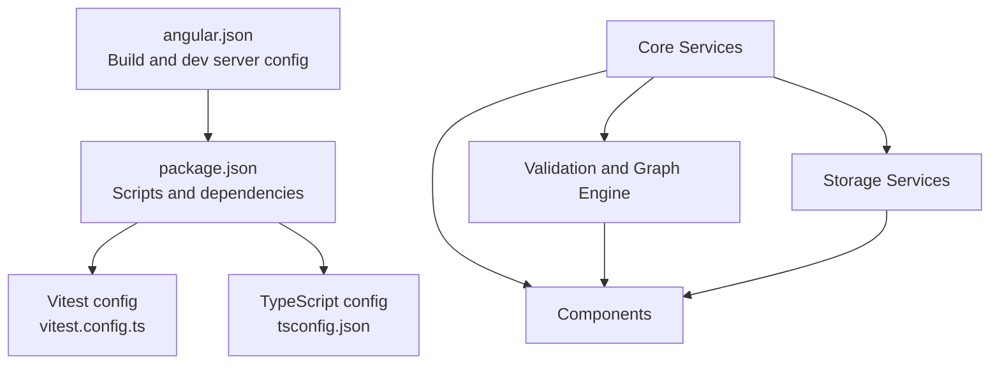
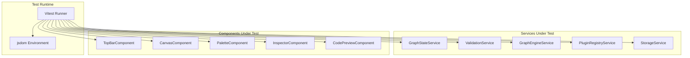
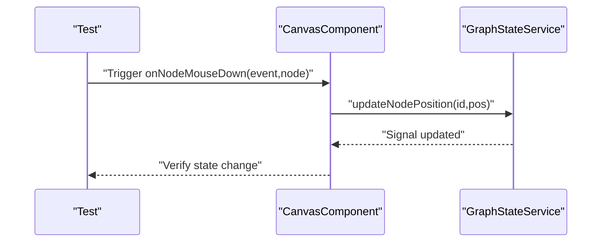
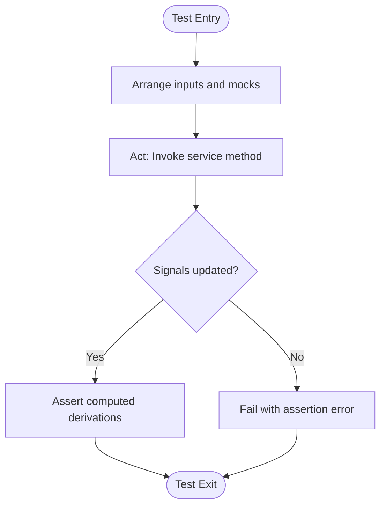
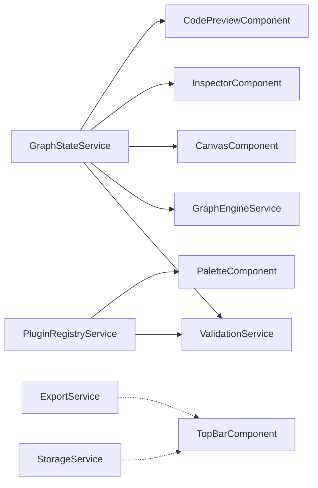

# Testing and Development

<cite>
**Referenced Files in This Document**
- [vitest.config.ts](file://vitest.config.ts)
- [package.json](file://package.json)
- [angular.json](file://angular.json)
- [tsconfig.json](file://tsconfig.json)
- [README.md](file://README.md)
- [graph-state.service.ts](file://src/app/core/services/graph-state.service.ts)
- [storage.service.ts](file://src/app/storage/storage.service.ts)
- [plugin-registry.service.ts](file://src/app/infra/plugin-registry.service.ts)
- [validation.service.ts](file://src/app/validation/validation.service.ts)
- [graph-engine.service.ts](file://src/app/graph-engine/graph-engine.service.ts)
- [top-bar.component.ts](file://src/app/layout/top-bar/top-bar.component.ts)
- [canvas.component.ts](file://src/app/canvas/canvas.component.ts)
- [palette.component.ts](file://src/app/palette/palette.component.ts)
- [inspector.component.ts](file://src/app/inspector/inspector.component.ts)
- [code-preview.component.ts](file://src/app/code-preview/code-preview.component.ts)
</cite>

## Table of Contents
1. [Introduction](#introduction)
2. [Project Structure](#project-structure)
3. [Core Components](#core-components)
4. [Architecture Overview](#architecture-overview)
5. [Detailed Component Analysis](#detailed-component-analysis)
6. [Dependency Analysis](#dependency-analysis)
7. [Performance Considerations](#performance-considerations)
8. [Troubleshooting Guide](#troubleshooting-guide)
9. [Conclusion](#conclusion)
10. [Appendices](#appendices)

## Introduction
This document describes CloudCanvas-TF’s testing framework and development workflow. It covers the Vitest configuration for unit testing, including component testing, service testing, and mocking patterns. It also explains the development setup (environment configuration, build processes, development server, and hot reload), testing approaches for Angular components and services, and reactive state management using signals. Quality assurance practices such as code coverage, performance testing, and cross-browser compatibility are included, along with contribution guidelines and examples for writing effective tests.

## Project Structure
CloudCanvas-TF is an Angular 21 application configured with a modern toolchain. The project uses:
- Angular CLI for builds and development server
- Vitest for unit testing with jsdom environment
- Strict TypeScript configuration for safety and correctness
- Standalone components and Angular signals for reactive state

**Diagram sources**
- [angular.json](file://angular.json#L11-L26)
- [package.json](file://package.json#L5-L11)
- [vitest.config.ts](file://vitest.config.ts#L3-L12)
- [tsconfig.json](file://tsconfig.json#L3-L14)

**Section sources**
- [README.md](file://README.md#L5-L13)
- [angular.json](file://angular.json#L11-L26)
- [package.json](file://package.json#L5-L11)
- [tsconfig.json](file://tsconfig.json#L3-L21)

## Core Components
This section outlines the primary building blocks used in tests and development:
- Reactive state via Angular signals in services
- Component-driven UI with computed signals and effects
- Service orchestration for validation, graph operations, and persistence
- Plugin registry for extensible resource definitions

Key services and components:
- GraphStateService: manages InfraGraph, selection, diagnostics, and dirty state
- ValidationService: validates schema, graph integrity, and policy compliance
- GraphEngineService: performs cycle detection and topological sorting
- PluginRegistryService: registers and retrieves resource plugins
- StorageService: IndexedDB-backed persistence for projects
- UI components: TopBar, Canvas, Palette, Inspector, CodePreview

**Section sources**
- [graph-state.service.ts](file://src/app/core/services/graph-state.service.ts#L12-L146)
- [validation.service.ts](file://src/app/validation/validation.service.ts#L7-L106)
- [graph-engine.service.ts](file://src/app/graph-engine/graph-engine.service.ts#L10-L126)
- [plugin-registry.service.ts](file://src/app/infra/plugin-registry.service.ts#L17-L72)
- [storage.service.ts](file://src/app/storage/storage.service.ts#L8-L84)
- [top-bar.component.ts](file://src/app/layout/top-bar/top-bar.component.ts#L14-L95)
- [canvas.component.ts](file://src/app/canvas/canvas.component.ts#L12-L285)
- [palette.component.ts](file://src/app/palette/palette.component.ts#L14-L82)
- [inspector.component.ts](file://src/app/inspector/inspector.component.ts#L21-L102)
- [code-preview.component.ts](file://src/app/code-preview/code-preview.component.ts#L100-L136)

## Architecture Overview
The testing architecture centers around Vitest with jsdom, enabling DOM APIs for component tests. Angular services are tested directly, while components are tested either via unit tests or integration tests using Angular’s testing utilities. Signals are first-class citizens in tests, allowing straightforward assertions on reactive state.

**Diagram sources**
- [vitest.config.ts](file://vitest.config.ts#L3-L12)
- [graph-state.service.ts](file://src/app/core/services/graph-state.service.ts#L12-L146)
- [validation.service.ts](file://src/app/validation/validation.service.ts#L7-L106)
- [graph-engine.service.ts](file://src/app/graph-engine/graph-engine.service.ts#L10-L126)
- [plugin-registry.service.ts](file://src/app/infra/plugin-registry.service.ts#L17-L72)
- [storage.service.ts](file://src/app/storage/storage.service.ts#L8-L84)
- [top-bar.component.ts](file://src/app/layout/top-bar/top-bar.component.ts#L14-L95)
- [canvas.component.ts](file://src/app/canvas/canvas.component.ts#L12-L285)
- [palette.component.ts](file://src/app/palette/palette.component.ts#L14-L82)
- [inspector.component.ts](file://src/app/inspector/inspector.component.ts#L21-L102)
- [code-preview.component.ts](file://src/app/code-preview/code-preview.component.ts#L100-L136)

## Detailed Component Analysis

### Vitest Configuration and Unit Testing Strategy
- Environment: jsdom enables DOM APIs for component tests
- Globals: Vitest globals enabled for concise test syntax
- Includes: Targets spec files under src/**/*.spec.ts
- Coverage: v8 provider with text and lcov reporters

Recommended patterns:
- Use beforeEach/afterEach to reset services and clear mocks
- Mock external APIs (e.g., StorageService) using Vitest spies or factories
- For components, prefer unit tests focusing on signals and service interactions
- For services, isolate logic and assert reactive state updates

**Section sources**
- [vitest.config.ts](file://vitest.config.ts#L3-L12)

### Development Setup
- Scripts:
  - start: ng serve (development server)
  - build: ng build (production)
  - watch: ng build --watch (development)
  - test: vitest run (unit tests)
- Angular CLI builder for build and dev server
- Strict TypeScript compiler options and Angular strictness flags

Development workflow:
- Run npm run start for local development server with hot reload
- Use npm run build for production builds
- Use npm run test for unit test runs and coverage reports

**Section sources**
- [package.json](file://package.json#L5-L11)
- [angular.json](file://angular.json#L21-L26)
- [tsconfig.json](file://tsconfig.json#L3-L21)
- [README.md](file://README.md#L9-L13)

### Testing Angular Components with Signals
Focus areas:
- TopBarComponent: tests should verify save status computation, project lifecycle actions, and menu toggles
- CanvasComponent: test SVG interactions, edge drawing, panning, zooming, and node manipulation via signals
- PaletteComponent: verify category filtering, search, and drag-and-drop integration
- InspectorComponent: test property updates, name changes, and diagnostic display
- CodePreviewComponent: test tab switching, clipboard operations, and highlighting pipe

Mocking strategies:
- Mock StorageService and ExportService to avoid IndexedDB and file operations
- Use partial mocks for GraphStateService to simulate reactive state transitions
- Stub DOM APIs when necessary (e.g., clipboard, file input)

**Diagram sources**
- [canvas.component.ts](file://src/app/canvas/canvas.component.ts#L128-L154)
- [graph-state.service.ts](file://src/app/core/services/graph-state.service.ts#L95-L102)

**Section sources**
- [top-bar.component.ts](file://src/app/layout/top-bar/top-bar.component.ts#L14-L95)
- [canvas.component.ts](file://src/app/canvas/canvas.component.ts#L12-L285)
- [palette.component.ts](file://src/app/palette/palette.component.ts#L14-L82)
- [inspector.component.ts](file://src/app/inspector/inspector.component.ts#L21-L102)
- [code-preview.component.ts](file://src/app/code-preview/code-preview.component.ts#L100-L136)

### Testing Services with Reactive State
Key services to test:
- GraphStateService: node/edge CRUD, selection, computed properties, and dirty state
- ValidationService: schema validation, graph integrity checks, and policy diagnostics
- GraphEngineService: adjacency map, cycle detection, topological sort, connectivity helpers
- PluginRegistryService: registration, retrieval, and categorized grouping
- StorageService: IndexedDB transactions, project CRUD, and metadata handling

Patterns:
- Assert signal updates using synchronous reads or microtask waits
- Verify computed derivations by changing base signals
- Mock plugin validators and graph engine results for deterministic tests
- For StorageService, mock IndexedDB transaction callbacks

**Diagram sources**
- [graph-state.service.ts](file://src/app/core/services/graph-state.service.ts#L12-L146)
- [validation.service.ts](file://src/app/validation/validation.service.ts#L7-L106)
- [graph-engine.service.ts](file://src/app/graph-engine/graph-engine.service.ts#L10-L126)
- [plugin-registry.service.ts](file://src/app/infra/plugin-registry.service.ts#L17-L72)
- [storage.service.ts](file://src/app/storage/storage.service.ts#L8-L84)

**Section sources**
- [graph-state.service.ts](file://src/app/core/services/graph-state.service.ts#L12-L146)
- [validation.service.ts](file://src/app/validation/validation.service.ts#L7-L106)
- [graph-engine.service.ts](file://src/app/graph-engine/graph-engine.service.ts#L10-L126)
- [plugin-registry.service.ts](file://src/app/infra/plugin-registry.service.ts#L17-L72)
- [storage.service.ts](file://src/app/storage/storage.service.ts#L8-L84)

### Example Test Scenarios
Below are example scenarios with guidance on how to structure tests without including code snippets:

- GraphStateService
  - Scenario: Adding a node updates graph and dirty state
    - Arrange: Initialize service with empty graph
    - Act: Call addNode with kind and position
    - Assert: graph().nodes length increases, isDirty is true, selectedNodeId matches new id
  - Scenario: Removing a node removes edges and clears selection
    - Arrange: Add a node and an edge to it
    - Act: Call removeNode
    - Assert: Nodes and edges reduced, selectedNodeId cleared, isDirty true
  - Scenario: Computed selectedNode reflects selection
    - Arrange: Select a node
    - Act: Access selectedNode computed
    - Assert: Returns the selected node or null

- ValidationService
  - Scenario: Detecting duplicate names produces diagnostics
    - Arrange: Build graph with two nodes of same kind and name
    - Act: Call validateAll
    - Assert: Diagnostics include DUPLICATE_NAME
  - Scenario: Unknown resource kind reported as error
    - Arrange: Add node with unknown kind
    - Act: Call validateAll
    - Assert: Diagnostics include UNKNOWN_RESOURCE

- GraphEngineService
  - Scenario: Cycle detection marks hasCycle true
    - Arrange: Build directed cycle
    - Act: Call detectCycle
    - Assert: hasCycle is true and cycleNodes populated
  - Scenario: Topological sort returns ordered nodes
    - Arrange: Build DAG
    - Act: Call topologicalSort
    - Assert: order has all nodes and hasCycle false

- PluginRegistryService
  - Scenario: Plugins registered by category
    - Arrange: Instantiate registry
    - Act: Call getPluginsByCategory
    - Assert: Categories present and ordered as expected

- StorageService
  - Scenario: Saving and loading project
    - Arrange: Build ProjectData
    - Act: saveProject, then loadProject
    - Assert: Loaded data equals original

- Components
  - Scenario: Canvas drag updates node position
    - Arrange: Mock GraphStateService, trigger onNodeMouseDown and mousemove/mouseup
    - Act: Simulate drag events
    - Assert: updateNodePosition invoked with expected coordinates
  - Scenario: Inspector property change updates node
    - Arrange: Select a node, change a property
    - Act: Trigger onFieldChange
    - Assert: updateNodeProperties called with key/value

**Section sources**
- [graph-state.service.ts](file://src/app/core/services/graph-state.service.ts#L12-L146)
- [validation.service.ts](file://src/app/validation/validation.service.ts#L7-L106)
- [graph-engine.service.ts](file://src/app/graph-engine/graph-engine.service.ts#L10-L126)
- [plugin-registry.service.ts](file://src/app/infra/plugin-registry.service.ts#L17-L72)
- [storage.service.ts](file://src/app/storage/storage.service.ts#L8-L84)
- [canvas.component.ts](file://src/app/canvas/canvas.component.ts#L128-L154)
- [inspector.component.ts](file://src/app/inspector/inspector.component.ts#L75-L85)

## Dependency Analysis
This section maps internal dependencies among services and components to guide testing strategies.

**Diagram sources**
- [graph-state.service.ts](file://src/app/core/services/graph-state.service.ts#L12-L146)
- [validation.service.ts](file://src/app/validation/validation.service.ts#L7-L12)
- [graph-engine.service.ts](file://src/app/graph-engine/graph-engine.service.ts#L10-L11)
- [plugin-registry.service.ts](file://src/app/infra/plugin-registry.service.ts#L17-L42)
- [palette.component.ts](file://src/app/palette/palette.component.ts#L14-L16)
- [canvas.component.ts](file://src/app/canvas/canvas.component.ts#L12-L14)
- [inspector.component.ts](file://src/app/inspector/inspector.component.ts#L21-L23)
- [code-preview.component.ts](file://src/app/code-preview/code-preview.component.ts#L107-L108)
- [storage.service.ts](file://src/app/storage/storage.service.ts#L8-L9)
- [top-bar.component.ts](file://src/app/layout/top-bar/top-bar.component.ts#L14-L17)

**Section sources**
- [graph-state.service.ts](file://src/app/core/services/graph-state.service.ts#L12-L146)
- [validation.service.ts](file://src/app/validation/validation.service.ts#L7-L12)
- [graph-engine.service.ts](file://src/app/graph-engine/graph-engine.service.ts#L10-L11)
- [plugin-registry.service.ts](file://src/app/infra/plugin-registry.service.ts#L17-L42)
- [storage.service.ts](file://src/app/storage/storage.service.ts#L8-L9)
- [top-bar.component.ts](file://src/app/layout/top-bar/top-bar.component.ts#L14-L17)

## Performance Considerations
- Prefer unit tests over heavy integration tests to keep feedback fast
- Use lightweight mocks for IndexedDB and file APIs to avoid flaky timing
- Keep component tests focused on signal reactions and minimal DOM interactions
- For performance-sensitive UI (e.g., Canvas), test rendering logic separately from DOM measurements
- Use Vitest’s built-in benchmarking capabilities sparingly and only for hot paths

## Troubleshooting Guide
Common issues and resolutions:
- Tests fail due to missing jsdom globals
  - Ensure Vitest environment is set to jsdom and globals are enabled
- IndexedDB failures in tests
  - Mock StorageService methods returning Promises with resolved values
- Clipboard API failures
  - Mock navigator.clipboard in tests
- Signal assertions timing out
  - Use microtasks or re-read signals synchronously after state updates
- Coverage gaps
  - Add branch coverage for conditionals in services and components
  - Ensure all exported functions and public methods are covered

**Section sources**
- [vitest.config.ts](file://vitest.config.ts#L3-L12)
- [storage.service.ts](file://src/app/storage/storage.service.ts#L30-L68)
- [code-preview.component.ts](file://src/app/code-preview/code-preview.component.ts#L124-L135)

## Conclusion
CloudCanvas-TF’s testing and development workflow leverages Vitest with jsdom and Angular signals for reactive, maintainable tests. By structuring tests around services and components, mocking external dependencies, and focusing on signal reactions, teams can achieve reliable unit tests, strong coverage, and efficient development cycles. Adhering to the contribution guidelines and best practices outlined here ensures consistent quality across the codebase.

## Appendices

### Contribution Guidelines
- Code standards
  - Follow strict TypeScript and Angular strictness settings
  - Use Angular signals for reactive state and computed derivations
  - Keep components standalone and focused
- Pull request process
  - Include unit tests for new features and bug fixes
  - Ensure coverage remains above thresholds
  - Describe changes and test scenarios in the PR description
- Issue reporting
  - Provide reproduction steps, expected vs. actual behavior, and environment details
  - Include relevant component/service context and test coverage status

### Quality Assurance Practices
- Code coverage
  - Enable v8 coverage with lcov reporter; review lcov report in CI
- Performance testing
  - Benchmark critical signal computations and graph operations
- Cross-browser compatibility
  - Validate component behavior across supported browsers in CI matrix