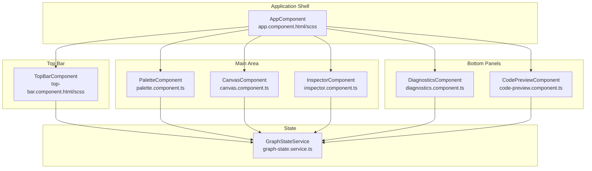
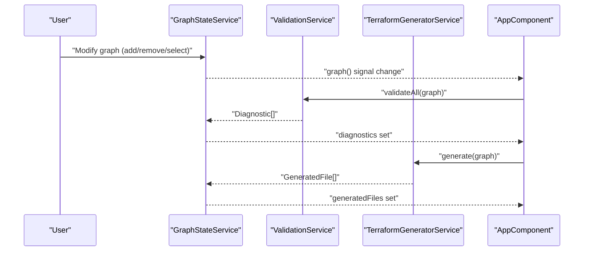
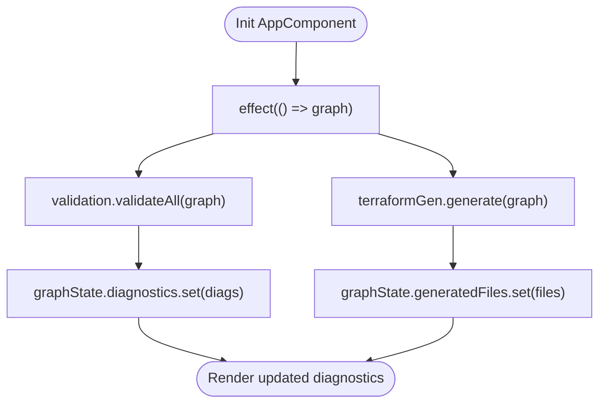
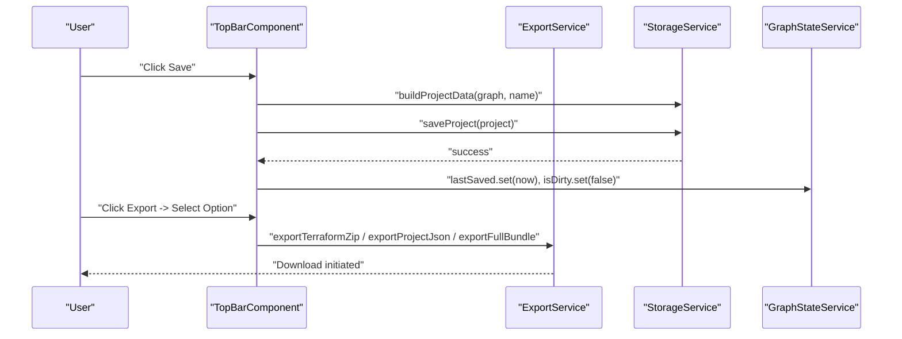
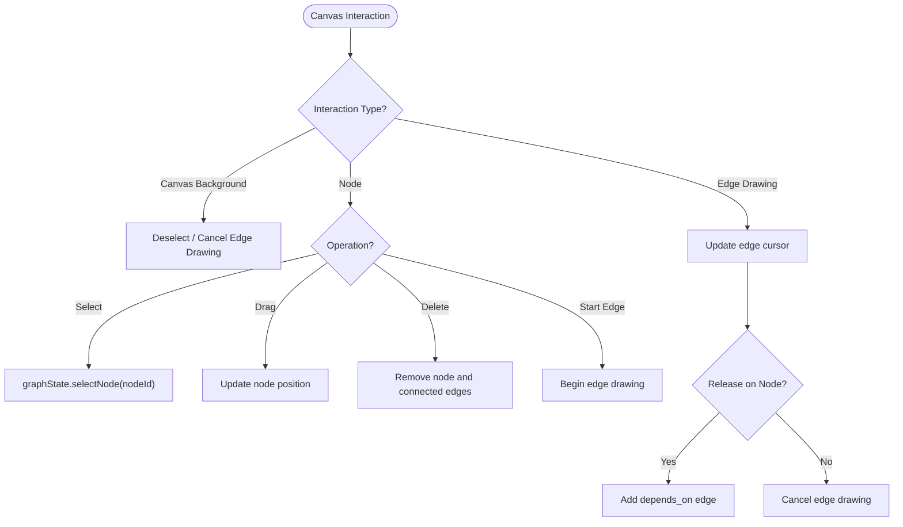
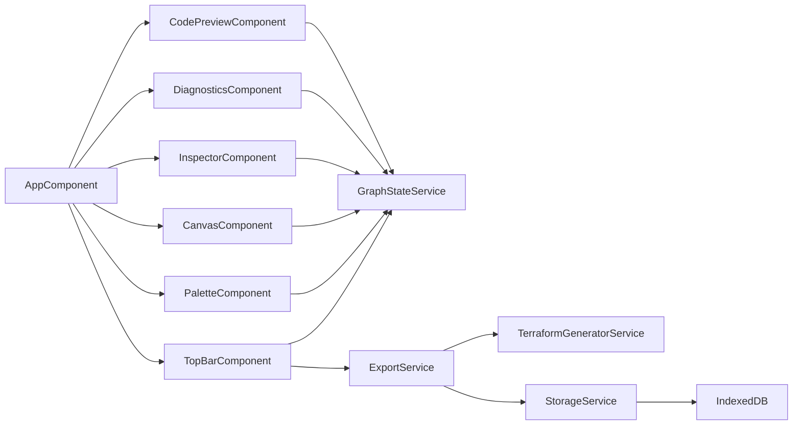

# UI Layout and Navigation

<cite>
**Referenced Files in This Document**
- [AppComponent](file://src/app/layout/app.component.ts)
- [AppComponent HTML](file://src/app/layout/app.component.html)
- [AppComponent SCSS](file://src/app/layout/app.component.scss)
- [TopBarComponent](file://src/app/layout/top-bar/top-bar.component.ts)
- [TopBarComponent HTML](file://src/app/layout/top-bar/top-bar.component.html)
- [TopBarComponent SCSS](file://src/app/layout/top-bar/top-bar.component.scss)
- [PaletteComponent](file://src/app/palette/palette.component.ts)
- [CanvasComponent](file://src/app/canvas/canvas.component.ts)
- [InspectorComponent](file://src/app/inspector/inspector.component.ts)
- [CodePreviewComponent](file://src/app/code-preview/code-preview.component.ts)
- [DiagnosticsComponent](file://src/app/diagnostics/diagnostics.component.ts)
- [GraphStateService](file://src/app/core/services/graph-state.service.ts)
- [InfraGraph Model](file://src/app/core/models/infra-graph.model.ts)
- [ExportService](file://src/app/storage/export.service.ts)
- [StorageService](file://src/app/storage/storage.service.ts)
</cite>

## Table of Contents
1. [Introduction](#introduction)
2. [Project Structure](#project-structure)
3. [Core Components](#core-components)
4. [Architecture Overview](#architecture-overview)
5. [Detailed Component Analysis](#detailed-component-analysis)
6. [Dependency Analysis](#dependency-analysis)
7. [Performance Considerations](#performance-considerations)
8. [Troubleshooting Guide](#troubleshooting-guide)
9. [Conclusion](#conclusion)
10. [Appendices](#appendices)

## Introduction
This document explains CloudCanvas-TF’s UI layout and navigation system with a focus on the application shell, responsive layout, and component orchestration. It documents the AppComponent as the primary application shell coordinating the TopBar, Palette, Canvas, Inspector, Code Preview, and Diagnostics panels. It also details the TopBarComponent’s project management and export capabilities, responsive design patterns, styling with SCSS, accessibility considerations, and layout customization strategies.

## Project Structure
The layout system centers around the application shell (AppComponent) and a set of cooperating panels:
- Application shell: coordinates the top bar, main canvas area, and bottom panels
- Panels: Palette (left), Canvas (center), Inspector (right), Diagnostics (bottom-left), Code Preview (bottom-right)
- State: managed centrally via GraphStateService, driving validation and code generation

**Diagram sources**
- [AppComponent HTML](file://src/app/layout/app.component.html#L1-L27)
- [AppComponent SCSS](file://src/app/layout/app.component.scss#L1-L115)
- [TopBarComponent](file://src/app/layout/top-bar/top-bar.component.ts#L1-L96)
- [PaletteComponent](file://src/app/palette/palette.component.ts#L1-L83)
- [CanvasComponent](file://src/app/canvas/canvas.component.ts#L1-L286)
- [InspectorComponent](file://src/app/inspector/inspector.component.ts#L1-L103)
- [DiagnosticsComponent](file://src/app/diagnostics/diagnostics.component.ts#L1-L44)
- [CodePreviewComponent](file://src/app/code-preview/code-preview.component.ts#L1-L137)
- [GraphStateService](file://src/app/core/services/graph-state.service.ts#L1-L147)

**Section sources**
- [AppComponent HTML](file://src/app/layout/app.component.html#L1-L27)
- [AppComponent SCSS](file://src/app/layout/app.component.scss#L1-L115)

## Core Components
- AppComponent: Declares and orchestrates all major UI areas. Reacts to graph changes to trigger validation and code generation, keeping diagnostics and generated files synchronized.
- TopBarComponent: Provides project name editing, save/import/new actions, and export menu with Terraform ZIP, Project JSON, and Full Bundle options.
- PaletteComponent: Lists categorized resource plugins with search and drag-and-drop support to add nodes to the canvas.
- CanvasComponent: Renders the interactive SVG canvas, supports panning, zooming, node dragging, edge drawing, and deletion.
- InspectorComponent: Displays and edits selected node properties, grouped by plugin-defined groups, with validation feedback.
- DiagnosticsComponent: Aggregates and displays validation diagnostics with severity counts and quick selection of affected nodes.
- CodePreviewComponent: Renders generated Terraform content with syntax highlighting and clipboard copy.

**Section sources**
- [AppComponent](file://src/app/layout/app.component.ts#L1-L48)
- [TopBarComponent](file://src/app/layout/top-bar/top-bar.component.ts#L1-L96)
- [PaletteComponent](file://src/app/palette/palette.component.ts#L1-L83)
- [CanvasComponent](file://src/app/canvas/canvas.component.ts#L1-L286)
- [InspectorComponent](file://src/app/inspector/inspector.component.ts#L1-L103)
- [DiagnosticsComponent](file://src/app/diagnostics/diagnostics.component.ts#L1-L44)
- [CodePreviewComponent](file://src/app/code-preview/code-preview.component.ts#L1-L137)

## Architecture Overview
The layout architecture follows a shell-and-panels model:
- Shell: AppComponent manages global layout and state reactions
- Panels: Left/right/top/bottom regions host specialized components
- State synchronization: GraphStateService drives validation and code generation; effects propagate changes to diagnostics and generated files

**Diagram sources**
- [AppComponent](file://src/app/layout/app.component.ts#L33-L41)
- [GraphStateService](file://src/app/core/services/graph-state.service.ts#L14-L33)

**Section sources**
- [AppComponent](file://src/app/layout/app.component.ts#L31-L42)
- [GraphStateService](file://src/app/core/services/graph-state.service.ts#L1-L147)

## Detailed Component Analysis

### AppComponent: Application Shell
- Responsibilities:
  - Declares and imports all major components
  - Hosts the shell layout with top bar, main area (left palette, center canvas, right inspector), and bottom panels
  - Initializes state and reacts to graph changes to keep diagnostics and generated files current
- Layout composition:
  - Uses flexbox for vertical shell and horizontal main area
  - Defines fixed-width side panels and a flexible canvas area
  - Bottom panels split into diagnostics (left) and code preview (right)
- Responsive behavior:
  - Media queries adjust panel widths and stack panels vertically on smaller screens
- State synchronization:
  - Effect observes graph changes and triggers validation and code generation

**Diagram sources**
- [AppComponent](file://src/app/layout/app.component.ts#L33-L41)
- [GraphStateService](file://src/app/core/services/graph-state.service.ts#L16-L17)

**Section sources**
- [AppComponent](file://src/app/layout/app.component.ts#L12-L48)
- [AppComponent HTML](file://src/app/layout/app.component.html#L1-L27)
- [AppComponent SCSS](file://src/app/layout/app.component.scss#L1-L115)

### TopBarComponent: Project Management and Export Controls
- Project management:
  - Editable project name bound to GraphStateService
  - Save status indicator reflecting dirty state and last saved time
  - New project clears the graph and resets project name
  - Import project loads serialized graph from JSON
- Export options:
  - Export menu toggled by a primary button
  - Options: Terraform ZIP, Project JSON, Full Bundle
  - Export functions delegate to ExportService and require user gesture for downloads
- Accessibility:
  - Proper aria-labels and roles for buttons and menu
  - Keyboard-friendly interactions via native button semantics

**Diagram sources**
- [TopBarComponent](file://src/app/layout/top-bar/top-bar.component.ts#L32-L39)
- [TopBarComponent](file://src/app/layout/top-bar/top-bar.component.ts#L45-L67)
- [ExportService](file://src/app/storage/export.service.ts#L18-L28)
- [ExportService](file://src/app/storage/export.service.ts#L30-L40)
- [ExportService](file://src/app/storage/export.service.ts#L42-L59)
- [StorageService](file://src/app/storage/storage.service.ts#L30-L38)
- [GraphStateService](file://src/app/core/services/graph-state.service.ts#L18-L20)

**Section sources**
- [TopBarComponent](file://src/app/layout/top-bar/top-bar.component.ts#L1-L96)
- [TopBarComponent HTML](file://src/app/layout/top-bar/top-bar.component.html#L1-L57)
- [TopBarComponent SCSS](file://src/app/layout/top-bar/top-bar.component.scss#L1-L200)
- [ExportService](file://src/app/storage/export.service.ts#L1-L203)
- [StorageService](file://src/app/storage/storage.service.ts#L1-L85)

### PaletteComponent: Resource Palette and Search
- Features:
  - Groups plugins by category and supports search filtering
  - Expand/collapse categories for better organization
  - Drag-and-drop nodes onto the canvas
  - Adds nodes with computed initial positions to avoid overlap
- Interaction:
  - onDragStart sets data transfer kind for canvas drop handling
  - addToCanvas creates nodes with default properties and selects them

**Section sources**
- [PaletteComponent](file://src/app/palette/palette.component.ts#L1-L83)
- [InfraGraph Model](file://src/app/core/models/infra-graph.model.ts#L93-L102)

### CanvasComponent: Interactive SVG Canvas
- Rendering:
  - Displays nodes and edges with computed SVG paths
  - Supports zoom via mouse wheel and pan via middle-click or Ctrl+click
- Interactions:
  - Node selection, dragging, deletion, and edge drawing
  - Canvas background click deselects and cancels edge drawing
- Diagnostics:
  - Highlights nodes with warnings or errors based on diagnostics
- Coordinate conversion:
  - Converts screen coordinates to SVG viewBox coordinates for precise interactions

**Diagram sources**
- [CanvasComponent](file://src/app/canvas/canvas.component.ts#L74-L125)
- [CanvasComponent](file://src/app/canvas/canvas.component.ts#L164-L177)
- [CanvasComponent](file://src/app/canvas/canvas.component.ts#L196-L218)
- [GraphStateService](file://src/app/core/services/graph-state.service.ts#L129-L131)

**Section sources**
- [CanvasComponent](file://src/app/canvas/canvas.component.ts#L1-L286)
- [GraphStateService](file://src/app/core/services/graph-state.service.ts#L1-L147)

### InspectorComponent: Node Property Editor
- Behavior:
  - Computes fields from plugin schema and groups them for display
  - Binds property changes to GraphStateService updates
  - Shows diagnostics for the selected node
- Editing:
  - Handles text, boolean, and numeric inputs with appropriate parsing
  - Updates node name and properties atomically

**Section sources**
- [InspectorComponent](file://src/app/inspector/inspector.component.ts#L1-L103)
- [GraphStateService](file://src/app/core/services/graph-state.service.ts#L73-L93)

### DiagnosticsComponent: Validation Feedback
- Functionality:
  - Aggregates diagnostics by severity
  - Sorts and displays counts for quick scanning
  - Allows clicking a diagnostic to select the associated node

**Section sources**
- [DiagnosticsComponent](file://src/app/diagnostics/diagnostics.component.ts#L1-L44)
- [GraphStateService](file://src/app/core/services/graph-state.service.ts#L16-L17)

### CodePreviewComponent: Generated Terraform Preview
- Features:
  - Displays generated files as tabs
  - Applies syntax highlighting via a custom pipe
  - Copies active file content to clipboard with feedback

**Section sources**
- [CodePreviewComponent](file://src/app/code-preview/code-preview.component.ts#L1-L137)

## Dependency Analysis
- Component dependencies:
  - AppComponent composes TopBar, Palette, Canvas, Inspector, Diagnostics, and Code Preview
  - All major components depend on GraphStateService for state and on PluginRegistryService for resource metadata
  - ExportService depends on TerraformGeneratorService and StorageService for export operations
- Coupling and cohesion:
  - Strong cohesion within each component around a single responsibility
  - Centralized state via GraphStateService reduces cross-component coupling
- External integrations:
  - IndexedDB via StorageService for persistence
  - Browser APIs for file downloads and clipboard

**Diagram sources**
- [AppComponent](file://src/app/layout/app.component.ts#L1-L11)
- [TopBarComponent](file://src/app/layout/top-bar/top-bar.component.ts#L1-L5)
- [ExportService](file://src/app/storage/export.service.ts#L1-L11)
- [StorageService](file://src/app/storage/storage.service.ts#L1-L85)

**Section sources**
- [AppComponent](file://src/app/layout/app.component.ts#L1-L11)
- [TopBarComponent](file://src/app/layout/top-bar/top-bar.component.ts#L1-L5)
- [ExportService](file://src/app/storage/export.service.ts#L1-L11)
- [StorageService](file://src/app/storage/storage.service.ts#L1-L85)

## Performance Considerations
- Reactive updates:
  - Use signals and computed properties to minimize unnecessary renders
  - Keep heavy computations (validation, generation) inside effects and services
- Canvas interactions:
  - Avoid excessive DOM updates during drag and pan; batch state updates
  - Use requestAnimationFrame for smooth animations where applicable
- Rendering:
  - Prefer SVG for scalable vector graphics and efficient redrawing
  - Limit re-computation of expensive derived data (e.g., diagnostics) by caching where appropriate

## Troubleshooting Guide
- Export fails or download does not start:
  - Ensure exports are triggered synchronously from user gestures
  - Verify browser permissions for downloads and pop-ups
- Import JSON errors:
  - Confirm the file matches the expected project data schema
  - Check for parsing errors and invalid JSON content
- Canvas not responding to clicks or drags:
  - Verify that node interactions are not being consumed by parent handlers
  - Ensure SVG viewBox calculations are correct and container sizes are available
- Diagnostics not updating:
  - Confirm the effect in AppComponent is running and GraphStateService is setting diagnostics and generated files

**Section sources**
- [ExportService](file://src/app/storage/export.service.ts#L18-L28)
- [ExportService](file://src/app/storage/export.service.ts#L61-L79)
- [CanvasComponent](file://src/app/canvas/canvas.component.ts#L267-L284)
- [AppComponent](file://src/app/layout/app.component.ts#L33-L41)

## Conclusion
CloudCanvas-TF’s layout system is built around a robust application shell that coordinates a responsive, modular panel arrangement. The TopBarComponent centralizes project lifecycle and export operations, while the Canvas, Palette, Inspector, Diagnostics, and Code Preview panels provide a cohesive authoring experience. State synchronization through GraphStateService ensures consistent UI updates across validations and code generation. The SCSS-driven layout enforces responsive behavior and accessibility, enabling customization and extension within the existing architecture.

## Appendices

### Responsive Breakpoints and Layout Regions
- Breakpoints:
  - 1024px: Adjust left/right panel widths
  - 768px: Stack main area panels vertically and stack bottom panels
- Regions:
  - Top bar: Fixed height, ghost buttons, and primary export menu
  - Main area: Left panel (palette), center canvas, right panel (inspector)
  - Bottom panels: Left diagnostics, right code preview

**Section sources**
- [AppComponent SCSS](file://src/app/layout/app.component.scss#L85-L114)

### Styling Patterns with SCSS
- Design tokens:
  - CSS variables for background, text, borders, and accent colors
- Component-specific styles:
  - Top bar uses backdrop blur and elevated backgrounds
  - Panels use scrollbars with theme-consistent styling
  - Buttons leverage hover/focus states and transitions
- Responsive adjustments:
  - Media queries modify flex properties and stacking order

**Section sources**
- [TopBarComponent SCSS](file://src/app/layout/top-bar/top-bar.component.scss#L1-L200)
- [AppComponent SCSS](file://src/app/layout/app.component.scss#L1-L115)

### Accessibility Considerations
- Semantic markup:
  - Buttons and menus use proper roles and labels
  - Inputs have aria-labels and placeholders
- Keyboard navigation:
  - Native button semantics support tabbing and activation
- Screen reader support:
  - Status indicators and menus announce state changes

**Section sources**
- [TopBarComponent HTML](file://src/app/layout/top-bar/top-bar.component.html#L13-L15)
- [TopBarComponent HTML](file://src/app/layout/top-bar/top-bar.component.html#L33-L38)

### Layout Customization Examples
- Add a new panel:
  - Extend the shell template with a new aside/main region
  - Create a new component and register it in AppComponent imports
  - Wire state bindings via GraphStateService
- Change sidebar width:
  - Modify flex basis values in the left/right panel selectors
- Adjust bottom panel proportions:
  - Change flex ratios in the bottom panels and child regions
- Introduce a collapsible sidebar:
  - Add a signal to track visibility and toggle classes in SCSS
  - Update media queries to handle collapsed state on small screens

**Section sources**
- [AppComponent HTML](file://src/app/layout/app.component.html#L4-L16)
- [AppComponent SCSS](file://src/app/layout/app.component.scss#L21-L56)
- [AppComponent SCSS](file://src/app/layout/app.component.scss#L58-L83)